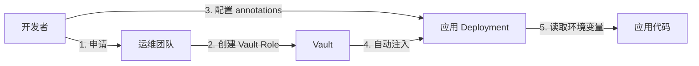
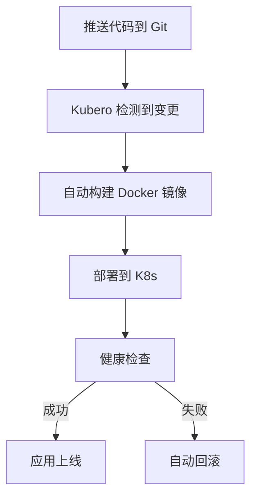

# 5 分钟快速开始

> **目标**：快速了解平台能力和核心概念，为后续接入做准备。

---

## 平台能提供什么？

作为应用开发者，这个平台为你提供：

### 🚀 应用部署 - Kubero
- **GitOps 风格**：推送代码自动触发部署
- **多环境管理**：staging 和 prod 环境隔离
- **Web UI**：可视化管理部署、日志、环境变量
- **访问地址**：`https://kcloud.${INTERNAL_DOMAIN}`

### 🗄️ 数据库服务
- **PostgreSQL** - 关系数据库（业务数据）
- **Redis** - 缓存和消息队列
- **ClickHouse** - OLAP 分析（配合 SigNoz）
- **ArangoDB** - 图数据库

### 🔐 密钥管理 - Vault
- **安全存储**：所有数据库密码、API Key 统一管理
- **自动注入**：通过 Kubernetes annotations 注入到应用
- **访问隔离**：每个应用只能访问自己的密钥
- **访问地址**：`https://secrets.${INTERNAL_DOMAIN}`

### 🔑 SSO 登录 - Casdoor
- **统一身份**：GitHub OAuth + 密码登录
- **OIDC 协议**：支持主流框架集成
- **访问地址**：`https://sso.${INTERNAL_DOMAIN}`

### 📊 监控和分析
- **SigNoz**：分布式追踪 + 日志 + 指标（基于 OpenTelemetry）
  - 访问地址：`https://signoz.${INTERNAL_DOMAIN}`（待部署）
- **OpenPanel**：用户行为分析 + A/B 测试
  - 访问地址：`https://openpanel.${INTERNAL_DOMAIN}`（待部署）

---

## 核心概念速查

### 环境隔离

| 环境 | 用途 | 域名示例 | Namespace |
|------|------|---------|-----------|
| **Staging** | 测试、预发布 | `x-staging.truealpha.club` | `apps-staging` |
| **Prod** | 生产流量 | `truealpha.club` | `apps-prod` |

**重点**：
- Staging 和 Prod 的数据库、Redis 完全独立
- 平台服务（Vault、Dashboard、Digger）是共享的
- Staging 数据不会自动同步到 Prod

### 密钥管理流程

**你需要做**：
- 在应用的 Deployment YAML 中添加 Vault annotations
- 在代码中读取环境变量（如 `PGPASSWORD`）

**不需要做**：
- 手动管理密码
- 在代码中硬编码密钥

### 部署流程

---

## 前置准备

在开始接入前，请确认你有：

### ✅ 必需
- [ ] **Git 仓库**：应用代码托管在 GitHub/GitLab
- [ ] **Dockerfile**：应用可以构建为 Docker 镜像
- [ ] **基本的 Kubernetes 知识**：了解 Deployment、Service、Ingress 概念

### 🔧 可选（按需）
- [ ] **访问平台服务的权限**
  - Kubero UI 登录（SSO）
  - Vault UI 查看密钥（SSO）
- [ ] **联系运维团队**：如需创建 Vault Role 或特殊配置

---

## 快速验证环境

### 1. 访问 Kubero UI

打开 `https://kcloud.${INTERNAL_DOMAIN}`，使用 Casdoor 登录（GitHub 或密码）。

**期望结果**：看到 Kubero 欢迎页面，可以创建 Pipeline。

### 2. 访问 Vault UI（可选）

打开 `https://secrets.${INTERNAL_DOMAIN}`，使用 OIDC 登录。

**期望结果**：登录成功，能看到自己有权限访问的 secret paths。

### 3. 查看平台文档

访问本文档站点（如果已部署）或直接阅读 GitHub repo。

---

## 下一步

根据你的需求，选择对应的场景指南：

| 场景 | 推荐阅读 | 预计时间 |
|------|---------|---------|
| **部署一个简单应用**（无数据库） | [部署第一个应用](./02.first-app.md) | 15 分钟 |
| **应用需要 PostgreSQL/Redis** | [使用数据库](./03.database.md) | 30 分钟 |
| **应用需要 SSO 登录** | [接入 SSO](./05.sso.md) | 20 分钟 |
| **需要监控和分析** | [监控和分析](./06.observability.md) | 30 分钟 |

**推荐路径**：先完成 [部署第一个应用](./02.first-app.md)，然后根据需要逐步添加功能。

---

## FAQ

### Q: 我需要自己搭建 Kubernetes 集群吗？
**A**: 不需要。平台已经提供了 K3s 集群，你只需要通过 Kubero 部署应用。

### Q: 部署应用需要付费吗？
**A**: （根据实际情况填写）

### Q: 我可以使用自己的域名吗？
**A**: 可以，需要联系运维团队配置 Cloudflare DNS。参考 [域名规则](../ssot/core.md#域名规则)。

### Q: Staging 和 Prod 环境的数据库是分开的吗？
**A**: 是的，完全独立。数据不会自动同步，需要手动迁移或同步。

### Q: 如何获取技术支持？
**A**:
1. 查看 [SSOT 文档](../ssot/README.md) 了解技术细节
2. 查看各场景的故障排查章节
3. 联系运维团队（填写联系方式）

---

## 相关链接

- **[返回开发者指南首页](./README.md)**
- **[部署第一个应用](./02.first-app.md)**
- **[SSOT 文档索引](../ssot/README.md)**
- **[平台架构说明](https://github.com/wangzitian0/infra2/blob/main/platform/README.md)**

---

*Last updated: 2025-12-21*
