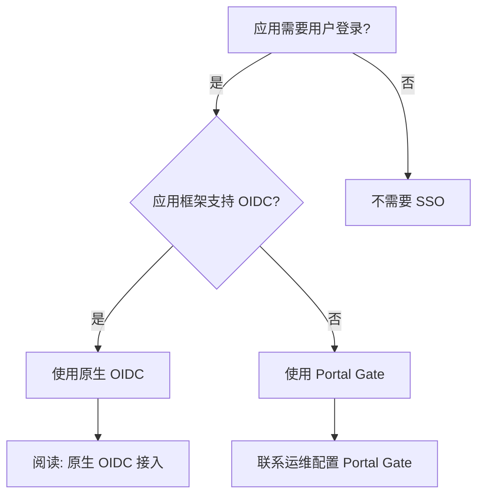
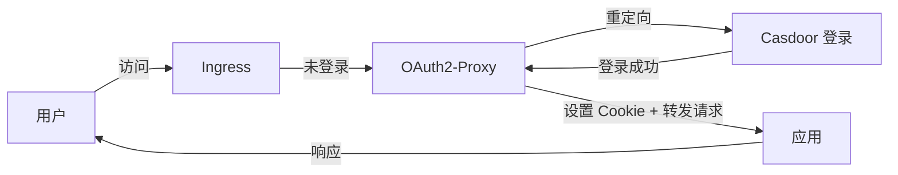

# 接入 SSO 登录

> **场景**：应用需要用户身份认证功能
> **预计时间**：30 分钟
> **前置条件**：已完成[部署第一个应用](./02.first-app.md)

---

## 概述

平台提供 **Casdoor** 作为统一 SSO 服务：

- **访问地址**：`https://sso.${INTERNAL_DOMAIN}`
- **支持登录方式**：GitHub OAuth + 密码登录
- **协议**：OIDC (OpenID Connect)

**你的应用可以**：
- 使用 GitHub 账号登录
- 使用平台内部账号（用户名+密码）
- 获取用户信息（email、头像等）
- 实现权限控制

---

## 决策树：我的应用需要 SSO 吗？



**推荐**：如果你的框架支持 OIDC（大部分现代框架都支持），优先使用原生 OIDC。

---

## 常见框架 OIDC 支持情况

| 框架/语言 | OIDC 支持 | 推荐库 |
|----------|----------|--------|
| **Next.js** | ✅ | `next-auth` |
| **Express.js** | ✅ | `passport-openidconnect` |
| **Django** | ✅ | `mozilla-django-oidc` |
| **FastAPI** | ✅ | `authlib` |
| **Spring Boot** | ✅ | Spring Security OAuth2 |
| **Laravel** | ✅ | `laravel/socialite` |
| **Go** | ✅ | `coreos/go-oidc` |

**如果你的框架不在列表**：搜索 "{framework} OIDC" 或联系运维咨询。

---

## 原生 OIDC 接入（推荐）

### 步骤 1: 在 Casdoor 创建应用

#### 方式 1: 联系运维创建（推荐）

提供以下信息：
- **应用名称**：`my-app`
- **Redirect URI**：`https://my-app.truealpha.club/auth/callback`
  - 注意：必须是你的应用域名 + 回调路径
  - 如果有多个环境，提供所有 URIs（如 staging 和 prod）

运维会通过 Terraform 创建应用，并提供：
- Client ID
- Client Secret

#### 方式 2: 自己在 Casdoor UI 创建（如果有权限）

1. 访问 `https://sso.${INTERNAL_DOMAIN}`
2. 使用 admin 账号登录
3. 导航到 "Applications"
4. 点击 "Add"
5. 填写信息：
   - Name: `my-app`
   - Organization: `admin`
   - Redirect URIs: `https://my-app.truealpha.club/auth/callback`
   - Enable Password: ✅
   - Enable GitHub: ✅
6. 保存后记录 Client ID 和 Client Secret

### 步骤 2: 将 Client Secret 存入 Vault

联系运维将 Client Secret 存入 Vault：

```
secret/data/my-app/casdoor
```

内容：
```json
{
  "client_id": "my-app",
  "client_secret": "xxxxxx",
  "issuer": "https://sso.${INTERNAL_DOMAIN}"
}
```

### 步骤 3: 在应用中集成 OIDC

#### Next.js 示例 (next-auth)

**安装依赖**：
```bash
npm install next-auth
```

**配置 `pages/api/auth/[...nextauth].ts`**：

```typescript
import NextAuth from "next-auth";

export default NextAuth({
  providers: [
    {
      id: "casdoor",
      name: "Casdoor",
      type: "oauth",
      wellKnown: `${process.env.CASDOOR_ISSUER}/.well-known/openid-configuration`,
      authorization: { params: { scope: "openid profile email" } },
      clientId: process.env.CASDOOR_CLIENT_ID,
      clientSecret: process.env.CASDOOR_CLIENT_SECRET,
      profile(profile) {
        return {
          id: profile.sub,
          name: profile.name,
          email: profile.email,
          image: profile.avatar,
        };
      },
    },
  ],
  callbacks: {
    async jwt({ token, account, profile }) {
      if (account) {
        token.accessToken = account.access_token;
      }
      return token;
    },
    async session({ session, token }) {
      session.accessToken = token.accessToken;
      return session;
    },
  },
});
```

**环境变量**（通过 Vault 注入）：
```bash
CASDOOR_CLIENT_ID=my-app
CASDOOR_CLIENT_SECRET=xxxxxx
CASDOOR_ISSUER=https://sso.${INTERNAL_DOMAIN}
NEXTAUTH_URL=https://my-app.truealpha.club
NEXTAUTH_SECRET=your-secret-key
```

**Vault Annotations**：
```yaml
vault.hashicorp.com/agent-inject-secret-casdoor: "secret/data/my-app/casdoor"
vault.hashicorp.com/agent-inject-template-casdoor: |
  {{- with secret "secret/data/my-app/casdoor" -}}
  export CASDOOR_CLIENT_ID="{{ .Data.data.client_id }}"
  export CASDOOR_CLIENT_SECRET="{{ .Data.data.client_secret }}"
  export CASDOOR_ISSUER="{{ .Data.data.issuer }}"
  {{- end }}
```

#### Express.js 示例 (passport)

**安装依赖**：
```bash
npm install passport passport-openidconnect express-session
```

**配置**：

```javascript
const passport = require('passport');
const { Strategy: OIDCStrategy } = require('passport-openidconnect');

passport.use('casdoor', new OIDCStrategy({
  issuer: process.env.CASDOOR_ISSUER,
  authorizationURL: `${process.env.CASDOOR_ISSUER}/login/oauth/authorize`,
  tokenURL: `${process.env.CASDOOR_ISSUER}/api/login/oauth/access_token`,
  userInfoURL: `${process.env.CASDOOR_ISSUER}/api/userinfo`,
  clientID: process.env.CASDOOR_CLIENT_ID,
  clientSecret: process.env.CASDOOR_CLIENT_SECRET,
  callbackURL: '/auth/callback',
  scope: 'openid profile email'
}, (issuer, profile, done) => {
  return done(null, profile);
}));

// Routes
app.get('/auth/login',
  passport.authenticate('casdoor'));

app.get('/auth/callback',
  passport.authenticate('casdoor', { failureRedirect: '/login' }),
  (req, res) => {
    res.redirect('/dashboard');
  });
```

#### Python (Django) 示例

**安装依赖**：
```bash
pip install mozilla-django-oidc
```

**settings.py**：

```python
INSTALLED_APPS = [
    ...
    'mozilla_django_oidc',
]

AUTHENTICATION_BACKENDS = [
    'mozilla_django_oidc.auth.OIDCAuthenticationBackend',
    'django.contrib.auth.backends.ModelBackend',
]

OIDC_RP_CLIENT_ID = os.environ['CASDOOR_CLIENT_ID']
OIDC_RP_CLIENT_SECRET = os.environ['CASDOOR_CLIENT_SECRET']
OIDC_OP_AUTHORIZATION_ENDPOINT = f"{os.environ['CASDOOR_ISSUER']}/login/oauth/authorize"
OIDC_OP_TOKEN_ENDPOINT = f"{os.environ['CASDOOR_ISSUER']}/api/login/oauth/access_token"
OIDC_OP_USER_ENDPOINT = f"{os.environ['CASDOOR_ISSUER']}/api/userinfo"

LOGIN_REDIRECT_URL = '/'
LOGOUT_REDIRECT_URL = '/'
```

### 步骤 4: 测试登录流程

1. 访问你的应用登录页
2. 点击登录按钮
3. 应该跳转到 Casdoor 登录页（`https://sso.${INTERNAL_DOMAIN}`）
4. 选择 GitHub 或密码登录
5. 授权后跳转回应用
6. 验证获取到用户信息

---

## Portal Gate 方式（无 OIDC 框架）

如果你的应用框架不支持 OIDC，可以使用 Portal Gate。

### 工作原理



**特点**：
- 应用无需修改代码
- 用户信息通过 HTTP Headers 传递：
  - `X-Auth-Request-User`: 用户名
  - `X-Auth-Request-Email`: 邮箱

### 配置步骤

**联系运维**启用 Portal Gate：

提供以下信息：
- 应用域名：`https://my-app.truealpha.club`
- 需要保护的路径：`/`（全站）或 `/admin`（部分）

运维会在 Ingress 添加 ForwardAuth 配置。

### 在应用中获取用户信息

**Node.js 示例**：

```javascript
app.get('/profile', (req, res) => {
  const username = req.headers['x-auth-request-user'];
  const email = req.headers['x-auth-request-email'];

  res.json({
    username,
    email,
  });
});
```

**注意**：Portal Gate 只提供基本用户信息，如需更多信息需要调用 Casdoor API。

---

## 获取更多用户信息

### 使用 OIDC UserInfo Endpoint

```javascript
const axios = require('axios');

async function getUserInfo(accessToken) {
  const response = await axios.get(
    `${process.env.CASDOOR_ISSUER}/api/userinfo`,
    {
      headers: {
        Authorization: `Bearer ${accessToken}`
      }
    }
  );
  return response.data;
}
```

**UserInfo 返回数据**：
```json
{
  "sub": "user-id",
  "name": "Zhang San",
  "email": "zhangsan@example.com",
  "avatar": "https://avatars.githubusercontent.com/u/xxx",
  "preferred_username": "zhangsan"
}
```

---

## 权限控制

### 场景：不同用户有不同权限

Casdoor 支持角色和权限管理，但需要额外配置。

**简单方案**：在应用内部管理权限

```javascript
const roles = {
  'admin@example.com': 'admin',
  'user@example.com': 'user',
};

function checkPermission(email, requiredRole) {
  const userRole = roles[email] || 'guest';
  return userRole === requiredRole;
}

app.get('/admin', (req, res) => {
  const email = req.user.email;
  if (!checkPermission(email, 'admin')) {
    return res.status(403).send('Forbidden');
  }
  res.send('Admin Dashboard');
});
```

**高级方案**：集成 Casdoor 权限系统（联系运维配置）。

---

## 常见问题

### Q: 登录后出现重定向循环

**原因**：Redirect URI 配置错误。

**解决**：
1. 检查 Casdoor 应用配置的 Redirect URI 是否完全匹配
2. 确认应用代码中的 `callbackURL` 路径正确
3. 检查域名协议（https vs http）

### Q: 提示 "invalid_client"

**原因**：Client ID 或 Client Secret 错误。

**解决**：
1. 确认 Vault 中的 secret 正确
2. 检查环境变量是否正确注入
3. 重新部署应用

### Q: 获取用户信息失败

**原因**：Access Token 无效或过期。

**解决**：
1. 检查 Token 是否正确传递
2. 确认 Scope 包含 `openid profile email`
3. 实现 Token 刷新机制

### Q: 如何实现登出？

**Next.js**：
```javascript
import { signOut } from "next-auth/react";
await signOut({ callbackUrl: "/" });
```

**Express.js**：
```javascript
app.get('/logout', (req, res) => {
  req.logout(() => {
    res.redirect('/');
  });
});
```

---

## 多环境配置

### Staging 和 Prod 使用不同的 Redirect URI

在 Casdoor 应用配置中添加所有环境的 Redirect URIs：

```
https://my-app-staging.truealpha.club/auth/callback
https://my-app.truealpha.club/auth/callback
```

应用代码使用环境变量动态设置：

```javascript
const callbackURL = process.env.NODE_ENV === 'production'
  ? 'https://my-app.truealpha.club/auth/callback'
  : 'https://my-app-staging.truealpha.club/auth/callback';
```

或通过 Kubero 环境变量设置：

```
CALLBACK_URL=https://my-app-staging.truealpha.club/auth/callback
```

---

## 下一步

现在你的应用支持 SSO 登录了！🎉

根据你的需求，继续探索：

| 需求 | 下一步阅读 |
|------|----------|
| **需要监控和日志** | [监控和分析](./06.observability.md) |
| **需要管理更多密钥** | [管理密钥](./04.secrets.md) |

---

## 参考

- **认证架构详解** - [platform.auth.md](../ssot/platform.auth.md)
- **Casdoor 官方文档** - https://casdoor.org/docs/overview
- **OIDC 协议说明** - https://openid.net/connect/

---

*Last updated: 2025-12-21*
