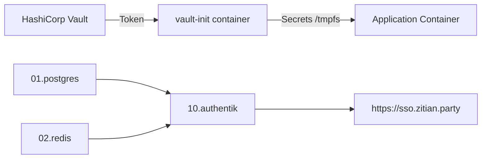

# Infra-004: Authentik Installation

**Status**: Completed ✅
**Owner**: Infra  
**Priority**: P2  
**Branch**: `feat/authentik-simplified-deploy` (Merged)

## Goal

Install Authentik SSO for identity management on platform services using Vault for secret management.

## Scope

- [x] Create deployment automation framework (libs/deployer.py)
- [x] Deploy PostgreSQL (01.postgres) with vault-init
- [x] Deploy Redis (02.redis) with vault-init
- [x] Deploy Authentik (10.authentik) with vault-init
- [x] Automate Vault Token generation and Dokploy configuration
- [x] Implement DRY compose templates (libs/compose_templates.py)

## Architecture



## Key Achievements

### 1. 100% Automated Deployment
- **Token Generation**: `invoke vault.setup-tokens` automatically generates permanent, read-only tokens for each service.
- **Configuration**: Tokens are automatically injected into Dokploy service environment variables.
- **Domain**: Sso domain is automatically configured via Dokploy API.

### 2. Secure Secret Management (vault-init)
- **Pattern**: Sidecar/Init container fetches secrets.
- **Storage**: Secrets stored in `tmpfs` (RAM only), never on disk.
- **Isolation**: Each service has its own limited-scope token.

### 3. Code Quality (DRY)
- **Templates**: `libs/compose_templates.py` eliminates ~150 lines of duplicate YAML.
- **Deployer**: Base class handles common logic (directories, permissions, Dokploy API).

## Deployment Commands

```bash
# 1. Generate Tokens (One-time)
invoke vault.setup-tokens

# 2. Deploy Services
invoke postgres.setup
invoke redis.setup
invoke authentik.setup
```

## Verification

- [x] `invoke --list` loads all modules
- [x] `invoke postgres.shared.status` returns healthy
- [x] `invoke redis.shared.status` returns healthy
- [x] `invoke authentik.shared.status` returns healthy
- [x] Authentik UI at https://sso.zitian.party reachable

## TODOWRITE

- [Infra-004.TODOWRITE.md](./Infra-004.TODOWRITE.md)

## References

- [SSOT: platform.automation.md](../ssot/platform.automation.md)
- [Walkthrough](../../walkthrough.md)
