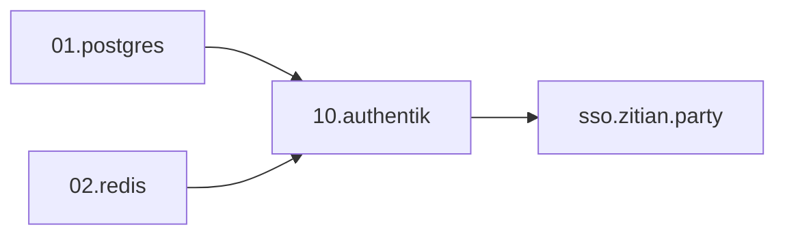

# Infra-004: Authentik Installation

**Status**: In Progress  
**Owner**: Infra  
**Priority**: P2  
**Branch**: `feat/deploy-authentik`

## Goal

Install Authentik SSO for identity management on platform services.

## Scope

- [x] Create deployment automation framework (libs/deployer.py)
- [ ] Deploy PostgreSQL (01.postgres)
- [ ] Deploy Redis (02.redis)
- [ ] Deploy Authentik (10.authentik)
- [ ] Configure initial SSO

## Architecture



## Deployment Order

```bash
# 1. PostgreSQL
invoke postgres.setup

# 2. Redis
invoke redis.setup

# 3. Authentik
invoke authentik.setup
```

## Implementation Details

### libs/ Structure

| File | Purpose |
|------|---------|
| `libs/common.py` | get_env, validate_env, generate_password, check_service |
| `libs/console.py` | Rich CLI output helpers |
| `libs/deployer.py` | Deployer base class with secrets integration |
| `libs/config.py` | Legacy secrets wrapper |

### Service Structure

```
platform/{nn}.{service}/
├── compose.yaml       # Docker Compose
├── deploy.py          # XxxDeployer + @task
├── shared_tasks.py    # status() check
└── README.md          # Service docs
```

### Key Features

- **Secrets SSOT**: Vault/1Password via `libs.env`
- **Vault integration**: Auto VAULT_ADDR from INTERNAL_DOMAIN
- **DRY pattern**: Deployer base class, check_service()

## PR Links

- [PR #7: Deploy Authentik with DRY/Pythonic improvements](https://github.com/wangzitian0/infra2/pull/7)

## Change Log

| Date | Change |
|------|--------|
| 2025-12-29 | Created libs/, platform services, Deployer pattern |
| 2025-12-29 | Fixed VAULT_ADDR to use https://vault.{INTERNAL_DOMAIN} |

## Verification

- [x] `invoke --list` loads all modules
- [ ] `invoke postgres.shared.status` returns healthy
- [ ] `invoke redis.shared.status` returns healthy
- [ ] `invoke authentik.shared.status` returns healthy
- [ ] Authentik UI at https://sso.zitian.party reachable

## References

- [SSOT: platform.automation.md](../ssot/platform.automation.md)
- [libs/README.md](https://github.com/wangzitian0/infra2/blob/main/libs/README.md)
- [platform/README.md](https://github.com/wangzitian0/infra2/blob/main/platform/README.md)
