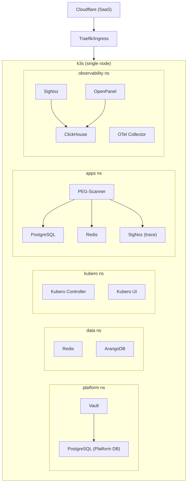

# Infra-001: Staging Deployment Blueprint

**Status**: Archived  
**Owner**: Infra  
**Legacy Source**: BRN-004 (Staging MVP) + BRN-007 (Five-env expansion)

## Summary
Define the staging MVP architecture, environment lifecycle, and core infra stack
choices for k3s, Vault, and platform services, with a path to five environments.

## PR Links
- PR #56: https://github.com/wangzitian0/infra/pull/56
- PR #309: https://github.com/wangzitian0/infra/pull/309
- PR #336: https://github.com/wangzitian0/infra/pull/336
- PR #260: https://github.com/wangzitian0/infra/pull/260

## Change Log
- [2025-12-05: Staging Deployment Design](../../change_log/2025-12-05.staging_deployment_design.md)

## Git Commits (Backtrace)
- 0a2d311 feat(platform): add OpenPanel L2 infrastructure with Portal Gate authentication (#336)
- 01e253a docs: mermaid diagrams + ssot naming alignment (#309)
- a1ba21d fix: replace port-forward with kubectl exec for L3 health checks (#260)

## Legacy Design (BRN-004 × BRN-007 × All Selections)

> **这是最终的全景架构设计**，整合了 BRN-004（Staging MVP）、BRN-007（五环境）以及所有基础设施、平台、观测等选型。

**关联文档 (Apps Submodule)**：
- [应用架构 (Apps Arch)](../../apps/docs/arch.md)
- [应用文档索引 (Apps Index)](../../apps/docs/index.md)
- [项目规格 (Specs)](../../apps/docs/specs)

---

## 一、核心决策（不再更改）

### 1.1 技术栈选型

| 层级 | 组件 | 选择 | 理由 |
|------|------|------|------|
| **IaC** | Terraform + Helm Provider | 一切皆代码，R2 state backend，无手动 |
| **Runtime** | k3s + Kubero + Kubero UI | 单 VPS 友好 + 原生 k8s + PaaS UI |
| **密钥管理** | Vault（自托管） | Policy/RBAC、审计、KV 版本、Agent Injector 注入 |
| **主数据库** | PostgreSQL | 通用，容器化部署 |
| **缓存** | Redis | 标准，高可用 |
| **图数据库** | ArangoDB（可选） | 应用依赖 |
| **可观测性** | SigNoz | OTel 原生，一体化 APM |
| **产品分析** | OpenPanel | 开源自托管，轻量级 |
| **开发者门户** | Backstage（后期） | 平台工程入口 |
| **网络** | Cloudflare | DNS/CDN/WAF，免费版限制 |
| **CI/CD** | GitHub Actions + Atlantis（后期） | 轻量，权限严格 |

### 1.2 部署位置与生命周期

| 环境 | VPS | 数据 | k3s | 生命周期 | 用途 |
|------|------|------|------|----------|------|
| **dev** | 本地/VM | 本地 DB | 本地或虚拟 | 持久 | 开发者本地 |
| **ci** | GH Actions | 临时 | 容器内 | 分钟级 | PR 自动验证 |
| **test** | 临时 VPS | 临时 | 临时 | PR 生命周期 | PR 预览 |
| **staging** | 专用 VPS | prod dump | 持久 | 持久 | 预发测试，1:1 prod |
| **prod** | 专用 VPS | 真实 | 持久 | 持久 | 线上服务 |

### 1.3 域名规范（Cloudflare 免费版约束）

**规则**：`{prefix}-{env}.${BASE_DOMAIN}` 或 `{prefix}.${BASE_DOMAIN}`

| 环境 | Ingress 域名 | Vault 域名 | SigNoz 域名 |
|------|------------|--------------|-----------|
| **prod** | `${BASE_DOMAIN}` | `secrets.<internal_domain>` | `signoz.<internal_domain>` |
| **staging** | `${DOMAIN_PREFIX}.${BASE_DOMAIN}` | `secrets.<internal_domain>` | `signoz.<internal_domain>` |
| **test** | `x-test.${BASE_DOMAIN}` | 不部署 | 不部署 |
| **ci** | 无（容器内通讯） | 无（容器内通讯） | 无 |
| **dev** | `localhost` | 无 | 无 |

---

## 二、Kubernetes 命名空间（4 + 系统）

**全局唯一（不随环境复制）**：
- `platform` — Vault + Platform PostgreSQL（staging/prod）

**随环境复制**（每个环境一套）：
- `data` — Redis + ArangoDB
- `kubero` — Kubero Controller + UI
- `apps` — 用户应用
- `observability` — SigNoz + OTel Collector + OpenPanel（staging/prod）

**系统**：
- `kube-system` — k3s 自动创建

---

## 三、部署阶段（phase 内可并行）

> 约定：平台 PostgreSQL（Vault/Kubero 用）在 Phase 0.x；业务 PostgreSQL 在 Phase 1.x。

### Phase 0.x：Bootstrap + 密钥基线
- k3s 集群（kubeconfig 可用）
- 平台 PostgreSQL（Vault/Kubero 用）
- Vault（上线后运行时密钥统一写入 Vault）

### Phase 1.x：管理入口 + PaaS + 业务库
- Kubernetes Dashboard
- Kubero Controller + Kubero UI
- 业务 PostgreSQL（应用库，独立于平台库）

### Phase 2.x：数据服务（业务侧）
- ArangoDB
- Redis
- ClickHouse

### Phase 3.x：观测/产品分析
- SigNoz
- OpenPanel

### Phase 999：应用部署（后期）
- 业务应用通过 Kubero UI 部署到 `apps` ns

---

## 四、Terraform 项目结构（本仓库）

```
1.bootstrap/                          # L1: k3s + Atlantis + DNS/Cert + Platform PG
2.platform/                           # L2: Vault + Dashboard + SSO
3.data/                               # L3: 业务数据库（规划中）
4.apps/                               # L4: Kubero + 应用（规划中）
envs/                                 # tfvars 模板
```

---

## 五、部署流程

### Staging（BRN-004 MVP）

```bash
# 1) L1: Bootstrap (k3s + DNS/Cert + Platform PG + Atlantis)
cd 1.bootstrap
terraform init \
  -backend-config="bucket=$R2_BUCKET" \
  -backend-config="key=k3s/staging.tfstate" \
  -backend-config="endpoints={s3=\"https://$R2_ACCOUNT_ID.r2.cloudflarestorage.com\"}"
terraform apply

# 2) L2: Platform (Vault / Dashboard / SSO)
cd ../2.platform
terraform init \
  -backend-config="bucket=$R2_BUCKET" \
  -backend-config="key=k3s/layer2.tfstate" \
  -backend-config="endpoints={s3=\"https://$R2_ACCOUNT_ID.r2.cloudflarestorage.com\"}"
terraform apply
```

### 五环境扩展（BRN-007 后期）

创建 `dev.tfvars`、`ci.tfvars`、`test.tfvars`、`prod.tfvars`，使用相同的 phases 代码，仅改 tfvars。

```bash
terraform apply -var-file="prod.tfvars" -target="module.k3s"  # prod VPS
terraform apply -var-file="prod.tfvars" -target="module.postgresql"
# ... 后续 phases 相同逻辑
```

---

## 六、配置管理

### staging.tfvars 模板

```hcl
# VPS 基础
vps_host            = "staging-vps.internal"
vps_user            = "root"
ssh_port            = 22
ssh_private_key     = file("~/.ssh/id_rsa")

# k3s
cluster_name        = "staging-k3s"
k3s_channel         = "stable"
api_endpoint        = "api-${DOMAIN_PREFIX}.${BASE_DOMAIN}"

# 环境
environment         = "staging"
base_domain         = "example.com"
domain_prefix       = "x-staging"

# 密钥（从 Vault 后续管理）
postgres_password    = "change-me"
redis_password       = "change-me"
arangodb_password    = "change-me"

# 存储
postgres_storage     = "50Gi"
redis_storage        = "20Gi"
arangodb_storage     = "100Gi"

# 特性开关
enable_observability = true
enable_backstage     = false
```

---

## 七、Ingress 与域名映射

Traefik/Nginx 自动生成 Ingress Route（通过 Helm values）：

**Staging 示例**：
```
secrets.<internal_domain>             → Vault
kcloud.<internal_domain>              → Kubero UI
kapi.<internal_domain>                → Kubero API
signoz.<internal_domain>              → SigNoz
openpanel.<internal_domain>           → OpenPanel
${DOMAIN_PREFIX}.${BASE_DOMAIN}        → 应用前端（后期）
```

每个服务的 Helm values 自动计算：
```hcl
locals {
  domains = {
    vault          = "secrets.${local.internal_domain}"
    kubero_ui      = "kcloud.${local.internal_domain}"
    kubero_backend = "kapi.${local.internal_domain}"
    signoz         = "signoz.${local.internal_domain}"
    openpanel      = "openpanel.${local.internal_domain}"
    frontend       = "${var.env_prefix}.${var.base_domain}"
    backend        = "${var.env_prefix}-api.${var.base_domain}"
  }
}
```

---

## 八、数据流与依赖链



---

## 九、初始化检查清单

### 基础准备
- [ ] Staging VPS：Ubuntu 22.04+，公网 IP，SSH
- [ ] Cloudflare：`*.${BASE_DOMAIN}` 通配符 DNS + SSL 证书
- [ ] R2：bucket 创建，state key 路径：`staging/terraform.tfstate`
- [ ] GitHub Secrets：R2 凭据、VPS SSH key

### Phase 执行
- [ ] Phase 0.x：k3s 运行，kubeconfig 可用；Vault UI 可访问
- [ ] Phase 1.x：平台 PostgreSQL、Kubernetes Dashboard 就绪
- [ ] Phase 2.x：业务 PostgreSQL/ArangoDB/Redis/ClickHouse 就绪（按需）
- [ ] Phase 3.x：Kubero、SigNoz + OpenPanel UI 可访问（按需）
- [ ] Phase 999：业务应用通过 Kubero 上线（后期）

---

## 十、后续演进（五环境、应用部署）

### BRN-007：多环境自动化
1. 创建 5 套 tfvars（dev/ci/test/staging/prod）
2. GitHub Actions 工作流支持多环境 plan/apply
3. 评论驱动 `/plan`、`/apply staging`、`/apply prod`

### 应用部署
1. 通过 Kubero UI 连接 GitHub 仓库（apps submodule）
2. 配置 Vault 注入/读取密钥
3. GitOps 自动部署

### 可观测性成熟
1. 应用接入 OTel SDK，发送 trace 到 SigNoz
2. OpenPanel 事件采集配置
3. Backstage Service Catalog 管理

---

## 十一、成本与扩展

### 单 VPS 成本（当前）
- VPS（Hetzner/OCI）：$5-20/月
- Cloudflare 免费版：$0
- R2 存储（state + 备份）：<$1/月
- **总计**：<$25/月

### 长期扩展路径
1. **6 个月**：PostgreSQL 托管化（Neon）+ Redis 托管化（Upstash）
2. **12 个月**：SigNoz 独立 VPS，多应用 VPS
3. **24 个月**：多 AZ，完整 Kubernetes 集群

---

**完成日期**：2025-12-05
**下一步**：编写 Terraform phases 代码
