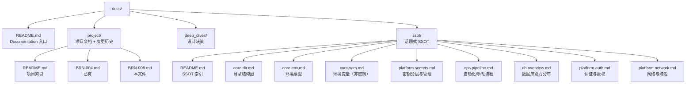
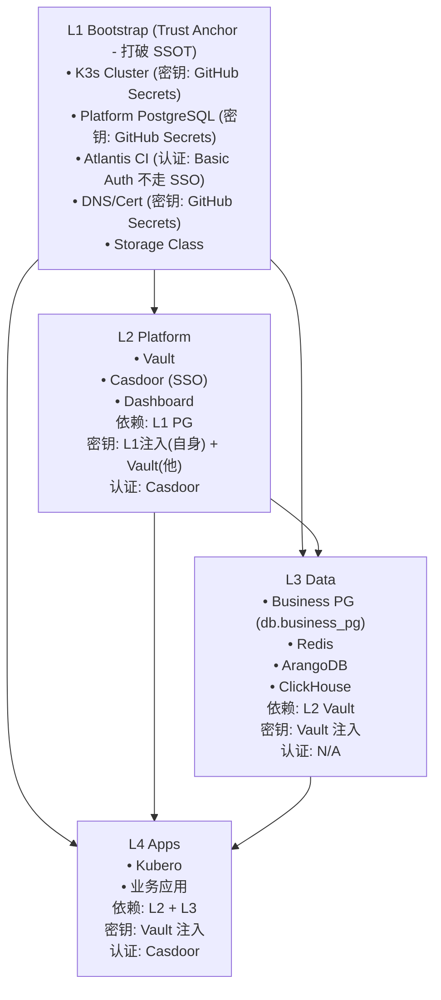
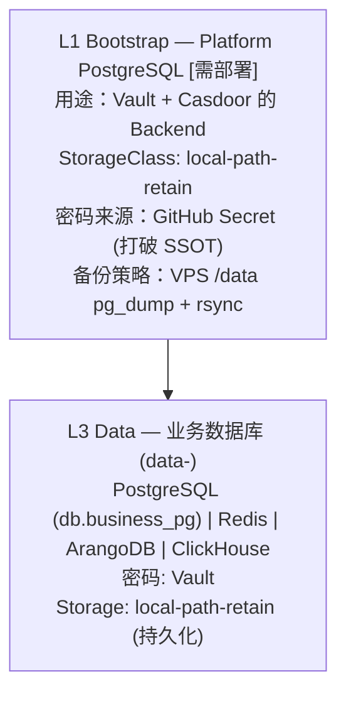
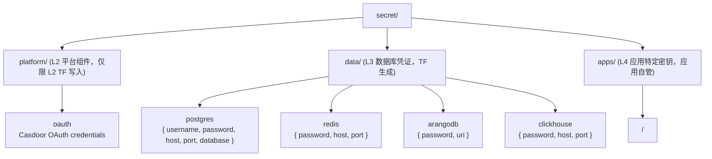
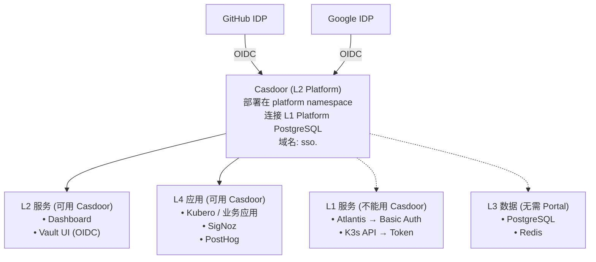

# Infra-002: SSOT Refactor and Documentation Restructure

**Status**: Archived  
**Owner**: Infra  
**Legacy Source**: BRN-008 (Infrastructure SSOT Refactor)

## Summary
Refactor documentation into SSOT topics, clarify secrets/pipeline/db ownership, and
align infra documentation with L1 trust anchor principles.

## PR Links
- PR #120: https://github.com/wangzitian0/infra/pull/120
- PR #121: https://github.com/wangzitian0/infra/pull/121
- PR #122: https://github.com/wangzitian0/infra/pull/122
- PR #123: https://github.com/wangzitian0/infra/pull/123
- PR #124: https://github.com/wangzitian0/infra/pull/124
- PR #309: https://github.com/wangzitian0/infra/pull/309
- PR #287: https://github.com/wangzitian0/infra/pull/287
- PR #280: https://github.com/wangzitian0/infra/pull/280
- PR #260: https://github.com/wangzitian0/infra/pull/260

## Change Log
- 2025-12-12: BRN-008 P0 Infrastructure & SSOT Docs
- 2025-12-25: SSOT Refactor

## Git Commits (Backtrace)
- 01e253a docs: mermaid diagrams + ssot naming alignment (#309)
- 7ba8ba9 Add Claude Code GitHub Workflow (#287)
- 71c5225 feat(ci): replace Claude review with GitHub Copilot (#280)
- a1ba21d fix: replace port-forward with kubectl exec for L3 health checks (#260)

## Legacy Plan (BRN-008)

> **项目目标**：重构 `docs/` 目录为 `docs/ssot/`，将话题式文档（变量、密钥、流程、数据库等）集中管理，与组件级 README 形成互补。同时重构 AGENTS.md，将"组件"、"能力"、"流程"拆分为三个独立章节。

**状态**: 📋 Planning（评估完成，待批准执行）
**创建日期**: 2025-12-11
**预计工作量**: 
- 文档重构：2-3 小时
- Platform PG 部署 + Vault 迁移（P0 前置）：4-6 小时

---

## 一、背景与动机

### 1.1 当前痛点

| 问题 | 现状 | 影响 |
|------|------|------|
| **密钥分散** | 密钥定义在 `variables.tf`、GitHub Secrets、DD-001、README 等多处 | 难以知道"这个密钥在哪配置" |
| **流程碎片化** | CI/CD 流程在 `.github/workflows/README.md`、`AGENTS.md`、`0.check_now.md` 多处描述 | 维护冲突，新人难以理解全貌 |
| **目录结构语义不清** | `docs/dir.md`（现为 `docs/ssot/core.dir.md`）既是导航图又是 SSOT 定义 | 职责混合 |
| **AGENTS.md 章节混乱** | SSOT Architecture 和 SOP 两章混合了组件、能力、流程 | 不符合正交设计原则 |

### 1.2 设计目标

```
现状：组件 README 描述"如何实现"，但缺少"某话题全系统如何分工"
目标：docs/ssot/ 按话题组织，回答"整个系统的密钥/流程/数据库能力如何分拆到组件"
```

---

## 二、用户场景分析

### 场景 1：数据库密钥 — 纯自动化管理，人可读

| 层级 | 当前实现 | 目标状态 |
|------|----------|----------|
| **L1 Bootstrap** | `vault_postgres_password` via GitHub Secret → TF_VAR | ✅ 保持（Trust Anchor，不能用 random） |
| **L2 Platform** | Vault storage backend 使用该密码 | ✅ 保持 L1 注入（不能 random，否则明文在 State） |
| **L3 Data** | 业务 PostgreSQL/Redis/ArangoDB 密码 | 🎯 **改进**：TF random → Vault 存储 → Pod 注入 |

**改进方案（仅限 L3 业务密钥）**：
```hcl
# L3 业务数据库密码可用 random_password（密码存 Vault，不留 State）
resource "random_password" "business_db_password" { ... }
resource "vault_generic_secret" "business_db" {
  path = "secret/data/postgres"
  data_json = jsonencode({ password = random_password.business_db_password.result })
}
# → App 通过 Vault Agent 注入 /vault/secrets/db
```

> ⚠️ **注意**：L1/L2 平台密钥（Platform PG）不能用 `random_password`，因为 TF State 会有明文。必须从 GitHub Secret 注入。

---

### 场景 2：NoDep 层 — GitHub Secret 直接启动 TF

| 资源 | 当前 | 目标 | 管理方式 |
|------|------|------|----------|
| `VPS_SSH_KEY` | GitHub Secret | ✅ 保持 | 人工设置 |
| `R2_ACCESS_KEY` / `R2_SECRET_KEY` | GitHub Secret → TF_VAR | ✅ 保持 | CI 注入 |
| `CLOUDFLARE_API_TOKEN` | GitHub Secret | ✅ 保持 | 人工设置 |
| `GITHUB_APP_KEY` | GitHub Secret | ✅ 保持 | 人工设置 |

**记录位置**：`docs/ssot/core.vars.md` § Bootstrap Secrets (L0/L1)

---

### 场景 3：人类记忆密钥 — 1Password 恢复一切

需要人类记忆的"根密钥"清单：

| 密钥 | 用途 | 恢复影响 | 存储建议 |
|------|------|----------|----------|
| **GitHub PAT / App Key** | Atlantis 身份 | 无法做 CI/CD | 1Password Vault |
| **R2 Access Key** | TF State 访问 | 无法 plan/apply | 1Password Vault |
| **Cloudflare API Token** | DNS/Cert 管理 | 无法更新域名 | 1Password Vault |
| **VPS SSH Key** | k3s 节点访问 | 无法 SSH 登录 | 1Password Vault |
| **Vault Root Token** | Vault 管理 | 无法 unseal/管理 | 1Password Vault + 离线备份 |
| **Vault Unseal Keys** | Vault 解封 | Vault 无法启动 | 1Password Vault + 离线备份 |

**设计原则**：只有上述"根密钥"需要人工记忆，其他所有密钥可通过 TF/Vault 自动恢复。

---

### 场景 4：K3s Secret — 人类无感

| 类型 | 生成方式 | 使用方式 | 人类可见性 |
|------|----------|----------|------------|
| Vault Agent 注入的密钥 | Vault → K8s Secret | Pod 挂载 | ❌ 无需关心 |
| Helm 自动生成的密钥 | `random_password` in TF | Helm values | ❌ 无需关心 |
| Kubeconfig | L1 output | Atlantis 环境变量 | ⚠️ 敏感但无需日常接触 |

---

### 场景 5：所有 Portal 走 Casdoor

**当前状态**：OAuth2-Proxy + GitHub OAuth（可选）
**目标状态**：Casdoor 作为统一 SSO

| 服务 | 当前认证 | 目标认证 |
|------|----------|----------|
| K8s Dashboard | Token + OAuth2-Proxy | Casdoor SSO |
| Vault UI | Root Token | Casdoor OIDC |
| Atlantis Web | Basic Auth | **Basic Auth (保持)** |
| Kubero UI | 无认证 | Casdoor SSO |
| **未来应用** | - | Casdoor 统一登录 |

**实施路径**（BRN-008 不执行）：
1. 在 L2 部署 Casdoor（Helm Chart）
2. 配置 GitHub/Google 作为 IDP
3. 各服务 Ingress 添加 `auth-url` 注解指向 Casdoor

---

### 场景 6：自动化流程 — TF + GitHub CI + Secrets

流程分类：

| 类型 | 触发方式 | 工具链 | 记录位置 |
|------|----------|--------|----------|
| **L1 Bootstrap** | 手动 `terraform apply` | GitHub Actions | `.github/workflows/deploy-k3s.yml` |
| **L2-L4 部署** | PR 评论 `atlantis apply` | Atlantis | `.github/workflows/terraform-plan.yml` |
| **代码审查** | Atlantis 成功后自动 | Claude GitHub App | `.github/workflows/claude-code-review.yml` |
| **健康检查** | PR 评论 `/dig` | GitHub Actions | `.github/workflows/dig.yml` |

---

### 场景 7：Raneto 式文档网站

**愿景**：将 `docs/` 直接生成静态文档站点

| 方案 | 优点 | 缺点 | 推荐度 |
|------|------|------|--------|
| **Raneto** | 轻量、Markdown 原生 | 功能简单 | ⭐⭐⭐ |
| **Docusaurus** | 功能丰富、版本化 | 需要 React 构建 | ⭐⭐⭐⭐ |
| **MkDocs Material** | Python 生态、主题美观 | 需要 Python | ⭐⭐⭐⭐⭐ |
| **VitePress** | 现代、快速 | 需要 Vue | ⭐⭐⭐⭐ |

**建议**：使用 MkDocs Material，配置 GitHub Pages 自动部署。

---

## 三、SSOT 目录设计

### 3.1 新目录结构



### 3.2 核心设计原则：L1 作为 Trust Anchor

> **循环依赖问题**：Vault 需要 DB，其他服务需要 Vault，SSO 想管一切，都要部署到 K3s。
> **解决方案**：L1 Bootstrap 打破 SSOT 规则，L2+ 严格遵守。



> L1 先启动 → L2/L3/L4 后启动（平级，互相独立）

### 3.2.1 SSOT 豁免规则

| 层级 | SSOT 状态 | 原因 |
|------|-----------|------|
| **L1** | ❌ 豁免 | Trust Anchor，打破循环依赖 |
| **L2** | ✅ 遵守 | 自身密钥 L1 注入；其他服务密钥存 Vault |
| **L3** | ✅ 遵守 | 密钥由 Vault 注入 |
| **L4** | ✅ 遵守 | 密钥由 Vault 注入，认证走 Casdoor |

### 3.2.2 L1 服务的特殊处理（不走 L2）

| L1 服务 | 密钥管理 | 认证方式 | 原因 |
|---------|----------|----------|------|
| **Atlantis** | GitHub Secret | **Basic Auth + IP 白名单** | 无法用 L2 Casdoor 保护 L1 服务 |
| **K3s API** | kubeconfig | Token | 系统层面 |
| **Platform PG** | GitHub Secret | 内部访问 | 无需 Portal |

### 3.2.3 高风险服务安全加固（P0）

> ⚠️ **必须在 BRN-008 执行期间完成**

#### Atlantis 安全加固

**攻击面**：Atlantis 拥有所有 TF_VAR_*（包含 SSH Key、R2 Key、PG 密码）+ ClusterAdmin 权限

**加固措施**：
1. **Ingress IP 白名单**：限制仅 GitHub Webhook IP 段可访问
   ```yaml
   # Ingress annotation
   nginx.ingress.kubernetes.io/whitelist-source-range: "140.82.112.0/20,185.199.108.0/22,192.30.252.0/22"
   ```
2. **启用 atlantis.yaml 严格模式**：
   ```yaml
   allowed_overrides: []  # 禁止 PR 覆盖 workflow
   apply_requirements: [approved, mergeable]  # 必须审批后才能 apply
   ```

#### Vault 安全加固

**风险**：当前 Vault 未开启审计日志，无法追溯操作

**加固措施**：
1. **启用审计日志**：
   ```hcl
   # 2.platform/2.secret.tf 修改
   auditStorage = {
     enabled = true
     size    = "1Gi"
   }
   ```
2. **Root Token 使用后 revoke**：日常管理使用普通 Token

### 3.3 `platform.secrets.md` — 密钥分层与管理

**核心问题**：这个密钥在哪配置？谁生成？谁消费？

```markdown
# 密钥管理 SSOT

## 分层模型

| 层级 | 密钥类型 | 生成方式 | 存储位置 | SSOT |
|------|----------|----------|----------|------|
| **根密钥** | SSH/R2/CF/GitHub | 人工创建 | 1Password | ❌ 人工 |
| **Bootstrap** | Platform PG 密码 | 人工设置 | GitHub Secret | ❌ L1 豁免 |
| **Runtime** | 业务 DB/API 密钥 | TF random | Vault | ✅ 自动化 |
| **派生** | Pod 获取的凭证 | Vault Agent | K8s Secret | ✅ 自动化 |

## 根密钥清单 (1Password 恢复一切)

| 密钥名 | 用途 | 丢失影响 | 恢复方式 |
|--------|------|----------|----------|
| `VPS_SSH_KEY` | SSH 登录 VPS | 无法访问节点 | 重新生成 SSH Key |
| `R2_ACCESS_KEY` | TF State 存储 | 无法 plan/apply | Cloudflare 控制台重建 |
| `CLOUDFLARE_API_TOKEN` | DNS/Cert | 无法更新域名 | CF 控制台重建 |
| `GITHUB_APP_KEY` | Atlantis 身份 | CI/CD 失效 | GitHub App 重新签发 |
| `VAULT_ROOT_TOKEN` | Vault 管理 | 无法管理 Vault | init 时备份 |
| `VAULT_UNSEAL_KEYS` | Vault 解封 | Vault 无法启动 | init 时备份 |

## Bootstrap 密钥 (L1 豁免 SSOT)

| 变量名 | 用途 | 来源 → 目标 |
|--------|------|-------------|
| `TF_VAR_platform_pg_password` | Vault/Casdoor DB | GitHub Secret → L1 Helm |
| `TF_VAR_atlantis_web_password` | Atlantis Web UI | GitHub Secret → L1 Helm |
| `TF_VAR_vault_postgres_password` | (同上别名) | GitHub Secret → L1 Helm |

## Runtime 密钥 (L2+ 遵守 SSOT)

| 服务 | 密钥 | 生成 | Vault Path | 消费者 |
|------|------|------|------------|--------|
| Redis | 密码 | TF random | `secret/data/redis` | L4 Apps |
| ArangoDB | 密码 | TF random | `secret/data/arangodb` | L4 Apps |
| ClickHouse | 密码 | TF random | `secret/data/clickhouse` | L4 Apps |
| 业务 PG (`db.business_pg`) | 密码 | TF random | `secret/data/postgres` | L4 Apps |
| OAuth Client | ID/Secret | **人工创建** → 存 Vault | `secret/platform/oauth` | Casdoor |

## K8s Secret — 人类无感

所有 L2+ 的 K8s Secret 由 Vault Agent Injector 自动注入：
- Pod annotation: `vault.hashicorp.com/agent-inject: "true"`
- 路径: `/vault/secrets/<name>`
- 人类不需要也不应该手动查看/修改这些 Secret
```

---

### 3.4 `db.overview.md` — 数据库能力分布

**核心问题**：哪些 DB 属于哪个层？密码谁管？

# 数据库能力 SSOT

## 架构概览

> ⚠️ **当前状态 vs 目标状态**
> - **当前**：Vault 使用 Raft 集成存储（`storage "raft"`）
> - **目标**：部署 Platform PostgreSQL，Vault 迁移到 PostgreSQL backend（更易备份）



## 服务矩阵

| 数据库 | 层级 | 命名空间 | 密码来源 | StorageClass | 消费者 |
|--------|------|----------|----------|--------------|--------|
| **Platform PG** | L1 | `platform` | GitHub Secret | `local-path-retain` | Vault, Casdoor |
| **Business PG (`db.business_pg`)** | L3 | `data-<env>` | Vault | `local-path-retain` | L4 Apps |
| **Redis (`db.redis`)** | L3 | `data-<env>` | Vault | `local-path-retain` | L4 Apps (Cache) |
| **ArangoDB (`db.arangodb`)** | L3 | `data-<env>` | Vault | `local-path-retain` | L4 Apps (Graph) |
| **ClickHouse (`db.clickhouse`)** | L3 | `data-<env>` | Vault | `local-path-retain` | L4 Apps (OLAP) |

## 为什么 Platform PG 在 L1？

1. **循环依赖**：Vault 需要 PG → 其他服务需要 Vault → 无法用 Vault 管理 Vault 的 PG 密码
2. **Trust Anchor**：L1 是信任锚点，允许打破 SSOT 规则
3. **隔离**：Platform PG 只服务于平台组件，不混用业务数据
4. **备份**：`pg_dump` 比 Raft snapshot 更标准，易于恢复

## 实施前提：Platform PostgreSQL 部署

**当前**：Platform PG 尚未部署，Vault 使用 Raft 存储

**待办**：
1. 备份现有 Vault 数据（`vault operator raft snapshot save`）
2. 在 `1.bootstrap/5.platform_pg.tf` 或 `2.platform/0.postgres.tf` 部署 PostgreSQL
3. 修改 `2.platform/2.secret.tf`，将 Vault storage 从 Raft 改为 PostgreSQL
4. 执行 Vault 数据迁移

**回滚方案**：
- 如果迁移失败，恢复 Raft 配置 + Raft snapshot
- 建议在维护窗口执行（停机 15-30 分钟）

## 连接方式

| 消费者 | 目标 DB | 连接字符串来源 |
|--------|---------|----------------|
| Vault Pod | Platform PG | Helm values (L1 注入) |
| Casdoor Pod | Platform PG | Helm values (L1 注入) |
| L4 App Pod | Business PG (`db.business_pg`) | Vault Agent 注入 |
| L4 App Pod | Redis | Vault Agent 注入 |

## Vault 路径规范



---

### 3.5 `platform.auth.md` — 认证与授权 (SSO/Casdoor)

**核心问题**：用户登录各 Portal 的统一入口

# 认证与授权 SSOT

## 目标架构：Casdoor SSO



## 服务认证矩阵

> **规则**：L1 服务无法被 L2 Casdoor 保护（循环依赖），必须使用独立认证。

| 服务 | 层级 | 当前认证 | 目标认证 | 原因 |
|------|------|----------|----------|------|
| **Atlantis** | L1 | Basic Auth | **Basic Auth (保持)** | ⚠️ L1 不能用 L2 SSO |
| **K3s API** | L1 | Token | Token | 系统级，不变 |
| **K8s Dashboard** | L2 | Token + OAuth2-Proxy | Casdoor SSO | 可以用 L2 |
| **Vault UI** | L2 | Root Token | Casdoor OIDC | Vault 原生支持 |
| **Kubero UI** | L4 | 无认证 | Casdoor SSO | 可以用 L2 |
| **SigNoz** | L4 | (未部署) | Casdoor SSO | 可以用 L2 |
| **PostHog** | L4 | (未部署) | Casdoor SSO | 可以用 L2 |
| **L4 Apps** | L4 | 应用自定义 | Casdoor SDK | 可以用 L2 |

## Casdoor 部署位置

| 组件 | 层级 | 命名空间 | 依赖 |
|------|------|----------|------|
| Casdoor | L2 | `platform` | L1 Platform PG |
| Casdoor 用的 DB | L1 | `platform` | Platform PG（与 Vault 共用同一 PG 实例） |

**为什么 Casdoor 不在 L1？**
- Casdoor 可以在 Vault 初始化后部署
- Casdoor 的 OAuth secrets 可以存 Vault
- 只有它依赖的 PG 需要在 L1

## 实现路径

### Phase 1: Casdoor 部署 (L2)
```hcl
# 2.platform/5.casdoor.tf
resource "helm_release" "casdoor" {
  name       = "casdoor"
  namespace  = "platform"
  repository = "https://casbin.github.io/charts"
  chart      = "casdoor"
  
  values = [yamlencode({
    database = {
      host     = "postgresql.platform.svc.cluster.local"
      password = var.platform_pg_password  # L1 注入
    }
  })]
}
```

### Phase 2: 各服务接入
```yaml
# Ingress annotation 示例
apiVersion: networking.k8s.io/v1
kind: Ingress
metadata:
  annotations:
    nginx.ingress.kubernetes.io/auth-url: "https://sso.${INTERNAL_DOMAIN}/api/auth"
    nginx.ingress.kubernetes.io/auth-signin: "https://sso.${INTERNAL_DOMAIN}/login"
```

### Phase 3: Vault OIDC
```hcl
resource "vault_jwt_auth_backend" "casdoor" {
  path         = "oidc"
  type         = "oidc"
  oidc_discovery_url = "https://sso.${var.internal_domain}"
  oidc_client_id     = data.vault_generic_secret.casdoor.data["client_id"]
  oidc_client_secret = data.vault_generic_secret.casdoor.data["client_secret"]
}
```


---

### 3.6 `pipeline.md` — 自动化与手动流程

```markdown
# 流程 SSOT

## 流程分类

| 类型 | 触发 | 工具 | 配置位置 | SSOT 状态 |
|------|------|------|----------|-----------|
| L1 Bootstrap | 手动 | TF + GitHub Actions | `.github/workflows/deploy-k3s.yml` | ❌ 人工触发 |
| L2-L4 部署 | PR 评论 | Atlantis | `atlantis.yaml` | ✅ GitOps |
| 代码审查 | 自动 | Claude App | `.github/workflows/claude-code-review.yml` | ✅ 自动化 |
| 健康检查 | 评论 | GitHub Actions | `.github/workflows/dig.yml` | ✅ 按需 |
| 密钥轮换 | (计划) | Vault + CronJob | TBD | ✅ 自动化 |

## 详细流程

### 1. L1 Bootstrap (打破 SSOT — 鸡生蛋)

触发条件: 手动执行或 push to main (deploy-k3s.yml)
```bash
cd 1.bootstrap
terraform init -backend-config="bucket=$R2_BUCKET" ...
terraform apply -auto-approve
```

### 2. L2-L4 GitOps (遵守 SSOT)

```
PR Created → terraform-plan.yml (fmt, lint, plan)
         → github-actions 评论 "atlantis plan"
         → Atlantis 执行 plan
         → infra-flash[bot] 评论结果
         → Claude 自动 review
         → 人工 review
         → 评论 "atlantis apply"
         → 合并到 main
```

### 3. 灾难恢复流程

| 场景 | 恢复步骤 |
|------|----------|
| Vault Pod 挂掉 | Re-apply Helm → PG 数据在 → Unseal |
| Platform PG 丢失 | 从 VPS /data 备份恢复 → Vault re-init |
| VPS 完全丢失 | 1Password 根密钥 → 新 VPS → L1 apply → L2 apply |


---

### 3.7 `core.vars.md` — 环境变量（非密钥）

# 环境变量 SSOT

## 变量分类

| 类别 | 示例 | 定义位置 | 注入方式 |
|------|------|----------|----------|
| **TF 变量** | `base_domain`, `env_prefix` | `variables.tf` | tfvars / TF_VAR_* |
| **Feature Flags** | `enable_observability` | `variables.tf` | tfvars |
| **Helm Values** | chart versions | `variables.tf` | TF → Helm |
| **Runtime Env** | `NODE_ENV` | L4 App 定义 | K8s ConfigMap |

## 完整变量清单

### L1 Bootstrap

| 变量 | 类型 | 必填 | 默认值 | 用途 |
|------|------|------|--------|------|
| `vps_host` | string | ✅ | - | VPS IP |
| `cluster_name` | string | ❌ | `truealpha-k3s` | K3s 集群名 |
| `base_domain` | string | ✅ | `truealpha.club` | 生产域名 |
| `internal_domain` | string | ❌ | (同 base) | 内部域名 |
| `env_prefix` | string | ❌ | `x-staging` | 环境前缀 |

### L2 Platform

| 变量 | 类型 | 必填 | 默认值 | 用途 |
|------|------|------|--------|------|
| `vault_chart_version` | string | ❌ | `0.31.0` | Vault Helm 版本 |
| `vault_image_tag` | string | ❌ | `1.20.4` | Vault 镜像版本 |
| `github_oauth_org` | string | ❌ | - | OAuth 限制的 GitHub Org |

### Feature Flags

| Flag | 层级 | 默认值 | 作用 |
|------|------|--------|------|
| `enable_infra` | L1 | `true` | 是否部署共享基础设施 |
| `enable_observability` | L1 | `false` | 是否部署 SigNoz/PostHog |
| `enable_ssl` | L1 | `true` | 是否启用 TLS |


---

### 3.8 `platform.network.md` — 网络与域名

# 网络 SSOT

## 域名规则

| 模式 | Cloudflare 代理 | 用途 | 示例 |
|------|-----------------|------|------|
| `<service>.<internal_domain>` | ✅ Orange (443) | 内部平台 | `atlantis.${INTERNAL_DOMAIN}` |
| `k3s.<internal_domain>` | ❌ Grey (DNS-only) | K3s API | `k3s.${INTERNAL_DOMAIN}:6443` |
| `x-<env>.<base_domain>` | ✅ Orange | 测试环境 | `x-staging.truealpha.club` |
| `<base_domain>` | ✅ Orange | 生产 | `truealpha.club` |

## 服务域名映射

| 服务 | 域名 | 层级 |
|------|------|------|
| Atlantis | `atlantis.<internal_domain>` | L1 |
| Vault | `secrets.<internal_domain>` | L2 |
| Dashboard | `kdashboard.<internal_domain>` | L2 |
| Kubero | `kcloud.<internal_domain>` | L4 |
| Casdoor | `sso.<internal_domain>` | L2 |
| SigNoz | `signoz.<internal_domain>` | L4 |


---

### 3.9 文件职责速查表

| 文件 | 核心问题 | 关键内容 |
|------|----------|----------|
| `core.dir.md` | 项目结构 | 目录树、Layer 定义、Namespace 注册 |
| `core.vars.md` | 非密钥变量 | TF_VAR 列表、默认值、Feature Flags |
| `platform.secrets.md` | 密钥管理 | 四层模型、1Password 清单、Vault Path |
| `ops.pipeline.md` | 流程汇总 | L1 手动 vs L2+ GitOps、灾备 |
| `db.overview.md` | 数据库分布 | Platform PG (L1) vs Business DBs (L3) |
| `platform.auth.md` | 统一认证 | Casdoor SSO、服务接入矩阵 |
| `platform.network.md` | 域名规则 | Internal vs Env 模式 |

---

## 四、AGENTS.md 重构方案

### 4.1 当前结构

# SSOT Architecture
- Module Quick Reference (组件 + 职责混合)

# Standard Operating Procedure (SOP)
- Development Workflow (流程)
- Security & State (能力 + 流程混合)


### 4.2 新结构提案
```markdown
# 禁令 / # 原则 (保持不变)

# 组件 (Components)
## Module Quick Reference (L1-L4)
表格：Layer | Directory | Responsibility

# 能力 (Capabilities)
## 密钥管理
- Bootstrap (L0/L1): GitHub Secrets
- Runtime (L2+): Vault

## 存储
- 持久化在 L1.4 和 L3
- 其他层无状态

## 认证
- 当前：OAuth2-Proxy (可选)
- 目标：Casdoor SSO

# 流程 (Procedures)
## 开发工作流
1. 读 README
2. 改 .tf
3. terraform fmt
4. terraform plan
5. 更新 README
6. PR → Atlantis

## PR 审查流程
- Claude 自动审查触发条件

## 灾备恢复
- Vault 恢复步骤
- 数据恢复步骤

# Documentation Responsibilities (保持或移入 ssot/README.md)
```

---

## 五、变更清单

### 5.1 新建文件

| 路径 | 内容来源 | 说明 |
|------|----------|------|
| `docs/ssot/README.md` | 新建 | SSOT 目录索引 |
| `docs/ssot/core.dir.md` | 从 `docs/dir.md` 移动 | 目录结构图 |
| `docs/ssot/core.vars.md` | 从 `variables.tf` + DD-001 提取 | 环境变量清单 |
| `docs/ssot/platform.secrets.md` | 从 DD-001、README 提取 | 密钥分层 + 1Password |
| `docs/ssot/ops.pipeline.md` | 从 `.github/workflows/README.md` 提取 | 流程汇总 |
| `docs/ssot/db.overview.md` | 从 `3.data/README.md`、BRN-004 提取 | 数据库能力 |
| `docs/ssot/platform.auth.md` | 从 `2.platform/README.md` 提取 | 认证能力 |
| `docs/ssot/platform.network.md` | 从 `1.bootstrap/README.md`、`network.md` 提取 | 网络规则 |

### 5.2 修改文件

| 路径 | 变更 |
|------|------|
| `AGENTS.md` | 重构为"组件/能力/流程"三章节 |
| `docs/README.md` | 更新链接指向 `ssot/` |
| `docs/project/README.md` | 添加 BRN-008 条目 |

### 5.3 删除/移动文件

| 操作 | 路径 | 目标 |
|------|------|------|
| 移动 | `docs/dir.md` | `docs/ssot/core.dir.md` |
| 移动 | `docs/BRN-004.env_eaas_design.md` | 归档或合并 |

### 5.4 需要更新的引用

文件内部链接需要更新：
- `AGENTS.md`: `docs/dir.md` → `docs/ssot/core.dir.md`
- `docs/README.md`: `./dir.md` → `./ssot/core.dir.md`
- 所有指向 `docs/dir.md` 的文件 → `docs/ssot/core.dir.md`

---

## 六、验证清单

- [ ] `docs/ssot/` 目录存在且包含所有规划文件
- [ ] 所有链接可访问（无 404）
- [ ] AGENTS.md 包含"组件/能力/流程"三个独立章节
- [ ] 密钥管理符合 Two-Tier 策略
- [ ] 1Password 恢复清单完整
- [ ] `terraform fmt -check` 通过（如有 TF 变更）
- [ ] 文档 CI 通过

---

## 七、影响范围

### 低风险
- 纯文档重构，不涉及 Terraform 资源变更
- 目录移动可能影响外部链接（GitHub Issues 引用等）

### 需要注意
- PR 应分阶段提交：
  1. 先移动 `docs/dir.md`（现 `docs/ssot/core.dir.md`），更新引用
  2. 创建 `ssot/` 新文件
  3. 最后重构 `AGENTS.md`

---

## 八、后续演进

| 项目 | 描述 | 优先级 |
|------|------|--------|
| **Platform PG 部署** | L1 部署 PostgreSQL，Vault 迁移到 PG backend | **P0** |
| **Atlantis IP 白名单** | Ingress 限制 GitHub Webhook IP 段 | **P0** |
| **Vault 审计日志** | 启用 auditStorage，记录所有操作 | **P0** |
| **Casdoor 部署** | 统一 SSO | P1 |
| **Vault Agent 集成** | 应用层无密码 | P1 |
| **NetworkPolicy** | data/platform 命名空间网络隔离 | P1 |
| **R2 Bucket ACL** | 仅允许 Atlantis IP 访问 TF State | P1 |
| **MkDocs 集成** | 自动生成文档站点 | P2 |
| **Cloudflare Rate Limiting** | 关键路径防暴破 | P2 |
| **密钥轮换自动化** | Vault Dynamic Secrets | P3 |
| **Vault HA 部署** | 多副本 + PostgreSQL 主从 | P3 |
| **Vault Auto-Unseal** | 使用 KMS 自动解封，避免人工持有 Key | P3 |

---

## 九、审计补充：遗漏的重要步骤（新增章节）

> 目标：把“目前文档/流程/代码存在的漂移点”收敛成**可执行**的补齐清单，避免误操作与不可复现。

### 9.1 明确 Ingress Controller 与安全策略（Traefik vs NGINX）

- [ ] **确定唯一 Ingress Controller**：当前配置大量使用 `ingressClassName=traefik`，但示例 tfvars 里出现 `disable_components=["traefik"]`，会导致 L1/L2 Ingress 全量失效。
- [ ] **修正 IP 白名单的实现方式**：目前用的是 `nginx.ingress.kubernetes.io/whitelist-source-range`，但集群入口是 Traefik 时该注解不会生效。
  - 选项 A：统一切到 NGINX Ingress（并在 L1 安装/迁移、修改所有 IngressClass）
  - 选项 B：保持 Traefik，改用 Traefik 的 Middleware/IPAllowList（或把限制上移到 Cloudflare/WAF）

### 9.2 固化“Apply 唯一入口”与 State Lock 策略

- [ ] **明确 L2 的 Apply 责任边界**：当前同时存在 Atlantis（PR comment 驱动）与 `deploy-k3s.yml`（push to main 直接 `terraform apply`）两条 Apply 路径，必须指定**唯一权威入口**，另一条改为只做 drift 检测或禁用 apply。
- [ ] **补齐锁语义**：R2(S3) backend 本身不提供 DynamoDB 锁；如果允许“非 Atlantis 的 terraform apply”，需要引入可用的锁方案（Terraform Cloud / S3+DDB / 仅 Atlantis）。

### 9.3 可复现性（避免 `latest` 漂移）

- [ ] **禁止关键组件使用 `latest`**：如 Platform PostgreSQL/Kubero 等存在 `image: latest` 或 `pullPolicy: Always` 的配置，会导致同一 commit 不同时间部署出不同结果。
  - 方案：pin chart version + 默认镜像，或 pin image tag/digest（推荐 digest）
- [ ] **固定 Provider 解析结果**：补齐/确认各层 `.terraform.lock.hcl` 策略（提交到仓库，或 CI 中 `terraform providers lock` 生成并校验）。

### 9.4 SSOT/README 漂移的收敛规则（文档一致性）

- [ ] **统一“项目入口 SSOT”**：当前 `README.md`、`.github/README.md`、`docs/ssot/*` 对“谁是入口文档/目录树”存在不一致与过期内容，需要明确一个入口并把其他降级为引用或归档。
- [ ] **修复不存在的工具引用**：例如文档中提到的 `docs-guard.sh`（本地预检）需补齐脚本或修正文档指向真实工具链。
- [ ] **把 “Casdoor 密码迁移到 1Password” 的最后 mile 写清楚**：
  - 1Password item 创建（字段/命名规范）
  - 同步到 GitHub Secret（`CASDOOR_ADMIN_PASSWORD`）
  - 验证点：Casdoor 管理端登录与密码一致性（与 `0.check_now.md` 的 checklist 对齐）

### 9.5 L3/L4 的 IaC 可复现性（当前模块缺失/未落地）

- [ ] **补齐或禁用未实现模块**：`atlantis.yaml` 已声明 L3/L4 projects，但对应目录当前缺少 Terraform 配置时会导致计划/执行不可预测；需要：
  - 方案 A：先放最小可运行骨架（backend/providers/versions + 空 plan）
  - 方案 B：在 `atlantis.yaml` 暂时移除未实现 projects，避免“假 SSOT”

---

**下一步**：请审阅本评估文档，批准后开始执行。
