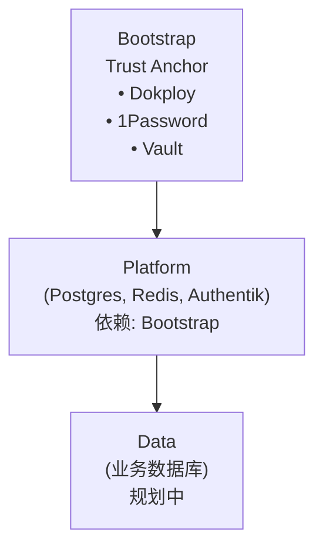

# SSOT 文档索引

> **Single Source of Truth** - 话题式架构文档
> **定位**：技术参考手册，关键信息集中，避免混乱
> **受众**：所有人（查阅技术细节时使用）

---

> 命令示例默认使用 `invoke`；未激活虚拟环境时请使用 `uv run invoke`。

## 📚 与其他文档的关系

| 文档类型 | 路径 | 适用场景 |
|---------|------|---------|
| **[开发者体验](../onboarding/README.md)** | `docs/onboarding/` | **新手入门，快速上手** → 场景驱动教程 |
| **SSOT（本目录）** | `docs/ssot/` | **查技术细节，理解原理** → 话题式参考 |
| **Layer README** | 各目录 | **修改基础设施，了解设计** → 模块说明 |

**建议使用方式**：
- 先看 [开发者体验](../onboarding/README.md) 快速上手
- 遇到问题查 **SSOT**（本目录）了解技术细节
- 需要修改基础设施时看对应模块的 README

**机器可读治理**：
- [MANIFEST.yaml](./MANIFEST.yaml) 是 SSOT key、owner 文件、code/test proof anchor 的机器可读清单。
- 新增或移动 SSOT 文件时，必须同步更新本索引和 `MANIFEST.yaml`。

---

## 相关文档

- **[工程入口](../../README.md)** - 仓库总览与命令入口
- **[开发者接入指南](../onboarding/README.md)** - 场景驱动的快速上手教程
- **[设计文档](../project/README.md)** - Infra-* 项目文档
- **[AI 行为准则](../../AGENTS.md)** - Claude 协作规范 · [GitHub](https://github.com/wangzitian0/infra2/blob/main/AGENTS.md)
- **[文档索引](../README.md)** - 文档体系总入口

---

<!-- BEGIN GENERATED SSOT INDEX (tools/gen_ssot_index.py) -->

## Core - 核心 (必读)

| 文件 | SSOT Key | 关键内容 |
|------|----------|----------|
| [core.md](./core.md) | `core` | 架构 + 目录 + 环境 + 变量 + 网络 |
| [core.environments.md](./core.environments.md) | `core.environments` | 环境分类、隔离与命名 |
| [core.harness.md](./core.harness.md) | `core.harness` | Workspace harness scope, repository autonomy, and coordination boundary |
| [core.truealpha_runtime.md](./core.truealpha_runtime.md) | `core.truealpha_runtime` | TrueAlpha Dagster artifact binding, environment isolation, and host-only OpenD boundary |

---

## Bootstrap - 引导层

| 文件 | SSOT Key | 关键内容 |
|------|----------|----------|
| [bootstrap.nodep.md](./bootstrap.nodep.md) | `bootstrap.nodep` | Bootstrap 组件（Dokploy、1Password、Vault） |
| [bootstrap.vars_and_secrets.md](./bootstrap.vars_and_secrets.md) | `bootstrap.vars_and_secrets` | 变量与密钥管理、.env 结构 |
| [bootstrap.dns_and_cert.md](./bootstrap.dns_and_cert.md) | `bootstrap.dns_and_cert` | DNS 与证书自动化 |
| [bootstrap.iac_runner.md](./bootstrap.iac_runner.md) | `bootstrap.iac_runner` | IaC Runner GitOps 自动化、Vault-Agent 模式 |

---

## Platform - 平台层

| 文件 | SSOT Key | 关键内容 |
|------|----------|----------|
| [platform.domain.md](./platform.domain.md) | `platform.domain` | 域名架构、Traefik 路由、Dokploy 配置规范 |
| [platform.sso.md](./platform.sso.md) | `platform.sso` | Authentik SSO |
| [platform.automation.md](./platform.automation.md) | `platform.automation` | Deployer 自动化 |
| [platform.ai.md](./platform.ai.md) | `platform.ai` | AI 接入、OpenRouter |
| [platform.openpanel.md](./platform.openpanel.md) | `platform.openpanel` | OpenPanel 产品分析部署 |

---

## Data - 数据层

| 文件 | SSOT Key | 关键内容 |
|------|----------|----------|
| [db.overview.md](./db.overview.md) | `db.overview` | 数据库总览、Vault 机制 |
| [db.vault-integration.md](./db.vault-integration.md) | `db.vault` | Per-App Token、故障排查 |
| [db.platform_pg.md](./db.platform_pg.md) | `db.platform_pg` | Platform PG (L1) |
| [db.redis.md](./db.redis.md) | `db.redis` | Redis 缓存 |
| [db.clickhouse.md](./db.clickhouse.md) | `db.clickhouse` | ClickHouse (SigNoz Storage) |
| [vault-self-refresh-inventory.yaml](./vault-self-refresh-inventory.yaml) | `vault.self_refresh_inventory` | Vault app-token self-refresh audit inventory |

---

## Ops - 运维

| 文件 | SSOT Key | 关键内容 |
|------|----------|----------|
| [ops.standards.md](./ops.standards.md) | `ops.standards` | 命名/标签规范、资源评估、防御性运维守则 |
| [ops.pipeline.md](./ops.pipeline.md) | `ops.pipeline` | CI/CD 流程、GitOps |
| [ops.e2e-regressions.md](./ops.e2e-regressions.md) | `ops.e2e` | 部署验证、E2E 测试 |
| [ops.test_coverage.md](./ops.test_coverage.md) | `ops.test_coverage` | libs/tools 单测覆盖率 no-regression 门禁 |
| [ops.recovery.md](./ops.recovery.md) | `ops.recovery` | 故障恢复、Vault Unseal |
| [ops.storage.md](./ops.storage.md) | `ops.storage` | 备份策略、R2 同步 |
| [ops.backup-inventory.yaml](./ops.backup-inventory.yaml) | `ops.backup_inventory` | Persistent data backup coverage inventory |
| [deploy-dependencies.yaml](./deploy-dependencies.yaml) | `ops.deploy_dependencies` | 部署扇出 + content-hash 依赖清单 |
| [delivery-stages.yaml](./delivery-stages.yaml) | `ops.delivery_stages` | SDK 版本化交付管线 stage 词汇（app+infra CI 共享） |
| [ci-gate-inventory.yaml](./ci-gate-inventory.yaml) | `ops.ci_gate_inventory` | infra CI gate 坐标清单（(stage,task_category)→workflow:job） |
| [ops.observability.md](./ops.observability.md) | `ops.obs` | 可观测性单一 owner：采集(SigNoz/日志/链路)+ 告警(规则/分级/watchdog)+ 报告(可用率账本)+ 时间尺度分层 |
| [watchdog-signals.yaml](./watchdog-signals.yaml) | `watchdog.signals` | Active watchdog signal inventory and ownership |

---

<!-- END GENERATED SSOT INDEX -->

## 维护约定 (Template)

请参考 [docs/ssot/template.md](./template.md) 进行文档编写。

- **Used by**：由 MkDocs 自动维护。
- **引用**：使用标准 Markdown 链接指向 SSOT 文件的特定章节或 Anchor。

---

## 层级架构

```mermaid
flowchart TB
    B["Bootstrap<br/>Trust Anchor<br/>• Dokploy<br/>• 1Password<br/>• Vault"]
    P["Platform<br/>(Postgres, Redis, Authentik)<br/>依赖: Bootstrap"]
    D["Data<br/>(业务数据库)<br/>规划中"]

    B --> P
    P --> D
```

*Last updated: 2025-12-30*
