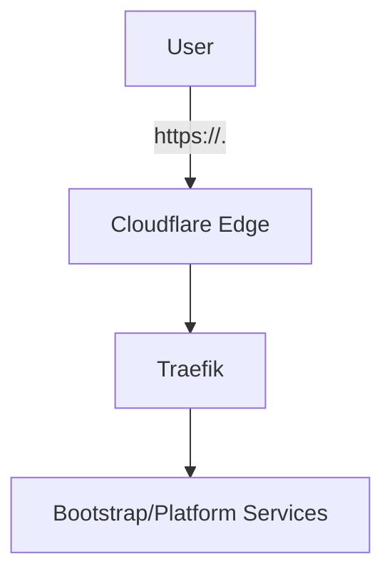

# DNS 与证书自动化 SSOT

> **SSOT Key**: `bootstrap.dns_and_cert`
> **核心定义**: Cloudflare DNS + TLS 设置以自动化任务为真源，确保核心域名可解析并具备 HTTPS。

---

## 1. 真理来源 (The Source)

| 维度 | 物理位置 (SSOT) | 说明 |
|------|----------------|------|
| **DNS 自动化** | `bootstrap/02.dns_and_cert/tasks.py` | Cloudflare API 调用与任务入口 |
| **操作手册** | `bootstrap/02.dns_and_cert/README.md` | 使用方法与兜底说明 |
| **环境变量清单** | `bootstrap/02.dns_and_cert/.env.example` | 仅 Key 清单 |
| **密钥真源** | 1Password `bootstrap/cloudflare` | `CF_API_TOKEN`, `CF_ZONE_ID`, `CF_ZONE_NAME` |
| **默认域名列表** | 1Password `bootstrap/cloudflare` | `CF_RECORDS` |
| **基础变量** | 1Password `init/env_vars` | `VPS_HOST`, `INTERNAL_DOMAIN` |

### Code as SSOT 索引

- **任务加载器**：`tasks.py`
- **Bootstrap 目录**：`bootstrap/02.dns_and_cert/`

---

## 2. 架构模型



### 关键决策

- **DNS 由 Cloudflare 管理**，DNS 记录通过 API 自动化。
- **证书由 Cloudflare + Traefik 共同完成**：边缘证书由 Cloudflare 提供，源站证书由 Traefik 自动申请。
- **域名范围**：`cloud`, `op`, `vault`, `sso`, `home`。
- **可扩展**：新增域名写入 `CF_RECORDS` 或用 `invoke dns_and_cert.add`。

---

## 3. 设计约束 (Dos & Don'ts)

### ✅ 推荐模式

- 使用 `invoke dns_and_cert.setup` 统一创建记录与 SSL 设置。
- 修改域名或目标 IP 时只更新 1Password/模板，然后重跑任务。

### ⛔ 禁止模式

- 禁止在 Cloudflare UI 手动改配置后不回写 SSOT。
- 禁止在仓库中存储 Cloudflare Token。

---

## 4. 标准操作程序 (Playbooks)

### SOP-001: 一键配置 DNS + SSL

```bash
invoke dns_and_cert.setup
```

### SOP-002: 仅更新 DNS 记录

```bash
invoke dns_and_cert.apply
```

### SOP-003: 新增域名

```bash
invoke dns_and_cert.add --records=newapp
```

### SOP-004: 证书预热与验证

```bash
invoke dns_and_cert.warm
invoke dns_and_cert.verify
```

---

## 5. 验证与测试 (The Proof)

| 行为描述 | 验证方式 | 覆盖率 |
|----------|----------|--------|
| DNS 可解析 | `invoke dns_and_cert.verify` | ✅ Manual |
| HTTPS 可达 | `invoke dns_and_cert.verify` | ✅ Manual |
| 网络层 E2E | `e2e_regressions/tests/bootstrap/network_layer/test_network.py` | ✅ Critical |

---

## Used by

> **Note**: 本章节由 MkDocs 插件自动维护反向链接，无需手动编辑。
