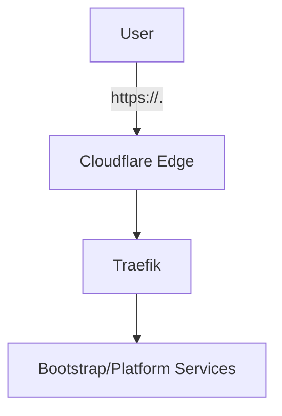

# DNS 与证书自动化 SSOT

> **SSOT Key**: `bootstrap.dns_and_cert`
> **核心定义**: Cloudflare DNS + TLS 设置以自动化任务为真源，确保核心域名可解析并具备 HTTPS。

---

## 1. 真理来源 (The Source)

| 维度 | 物理位置 (SSOT) | 说明 |
|------|----------------|------|
| **DNS 自动化** | `bootstrap/02.dns_and_cert/tasks.py` | Cloudflare API 调用与任务入口 |
| **操作手册** | `bootstrap/02.dns_and_cert/README.md` | 使用方法与兜底说明 |
| **环境变量清单** | `bootstrap/02.dns_and_cert/.env.example` | 仅 Key 清单 |
| **密钥真源** | 1Password `bootstrap/cloudflare` | `CF_API_TOKEN`, `CF_ZONE_ID`, `CF_ZONE_NAME` |
| **默认域名列表** | 1Password `bootstrap/cloudflare` | `CF_RECORDS` |
| **基础变量** | 1Password `init/env_vars` | `VPS_HOST`, `INTERNAL_DOMAIN` |

### Code as SSOT 索引

- **任务加载器**：`tasks.py`
- **Bootstrap 目录**：`bootstrap/02.dns_and_cert/`

---

## 2. 架构模型


```mermaid
flowchart TB
    User[User] -->|https://<service>.<internal_domain>| Cloudflare[Cloudflare Edge]
    Cloudflare --> Traefik[Traefik]
    Traefik --> Services[Bootstrap/Platform Services]
```

### 关键决策

- **DNS 由 Cloudflare 管理**，DNS 记录通过 API 自动化。
- **证书由 Cloudflare + Traefik 共同完成**：边缘证书由 Cloudflare 提供，源站证书由 Traefik 自动申请。
- **域名范围**：`cloud`, `op`, `vault`, `sso`, `home`。
- **可扩展**：新增域名写入 `CF_RECORDS` 或用 `invoke dns-and-cert.add`。

### 多 Zone（App 自有域名）

某些 App 有自己独立于 `INTERNAL_DOMAIN` 的公开域名（例如 truealpha/app 的
`truealpha.club`，见 infra2#550），路由到**同一台 VPS**，但和共享控制面
（`cloud.`/`vault.`/`otel.` 等，见 `libs.common.infra_domain()`）是两个不同的
Cloudflare zone。这些域名的 A 记录（wildcard `*` + apex `@`）不在
`bootstrap/02.dns_and_cert` 默认管理范围（`CF_RECORDS` 仍只描述
`INTERNAL_DOMAIN` 下的记录），改用 `invoke dns-and-cert.apply --domain=<zone> --records=<...>`
显式指定 zone：

```bash
invoke dns-and-cert.apply --domain=truealpha.club --records="*,@"
```

`--domain` 与默认 `INTERNAL_DOMAIN` 不同时，zone 永远按名称实时解析（绝不复用
`CF_ZONE_ID`——那只是默认 zone 的 id，跨 zone 复用会静默写错 zone）。同一个
`CF_API_TOKEN` 已同时对 `zitian.party` 与 `truealpha.club` 两个 zone 授权
（Zone.Zone + Zone.DNS，2026-07-20 验证）；该 token **没有** Zone Settings 权限，
所以 `invoke dns-and-cert.ssl` 目前只能对默认 zone 生效——`truealpha.club` 的
SSL/TLS 模式仍需在 Cloudflare 控制台手动确认（该 zone 的邮件相关记录
`MX`/`SendGrid CNAME`/`DKIM`/`SPF`/`DMARC` 也完全在本自动化管理范围之外，不要
碰）。

---

## 3. 设计约束 (Dos & Don'ts)

### ✅ 推荐模式

- 使用 `invoke dns-and-cert.setup` 统一创建记录与 SSL 设置。
- 修改域名或目标 IP 时只更新 1Password/模板，然后重跑任务。

### ⛔ 禁止模式

- 禁止在 Cloudflare UI 手动改配置后不回写 SSOT。
- 禁止在仓库中存储 Cloudflare Token。

### ⚠️ 重要注意事项

> [!WARNING]
> **Dokploy 域名变更需要 Redeploy**
>
> 在 Dokploy UI 中修改域名配置后，必须触发一次 **Redeploy** 才能生效。
> 这是因为 Traefik labels 是在 compose 文件部署时动态生成的。
>
> - 如果修改了域名端口映射 → 需要 Redeploy
> - 如果新增了域名 → `ensure_domains()` 会自动触发 Redeploy
> - 如果删除了域名 → 需要手动 Redeploy

---

## 4. 标准操作程序 (Playbooks)

### SOP-001: 一键配置 DNS + SSL

```bash
invoke dns-and-cert.setup
```

`setup` 默认内置 60s 冷却等待，避免 DNS/证书传播导致误判，可用 `--cooldown=0` 跳过。

### SOP-002: 仅更新 DNS 记录

```bash
invoke dns-and-cert.apply
```

### SOP-003: 新增域名

```bash
invoke dns-and-cert.add --records=newapp
```

### SOP-004: 证书预热与验证

```bash
invoke dns-and-cert.warm
invoke dns-and-cert.verify
```

---

## 5. 验证与测试 (The Proof)

| 行为描述 | 验证方式 | 覆盖率 |
|----------|----------|--------|
| DNS 可解析 | `invoke dns-and-cert.verify` | ✅ Manual |
| HTTPS 可达 | `invoke dns-and-cert.verify` | ✅ Manual |
| 网络层 E2E | `e2e_regressions/tests/bootstrap/network_layer/test_network.py` | ✅ Critical |

---

## Used by

> **Note**: 本章节由 MkDocs 插件自动维护反向链接，无需手动编辑。
