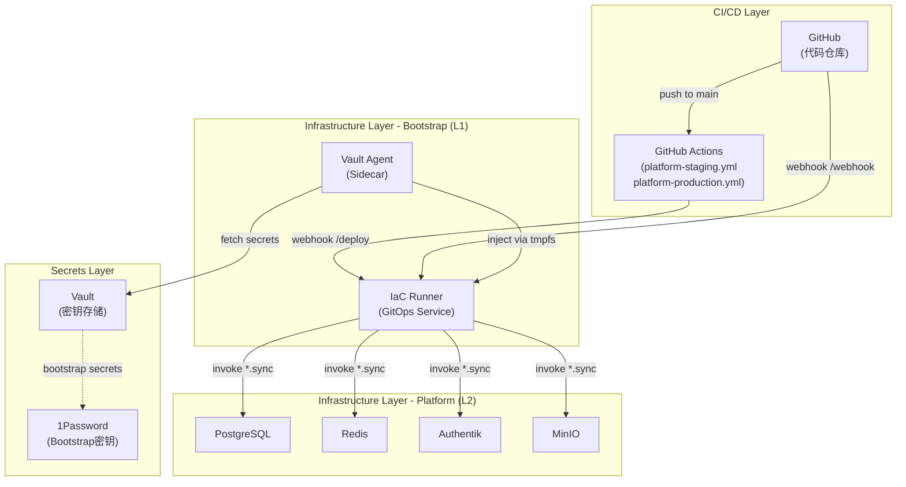
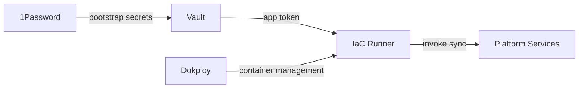

# IaC Runner SSOT

> **SSOT Key**: `bootstrap.iac_runner`
> **核心定义**: GitOps 自动化部署服务，监听 GitHub webhook 并自动同步基础设施变更。

---

## 1. 真理来源 (The Source)

| 维度 | 物理位置 (SSOT) | 说明 |
|------|----------------|------|
| **Service Code** | [`bootstrap/06.iac-runner/`](../../bootstrap/06.iac-runner/) | 服务实现、Dockerfile |
| **Deployment** | [`bootstrap/06.iac-runner/deploy.py`](../../bootstrap/06.iac-runner/deploy.py) | 部署脚本 |
| **Secrets** | `secret/data/bootstrap/production/iac_runner` (Vault) | WEBHOOK_SECRET, GIT_REPO_URL |
| **GitHub Workflows** | [`.github/workflows/platform-*.yml`](../../.github/workflows/) | 触发 IaC Runner 的 CI/CD 流程 |
| **Component README** | [`bootstrap/06.iac-runner/README.md`](../../bootstrap/06.iac-runner/README.md) | 操作手册 |

---

## 2. 架构概览

### 2.1 定位与职责

IaC Runner 是 **L1 Bootstrap 层**组件，负责自动化部署 **L2 Platform 层**服务。

**核心职责**:
- 接收 GitHub webhook（push to `main`）
- 解析变更文件，识别受影响的服务
- 执行 `invoke {service}.sync` 自动部署
- 支持基于版本的 GitOps 部署（staging/production）

**管理范围**:

| 项目 | 管理方式 |
|------|---------|
| **Bootstrap** (1Password, Vault, IaC Runner) | 手动部署（避免循环依赖） |
| **Platform** (Postgres, Redis, Authentik) | **IaC Runner 自动同步** ✅ |
| **Apps** (finance_report, wealthfolio) | 各自独立的 CI/CD Pipeline |

### 2.2 架构图



### 2.3 Vault-Agent Sidecar 模式

```
┌─────────────────────────────────────────────────────────────────┐
│                       IaC Runner Pod                            │
│  ┌──────────────┐    tmpfs    ┌─────────────────────────────┐   │
│  │ vault-agent  │───────────▶│     IaC Runner              │   │
│  │ (sidecar)    │ /secrets   │  - Webhook server           │   │
│  └──────────────┘            │  - Sync runner              │   │
│         │                    │  - Invoke tasks             │   │
│         ▼                    └─────────────────────────────┘   │
│  Vault (fetch WEBHOOK_SECRET, GIT_REPO_URL)                     │
└─────────────────────────────────────────────────────────────────┘
```

**优势**:
- ✅ 零密钥泄露风险（密钥存于内存 tmpfs）
- ✅ 自动刷新（Vault Agent 定期 renew）
- ✅ 无需环境变量明文传递

---

## 3. 工作流详解

### 3.1 变更驱动自动同步（Webhook）

```
┌─────────────┐     1. push to main      ┌──────────────┐
│ Developer   │ ──────────────────────▶ │   GitHub     │
└─────────────┘                          └──────────────┘
                                               │
                                               │ 2. webhook POST /webhook
                                               ▼
                                        ┌──────────────┐
                                        │  IaC Runner  │
                                        └──────────────┘
                                               │
                                               │ 3. parse changed files
                                               ▼
                                        ┌──────────────┐
                                        │ Identify     │
                                        │ Services     │
                                        └──────────────┘
                                               │
                                               │ 4. invoke {service}.sync
                                               ▼
                                        ┌──────────────┐
                                        │   Dokploy    │
                                        │  (Services)  │
                                        └──────────────┘
```

**关键步骤**:
1. Developer 推送代码到 `main` 分支
2. GitHub 触发 webhook → `POST https://iac.{domain}/webhook`
3. IaC Runner 解析 `modified_files`，识别受影响的服务
4. 对每个服务执行 `invoke {service}.sync`
5. `sync` 任务计算配置哈希，仅在变更时重新部署

### 3.2 版本驱动 GitOps 部署（GitHub Actions）

**语义化版本**: `v{major}.{minor}.{patch}`

- **Patch**: Staging 迭代（每次 push main 自动 +1）
- **Minor**: Production 发布（手动从 staging tag promote）
- **Major**: 架构变更（罕见，手动）

#### Staging 自动部署流程

```
┌─────────────┐     1. push to main      ┌──────────────┐
│ Developer   │ ──────────────────────▶ │   GitHub     │
└─────────────┘                          └──────────────┘
                                               │
                                               │ 2. trigger workflow
                                               ▼
                                        ┌──────────────┐
                                        │ platform-    │
                                        │ staging.yml  │
                                        └──────────────┘
                                               │
                                               │ 3. auto-increment patch
                                               │    v1.2.3 → v1.2.4
                                               ▼
                                        ┌──────────────┐
                                        │ Create Tag   │
                                        └──────────────┘
                                               │
                                               │ 4. POST /deploy
                                               │    {"env":"staging","tag":"v1.2.4"}
                                               ▼
                                        ┌──────────────┐
                                        │  IaC Runner  │
                                        └──────────────┘
                                               │
                                               │ 5. checkout tag
                                               │ 6. invoke *.sync (all platform)
                                               ▼
                                        ┌──────────────┐
                                        │   Dokploy    │
                                        │  (Staging)   │
                                        └──────────────┘
```

#### Production 手动部署流程

```
┌─────────────┐     1. gh workflow run     ┌──────────────┐
│ Maintainer  │ ──────────────────────────▶│   GitHub     │
│             │    (staging_tag=v1.2.4)    │   Actions    │
└─────────────┘                            └──────────────┘
                                                  │
                                                  │ 2. validate tag exists
                                                  ▼
                                           ┌──────────────┐
                                           │ platform-    │
                                           │ production.yml│
                                           └──────────────┘
                                                  │
                                                  │ 3. promote minor version
                                                  │    v1.2.4 → v1.3.0
                                                  ▼
                                           ┌──────────────┐
                                           │ Create Tag   │
                                           │ + Release    │
                                           └──────────────┘
                                                  │
                                                  │ 4. POST /deploy
                                                  │    {"env":"production","tag":"v1.3.0"}
                                                  ▼
                                           ┌──────────────┐
                                           │  IaC Runner  │
                                           └──────────────┘
                                                  │
                                                  │ 5. checkout tag
                                                  │ 6. invoke *.sync (all platform)
                                                  ▼
                                           ┌──────────────┐
                                           │   Dokploy    │
                                           │ (Production) │
                                           └──────────────┘
```

### 3.3 配置哈希幂等性

**Sync 任务工作原理**:
```python
# 伪代码示例
def sync_service(service_name):
    current_config = load_compose_yaml() + fetch_env_vars()
    new_hash = sha256(current_config)
    
    stored_hash = get_from_dokploy_env("IAC_CONFIG_HASH")
    
    if new_hash == stored_hash:
        print("Config unchanged, skipping deploy")
        return
    
    deploy_to_dokploy(service_name, current_config)
    update_dokploy_env("IAC_CONFIG_HASH", new_hash)
```

**优势**:
- ✅ 避免无意义的重启
- ✅ 幂等性保证（多次执行结果相同）
- ✅ 快速失败（检测到配置无变更时立即返回）

---

## 4. API 端点

### 4.1 端点概览

| Endpoint | Method | Description | 触发方式 |
|----------|--------|-------------|---------|
| `/health` | GET | 健康检查 | 手动 / 监控 |
| `/webhook` | POST | GitHub webhook 接收器（变更驱动） | GitHub 自动触发 |
| `/deploy` | POST | 版本部署（GitOps）| GitHub Actions |
| `/sync` | POST | 手动同步触发器（遗留） | 手动 curl |

### 4.2 `/health` - 健康检查

**请求**:
```bash
curl https://iac.{domain}/health
```

**响应**:
```json
{
  "status": "healthy",
  "version": "1.0.0",
  "uptime": 3600
}
```

### 4.3 `/webhook` - GitHub Webhook

**请求示例**（GitHub 自动发送）:
```json
POST /webhook HTTP/1.1
Host: iac.{domain}
X-Hub-Signature-256: sha256=...
Content-Type: application/json

{
  "ref": "refs/heads/main",
  "commits": [
    {
      "modified": ["platform/01.postgres/compose.yaml"],
      "added": ["platform/03.redis/deploy.py"]
    }
  ]
}
```

**处理逻辑**:
1. 验证 HMAC 签名（`X-Hub-Signature-256`）
2. 仅处理 `main` 分支推送
3. 解析 `modified`/`added`/`removed` 文件列表
4. 映射文件路径到服务名称
5. 执行 `invoke {service}.sync`

**响应**:
```json
{
  "status": "success",
  "synced_services": ["postgres", "redis"],
  "skipped_services": []
}
```

### 4.4 `/deploy` - 版本部署

**请求示例**（GitHub Actions 调用）:
```bash
PAYLOAD='{"env":"staging","tag":"v1.2.4","triggered_by":"github-actions"}'
SIGNATURE=$(echo -n "$PAYLOAD" | openssl dgst -sha256 -hmac "$SECRET" | awk '{print $2}')

curl -X POST https://iac.{domain}/deploy \
  -H "Content-Type: application/json" \
  -H "X-Hub-Signature-256: sha256=$SIGNATURE" \
  -d "$PAYLOAD"
```

**参数**:
- `env`: 目标环境（`staging` / `production`）
- `tag`: Git tag（如 `v1.2.4`）
- `triggered_by`: 触发来源（如 `github-actions`, `manual-promotion`）

**处理逻辑**:
1. 验证 HMAC 签名
2. Checkout 指定 tag
3. 根据环境设置 `DEPLOY_ENV` 环境变量
4. 执行 `invoke {service}.sync` for all platform services
5. 记录部署日志

**响应**:
```json
{
  "status": "success",
  "env": "staging",
  "tag": "v1.2.4",
  "deployed_services": ["postgres", "redis", "authentik", "minio"],
  "timestamp": "2025-01-24T04:51:00Z"
}
```

### 4.5 `/sync` - 手动同步（Legacy）

**请求示例**:
```bash
# 同步特定服务
PAYLOAD='{"services":["platform/postgres"]}'
SIGNATURE=$(echo -n "$PAYLOAD" | openssl dgst -sha256 -hmac "$SECRET" | cut -d' ' -f2)

curl -X POST https://iac.{domain}/sync \
  -H "Content-Type: application/json" \
  -H "X-Hub-Signature-256: sha256=$SIGNATURE" \
  -d "$PAYLOAD"

# 同步所有服务
PAYLOAD='{"all": true}'
SIGNATURE=$(echo -n "$PAYLOAD" | openssl dgst -sha256 -hmac "$SECRET" | cut -d' ' -f2)

curl -X POST https://iac.{domain}/sync \
  -H "Content-Type: application/json" \
  -H "X-Hub-Signature-256: sha256=$SIGNATURE" \
  -d "$PAYLOAD"
```

**注意**: 此端点为遗留接口，推荐使用 `/deploy` 进行版本化部署。

---

## 5. 服务映射

### 5.1 变更文件 → 服务映射表

| 变更路径 | 触发任务 | 说明 |
|---------|---------|------|
| `platform/01.postgres/*` | `postgres.sync` | 自动同步 PostgreSQL |
| `platform/02.redis/*` | `redis.sync` | 自动同步 Redis |
| `platform/10.authentik/*` | `authentik.sync` | 自动同步 Authentik |
| `platform/11.minio/*` | `minio.sync` | 自动同步 MinIO |
| `libs/*` | **All platform services** | 公共库变更，全量同步 |
| `bootstrap/*` | **Skipped** | 手动部署（避免循环依赖）|
| `finance_report/*` | **Skipped** | 使用 finance_report 独立 CI |
| `finance/*` | **Skipped** | 使用应用独立 CI |

### 5.2 排除规则

**为什么 Bootstrap 不自动同步？**
- IaC Runner 本身是 Bootstrap 组件
- 自动同步会导致循环依赖（IaC Runner 重启自己）
- Bootstrap 变更频率低，手动部署更安全

**为什么 Apps 不自动同步？**
- Apps 有独立的构建流程（Docker 镜像构建）
- IaC Runner 只管理基础设施配置，不负责应用代码构建
- 各应用使用自己的 GitHub CI/CD pipeline

---

## 6. 配置管理

### 6.1 Vault 密钥

**路径**: `secret/data/bootstrap/production/iac_runner`

**必需字段**:
| Key | 说明 | 生成方式 |
|-----|------|---------|
| `WEBHOOK_SECRET` | GitHub webhook 验证密钥 | `openssl rand -hex 32` |
| `GIT_REPO_URL` | Git 仓库地址 | `https://github.com/wangzitian0/infra2.git` |

**设置命令**:
```bash
invoke env.set WEBHOOK_SECRET=$(openssl rand -hex 32) \
  --project=bootstrap --service=iac_runner

invoke env.set GIT_REPO_URL=https://github.com/wangzitian0/infra2.git \
  --project=bootstrap --service=iac_runner
```

### 6.2 Vault Token

**Token 类型**: App Token（只读权限）

**生成命令**:
```bash
export VAULT_ROOT_TOKEN=$(op read 'op://Infra2/dexluuvzg5paff3cltmtnlnosm/Token')
invoke vault.setup-tokens
```

**Token 自动注入**:
- `invoke vault.setup-tokens` 自动在 Dokploy 中为 IaC Runner 配置 `VAULT_APP_TOKEN`
- Vault Agent 使用此 token 拉取密钥

### 6.3 环境变量

**Dokploy 环境变量**:
| Variable | Source | 说明 |
|----------|--------|------|
| `VAULT_ADDR` | 手动配置 | `https://vault.{domain}` |
| `VAULT_APP_TOKEN` | `invoke vault.setup-tokens` | Vault 只读 token |
| `INTERNAL_DOMAIN` | 手动配置 | 内部域名 |
| `DEPLOY_ENV` | 手动配置 | `production` / `staging` |

**容器内环境变量**（由 Vault Agent 注入）:
| Variable | Source | 说明 |
|----------|--------|------|
| `WEBHOOK_SECRET` | Vault | GitHub webhook 验证密钥 |
| `GIT_REPO_URL` | Vault | Git 仓库地址 |

---

## 7. 部署与维护

### 7.1 初次部署

**前置条件**:
- ✅ Dokploy 已安装
- ✅ Vault 已部署且可访问
- ✅ 1Password CLI 已安装（用于读取 Vault root token）

**部署步骤**:
```bash
# 1. 配置密钥
invoke env.set WEBHOOK_SECRET=$(openssl rand -hex 32) \
  --project=bootstrap --service=iac_runner

invoke env.set GIT_REPO_URL=https://github.com/wangzitian0/infra2.git \
  --project=bootstrap --service=iac_runner

# 2. 生成 Vault token
export VAULT_ROOT_TOKEN=$(op read 'op://Infra2/dexluuvzg5paff3cltmtnlnosm/Token')
invoke vault.setup-tokens

# 3. 部署服务
invoke iac-runner.setup

# 4. 验证部署
docker ps --filter name=iac-runner
curl https://iac.{domain}/health

# 5. 配置 GitHub webhook
# 在仓库设置中添加 webhook:
# - URL: https://iac.{domain}/webhook
# - Secret: (Vault 中的 WEBHOOK_SECRET)
# - Events: push
```

### 7.2 健康检查

```bash
# 检查容器状态
docker ps --filter name=iac-runner

# 检查健康端点
curl https://iac.{domain}/health

# 检查 Vault Agent 状态
docker ps --filter name=iac-runner-vault-agent

# 检查 op CLI 可用性
docker exec iac-runner which op
# 应返回: /usr/local/bin/op
```

### 7.3 常见问题排查

#### 问题 1: `FileNotFoundError: 'op'`

**症状**:
```
FileNotFoundError: [Errno 2] No such file or directory: 'op'
```

**原因**: 容器中未安装 1Password CLI

**解决方案**: 已在 Dockerfile 中添加 op CLI 安装（见 PR #101）
```dockerfile
# Install 1Password CLI (required by libs/common.py::OpSecrets)
RUN curl -sSfLo op.zip https://cache.agilebits.com/dist/1P/op2/pkg/v2.30.0/op_linux_amd64_v2.30.0.zip && \
    unzip -od /usr/local/bin/ op.zip && \
    rm op.zip && \
    chmod +x /usr/local/bin/op
```

#### 问题 2: `unzip: not found`

**症状**:
```
/bin/sh: 1: unzip: not found
```

**原因**: `python:3.11-slim` 基础镜像不包含 `unzip` 工具

**解决方案**: 已在 Dockerfile 中添加 unzip 依赖（见 PR #102）
```dockerfile
RUN apt-get update && apt-get install -y \
    git \
    unzip \
    && rm -rf /var/lib/apt/lists/*
```

#### 问题 3: Webhook 验证失败

**症状**: GitHub webhook 返回 403 Forbidden

**原因**: HMAC 签名验证失败

**排查步骤**:
```bash
# 1. 检查 Vault 中的密钥
invoke env.get WEBHOOK_SECRET --project=bootstrap --service=iac_runner

# 2. 检查 GitHub webhook 配置
# Settings → Webhooks → 检查 Secret 是否匹配

# 3. 手动测试签名
PAYLOAD='{"ref":"refs/heads/main"}'
SECRET="<WEBHOOK_SECRET>"
SIGNATURE=$(echo -n "$PAYLOAD" | openssl dgst -sha256 -hmac "$SECRET" | awk '{print $2}')
echo "X-Hub-Signature-256: sha256=$SIGNATURE"
```

#### 问题 4: Vault Agent 无法连接

**症状**: 容器日志显示 Vault 连接错误

**排查步骤**:
```bash
# 1. 检查 VAULT_APP_TOKEN 是否存在
docker exec iac-runner env | grep VAULT_APP_TOKEN

# 2. 手动测试 Vault 连接
docker exec iac-runner curl -H "X-Vault-Token: $VAULT_APP_TOKEN" \
  https://vault.{domain}/v1/secret/data/bootstrap/production/iac_runner

# 3. 重新生成 token
export VAULT_ROOT_TOKEN=$(op read 'op://Infra2/dexluuvzg5paff3cltmtnlnosm/Token')
invoke vault.setup-tokens

# 4. 重启容器
docker restart iac-runner
```

### 7.4 更新 IaC Runner

**手动更新流程**（Bootstrap 组件手动部署）:
```bash
# 1. 拉取最新代码
cd /path/to/infra2
git pull origin main

# 2. 重新构建镜像（如果需要）
# （通常在 Dokploy 中配置自动构建）

# 3. 重新部署
invoke iac-runner.setup

# 4. 验证
docker ps --filter name=iac-runner
curl https://iac.{domain}/health
```

---

## 8. 安全考量

### 8.1 访问控制

| 资源 | 权限 | 实现方式 |
|------|------|---------|
| **Vault 密钥** | 只读 | App Token（`vault.setup-tokens` 生成）|
| **Docker Socket** | 只读 | `ro` mount（`/var/run/docker.sock:/var/run/docker.sock:ro`）|
| **Host 文件系统** | 无写入权限 | 仅 workspace 目录可写 |
| **Bootstrap 服务** | 排除自动同步 | 代码中硬编码过滤规则 |

### 8.2 HMAC 签名验证

**所有 API 端点**均要求 HMAC 签名验证:
```python
def verify_signature(payload: bytes, signature: str) -> bool:
    expected = hmac.new(
        WEBHOOK_SECRET.encode(),
        payload,
        hashlib.sha256
    ).hexdigest()
    return hmac.compare_digest(f"sha256={expected}", signature)
```

### 8.3 密钥轮换

**定期轮换 WEBHOOK_SECRET**:
```bash
# 1. 生成新密钥
NEW_SECRET=$(openssl rand -hex 32)

# 2. 更新 Vault
invoke env.set WEBHOOK_SECRET=$NEW_SECRET \
  --project=bootstrap --service=iac_runner

# 3. 更新 GitHub webhook 配置

# 4. 重启 IaC Runner
docker restart iac-runner
```

---

## 9. 监控与告警

### 9.1 健康监控

**推荐监控指标**:
- `/health` 端点响应时间 < 500ms
- 容器状态（健康检查通过）
- Vault Agent 连接状态

**UptimeKuma 配置示例**:
```yaml
name: IaC Runner Health
url: https://iac.{domain}/health
interval: 60  # 每分钟检查一次
```

### 9.2 日志监控

**关键日志事件**:
- ✅ Webhook 接收成功
- ✅ 服务同步成功
- ❌ 签名验证失败
- ❌ Vault 连接错误
- ❌ Sync 任务执行失败

**日志查询示例**（如使用 SigNoz）:
```
service_name = "iac-runner"
AND (
  body contains "sync completed"
  OR body contains "ERROR"
)
```

### 9.3 告警规则

**推荐告警**:
1. **健康检查失败**: `/health` 端点连续 3 次失败
2. **Webhook 验证失败率 > 10%**: 可能的密钥泄露或配置错误
3. **Sync 任务失败**: 任何服务同步失败需立即告警
4. **Vault Agent 异常**: Vault 连接失败

---

## 10. 与其他组件的交互

### 10.1 依赖关系



**上游依赖**（IaC Runner 依赖这些服务）:
- **Vault**: 提供密钥存储和 App Token
- **Dokploy**: 提供容器编排和 API
- **1Password**: 间接依赖（通过 op CLI 读取 bootstrap secrets）

**下游消费**（这些服务由 IaC Runner 管理）:
- **Platform Services**: postgres, redis, authentik, minio 等

### 10.2 变更影响分析

**IaC Runner 变更影响**:

| 变更类型 | 影响范围 | 风险等级 | 恢复方式 |
|---------|---------|---------|---------|
| **代码逻辑** | IaC Runner 自身 | 低 | 回滚镜像 |
| **Dockerfile** | 构建流程 | 中 | 重新构建 |
| **Vault 密钥** | 认证失败 | 高 | 回滚密钥 |
| **GitHub Webhook** | 触发失败 | 中 | 修正配置 |

### 10.3 故障转移

**IaC Runner 宕机时的应对**:
1. **自动同步失败** → Platform 服务保持当前状态（无影响）
2. **手动部署** → 直接使用 `invoke {service}.setup`（不依赖 IaC Runner）
3. **快速恢复** → `docker restart iac-runner` 或 `invoke iac-runner.setup`

**关键原则**:
- ✅ IaC Runner 宕机不影响已运行的服务
- ✅ 可随时回退到手动部署模式
- ✅ 无状态设计，重启即恢复

---

## 11. 最佳实践

### 11.1 变更管理

**推荐流程**:
1. **开发阶段**: 在功能分支测试变更
2. **PR Review**: 人工审核 `platform/*` 变更
3. **Merge to main**: 触发 IaC Runner 自动部署到 staging
4. **Staging 验证**: 执行 E2E 测试
5. **Production 发布**: 手动 promote staging tag 到 production

### 11.2 配置版本控制

**所有配置文件纳入 Git**:
- ✅ `compose.yaml`
- ✅ `deploy.py`
- ✅ `shared_tasks.py`
- ❌ 密钥（存于 Vault，不进 Git）

### 11.3 测试策略

**部署前测试**:
```bash
# 1. 本地测试 sync 任务
DEPLOY_ENV=staging invoke postgres.sync --dry-run

# 2. 验证配置哈希计算
invoke postgres.shared.config-hash

# 3. 检查环境变量完整性
invoke check-env
```

### 11.4 回滚策略

**快速回滚步骤**:
```bash
# 方式 1: 回滚 Git tag（推荐）
gh workflow run platform-production.yml \
  -f confirm="deploy" \
  -f staging_tag="v1.2.3"  # 使用之前的稳定版本

# 方式 2: 手动执行上一个版本的 sync
git checkout v1.2.3
invoke postgres.sync

# 方式 3: 直接在 Dokploy UI 回滚容器
# (适用于紧急情况)
```

---

## 12. 未来规划

### 12.1 Roadmap

| 功能 | 优先级 | 状态 |
|------|-------|------|
| **Multi-env support** | High | 🚧 进行中 |
| **Rollback automation** | Medium | 📋 规划中 |
| **Deployment metrics** | Low | 📋 规划中 |
| **Slack notifications** | Low | 📋 规划中 |

### 12.2 已知限制

1. **Bootstrap 循环依赖**: IaC Runner 自身不能自动更新（需手动部署）
2. **单点故障**: 只有一个 IaC Runner 实例（未来可考虑主备模式）
3. **缺乏审计日志**: 当前日志未持久化（可接入 SigNoz 改进）

---

## 13. The Proof (验证方法)

### 13.1 部署验证

```bash
# 容器健康检查
docker ps --filter name=iac-runner
# 预期输出: iac-runner (Up, healthy)
# 预期输出: iac-runner-vault-agent (Up, healthy)

# 健康端点
curl https://iac.{domain}/health
# 预期输出: {"status":"healthy"}

# Vault Agent 正常运行
docker logs iac-runner-vault-agent --tail 10
# 预期: 无错误日志，显示 "renewed lease"

# op CLI 可用
docker exec iac-runner which op
# 预期输出: /usr/local/bin/op
```

### 13.2 功能验证

```bash
# 测试 webhook 端点（手动触发）
PAYLOAD='{"ref":"refs/heads/main","commits":[{"modified":["platform/01.postgres/compose.yaml"]}]}'
SECRET=$(invoke env.get WEBHOOK_SECRET --project=bootstrap --service=iac_runner)
SIGNATURE=$(echo -n "$PAYLOAD" | openssl dgst -sha256 -hmac "$SECRET" | awk '{print $2}')

curl -X POST https://iac.{domain}/webhook \
  -H "Content-Type: application/json" \
  -H "X-Hub-Signature-256: sha256=$SIGNATURE" \
  -d "$PAYLOAD"

# 预期输出: {"status":"success","synced_services":["postgres"]}
```

### 13.3 GitHub Integration 验证

```bash
# 1. 推送测试变更
echo "# test" >> platform/01.postgres/README.md
git add platform/01.postgres/README.md
git commit -m "test: trigger iac runner"
git push origin main

# 2. 检查 GitHub webhook delivery
# Settings → Webhooks → Recent Deliveries
# 预期: 最新一次 delivery 显示 200 OK

# 3. 检查 IaC Runner 日志
docker logs iac-runner --tail 50
# 预期: 显示 "sync completed: 1 succeeded, 0 failed"
```

---

## 14. 相关文档

### 14.1 SSOT 参考

- [核心架构](./core.md) - 层级定义和依赖关系
- [Pipeline SSOT](./ops.pipeline.md) - CI/CD 流程和 GitOps 版本策略
- [Bootstrap 变量与密钥](./bootstrap.vars_and_secrets.md) - 密钥管理体系
- [Vault Integration](./db.vault-integration.md) - Vault Agent 模式

### 14.2 操作手册

- [IaC Runner README](../../bootstrap/06.iac-runner/README.md) - 快速操作指南
- [Bootstrap Layer README](../../bootstrap/README.md) - Bootstrap 组件索引

### 14.3 GitHub Workflows

- [platform-staging.yml](../../.github/workflows/platform-staging.yml) - Staging 自动部署
- [platform-production.yml](../../.github/workflows/platform-production.yml) - Production 手动部署

---

**Last updated**: 2025-01-24  
**Maintained by**: @wangzitian0
