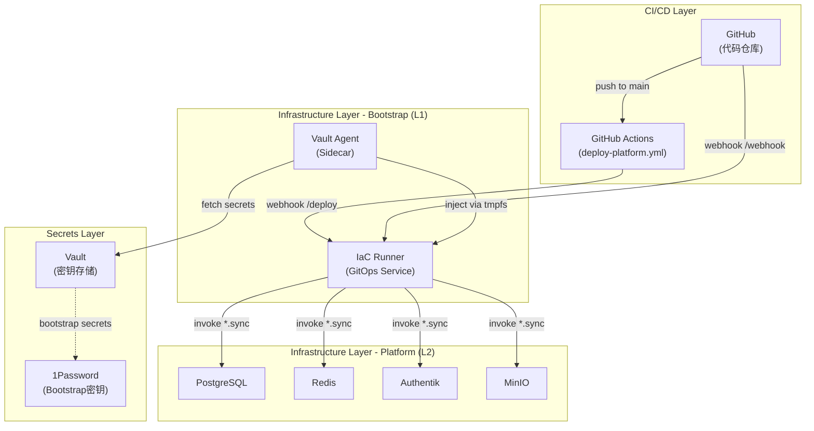
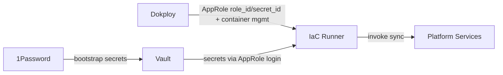

# IaC Runner SSOT

> **SSOT Key**: `bootstrap.iac_runner`
> **核心定义**: GitOps 自动化部署服务，监听 GitHub webhook 并自动同步基础设施变更。

---

## 1. 真理来源 (The Source)

| 维度 | 物理位置 (SSOT) | 说明 |
|------|----------------|------|
| **Service Code** | [`bootstrap/06.iac_runner/`](../../bootstrap/06.iac_runner/) | 服务实现、Dockerfile |
| **Deployment** | [`bootstrap/06.iac_runner/deploy.py`](../../bootstrap/06.iac_runner/deploy.py) | 部署脚本 |
| **Secrets** | `secret/data/bootstrap/production/iac_runner` (Vault) | WEBHOOK_SECRET, GIT_REPO_URL |
| **GitHub Workflows** | [`.github/workflows/deploy-platform.yml`](../../.github/workflows/deploy-platform.yml) | 触发 IaC Runner 的 CI/CD 流程 |
| **Component README** | [`bootstrap/06.iac_runner/README.md`](../../bootstrap/06.iac_runner/README.md) | 操作手册 |

---

## 2. 架构概览

### 2.1 定位与职责

IaC Runner 是 **L1 Bootstrap 层**组件，负责自动化部署 **L2 Platform 层**服务。

**核心职责**:
- 接收 GitHub webhook（push to `main`）
- 解析变更文件，识别受影响的服务
- 执行 `invoke {service}.sync` 自动部署
- 支持基于版本的 GitOps 部署（staging/production）

**管理范围**:

| 项目 | 管理方式 |
|------|---------|
| **Bootstrap** (1Password, Vault) | Manual deployment and recovery |
| **IaC Runner source image** | GitHub Actions external bootstrap update before `/deploy` when `bootstrap/06.iac_runner/**` changes |
| **Platform** (Postgres, Redis, Authentik) | **IaC Runner 自动同步** ✅ |
| **Apps** (finance_report, wealthfolio) | 各自独立的 CI/CD Pipeline |

### 2.2 架构图


```mermaid
flowchart TB
    subgraph "Secrets Layer"
        Vault["Vault<br/>(密钥存储)"]
        1P["1Password<br/>(Bootstrap密钥)"]
    end

    subgraph "CI/CD Layer"
        GitHub["GitHub<br/>(代码仓库)"]
        Actions["GitHub Actions<br/>(deploy-platform.yml)"]
    end

    subgraph "Infrastructure Layer - Bootstrap (L1)"
        IaCRunner["IaC Runner<br/>(GitOps Service)"]
        VaultAgent["Vault Agent<br/>(Sidecar)"]
    end

    subgraph "Infrastructure Layer - Platform (L2)"
        Postgres["PostgreSQL"]
        Redis["Redis"]
        Authentik["Authentik"]
        MinIO["MinIO"]
    end

    GitHub -->|push to main| Actions
    Actions -->|webhook /deploy| IaCRunner
    GitHub -->|webhook /webhook| IaCRunner
    
    VaultAgent -->|fetch secrets| Vault
    VaultAgent -->|inject via tmpfs| IaCRunner
    
    IaCRunner -->|invoke *.sync| Postgres
    IaCRunner -->|invoke *.sync| Redis
    IaCRunner -->|invoke *.sync| Authentik
    IaCRunner -->|invoke *.sync| MinIO
    
    Vault -.->|bootstrap secrets| 1P
```

### 2.3 Vault-Agent Sidecar 模式

```
┌─────────────────────────────────────────────────────────────────┐
│                       IaC Runner Pod                            │
│  ┌──────────────┐    tmpfs    ┌─────────────────────────────┐   │
│  │ vault-agent  │───────────▶│     IaC Runner              │   │
│  │ (sidecar)    │ /secrets   │  - Webhook server           │   │
│  └──────────────┘            │  - Sync runner              │   │
│         │                    │  - Invoke tasks             │   │
│         ▼                    └─────────────────────────────┘   │
│  Vault (fetch WEBHOOK_SECRET, GIT_REPO_URL)                     │
└─────────────────────────────────────────────────────────────────┘
```

**优势**:
- ✅ 零密钥泄露风险（密钥存于内存 tmpfs）
- ✅ 自动刷新（Vault Agent 定期 renew）
- ✅ 无需环境变量明文传递

---

## 3. 工作流详解

### 3.1 变更驱动自动同步（Webhook）

```
┌─────────────┐     1. push to main      ┌──────────────┐
│ Developer   │ ──────────────────────▶ │   GitHub     │
└─────────────┘                          └──────────────┘
                                               │
                                               │ 2. webhook POST /webhook
                                               ▼
                                        ┌──────────────┐
                                        │  IaC Runner  │
                                        └──────────────┘
                                               │
                                               │ 3. parse changed files
                                               ▼
                                        ┌──────────────┐
                                        │ Identify     │
                                        │ Services     │
                                        └──────────────┘
                                               │
                                               │ 4. invoke {service}.sync
                                               ▼
                                        ┌──────────────┐
                                        │   Dokploy    │
                                        │  (Services)  │
                                        └──────────────┘
```

**关键步骤**:
1. Developer 推送代码到 `main` 分支
2. GitHub 触发 webhook → `POST https://iac.{domain}/webhook`
3. IaC Runner 解析 `modified_files`，识别受影响的服务
4. 对每个服务执行 `invoke {service}.sync`
5. `sync` 任务计算配置哈希，仅在变更时重新部署

IaC Runner owns the invoke child-process environment for GitOps deploys. For
IaC Runner GitOps deploys specifically, non-production deploys must pass
`DEPLOY_ENV=<env>`, `ENV_SUFFIX=-<env>`, and `ENV_DOMAIN_SUFFIX=-<env>` into
every `invoke *.sync` subprocess so deployer-owned data paths, container names,
and public domains stay isolated. This is IaC Runner policy even though the
broader deployer contract also permits explicit `DATA_PATH` isolation in
non-GitOps contexts. Production deploys use empty suffixes.

GitHub Actions starts deployments with a short signed `/deploy` request and
polls `/deploy/status` with signed short requests. This preserves real sync
result semantics without holding a public Cloudflare request open long enough
to hit a 524 timeout. Failed deploy result responses must include a bounded
`failure_summary` with `service`, `task`, `error_kind`, `summary`, and
`next_action`. Full child stdout/stderr is tailed to keep GitHub Actions logs
diagnostic instead of noisy.

IaC Runner sync must repair missing runtime Vault paths before deployment when
the service declares a `secret_key` and the scoped token can create/update that
path. Services that do not consume a runtime Vault template must explicitly set
an empty `secret_key` so full platform sync does not fail on an unused
`secret/data/{project}/{env}/{service}` path.

### 3.2 版本驱动 GitOps 部署（GitHub Actions）

**语义化版本**: `v{major}.{minor}.{patch}`

- **Patch**: Staging 迭代（每次 push main 自动 +1）
- **Minor**: Production 发布（手动从 staging tag promote）
- **Major**: 架构变更（罕见，手动）

#### Staging 自动部署流程

```
┌─────────────┐     1. push to main      ┌──────────────┐
│ Developer   │ ──────────────────────▶ │   GitHub     │
└─────────────┘                          └──────────────┘
                                               │
                                               │ 2. trigger workflow
                                               ▼
                                        ┌──────────────┐
                                        │ platform-    │
                                        │ staging.yml  │
                                        └──────────────┘
                                               │
                                               │ 3. auto-increment patch
                                               │    v1.2.3 → v1.2.4
                                               ▼
                                        ┌──────────────┐
                                        │ Create Tag   │
                                        └──────────────┘
                                               │
                                               │ 4. POST /deploy
                                               │    {"env":"staging","tag":"v1.2.4"}
                                               ▼
                                        ┌──────────────┐
                                        │  IaC Runner  │
                                        └──────────────┘
                                               │
                                               │ 5. checkout tag
                                               │ 6. invoke *.sync (all platform)
                                               ▼
                                        ┌──────────────┐
                                        │   Dokploy    │
                                        │  (Staging)   │
                                        └──────────────┘
```

#### Production 手动部署流程

```
┌─────────────┐     1. gh workflow run     ┌──────────────┐
│ Maintainer  │ ──────────────────────────▶│   GitHub     │
│             │    (staging_tag=v1.2.4)    │   Actions    │
└─────────────┘                            └──────────────┘
                                                  │
                                                  │ 2. validate tag exists
                                                  ▼
                                           ┌──────────────┐
                                           │ platform-    │
                                           │ production.yml│
                                           └──────────────┘
                                                  │
                                                  │ 3. promote minor version
                                                  │    v1.2.4 → v1.3.0
                                                  ▼
                                           ┌──────────────┐
                                           │ Create Tag   │
                                           │ + Release    │
                                           └──────────────┘
                                                  │
                                                  │ 4. POST /deploy
                                                  │    {"env":"production","tag":"v1.3.0"}
                                                  ▼
                                           ┌──────────────┐
                                           │  IaC Runner  │
                                           └──────────────┘
                                                  │
                                                  │ 5. checkout tag
                                                  │ 6. invoke *.sync (all platform)
                                                  ▼
                                           ┌──────────────┐
                                           │   Dokploy    │
                                           │ (Production) │
                                           └──────────────┘
```

### 3.3 配置哈希幂等性

**Sync 任务工作原理**:
```python
# 伪代码示例
def sync_service(service_name):
    current_config = load_compose_yaml() + fetch_env_vars()
    new_hash = sha256(current_config)
    
    stored_hash = get_from_dokploy_env("IAC_CONFIG_HASH")
    
    if new_hash == stored_hash:
        print("Config unchanged, skipping deploy")
        return
    
    deploy_to_dokploy(service_name, current_config)
    update_dokploy_env("IAC_CONFIG_HASH", new_hash)
```

**优势**:
- ✅ 避免无意义的重启
- ✅ 幂等性保证（多次执行结果相同）
- ✅ 快速失败（检测到配置无变更时立即返回）

---

## 4. API 端点

### 4.1 端点概览

| Endpoint | Method | Description | 触发方式 |
|----------|--------|-------------|---------|
| `/health` | GET | 健康检查 | 手动 / 监控 |
| `/webhook` | POST | GitHub webhook 接收器（变更驱动） | GitHub 自动触发 |
| `/deploy` | POST | 版本部署（GitOps）| GitHub Actions |
| `/sync` | POST | 手动同步触发器（遗留） | 手动 curl |

### 4.2 `/health` - 健康检查

**请求**:
```bash
curl https://iac.{domain}/health
```

**响应**:
```json
{
  "status": "healthy",
  "version": "1.0.0",
  "uptime": 3600
}
```

### 4.3 `/webhook` - GitHub Webhook

**请求示例**（GitHub 自动发送）:
```json
POST /webhook HTTP/1.1
Host: iac.{domain}
X-Hub-Signature-256: sha256=...
Content-Type: application/json

{
  "ref": "refs/heads/main",
  "commits": [
    {
      "modified": ["platform/01.postgres/compose.yaml"],
      "added": ["platform/03.redis/deploy.py"]
    }
  ]
}
```

**处理逻辑**:
1. 验证 HMAC 签名（`X-Hub-Signature-256`）
2. 仅处理 `main` 分支推送
3. 解析 `modified`/`added`/`removed` 文件列表
4. 映射文件路径到服务名称
5. 执行 `invoke {service}.sync`

**响应**:
```json
{
  "status": "success",
  "synced_services": ["postgres", "redis"],
  "skipped_services": []
}
```

### 4.4 `/deploy` - 版本部署

**请求示例**（GitHub Actions 调用）:
```bash
PAYLOAD='{"env":"staging","ref":"0123456789abcdef0123456789abcdef01234567","source_ref":"main","triggered_by":"github-actions","wait":false}'
TIMESTAMP="$(date +%s)"
NONCE="$(openssl rand -hex 16)"
SIGNATURE=$(printf '%s' "${TIMESTAMP}.${NONCE}.${PAYLOAD}" | openssl dgst -sha256 -hmac "$SECRET" | awk '{print $2}')

curl -X POST https://iac.{domain}/deploy \
  -H "Content-Type: application/json" \
  -H "X-Hub-Signature-256: sha256=$SIGNATURE" \
  -H "X-IAC-Timestamp: $TIMESTAMP" \
  -H "X-IAC-Nonce: $NONCE" \
  -d "$PAYLOAD"
```

**参数**:
- `env`: 目标环境（`staging` / `production`）
- `ref`: immutable 40-character commit SHA. Branches and tags are resolved by
  GitHub Actions before calling IaC Runner.
- `source_ref`: original branch or tag for audit context only.
- `triggered_by`: 触发来源（如 `github-actions`, `manual-promotion`）

**处理逻辑**:
1. Validate timestamped nonce HMAC signature.
2. Reject mutable refs; `/deploy` only accepts exact commit SHAs.
3. `wait=false` 时启动后台部署并返回 `deployment_id`
4. GitHub Actions 轮询签名 `/deploy/status`
5. Checkout 指定 commit SHA
6. 根据环境设置 `DEPLOY_ENV` 环境变量
7. 执行 `invoke {service}.sync` for all platform services
8. Return status/counts/diagnostics only; child stdout/stderr stay in runner logs.

**响应**:
```json
{
  "status": "in_progress",
  "deployment_id": "b3f8d7ad4d0e0d2f",
  "env": "staging",
  "ref": "0123456789abcdef0123456789abcdef01234567",
  "status_url": "/deploy/status"
}
```

### 4.5 `/sync` - 手动同步（Legacy）

`/sync` is disabled by default. It is a legacy manual endpoint and must only be
enabled temporarily with `ENABLE_LEGACY_SYNC=true`; enabled calls use the same
timestamped nonce HMAC headers as `/deploy`.

**请求示例**:
```bash
# 同步特定服务
PAYLOAD='{"services":["platform/postgres"]}'
SIGNATURE=$(echo -n "$PAYLOAD" | openssl dgst -sha256 -hmac "$SECRET" | cut -d' ' -f2)

curl -X POST https://iac.{domain}/sync \
  -H "Content-Type: application/json" \
  -H "X-Hub-Signature-256: sha256=$SIGNATURE" \
  -d "$PAYLOAD"

# 同步所有服务
PAYLOAD='{"all": true}'
SIGNATURE=$(echo -n "$PAYLOAD" | openssl dgst -sha256 -hmac "$SECRET" | cut -d' ' -f2)

curl -X POST https://iac.{domain}/sync \
  -H "Content-Type: application/json" \
  -H "X-Hub-Signature-256: sha256=$SIGNATURE" \
  -d "$PAYLOAD"
```

**注意**: 此端点为遗留接口，推荐使用 `/deploy` 进行版本化部署。

---

## 5. 服务映射

### 5.1 变更文件 → 服务映射表

| 变更路径 | 触发任务 | 说明 |
|---------|---------|------|
| `platform/01.postgres/*` | `postgres.sync` | 自动同步 PostgreSQL |
| `platform/02.redis/*` | `redis.sync` | 自动同步 Redis |
| `platform/10.authentik/*` | `authentik.sync` | 自动同步 Authentik |
| `platform/11.minio/*` | `minio.sync` | 自动同步 MinIO |
| `platform/12.alerting/*` | `alerting.sync` | 自动同步 alert bridge and probe runner |
| `libs/*` | **All platform services** | 公共库变更，全量同步 |
| `bootstrap/06.iac_runner/*` | External bootstrap update | GitHub Actions rebuilds the runner through SSH before `/deploy` |
| `bootstrap/*` | **Skipped** | Other bootstrap services stay manual |
| `finance_report/*` | **Skipped** | 使用 finance_report 独立 CI |
| `finance/*` | **Skipped** | 使用应用独立 CI |

### 5.2 排除规则

**Why IaC Runner is updated externally**
- IaC Runner must not restart itself from inside its own `/deploy` request,
  because that can kill the request handler before GitHub Actions receives a
  terminal deployment result.
- `deploy-platform.yml` detects `bootstrap/06.iac_runner/**` changes on
  `main` from the GitHub compare/commit API file list, SSHes to the VPS with
  the out-of-band watchdog key, updates only the runner source path in the
  Dokploy compose checkout, persists the target `GIT_SHA` and
  `autoDeploy=false` through the internal Dokploy API, rebuilds the compose
  project, and waits for container health before calling `/deploy`.
- Other bootstrap components remain manual to avoid circular dependency during
  first install and disaster recovery.

**为什么 Apps 不自动同步？**
- Apps 有独立的构建流程（Docker 镜像构建）
- IaC Runner 只管理基础设施配置，不负责应用代码构建
- 各应用使用自己的 GitHub CI/CD pipeline

---

## 6. 配置管理

### 6.1 Vault 密钥

**路径**: `secret/data/bootstrap/production/iac_runner`

**必需字段**:
| Key | 说明 | 生成方式 |
|-----|------|---------|
| `WEBHOOK_SECRET` | GitHub webhook 验证密钥 | `openssl rand -hex 32` |
| `GIT_REPO_URL` | Git 仓库地址 | `https://github.com/wangzitian0/infra2.git` |

**设置命令**:
```bash
invoke env.set WEBHOOK_SECRET=$(openssl rand -hex 32) \
  --project=bootstrap --service=iac_runner

invoke env.set GIT_REPO_URL=https://github.com/wangzitian0/infra2.git \
  --project=bootstrap --service=iac_runner
```

### 6.2 Vault 凭证（AppRole）

**认证方式**: AppRole（单一有界 role；no static `VAULT_APP_TOKEN`）— 详见 §6.4。

**生成 / 注入命令**:
```bash
export VAULT_ROOT_TOKEN=$(op read 'op://Infra2/dexluuvzg5paff3cltmtnlnosm/Token')
invoke vault.setup-approle --project=bootstrap --service=iac_runner
```

**凭证注入与使用**:
- `invoke vault.setup-approle` 生成 `role_id`/`secret_id`（`secret_id_ttl=0` 永不过期），
  注入 Dokploy compose env（`VAULT_ROLE_ID`/`VAULT_SECRET_ID`），并要求 Dokploy 产生新的
  runtime deployment record。凭证**不进 1Password、不进 Vault**。
- Vault Agent sidecar 以 AppRole 登录并原生续期，拉取 `bootstrap/{env}/iac_runner` 密钥。
- Sync subprocesses get `VAULT_ROOT_TOKEN` from an in-container
  `auth/approle/login` (`resolve_vault_root_token`) — a short-TTL bounded token so
  deployers can read and repair `platform/{env}/*` and `finance_report/{env}/*`
  runtime secret fields before deployment. The token must not grant `delete`, and
  it must not mutate bootstrap root credentials.

### 6.3 环境变量

**Dokploy 环境变量**:
| Variable | Source | 说明 |
|----------|--------|------|
| `VAULT_ADDR` | 手动配置 | `https://vault.{domain}` |
| `VAULT_ROLE_ID` / `VAULT_SECRET_ID` | `invoke vault.setup-approle` | AppRole login material (bounded; `secret_id_ttl=0`) |
| `INTERNAL_DOMAIN` | 手动配置 | 内部域名 |
| `DEPLOY_ENV` | 手动配置 | `production` / `staging` |

**容器内环境变量**（由 Vault Agent 注入）:
| Variable | Source | 说明 |
|----------|--------|------|
| `WEBHOOK_SECRET` | Vault | GitHub webhook 验证密钥 |
| `GIT_REPO_URL` | Vault | Git 仓库地址 |
| `OP_SERVICE_ACCOUNT_TOKEN` | Vault | Required 1Password service account token used by IaC Runner subprocesses to read Infra2 through `op` CLI |
| `VAULT_ROOT_TOKEN_OP_REF` | — | **Not implemented / removed by the §6.4 AppRole migration.** `resolve_vault_root_token` never read it; the deploy credential now comes from an in-container AppRole login (Dokploy-env `VAULT_ROLE_ID`/`VAULT_SECRET_ID`), not from 1Password. |

`VAULT_ROOT_TOKEN` must not be stored in GitHub Actions. IaC Runner resolves it
inside the container via 1Password only for sync subprocesses, then passes it as
process environment to `invoke *.sync`.

IaC Runner `/health` must report `op_service_account_token=true`. It checks the
actual runner process environment, not only the rendered `/secrets/.env` file, so
a stale process that did not reload Vault Agent output is degraded.

### 6.4 Vault AppRole 迁移设计（Planned, #257/#259）

> **Status**: Design (counterfactual-verified; **revised 2026-06-17** to honor the
> secrets SSOT — deployer creds live in Dokploy env, **never** in 1Password, and a
> **single bounded AppRole** replaces the earlier two-role/`op read` draft; see §6.4.2).
> IaC Runner is the **last** service still on the legacy `token_file`
> static-`VAULT_APP_TOKEN` model; the other 11 prod services are already on AppRole.
> This section is the canonical design for finishing the migration (#369).
> **Do not implement without honoring the P0 invariants below.**

#### 6.4.1 为什么 IaC Runner 不能照搬其它服务的机械迁移

普通服务的 vault-agent 只渲染**自己**的 secret，迁 AppRole 就是换 `auth_method`。IaC
Runner 有两个**不同**的 Vault 凭证**用途**（注意：用途不同，但 §6.4.2 用**一个有界
AppRole** 同时满足，无需两个角色）：

| 凭证用途 | 作用 | 范围 |
|------|------|------|
| **Sidecar 渲染** | vault-agent 渲染 runner 自己的 secret（`secret/data/bootstrap/{env}/iac_runner`） | 只读自身 |
| **Deploy 凭证** | 传给 `invoke *.sync` 子进程作 `VAULT_ROOT_TOKEN`，让它们读写 `secret/data/{platform,finance_report}/{env}/*` | 宽但有界：跨服务 KV create/read/update（**无 delete、无 root**） |

今天后者就是静态 `VAULT_APP_TOKEN`（`sync_runner.py::resolve_vault_root_token`
回落到它）。它会衰减、且是长寿明文。

#### 6.4.2 目标设计（SSOT 正解：单一有界 AppRole + Dokploy env 注入）

> **设计修正（2026-06-17，本次）**：本节早先草案把 deployer 登录材料**存入 1Password
> 并在运行时 `op read`**（并声称复用 `VAULT_ROOT_TOKEN_OP_REF`）。这**违反 secrets SSOT**：
> **1Password 只装两类东西——①0 依赖启动根（Vault root/unseal、OP Connect token、Dokploy
> API key、Cloudflare token）；②web 登录才能产出的 admin 密码（如 signoz admin）**。deployer
> 凭证两者都不是——它是"进 Vault 的钥匙"，归宿与其余 11 个服务的 AppRole 凭证**完全一致**：
> **Dokploy compose env**（由 `setup-approle` 注入，既不进 OP 也不进 Vault）。另外
> `VAULT_ROOT_TOKEN_OP_REF` 解析路径**从未实现**（`resolve_vault_root_token` 只读 env），
> 故不存在"复用"；本次按正解实现，且**全程不引入 OP 运行时读**。

**一个有界 AppRole，两处使用**：IaC Runner 复用其余 11 个服务的既有模式——
`invoke vault.setup-approle --project=bootstrap --service=iac_runner` 把
`VAULT_ROLE_ID`/`VAULT_SECRET_ID` 注入 Dokploy compose env（既不进 OP 也不进 Vault），
该 role 绑定 §6.4.3 的有界 policy。容器内两处使用同一对凭证、但**各自独立登录、互不共享 token**：

| 使用点 | 怎么用这对 role_id/secret_id | 产出 |
|--------|------------------------------|------|
| **vault-agent sidecar** | `auth_method "approle"`，读 `/vault/role_id`、`/vault/secret_id` 自动登录并原生续期 | sink token 渲染 runner 自身配置 |
| **`resolve_vault_root_token`** | 从**进程 env** 读 `VAULT_ROLE_ID`/`VAULT_SECRET_ID` → 每次部署现场 `vault write auth/approle/login` | 一枚**短 TTL、有界** token，作 `VAULT_ROOT_TOKEN` 传子进程 |

- **Sidecar**：`auth_method` `token_file → approle`，与 openpanel 等**完全同构**。
- **Deploy 凭证**：`resolve_vault_root_token` 改为每次部署用 `VAULT_ROLE_ID`/`VAULT_SECRET_ID`
  现场 `auth/approle/login` 拿一枚短 TTL token，**不**复用 sidecar 的 sink token（规避共享卷
  token 问题），并**删除 `VAULT_APP_TOKEN` 回落**。
- **不 `op read`**：现有测试 Infra-011.10「runner 不得从 OP 解析 root token」的精神
  **完整保留**——凭证来自 Dokploy env 而非 OP，登录产出的也是有界（非 root）token。
- **0 帧根仍是 OP**：这对 AppRole 凭证由操作员持 OP 里的 Vault root token 跑 `setup-approle`
  生成并注入；`secret_id_ttl=0 secret_id_num_uses=0` 永不过期。Vault 里没有任何 IaC Runner
  "自签发又自轮换"的凭证。

> **为何不用两个角色（窄 sidecar + 宽 deployer）？** 两角色能把 sidecar 的 sink token 也收
> 窄（只读自身），是更强的最小权限；但它需扩展 `setup-approle` 注入第二对 env、给
> `RUNTIME_ENV_KEYS_TO_PRESERVE`（`libs/deployer.py`）加 `VAULT_DEPLOYER_*`，**否则每次重部署
> 会丢失 deployer 凭证、致部署中断**（见 §6.4.5 场景 ③），并新增一份窄 policy 文件。单角色与
> 今天的单一 `VAULT_APP_TOKEN` **同构、blast radius 持平**（今天那枚静态 token 同样是宽的），
> 却额外获得 AppRole 的"不衰减 + 每次部署现签子 token"。故 **v1 采用单角色**；若日后要把 sink
> token 也收窄，再作为**附加**的最小权限强化推进，不阻塞本次迁移。

#### 6.4.3 最小权限 policy（deployer）

```hcl
# 跨服务 secret 同步——不可约的核心（runner 职责就是给所有服务同步 secret）
path "secret/data/platform/+/*"        { capabilities = ["create","read","update"] }   # 无 delete
path "secret/data/finance_report/+/*"  { capabilities = ["create","read","update"] }
path "secret/metadata/platform/+/*"        { capabilities = ["read","list"] }
path "secret/metadata/finance_report/+/*"  { capabilities = ["read","list"] }
path "secret/data/bootstrap/+/iac_runner"  { capabilities = ["read"] }                  # 自身配置
path "auth/token/lookup-self"          { capabilities = ["read"] }
```

**v2（#369）已砍掉**以下两条（上面的 policy 块即收敛后的最终形态）：
- `secret/data/bootstrap/+/vault_token_accessors/*`（CRUD）——曾是**追踪/轮换旧静态
  token 的账本**（`libs/vault_tokens.py`，仅旧 `setup-tokens` 任务用，**`.sync` 部署路径从不调用它**）。
  全员 AppRole 后无静态 token 可追踪 → 已连同 `setup-tokens` 任务一并删除。
- `auth/token/renew-self`（update）——AppRole 由 agent 原生续期/重登录，app 不需自 renew。

> **依据**：`.sync → ensure_runtime_secrets` 实测只做 KV `get`/`set`（缺失则
> `generate_password` 写回），**无铸 token、无写 policy/role、无 root 操作**，故上述
> 有界 policy 充分。

#### 6.4.4 P0 不变量（红线，迁移**必须**保持）

1. **断环**：`SERVICE_TASK_MAP` 中 `bootstrap/{vault,1password,iac-runner}` 永远是
   `None`——IaC Runner **不部署/不轮换它自己、不部署 Vault/1Password**。这是现有的
   断环设计，迁移不得破坏。
2. **不自指轮换**：IaC Runner 的 `role_id`/`secret_id` **绝不能**被纳入它自己的
   `.sync`/accessor 轮换（`vault_token_accessors` 里不得有 `iac_runner`）。否则凭证过期时
   要靠它自己刷新，而它已进不去 Vault → 死锁。
3. **OP 扎根（带外注入）**：AppRole 的 `role_id`/`secret_id` 由操作员持 OP 里的 Vault
   root token 运行 `setup-approle` 生成、注入 **Dokploy compose env**——**不进 OP、不进
   Vault**（与其余 11 个服务一致），`secret_id_ttl=0 secret_id_num_uses=0` 永不过期。
   IaC Runner 身份不得扎根在"Vault 签发且需 IaC Runner 在线才能 provision/refresh"的
   凭证上；唯一静态根是 OP（操作员带外重建）。**绝不**把 deployer 凭证存进 OP（它非 0 帧
   根、非 web admin 密码）或运行时 `op read`。
4. **无 delete / 无 root**：deployer token 不得有 `delete`，不得改 bootstrap root 凭证。

#### 6.4.5 反事实论证（聚焦循环依赖；逐场景给出恢复链或反例）

> 单角色设计**不引入任何新循环依赖**：provision/恢复拓扑与今天的 token_file 完全一致
> （操作员 + OP root → `setup-approle` → Dokploy env），只换认证机制（静态 token → approle 登录）。

| # | 反事实场景 | 可恢复？恢复链 / 反例 |
|---|-----------|----------------------|
| ① | **0 帧冷启动**（全新 VPS、Vault 未初始化） | ✅ 操作员带外：装 Dokploy（OP 里 Dokploy key）→ bootstrap Vault（root/unseal 入 OP）→ 装 OP Connect → `setup-approle --service=iac_runner` 注入 `VAULT_ROLE_ID/SECRET_ID` 到 Dokploy env → `env.set` 写 runner 自身 secret → 部署 runner。**任何一步都不需要 runner 已在运行** |
| ② | **Vault 全擦/重 bootstrap**（secret_id 失效） | ✅ 操作员持 OP root 重 bootstrap Vault，再跑 `setup-approle --service=iac_runner` 重注入。`SERVICE_TASK_MAP["bootstrap/iac-runner"]=None` + deploy-platform.yml 把 `bootstrap/06.iac_runner/**` 路由到外部重建脚本 → **runner 永不自部署/自轮换**，重建者是操作员，不是 runner |
| ③ | **Dokploy 重部署丢 env** | ✅ 单角色只用 `VAULT_ROLE_ID/SECRET_ID`，已在 `RUNTIME_ENV_KEYS_TO_PRESERVE`（`libs/deployer.py:44`）内、跨重部署保留；万一丢失，操作员 `setup-approle` 带外重注入，非死锁。**⚠️ 若改两角色，必须把 `VAULT_DEPLOYER_*` 也加入该列表，否则丢凭证致部署中断——这是放弃两角色的关键原因** |
| ④ | **secret_id 衰减 / kill-token**（#257 验收项） | ✅ `secret_id_ttl=0` 永不过期；sidecar agent 被 revoke 后凭 role_id/secret_id 自动重登录；deploy 凭证**每次部署现场新登录** → 杀 token 后下一次部署自愈，比 token_file 更强 |
| ⑤ | **Vault 封存时走登录路径** | ✅ 优雅降级：`auth/approle/login` 失败 → `resolve_vault_root_token` 返回 None、该次 `.sync` 以明确 `vault_login_failed` 诊断失败，webhook server 进程不崩；sidecar 维持今天 `exit_on_err` 的重启语义，非新循环 |
| ⑥ | **deployer 登录是否需要只有 runner 自己 `.sync` 才能 provision 的东西？** | ✅ **否**：role 与 secret_id 由操作员 `setup-approle` 带外建；`auth/approle/login` 是免认证端点，不需任何 runner 写入的 secret。deployer 角色的存在**不**依赖任何一次部署 |
| ⑦ | **`.sync` 需要 root（铸 token / 写 policy）** | ✅ **否**：`ensure_runtime_secrets`（`libs/deployer.py`）仅 KV `get/set`（缺失则 `generate_password` 写回），有界 policy 足够 |
| ⑧ | **`setup-approle` 自身是否经 runner webhook？** | ✅ **否**：它是操作员机器上的 invoke 任务，`_configure_dokploy_approle` 直连 Dokploy API，不 POST runner `/webhook` 或 `/deploy` → 被迁移的服务自身无环 |
| ⑨ | **`deploy_iac_runner_bootstrap.sh` 是否自部署 / 依赖被迁移破坏的读？** | ✅ 外部重建（SSH 直建 compose，不走 `/deploy`）。**⚠️ 但脚本现在预检 `VAULT_APP_TOKEN`（约 line 241），迁移后该 env 消失 → 必须改成预检 `VAULT_ROLE_ID/VAULT_SECRET_ID`，否则部署 runner 的工具本身被卡死** |
| ⑩ | **`OP_SERVICE_ACCOUNT_TOKEN` 成 SPOF** | ✅ 不变甚至更轻：今天 `.sync` 已用它读 signoz admin（category②）；本设计 deploy 凭证**不再**经 OP，反而比草案的 `op read` 方案减少了一处 OP 运行时依赖 |
| ⑪ | app 拿不到 agent 的 token（共享卷问题） | ✅ **消解**：deploy 凭证由 `resolve_vault_root_token` 独立 approle 登录现签，**不**复用 sidecar 的 sink token，无需共享卷 |
| ⑫ | accessor grant 砍掉后 sync 失败 | ✅ **v2（#369）已砍**：accessor 仅 root bootstrap 用，`.sync` 不碰；砍后全套 libs 测试 + 一次 staging `.sync` 通过验证 |

#### 6.4.6 两阶段灰度

- **v1（认证方式切换，policy 不变）**：
  1. sidecar `vault-agent.hcl` `token_file → approle`（读 `/vault/role_id`、`/vault/secret_id`）；
  2. `compose.yaml` vault-agent 块：entrypoint 从 `VAULT_ROLE_ID`/`VAULT_SECRET_ID` 写入 tmpfs、
     去掉 in-band `renew-self` 循环、去掉 `VAULT_APP_TOKEN`，healthcheck 指向 sink token；
  3. `sync_runner.py::resolve_vault_root_token` 改为 `VAULT_ROLE_ID`/`VAULT_SECRET_ID` →
     `auth/approle/login` → 短 TTL token，**删除 `VAULT_APP_TOKEN` 回落**，并修 lines 125/129 诊断文案；
  4. `setup-approle --project=bootstrap --service=iac_runner` 注入凭证（policy 文件已存在且有界）；
  5. `scripts/deploy_iac_runner_bootstrap.sh` 预检 `VAULT_APP_TOKEN` → `VAULT_ROLE_ID`/`VAULT_SECRET_ID`；
  6. `vault-self-refresh-inventory.yaml` iac_runner `auth_method: approle`；
  7. 保留现有 policy（含 accessors）。先在 staging 验证完整 GitOps 链路（webhook → `.sync` → 服务 healthy）。
- **v2（权限收敛）—— 已完成（#369）**：砍掉 `vault_token_accessors` grant 与 `renew-self`，删除
  `setup-tokens` 任务与 `libs/vault_tokens.py` 静态 token 账本代码（仅保留 AppRole 复用的
  `policy_name`/`normalize_selector`/`VaultTokenTarget`），并从 `RUNTIME_ENV_KEYS_TO_PRESERVE` 移除
  `VAULT_APP_TOKEN`。**范围外（独立任务）**：其它 11 个服务 policy 的 `renew-self`、ClickHouse 旧
  `compose-with-vault.yaml`、以及 no-op 的 `VAULT_APP_TOKEN` 部署预检。
- iac-runner 是 bootstrap 服务、改坏会瘫掉部署链，**全程用外部 bootstrap 重建流程
  （`scripts/deploy_iac_runner_bootstrap.sh`）而非 `/deploy` 自部署**（见 §5.2、§7.4），
  并准备好回滚（恢复 `VAULT_APP_TOKEN` env + token_file compose）。

> **紧迫性低、风险最高**：IaC Runner 走 bootstrap 部署、不经 preflight，且 sidecar 的
> in-band `renew-self` 循环使其 token 不像被 preflight 拦的那些一样衰减 → 它**不是**部署
> 误拦的来源。因此本迁移应作为**独立、设计完备、可回滚**的变更推进，不与其它服务捆绑。

---

## 7. 部署与维护

### 7.1 初次部署

**前置条件**:
- ✅ Dokploy 已安装
- ✅ Vault 已部署且可访问
- ✅ 1Password CLI 已安装（用于读取 Vault root token）

**部署步骤**:
```bash
# 1. 配置密钥
invoke env.set WEBHOOK_SECRET=$(openssl rand -hex 32) \
  --project=bootstrap --service=iac_runner

invoke env.set GIT_REPO_URL=https://github.com/wangzitian0/infra2.git \
  --project=bootstrap --service=iac_runner

# 2. 生成并注入 AppRole 凭证（role_id/secret_id → Dokploy env）
export VAULT_ROOT_TOKEN=$(op read 'op://Infra2/dexluuvzg5paff3cltmtnlnosm/Token')
invoke vault.setup-approle --project=bootstrap --service=iac_runner

# 3. 部署服务
invoke iac-runner.setup

# 4. 验证部署
docker ps --filter name=iac-runner
curl https://iac.{domain}/health

# 5. 配置 GitHub webhook
# 在仓库设置中添加 webhook:
# - URL: https://iac.{domain}/webhook
# - Secret: (Vault 中的 WEBHOOK_SECRET)
# - Events: push
```

### 7.2 健康检查

```bash
# 检查容器状态
docker ps --filter name=iac-runner

# 检查健康端点
curl https://iac.{domain}/health

# 检查 Vault Agent 状态
docker ps --filter name=iac-runner-vault-agent

# 检查 op CLI 可用性
docker exec iac-runner which op
# 应返回: /usr/local/bin/op
```

### 7.3 常见问题排查

#### 问题 1: `FileNotFoundError: 'op'`

**症状**:
```
FileNotFoundError: [Errno 2] No such file or directory: 'op'
```

**原因**: 容器中未安装 1Password CLI

**解决方案**: 已在 Dockerfile 中添加 op CLI 安装（见 PR #101）
```dockerfile
# Install 1Password CLI (required by libs/common.py::OpSecrets)
RUN curl -sSfLo op.zip https://cache.agilebits.com/dist/1P/op2/pkg/v2.30.0/op_linux_amd64_v2.30.0.zip && \
    unzip -od /usr/local/bin/ op.zip && \
    rm op.zip && \
    chmod +x /usr/local/bin/op
```

#### 问题 2: `unzip: not found`

**症状**:
```
/bin/sh: 1: unzip: not found
```

**原因**: `python:3.11-slim` 基础镜像不包含 `unzip` 工具

**解决方案**: 已在 Dockerfile 中添加 unzip 依赖（见 PR #102）
```dockerfile
RUN apt-get update && apt-get install -y \
    git \
    unzip \
    && rm -rf /var/lib/apt/lists/*
```

#### 问题 3: Webhook 验证失败

**症状**: GitHub webhook 返回 403 Forbidden

**原因**: HMAC 签名验证失败

**排查步骤**:
```bash
# 1. 检查 Vault 中的密钥
invoke env.get WEBHOOK_SECRET --project=bootstrap --service=iac_runner

# 2. 检查 GitHub webhook 配置
# Settings → Webhooks → 检查 Secret 是否匹配

# 3. 手动测试签名
PAYLOAD='{"ref":"refs/heads/main"}'
SECRET="<WEBHOOK_SECRET>"
SIGNATURE=$(echo -n "$PAYLOAD" | openssl dgst -sha256 -hmac "$SECRET" | awk '{print $2}')
echo "X-Hub-Signature-256: sha256=$SIGNATURE"
```

#### 问题 4: Vault Agent 无法连接

**症状**: 容器日志显示 Vault 连接错误

**排查步骤**:
```bash
# 1. 检查 AppRole 凭证是否存在
docker exec iac-runner env | grep -E 'VAULT_ROLE_ID|VAULT_SECRET_ID'

# 2. 验证 sidecar 已登录并渲染（approle sink token）
docker exec iac-runner-vault-agent sh -c 'test -s /vault/.token && echo token-present'

# 3. 重新注入 AppRole 凭证；该命令必须看到 Dokploy runtime deployment record
export VAULT_ROOT_TOKEN=$(op read 'op://Infra2/dexluuvzg5paff3cltmtnlnosm/Token')
invoke vault.setup-approle --project=bootstrap --service=iac_runner

# 4. 如果 Dokploy 接受请求但没有重建 runtime，用外部 bootstrap 重建
INFRA2_DEPLOY_SHA=$(git rev-parse HEAD) bash scripts/deploy_iac_runner_bootstrap.sh
```

### 7.4 更新 IaC Runner

**Automated post-merge update**:

When `bootstrap/06.iac_runner/**` changes on `main`, GitHub Actions runs
`scripts/deploy_iac_runner_bootstrap.sh` on the VPS before the normal
`/deploy` call. The script resolves the live Dokploy compose project from the
`iac-runner` container label, checks out only `bootstrap/06.iac_runner` at the
merged SHA in the Dokploy code checkout, rebuilds the compose project with
`GIT_SHA=<short_sha>`, recreates the runner with the confirmed Dokploy compose
env instead of the previous container env, and waits for Docker health.

Generic deployer config hashes include compose text, deploy env values, local
bind-mounted files referenced by compose, Dockerfiles, and Dockerfile
`COPY`/`ADD` source files. Services such as `platform/12.alerting` therefore
redeploy when bridge/probe source code or Vault templates change even if the
compose YAML itself is unchanged.

**Manual recovery flow**:
```bash
# 1. 拉取最新代码
cd /path/to/infra2
git pull origin main

# 2. 重新构建镜像（如果需要）
# （通常在 Dokploy 中配置自动构建）

# 3. 重新部署
invoke iac-runner.setup

# 4. 验证
docker ps --filter name=iac-runner
curl https://iac.{domain}/health
```

---

## 8. 安全考量

### 8.1 访问控制

| 资源 | 权限 | 实现方式 |
|------|------|---------|
| **Runtime Vault service secrets** | Read + create/update only | Bounded AppRole login (`vault.setup-approle`) |
| **Bootstrap/root credentials** | Read-only for iac_runner config | Bounded AppRole token; root credentials are operator-only |
| **Docker Socket** | 只读 | `ro` mount（`/var/run/docker.sock:/var/run/docker.sock:ro`）|
| **Host 文件系统** | 无写入权限 | 仅 workspace 目录可写 |
| **Bootstrap 服务** | 排除自动同步 | 代码中硬编码过滤规则 |

### 8.2 HMAC 签名验证

**所有 API 端点**均要求 HMAC 签名验证:
```python
def verify_signature(payload: bytes, signature: str) -> bool:
    expected = hmac.new(
        WEBHOOK_SECRET.encode(),
        payload,
        hashlib.sha256
    ).hexdigest()
    return hmac.compare_digest(f"sha256={expected}", signature)
```

### 8.3 密钥轮换

**定期轮换 WEBHOOK_SECRET**:
```bash
# 1. 生成新密钥
NEW_SECRET=$(openssl rand -hex 32)

# 2. 更新 Vault
invoke env.set WEBHOOK_SECRET=$NEW_SECRET \
  --project=bootstrap --service=iac_runner

# 3. 更新 GitHub webhook 配置

# 4. 重启 IaC Runner
docker restart iac-runner
```

---

## 9. 监控与告警

### 9.1 健康监控

**推荐监控指标**:
- `/health` 端点响应时间 < 500ms
- 容器状态（健康检查通过）
- Vault Agent 连接状态

**UptimeKuma 配置示例**:
```yaml
name: IaC Runner Health
url: https://iac.{domain}/health
interval: 60  # 每分钟检查一次
```

### 9.2 日志监控

**关键日志事件**:
- ✅ Webhook 接收成功
- ✅ 服务同步成功
- ❌ 签名验证失败
- ❌ Vault 连接错误
- ❌ Sync 任务执行失败

**日志查询示例**（如使用 SigNoz）:
```
service_name = "iac-runner"
AND (
  body contains "sync completed"
  OR body contains "ERROR"
)
```

### 9.3 告警规则

**推荐告警**:
1. **健康检查失败**: `/health` 端点连续 3 次失败
2. **Webhook 验证失败率 > 10%**: 可能的密钥泄露或配置错误
3. **Sync 任务失败**: 任何服务同步失败需立即告警
4. **Vault Agent 异常**: Vault 连接失败

---

## 10. 与其他组件的交互

### 10.1 依赖关系


```mermaid
flowchart LR
    1P["1Password"]
    Vault["Vault"]
    Dokploy["Dokploy"]
    IaC["IaC Runner"]
    Platform["Platform Services"]

    1P -->|bootstrap secrets| Vault
    Dokploy -->|AppRole role_id/secret_id + container mgmt| IaC
    Vault -->|secrets via AppRole login| IaC
    IaC -->|invoke sync| Platform
```

**上游依赖**（IaC Runner 依赖这些服务）:
- **Vault**: 提供密钥存储；IaC Runner 以 AppRole 登录获取
- **Dokploy**: 提供容器编排和 API，并持有注入的 AppRole `role_id`/`secret_id`
- **1Password**: 间接依赖（通过 op CLI 读取 bootstrap secrets）

**下游消费**（这些服务由 IaC Runner 管理）:
- **Platform Services**: postgres, redis, authentik, minio 等

### 10.2 变更影响分析

**IaC Runner 变更影响**:

| 变更类型 | 影响范围 | 风险等级 | 恢复方式 |
|---------|---------|---------|---------|
| **代码逻辑** | IaC Runner 自身 | 低 | 回滚镜像 |
| **Dockerfile** | 构建流程 | 中 | 重新构建 |
| **Vault 密钥** | 认证失败 | 高 | 回滚密钥 |
| **GitHub Webhook** | 触发失败 | 中 | 修正配置 |

### 10.3 故障转移

**IaC Runner 宕机时的应对**:
1. **自动同步失败** → Platform 服务保持当前状态（无影响）
2. **手动部署** → 直接使用 `invoke {service}.setup`（不依赖 IaC Runner）
3. **快速恢复** → `docker restart iac-runner` 或 `invoke iac-runner.setup`

**关键原则**:
- ✅ IaC Runner 宕机不影响已运行的服务
- ✅ 可随时回退到手动部署模式
- ✅ 无状态设计，重启即恢复

---

## 11. 最佳实践

### 11.1 变更管理

**推荐流程**:
1. **开发阶段**: 在功能分支测试变更
2. **PR Review**: 人工审核 `platform/*` 变更
3. **Merge to main**: 触发 IaC Runner 自动部署到 staging
4. **Staging 验证**: 执行 E2E 测试
5. **Production 发布**: 手动 promote staging tag 到 production

### 11.2 配置版本控制

**所有配置文件纳入 Git**:
- ✅ `compose.yaml`
- ✅ `deploy.py`
- ✅ `shared_tasks.py`
- ❌ 密钥（存于 Vault，不进 Git）

### 11.3 运行时漂移检查

IaC Runner 是 bootstrap 服务，不能依赖自身自动修复。Post-merge workflow 调用 `/deploy` 前必须先调用 `/health`，把运行时漂移暴露为明确的 preflight failure。

关键漂移信号：
- `GET https://iac.{domain}/health` 返回 404：Dokploy 域名没有路由到 IaC Runner app，优先检查 `bootstrap/iac_runner` 的 domain、serviceName、source path。
- `/health` 中 `python:PyYAML`、`python:invoke`、`binary:op` 等 runtime
  dependency check 为 `false`：当前 bootstrap image 没有按代码中的
  `requirements.txt`/Dockerfile 重建。
- GitHub Actions 收到 Cloudflare `524`：不要使用 public route 上的
  `wait=true` 长请求；应使用 `/deploy` + `/deploy/status` 短请求轮询。
- Dokploy deployment log 出现 `Compose file not found`：`composePath` 必须是 `bootstrap/06.iac_runner/compose.yaml`。
- `iac-runner-vault-agent` 出现 `VAULT_ROLE_ID and VAULT_SECRET_ID are required` 或 approle 登录失败：运行
  `VAULT_ROOT_TOKEN=$(op read 'op://Infra2/dexluuvzg5paff3cltmtnlnosm/Token') invoke vault.setup-approle --project=bootstrap --service=iac_runner`
  重新注入 role_id/secret_id；如果 Dokploy compose env 已更新但容器仍使用旧
  凭证，必须通过外部 IaC Runner bootstrap 重建流程重建 compose，单纯
  `docker restart` 不会更新容器 env。
- `iac-runner` 出现 `Secrets file not found after 60s`：通常是 Vault Agent 未渲染 `/vault/secrets/.env`，先看 sidecar token 状态。
- Docker 启动失败并提示 `error mounting "/root/.ssh/id_ed25519"`：不要挂载单个 SSH key 文件；挂载 `${SSH_DIR_PATH:-/root/.ssh}` 到 `/host_ssh`。

### 11.4 测试策略

**部署前测试**:
```bash
# 1. 本地测试 sync 任务
DEPLOY_ENV=staging invoke postgres.sync --dry-run

# 2. 验证配置哈希计算
invoke postgres.shared.config-hash

# 3. 检查环境变量完整性
invoke check-env
```

### 11.5 回滚策略

**快速回滚步骤**:
```bash
# 方式 1: 回滚 Git tag（推荐）
gh workflow run deploy-platform.yml \
  -f env="production" \
  -f ref="v1.2.3"  # 使用之前的稳定版本

# 方式 2: 手动执行上一个版本的 sync
git checkout v1.2.3
invoke postgres.sync

# 方式 3: 直接在 Dokploy UI 回滚容器
# (适用于紧急情况)
```

---

## 12. 未来规划

### 12.1 Roadmap

| 功能 | 优先级 | 状态 |
|------|-------|------|
| **Multi-env support** | High | 🚧 进行中 |
| **Rollback automation** | Medium | 📋 规划中 |
| **Deployment metrics** | Low | 📋 规划中 |
| **Slack notifications** | Low | 📋 规划中 |

### 12.2 已知限制

1. **Bootstrap recovery boundary**: IaC Runner source is externally rebuilt by
   GitHub Actions after merge, but first install and broken-SSH recovery remain
   manual bootstrap operations.
2. **单点故障**: 只有一个 IaC Runner 实例（未来可考虑主备模式）
3. **缺乏审计日志**: 当前日志未持久化（可接入 SigNoz 改进）

---

## 13. The Proof (验证方法)

### 13.1 部署验证

```bash
# 容器健康检查
docker ps --filter name=iac-runner
# 预期输出: iac-runner (Up, healthy)
# 预期输出: iac-runner-vault-agent (Up, healthy)

# 健康端点
curl https://iac.{domain}/health
# 预期输出: {"status":"healthy"}

# Vault Agent 正常运行
docker logs iac-runner-vault-agent --tail 10
# 预期: 无错误日志，显示 "renewed lease"

# op CLI 可用
docker exec iac-runner which op
# 预期输出: /usr/local/bin/op
```

### 13.2 功能验证

```bash
# 测试 webhook 端点（手动触发）
PAYLOAD='{"ref":"refs/heads/main","commits":[{"modified":["platform/01.postgres/compose.yaml"]}]}'
SECRET=$(invoke env.get WEBHOOK_SECRET --project=bootstrap --service=iac_runner)
SIGNATURE=$(echo -n "$PAYLOAD" | openssl dgst -sha256 -hmac "$SECRET" | awk '{print $2}')

curl -X POST https://iac.{domain}/webhook \
  -H "Content-Type: application/json" \
  -H "X-Hub-Signature-256: sha256=$SIGNATURE" \
  -d "$PAYLOAD"

# 预期输出: {"status":"success","synced_services":["postgres"]}
```

### 13.3 GitHub Integration 验证

```bash
# 1. 推送测试变更
echo "# test" >> platform/01.postgres/README.md
git add platform/01.postgres/README.md
git commit -m "test: trigger iac runner"
git push origin main

# 2. 检查 GitHub webhook delivery
# Settings → Webhooks → Recent Deliveries
# 预期: 最新一次 delivery 显示 200 OK

# 3. 检查 IaC Runner 日志
docker logs iac-runner --tail 50
# 预期: 显示 "sync completed: 1 succeeded, 0 failed"
```

---

## 14. 相关文档

### 14.1 SSOT 参考

- [核心架构](./core.md) - 层级定义和依赖关系
- [Pipeline SSOT](./ops.pipeline.md) - CI/CD 流程和 GitOps 版本策略
- [Bootstrap 变量与密钥](./bootstrap.vars_and_secrets.md) - 密钥管理体系
- [Vault Integration](./db.vault-integration.md) - Vault Agent 模式

### 14.2 操作手册

- [IaC Runner README](../../bootstrap/06.iac_runner/README.md) - 快速操作指南
- [Bootstrap Layer README](../../bootstrap/README.md) - Bootstrap 组件索引

### 14.3 GitHub Workflows

- [deploy-platform.yml](../../.github/workflows/deploy-platform.yml) - Post-merge platform deployment

---

**Last updated**: 2026-06-17 (§6.4 revised to secrets-SSOT — single bounded AppRole, Dokploy-env creds, no 1Password storage; expanded circular-dependency counterfactuals)  
**Maintained by**: @wangzitian0
