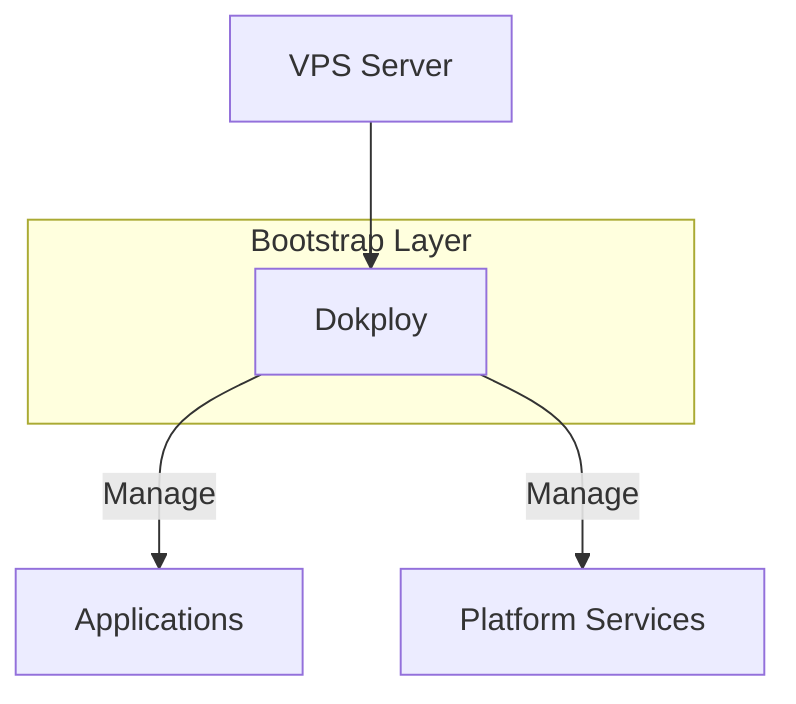

# Bootstrap 组件 SSOT

> **SSOT Key**: `bootstrap.nodep`
> **核心定义**: Bootstrap 层中由脚本或手动安装的组件（Dokploy/1Password/Vault）。

---

## 1. 组件清单

| 组件 | 安装方式 | 管理方式 | 状态 |
|------|----------|----------|------|
| **Dokploy** | 官方脚本 | Web UI | ✅ Active |
| **1Password Connect** | Docker Compose | Dokploy | ✅ Active |
| **Vault** | Docker Compose | Dokploy | ⏭️ Planned |

---

## 2. 真理来源 (The Source)

> **原则**：Bootstrap 组件是平台信任锚点，优先保持最小依赖。

| 维度 | 物理位置 (SSOT) | 说明 |
|------|----------------|------|
| **操作手册** | [`bootstrap/README.md`](https://github.com/wangzitian0/infra2/blob/main/bootstrap/README.md) | 安装步骤 |
| **版本追踪** | 本文档 [§5](#5-版本追踪) | 组件版本记录 |

### Code as SSOT 索引

- **Dokploy 官方文档**：[docs.dokploy.com](https://docs.dokploy.com)
- **1Password Connect 配置**：[`bootstrap/04.1password/compose.yaml`](https://github.com/wangzitian0/infra2/blob/main/bootstrap/04.1password/compose.yaml)
- **Vault 配置**：[`bootstrap/05.vault/compose.yaml`](https://github.com/wangzitian0/infra2/blob/main/bootstrap/05.vault/compose.yaml)

---

## 3. 架构模型

### Dokploy



### 1Password Connect

```mermaid
flowchart LR
    Internet[Internet]
    Traefik[Traefik]
    API[op-connect-api<br/>:8080]
    SYNC[op-connect-sync<br/>内部服务]
    Cloud[1Password Cloud]

    Internet -->|op.${INTERNAL_DOMAIN}| Traefik
    Traefik --> API
    API <--> SYNC
    SYNC <-.同步.-> Cloud

    style API fill:#90EE90
    style SYNC fill:#FFE4B5
```

---

## 4. 设计约束 (Dos & Don'ts)

### ✅ 推荐模式 (Whitelist)

- **模式 A**：使用官方安装脚本或官方镜像。
- **模式 B**：安装后立即更新版本追踪表。

### ⛔ 禁止模式 (Blacklist)

- **反模式 A**：**禁止** 让 Bootstrap 依赖 Platform 服务（避免循环依赖）。
- **反模式 B**：**禁止** 不记录版本的“幽灵安装”。

### ⚠️ 常见陷阱与对策

1. **Strict 模式的代价**：
   - 一旦开启 Cloudflare Full (Strict)，所有的自动化 HTTP-01 证书申请（包括 Traefik, Caddy, Certbot）都会大概率失败。
   - 对策：必须使用 DNS-01 验证（需要 API Token），或者手动上传 Origin CA 证书。不要在这个模式下指望 HTTP 自动验证。

2. **Dokploy 的 UI 陷阱**：
   - 在 Dokploy 中修改了 Environment、Domain 或 Traefik 设置后，必须手动点击 Deploy（或重启服务）。
   - 仅仅点击 "Save" 往往只更新数据库，不会自动重启容器应用新配置。如果发现配置没生效，第一时间去点 Deploy。

3. **IaC 的重要性**：
   - 这次问题排查花了很久是因为服务是手动创建的（Manual ClickOps），代码库里没有任何记录。
   - 如果使用 platform/ 下的代码化部署，不仅配置透明（能直接看到是不是用了 DNS-01），而且 invoke deploy 命令会自动处理“配置下发”和“重启”的动作，避免“点了保存没生效”的尴尬。

---

## 5. 版本追踪 {#5-版本追踪}

> **约定**：每次安装/升级后更新此表。

| 组件 | 当前版本 | 安装日期 | 操作人 |
|------|----------|----------|--------|
| Dokploy | unknown (需补) | unknown (需补) | - |
| 1Password Connect | latest | unknown (需补) | - |
| Vault | latest | unknown (需补) | - |

---

## 6. 验证与测试 (The Proof)

| 行为描述 | 验证方式 | 状态 |
|----------|----------|------|
| **Dokploy 服务可达** | `curl -I http://<VPS_IP>:3000` | ⏳ 未验证 |

---

## Used by

- [docs/ssot/README.md](./README.md)
