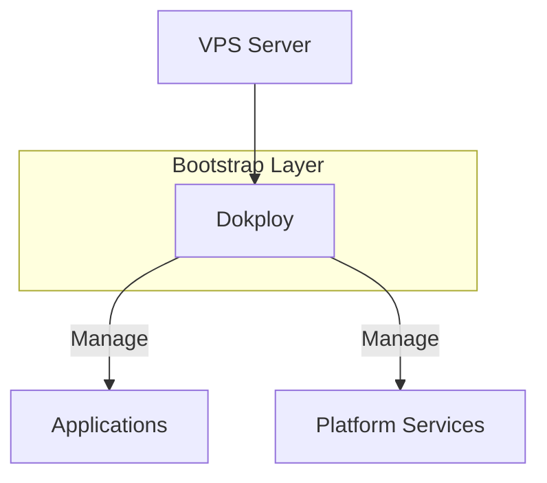

# Bootstrap 组件 SSOT

> **SSOT Key**: `bootstrap.nodep`
> **核心定义**: Bootstrap 层中由脚本或手动安装的组件（Dokploy/1Password/Vault）。

---

## 1. 组件清单

| 组件 | 安装方式 | 管理方式 | 状态 |
|------|----------|----------|------|
| **Dokploy** | 官方脚本 | Web UI | ✅ Active |
| **1Password Connect** | Docker Compose | Dokploy | ✅ Active |
| **Vault** | Docker Compose | Dokploy | ⏭️ Planned |

---

## 2. 真理来源 (The Source)

> **原则**：Bootstrap 组件是平台信任锚点，优先保持最小依赖。

| 维度 | 物理位置 (SSOT) | 说明 |
|------|----------------|------|
| **操作手册** | [`bootstrap/README.md`](https://github.com/wangzitian0/infra2/blob/main/bootstrap/README.md) | 安装步骤 |
| **版本追踪** | 本文档 [§5](#5-版本追踪) | 组件版本记录 |

### Code as SSOT 索引

- **Dokploy 官方文档**：[docs.dokploy.com](https://docs.dokploy.com)
- **1Password Connect 配置**：[`bootstrap/04.1password/compose.yaml`](https://github.com/wangzitian0/infra2/blob/main/bootstrap/04.1password/compose.yaml)
- **Vault 配置**：[`bootstrap/05.vault/compose.yaml`](https://github.com/wangzitian0/infra2/blob/main/bootstrap/05.vault/compose.yaml)

---

## 3. 架构模型

### Dokploy



### 1Password Connect

```mermaid
flowchart LR
    Internet[Internet]
    Traefik[Traefik]
    API[op-connect-api<br/>:8080]
    SYNC[op-connect-sync<br/>内部服务]
    Cloud[1Password Cloud]

    Internet -->|op.${INTERNAL_DOMAIN}| Traefik
    Traefik --> API
    API <--> SYNC
    SYNC <-.同步.-> Cloud

    style API fill:#90EE90
    style SYNC fill:#FFE4B5
```

---

## 4. 设计约束 (Dos & Don'ts)

### ✅ 推荐模式 (Whitelist)

- **模式 A**：使用官方安装脚本或官方镜像。
- **模式 B**：安装后立即更新版本追踪表。
- **模式 C**：使用 `libs` 系统全量注入环境变量到 Dokploy Compose，避免使用 local `.env` 文件。

### ⛔ 禁止模式 (Blacklist)

- **反模式 A**：**禁止** 让 Bootstrap 依赖 Platform 服务（避免循环依赖）。
- **反模式 B**：**禁止** 不记录版本的“幽灵安装”。
- **反模式 C**：**禁止** 使用 root 权限 (UID 0) 挂载 1Password 数据目录（必须使用 UID 999）。

### ⚠️ 常见坑点 (Pitfalls)

#### 1Password Connect
1. **权限控制**：
   - 容器内用户 `opuser` 使用 UID/GID `999`.
   - 宿主机数据目录必须 `chown -R 999:999`.
   - `permissions too broad` 错误：`files` 目录权限必须为 `700`。
2. **环境变量注入**：
   - Traefik 标签（如 `Host(\`op.${INTERNAL_DOMAIN}\`)`）依赖 Compose 时的环境变量。
   - 必须通过 Dokploy API (`update_compose`) 显式注入变量，否则解析为空导致 SSL 申请失败 (400 Bad Request).
   - 不要依赖 Dokploy 生成的 `.env` 文件，它是运行时生成的。

---

## 5. 版本追踪 {#5-版本追踪}

> **约定**：每次安装/升级后更新此表。

| 组件 | 当前版本 | 安装日期 | 操作人 |
|------|----------|----------|--------|
| Dokploy | v0.25.11 | 2025-12-31 | AI Agent |
| 1Password Connect | v1.8.1 (latest) | 2025-12-31 | AI Agent |
| Vault | latest | unknown (需补) | - |

---

## 6. 验证与测试 (The Proof)

| 行为描述 | 验证方式 | 状态 |
|----------|----------|------|
| **Dokploy 服务可达** | `curl -I https://cloud.<DOMAIN>` | ✅ 200 OK |
| **1Password API 健康** | `curl https://op.<DOMAIN>/health` | ✅ 200 OK |
| **SSL 证书有效** | `openssl x509 -in <CERT>` | ✅ Let's Encrypt |

---

## Used by

- [docs/ssot/README.md](./README.md)
