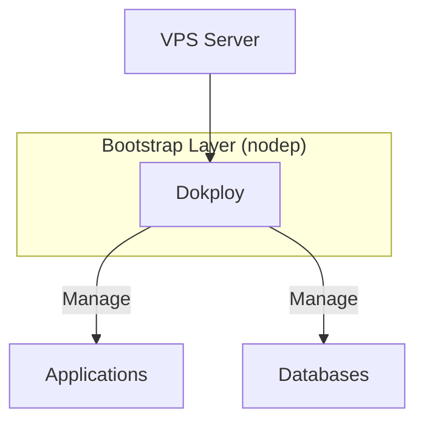

# Bootstrap 非 Terraform 管理组件 SSOT

> **SSOT Key**: `bootstrap.nodep`
> **核心定义**: Bootstrap 层中由脚本或手动安装的组件，不通过 Terraform 管理。

---

## 1. 真理来源 (The Source)

> **原则**：此处记录的组件均为 Terraform 管控边界之外的基础设施。

| 维度 | 物理位置 (SSOT) | 说明 |
|------|----------------|------|
| **操作手册** | [`bootstrap/README.md`](https://github.com/wangzitian0/infra2/blob/main/bootstrap/README.md) | 安装步骤 |
| **版本追踪** | 本文档 [§4](#4-版本追踪) | 组件版本记录 |

### Code as SSOT 索引

- **Dokploy 官方文档**：[docs.dokploy.com](https://docs.dokploy.com)
- **Dokploy 源码**：[github.com/dokploy/dokploy](https://github.com/dokploy/dokploy)
- **1Password Connect 文档**：[developer.1password.com/docs/connect](https://developer.1password.com/docs/connect/)
- **1Password Connect 配置**：[`self_host_1password.yaml`](https://github.com/wangzitian0/infra2/blob/main/bootstrap/self_host_1password.yaml)

---

## 2. 架构模型

### Dokploy



### 1Password Connect

```mermaid
flowchart LR
    Internet[Internet]
    Traefik[Traefik]
    API[op-connect-api<br/>:8080]
    SYNC[op-connect-sync<br/>内部服务]
    Cloud[1Password Cloud]
    
    Internet -->|op.${INTERNAL_DOMAIN}| Traefik
    Traefik --> API
    API <--> SYNC
    SYNC <-.同步.-> Cloud
    
    style API fill:#90EE90
    style SYNC fill:#FFE4B5
```

### 关键决策 (Architecture Decision)

- **为什么 nodep**：部分组件（如 PaaS 平台）更适合用官方脚本安装，避免过度 Terraform 化。
- **Trust Anchor**：Bootstrap 是系统信任锚点，独立于上层服务。
- **1Password Connect 服务划分**：
  - `op-connect-api`：对外 REST API，需要域名访问（有 Traefik labels）
  - `op-connect-sync`：内部同步服务，无需对外暴露（无 labels）
- **端口暴露策略**：所有服务通过 Traefik 反向代理，不直接暴露端口到宿主机，确保只能通过域名 HTTPS 访问。

---

## 3. 设计约束 (Dos & Don'ts)

### ✅ 推荐模式 (Whitelist)

- **模式 A**：使用官方 curl 脚本安装，保持与上游同步。
- **模式 B**：安装后立即更新版本追踪表。

### ⛔ 禁止模式 (Blacklist)

- **反模式 A**：**严禁** 将 nodep 组件纳入 Terraform 管理。
- **反模式 B**：**禁止** 不记录版本的"幽灵安装"。

---

## 4. 版本追踪 {#4-版本追踪}

> **约定**：每次安装/升级后更新此表。

| 组件 | 当前版本 | 安装日期 | 操作人 |
|------|----------|----------|--------|
| Dokploy | _待记录_ | _待记录_ | - |
| 1Password Connect | latest | _待记录_ | - |

---

## 5. 验证与测试 (The Proof)

| 行为描述 | 验证方式 | 状态 |
|----------|----------|------|
| **Dokploy 服务可达** | `curl -I http://<VPS_IP>:3000` | ⚠️ Pending |

---

## Used by

- [docs/ssot/README.md](./README.md)
