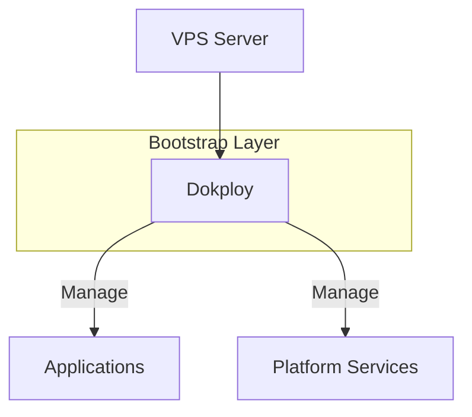

# Bootstrap 组件 SSOT

> **SSOT Key**: `bootstrap.nodep`
> **核心定义**: Bootstrap 层中由脚本或手动安装的组件（Dokploy/1Password/Vault/主机防火墙）。

---

## 1. 组件清单

| 组件 | 安装方式 | 管理方式 | 状态 |
|------|----------|----------|------|
| **Dokploy** | 官方脚本 | Web UI | ✅ Active |
| **1Password Connect** | Docker Compose | Dokploy | ✅ Active |
| **Vault** | Docker Compose | Dokploy | ⏭️ Planned |
| **主机防火墙**（nftables `inet infra2_hostfw`） | `bootstrap/01.dokploy_install/hostfw/hostfw.sh install` | systemd `infra2-hostfw.service` | ✅ Active（2026-09-17） |

---

## 2. 真理来源 (The Source)

> **原则**：Bootstrap 组件是平台信任锚点，优先保持最小依赖。

| 维度 | 物理位置 (SSOT) | 说明 |
|------|----------------|------|
| **操作手册** | [`bootstrap/README.md`](https://github.com/wangzitian0/infra2/blob/main/bootstrap/README.md) | 安装步骤 |
| **版本追踪** | 本文档 [§5](#5-版本追踪) | 组件版本记录 |

### Code as SSOT 索引

- **Dokploy 官方文档**：[docs.dokploy.com](https://docs.dokploy.com)
- **1Password Connect 配置**：[`bootstrap/04.1password/compose.yaml`](https://github.com/wangzitian0/infra2/blob/main/bootstrap/04.1password/compose.yaml)
- **Vault 配置**：[`bootstrap/05.vault/compose.yaml`](https://github.com/wangzitian0/infra2/blob/main/bootstrap/05.vault/compose.yaml)
- **主机防火墙**：[`bootstrap/01.dokploy_install/hostfw/`](https://github.com/wangzitian0/infra2/blob/main/bootstrap/01.dokploy_install/hostfw/)（规则 `hostfw.nft`、单元 `infra2-hostfw.service`、操作脚本 `hostfw.sh`；约束由 `libs/tests/test_host_firewall.py` 固定）

---

## 3. 架构模型

### Dokploy

```mermaid
flowchart TB
    VPS[VPS Server]
    subgraph Bootstrap[Bootstrap Layer]
        DOK[Dokploy]
    end

    VPS --> DOK
    DOK -->|Manage| APPS[Applications]
    DOK -->|Manage| SERVICES[Platform Services]
```

### 1Password Connect

```mermaid
flowchart LR
    Internet[Internet]
    Traefik[Traefik]
    API[op-connect-api<br/>:8080]
    SYNC[op-connect-sync<br/>内部服务]
    Cloud[1Password Cloud]

    Internet -->|op.${INTERNAL_DOMAIN}| Traefik
    Traefik --> API
    API <--> SYNC
    SYNC <-.同步.-> Cloud

    style API fill:#90EE90
    style SYNC fill:#FFE4B5
```

---

## 4. 设计约束 (Dos & Don'ts)

### ✅ 推荐模式 (Whitelist)

- **模式 A**：使用官方安装脚本或官方镜像。
- **模式 B**：安装后立即更新版本追踪表。
- **模式 C**：使用 `libs` 系统全量注入环境变量到 Dokploy Compose，避免使用 local `.env` 文件。

### ⛔ 禁止模式 (Blacklist)

- **反模式 A**：**禁止** 让 Bootstrap 依赖 Platform 服务（避免循环依赖）。
- **反模式 B**：**禁止** 不记录版本的“幽灵安装”。
- **反模式 C**：**禁止** 使用 root 权限 (UID 0) 挂载 1Password 数据目录（必须使用 UID 999）。

### 主机防火墙 (Host firewall) {#host-firewall}

Infra-022 T1.3 / #724。2026-09-17 审计发现：Dokploy UI（3000/tcp）和单节点 swarm 的 2377/tcp、7946/tcp+udp、4789/udp（VXLAN，Docker 文档要求必须防火墙隔离）都能从公网直接连到，主机没有任何防火墙（ufw inactive，INPUT policy ACCEPT）。

- **公网面**：公网网卡（`eth0`）上只放行 SSH 22 和 Traefik 入口 80、443、443/udp（HTTP/3），外加 DHCP 客户端回包（68、546/udp）、ICMP/ICMPv6、已建立连接。其余一律丢弃（input 链默认 drop）。
- **只动自己的表**：规则只加载 `table inet infra2_hostfw`，绝不 `flush ruleset`。Docker（iptables-nft 的 `ip filter`/`ip nat`）与 fail2ban（`inet f2b-table`）各管各的表；同一 hook 上一个包必须通过所有 base chain，所以本表的 drop 是最终结果，本表的 accept 不会绕过它们。
- **不用 UFW**：Docker 发布的 IPv4 端口在 prerouting 被 DNAT，走 FORWARD 而不是 INPUT，UFW 挡不住。本表另设 `forward` 链（priority `filter - 1`，先于 Docker 的 FORWARD），按原始目的端口丢弃来自公网的 3000。IPv6 发布端口由主机上的 docker-proxy 提供，归 input 链管。
- **不要启用系统自带的 `nftables.service`**：Ubuntu 默认 `/etc/nftables.conf` 以 `flush ruleset` 开头，开机会清掉 Docker 与 fail2ban 的规则。`hostfw.sh check` 发现它被启用会拒绝继续。
- **Dokploy UI**：只经 `https://cloud.<INTERNAL_DOMAIN>`（Cloudflare → 443 → Traefik → overlay 上的 `dokploy:3000`）或 SSH 隧道（`ssh -L 3000:localhost:3000 root@<VPS>`）访问。部署路径不受影响：`libs/dokploy.py` 走 `https://cloud.<domain>/api` 或 overlay 上的 `http://dokploy:3000/api`，没有任何代码用 `<公网 IP>:3000`。
- **Swarm 端口**：单节点 swarm 不需要从外部访问 2377/7946/4789。将来加节点时，只对节点 IP 放行这三个端口，不要整体开放。
- **变更 SOP（防锁死）**：`hostfw.sh check` → `hostfw.sh apply`（先用 `systemd-run` 挂 5 分钟自动回滚，再加载）→ 另开一个**新的** SSH 登录验证 → `hostfw.sh confirm` → `hostfw.sh install`。回滚触发后主机回到"没有 infra2 表"的状态，也就是首次上线前的状态。VNC 控制台是最后兜底。
- **漂移**：规则改动合入 main 后，从 main 的副本执行一次 `hostfw.sh install`，再用 `hostfw.sh status` 确认已安装规则与仓库副本 sha256 一致。
- **下一步（#724 §3，未做）**：80/443 只放行 Cloudflare IP 段，防止绕过 CF 直打源站。需要同时处理 forward 链（DNAT）与 input 链（IPv6 docker-proxy），并确认没有任何探针直连源站 IP。

### ⚠️ 常见坑点 (Pitfalls)

#### 1Password Connect
1. **权限控制**：
   - 容器内用户 `opuser` 使用 UID/GID `999`.
   - 宿主机数据目录必须 `chown -R 999:999`.
   - `permissions too broad` 错误：`files` 目录权限必须为 `700`。
2. **环境变量注入**：
   - Traefik 标签（如 `Host(\`op.${INTERNAL_DOMAIN}\`)`）依赖 Compose 时的环境变量。
   - 必须通过 Dokploy API (`update_compose`) 显式注入变量，否则解析为空导致 SSL 申请失败 (400 Bad Request).
   - 不要依赖 Dokploy 生成的 `.env` 文件，它是运行时生成的。

### ⚠️ 常见陷阱与对策

1. **Strict 模式的代价**：
   - 一旦开启 Cloudflare Full (Strict)，所有的自动化 HTTP-01 证书申请（包括 Traefik, Caddy, Certbot）都会大概率失败。
   - 对策：必须使用 DNS-01 验证（需要 API Token），或者手动上传 Origin CA 证书。不要在这个模式下指望 HTTP 自动验证。

2. **Dokploy 的 UI 陷阱**：
   - 在 Dokploy 中修改了 Environment、Domain 或 Traefik 设置后，必须手动点击 Deploy（或重启服务）。
   - 仅仅点击 "Save" 往往只更新数据库，不会自动重启容器应用新配置。如果发现配置没生效，第一时间去点 Deploy。

3. **IaC 的重要性**：
   - 这次问题排查花了很久是因为服务是手动创建的（Manual ClickOps），代码库里没有任何记录。
   - 如果使用 platform/ 下的代码化部署，不仅配置透明（能直接看到是不是用了 DNS-01），而且 invoke deploy 命令会自动处理“配置下发”和“重启”的动作，避免“点了保存没生效”的尴尬。

---

## 5. 版本追踪 {#5-版本追踪}

> **约定**：每次安装/升级后更新此表。

| 组件 | 当前版本 | 安装日期 | 操作人 |
|------|----------|----------|--------|
| Dokploy | v0.29.8 | 2026-06-12 | AI Agent |
| 1Password Connect | v1.8.1 (pinned) | 2026-05-25 | AI Agent |
| Vault | v1.15.4 (pinned) | 2026-05-25 | AI Agent |
| 主机防火墙 | `hostfw.nft` v1（nftables 1.0.9, Ubuntu 24.04） | 2026-09-17 | AI Agent（owner 批准） |

---

## 6. 验证与测试 (The Proof)

| 行为描述 | 验证方式 | 状态 |
|----------|----------|------|
| **Dokploy 服务可达** | `curl -I https://cloud.<DOMAIN>` | ✅ 200 OK |
| **1Password API 健康** | `curl https://op.<DOMAIN>/health` | ✅ 200 OK |
| **SSL 证书有效** | `openssl x509 -in <CERT>` | ✅ Let's Encrypt |
| **公网只开放 22/80/443** | 外部 `nc -z -G 5 <VPS_IP> {3000,2377,7946}` 失败，`{22,80,443}` 成功 | ✅ 2026-09-17 |
| **部署路径不受防火墙影响** | runner 内 `http://dokploy:3000/api/settings.health` 返回 401；`https://cloud.<DOMAIN>` 200；runner → `<VPS_IP>:22` 可连 | ✅ 2026-09-17 |
| **防火墙无漂移且开机加载** | `hostfw.sh status`：`service enabled/active`、`installed rules match` | ✅ 2026-09-17 |

---

## Used by

- [docs/ssot/README.md](./README.md)
