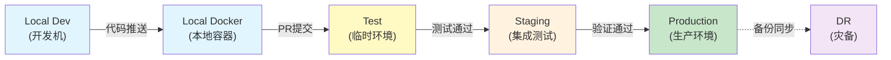

# 六环境架构 SSOT

> **SSOT Key**: `core.environments`  
> **核心定义**: 定义从本地开发到生产的六环境架构、各环境的用途、隔离策略、测试点和迭代速度。

---

## 1. 真理来源 (The Source)

| 维度 | 物理位置 (SSOT) | 说明 |
|------|----------------|------|
| **环境配置** | Dokploy Project/Environment | 远端环境变量和部署配置 |
| **环境选择** | `DEPLOY_ENV` 环境变量 | 部署时目标环境选择 |
| **数据隔离** | `DATA_PATH` / `ENV_SUFFIX` | 数据和容器名隔离 |
| **域名隔离** | `ENV_DOMAIN_SUFFIX` | 公网域名隔离 |

---

## 2. 架构模型 - 六环境设计



---

## 3. 环境定义与特性

### 3.1 Local Development (本地开发)

**位置**: 开发者工作站  
**用途**: 代码编辑、单元测试、快速迭代  
**特点**:
- ✅ **零基础设施** - 无需 Docker/DB，纯代码开发
- ✅ **Mock 外部依赖** - 使用 pytest fixtures 模拟 DB/Redis/S3
- ✅ **热重载** - Next.js dev server + FastAPI --reload
- ✅ **IDE 集成** - LSP、调试器、类型检查

**配置**:
```bash
# Finance Report 示例
cd apps/backend
uv run pytest  # 单元测试（内存 SQLite）

cd apps/frontend
npm run dev  # Next.js dev server (localhost:3000)
```

**数据**: 无持久化，使用内存数据库或 Mock

**迭代速度**: ⚡⚡⚡⚡⚡ (秒级)

---

### 3.2 Local Docker (本地容器)

**位置**: 开发者工作站 (Docker Compose)  
**用途**: 端到端测试、集成测试、依赖验证  
**特点**:
- ✅ **完整栈** - PostgreSQL + Redis + MinIO + Backend + Frontend
- ✅ **真实依赖** - 真实数据库、真实 S3
- ✅ **快速重置** - `docker compose down -v && docker compose up`
- ✅ **调试友好** - 容器日志、端口映射

**配置**:
```bash
# Finance Report 示例
docker compose up -d postgres minio redis  # 启动依赖
moon run backend:dev  # 后端连接真实 DB
moon run frontend:dev  # 前端

# 或者完整栈
docker compose up  # 包括 backend + frontend
```

**数据**: `/tmp/finance_report/` 或 Docker volumes (可随时删除)

**迭代速度**: ⚡⚡⚡⚡ (分钟级)

---

### 3.3 Test (临时测试环境)

**位置**: VPS (Dokploy)  
**用途**: PR 预览、功能验证、临时测试、0-downtime bootstrap 验证  
**特点**:
- ✅ **临时部署** - PR 创建时自动部署，PR 合并后自动销毁
- ✅ **独立域名** - `report-pr-123.zitian.party`
- ✅ **独立数据** - `ENV_SUFFIX=-pr-123` 确保数据隔离
- ✅ **0帧起手** - 验证从零开始部署的完整流程
- ✅ **快速验证** - 无需等待 staging，直接测试新功能

**配置**:
```bash
# 通过 GitHub Actions 或手动触发 deploy_v2 preview/pr
cd repo
python -m tools.deploy_v2 \
  --service finance_report/app \
  --type preview/pr \
  --version-ref 123 \
  --iac-ref vX.Y.Z \
  --domain zitian.party
```

**数据**: `/data/test/finance_report-pr-{PR_NUMBER}/` (自动清理)

**域名**: `report-pr-{PR_NUMBER}.zitian.party`

**生命周期**:
- 创建: PR 提交时
- 销毁: PR 合并或关闭后 7 天

**测试点**:
- ✅ 功能正确性
- ✅ UI/UX 验证
- ✅ 基础性能测试
- ✅ 0-downtime bootstrap (新环境从零启动)

**迭代速度**: ⚡⚡⚡ (小时级)

---

### 3.4 Staging (集成测试环境)

**位置**: VPS (Dokploy)  
**用途**: 集成测试、回归测试、UAT、性能测试  
**特点**:
- ✅ **长期运行** - 永久环境，不销毁
- ✅ **生产镜像** - 与 production 相同的配置
- ✅ **完整测试** - E2E、性能、安全扫描
- ✅ **数据保留** - 测试数据持久化（用于回归测试）

**配置**:
```bash
cd repo

# Finance Report backing services
python -m tools.deploy_v2 --service finance_report/postgres --type staging --iac-ref vX.Y.Z --domain zitian.party
python -m tools.deploy_v2 --service finance_report/redis --type staging --iac-ref vX.Y.Z --domain zitian.party

# Finance Report app
python -m tools.deploy_v2 --service finance_report/app --type staging --version-ref vX.Y.Z --iac-ref vX.Y.Z --domain zitian.party
```

**数据**: `/data/platform/staging/`, `/data/finance_report/staging/`

**域名**: `{service}-staging.zitian.party`

**测试点**:
- ✅ 完整 E2E 测试套件
- ✅ API 集成测试
- ✅ 性能基准测试
- ✅ 安全扫描 (OWASP ZAP)
- ✅ 数据库迁移测试
- ✅ 备份恢复测试

**迭代速度**: ⚡⚡ (天级)

---

### 3.5 Production (生产环境)

**位置**: VPS (Dokploy)  
**用途**: 生产服务、真实用户访问  
**特点**:
- ✅ **高可用** - 监控、告警、备份
- ✅ **性能优化** - 缓存、CDN、数据库优化
- ✅ **安全加固** - WAF、Rate limiting、Audit logs
- ✅ **数据备份** - 每日备份到 Cloudflare R2

**配置**:
```bash
cd repo

# Finance Report backing services
python -m tools.deploy_v2 --service finance_report/postgres --type prod --iac-ref vX.Y.Z --domain zitian.party --code-reviewed
python -m tools.deploy_v2 --service finance_report/redis --type prod --iac-ref vX.Y.Z --domain zitian.party --code-reviewed

# Finance Report app
python -m tools.deploy_v2 --service finance_report/app --type prod --version-ref vX.Y.Z --iac-ref vX.Y.Z --domain zitian.party --staging-validated --code-reviewed
```

**数据**: `/data/platform/`, `/data/finance_report/`

**域名**: `{service}.zitian.party` (无后缀)

**部署策略**:
- ✅ 只部署经过 staging 完整测试的版本
- ✅ 使用 Git tags (如 `v1.2.3`)
- ✅ 数据库迁移先在 staging 验证
- ✅ 分批部署 (canary / blue-green)

**迭代速度**: ⚡ (周级)

---

### 3.6 DR (灾备环境)

**位置**: 备用 VPS (或 Cloudflare R2)  
**用途**: 数据备份、灾难恢复  
**特点**:
- ✅ **冷备份** - 数据每日同步，不运行服务
- ✅ **快速恢复** - 可在 1 小时内启动服务
- ✅ **成本优化** - 仅存储数据，不运行容器

**配置**:
```bash
# 备份策略 (每日执行)
# PostgreSQL → pg_dump → R2
# MinIO → rclone sync → R2
# Vault → backup snapshot → R2
```

**恢复 SLA**: < 1 小时 (RTO)  
**数据丢失**: < 24 小时 (RPO)

---

## 4. 环境隔离策略

### 4.1 容器名隔离

| 环境 | ENV_SUFFIX | 容器名示例 |
|------|-----------|-----------|
| Local Docker | (无) | `postgres`, `backend`, `frontend` |
| Test | `-pr-{PR}` | `finance_report-postgres-pr-123` |
| Staging | `-staging` | `platform-postgres-staging` |
| Production | (空) | `platform-postgres` |

### 4.2 域名隔离

| 环境 | ENV_DOMAIN_SUFFIX | 域名示例 |
|------|------------------|---------|
| Local | (localhost) | `localhost:3000` |
| Test | `-pr-{PR}` | `report-pr-123.zitian.party` |
| Staging | `-staging` | `report-staging.zitian.party` |
| Production | (空) | `report.zitian.party` |

### 4.3 数据隔离

| 环境 | DATA_PATH | 说明 |
|------|-----------|------|
| Local | `/tmp/` or volumes | 可随时删除 |
| Test | `/data/test/{app}-pr-{PR}/` | PR 关闭后自动清理 |
| Staging | `/data/{layer}/staging/` | 持久化 |
| Production | `/data/{layer}/` | 持久化 + 备份 |

### 4.4 Vault 密钥隔离

| 环境 | Vault 路径 | 示例 |
|------|----------|------|
| Test | `secret/data/{project}/test/{service}` | `secret/data/finance_report/test/app` |
| Staging | `secret/data/{project}/staging/{service}` | `secret/data/finance_report/staging/app` |
| Production | `secret/data/{project}/production/{service}` | `secret/data/finance_report/production/app` |

<a id="telemetry-identity"></a>
### 4.5 遥测标识隔离 (Telemetry identity)

可观测性是**单一全局实例**（SigNoz / OpenPanel，`prod_only`）：所有环境都打到同一套，**靠标识区分**，不靠 per-env 实例。身份由 `libs/service_identity.py` 一次签发并映射到 IaC、运行时、遥测和告警：

| 语义 | canonical 字段 | 示例 |
|------|----------------|------|
| 服务坐标 | `infra.service.id` / `service.namespace` / `service.name` | `finance_report/app` / `finance-report` / `finance-report-backend` |
| 运行组件 | `infra.component` | `backend` / `worker` / `vault-agent` |
| 环境别名 | `deployment.environment.name` | `production` / `staging` / `pr-123` / `tag-v1-2-3` |
| 应用版本 | `service.version` | immutable image tag 或 commit SHA |
| IaC 版本 | `infra.iac.ref` | exact 40-character infra2 commit SHA |
| 契约所有权 | `infra.identity.schema=v1`, `infra.managed_by=infra2` | 固定值 |

**签发归 infra2**：Deployer / fixed promote / preview 三个入口从 registry 和已验证部署坐标构建 `ServiceIdentity`；应用与 Vault Agent 只消费签发值，不得从 secret 或自身默认值重定义身份。标准字段是 `deployment.environment.name`；迁移期双写旧 `deployment.environment`，查询和新告警必须使用 `.name`。身份 metadata 不进入运行配置 hash，远端缺失/错误则触发一次 reconcile；部署后校验关键 `INFRA_*` 字段，避免永久重启抖动。OTLP 端点见 [ops.observability.md](ops.observability.md#41-应用接入-otlp)。

对 **preview** 多别名而言，`deployment.environment.name` 的取值就是 alias token（见 §4.6）。同一份签发逻辑由 `libs/deploy/preview` 后端（经 `tools/deploy_v2 --type preview/*` 触发，非直接调用）注入 compose（vault-agent 与遥测共同消费），与 `libs/deploy_env_config.py::preview_alias` 派生的 `env_suffix` 保持同源。

---

<a id="manual-deploy-targets"></a>
### 4.6 部署目标与触发 (Deploy targets & triggers)

> **部署触发模型已收敛到单一 owner**:见 [ops.pipeline §2「部署目标与触发」](./ops.pipeline.md#2-部署目标与触发-deploy-targets--triggers)
> + [§3「发布机制」](./ops.pipeline.md#3-发布机制-release-model--infra2-是独立产物)。
> 一句话:`report-branch-main` 随 main 自动重部署;**staging/prod 只部署 release tag**(staging 与 prod 钉同一 tag,
> promote-not-rebuild);平台 `iac_pinned` 服务由 `reconcile-iac-inputs.yml` 在 **tag 推送**时晋升。
> 本节只保留**环境定义**侧的 preview 多别名模型;「什么触发什么」不要在这里重述(那正是它和 ops.pipeline 漂移过的原因)。

**preview 多别名模型**（每个别名 = 一套独立的 Dokploy compose 栈）：

每个别名统一是 `<kind>-<value>`（没有裸特例），下游（telemetry label / URL / compose 名）解析方式一致：

| 别名 kind | alias token | ENV_SUFFIX / ENV_DOMAIN_SUFFIX | 域名 | compose 名 (appName slug) | `deployment.environment` |
|-----------|-------------|--------------------------------|------|---------------------------|--------------------------|
| `branch` | `branch-<name>` | `-branch-<name>` | `report-branch-<name>.<domain>` | `finance-report-preview-branch-<name>` | `branch-<name>` |
| `pr` | `pr-<N>` | `-pr-<N>` | `report-pr-<N>.<domain>` | `finance-report-preview-pr-<N>` | `pr-<N>` |
| `commit` | `commit-<sha7>` | `-commit-<sha7>` | `report-commit-<sha7>.<domain>` | `finance-report-preview-commit-<sha7>` | `commit-<sha7>` |
| `tag` | `tag-<v1-2-3>` | `-tag-<v1-2-3>` | `report-tag-<v1-2-3>.<domain>` | `finance-report-preview-tag-<v1-2-3>` | `tag-<v1-2-3>` |

`branch` 默认 `main`（→ `branch-main`，取代旧的裸 `main` 槽）；`tag` 的点变横线做 DNS-safe slug（`v1.2.3` → `tag-v1-2-3`）。注意区分：**镜像** `IMAGE_TAG` 用规范值 `v1.2.3`（`preview_alias.value`），而 **URL / 遥测 `deployment.environment`** 用 slug `tag-v1-2-3`（即上表那一列）——过滤遥测时按 `tag-v1-2-3`。真源：`libs/deploy_env_config.py::preview_alias(kind, value)`（纯函数，确定性，单测覆盖）。

**preview 关键特性**：
1. **多别名共存**：`branch-<name>` / `pr-<N>` / `commit-<sha7>` / `tag-<v>` 各自一套独立 compose 栈，互不冲突，也不与 staging/prod 撞容器名或 Host() 规则（靠唯一的 `ENV_SUFFIX`）。
2. **临时数据库**：preview compose 模板（`finance_report/finance_report/preview/compose.yaml`）内置自己的 `db`（postgres）服务，数据落在**命名卷**（无 host bind mount）。`DATABASE_URL` 在 backend entrypoint 中、source 完 Vault 渲染的 `/secrets/.env` 之后被覆盖指向这个本地库——因此 preview **绝不读写**共享的 staging/prod 数据库；其它 app secret（AI keys、S3）仍由 Vault 提供，preview 完整可用。迁移在 backend 启动时对新库执行（`alembic upgrade head`）。
3. **生命周期长于 CI**：preview 栈在显式 teardown 前一直存活。`preview_lifecycle down --kind ... --value ...` 通过 `delete_compose(delete_volumes=True)` 销毁该别名的 compose **并删除其临时 DB 命名卷**，不留残余。
4. **路由零额外工作**：`*.zitian.party` 通配 DNS + 通配证书已就绪；任何 `report-<alias>` 主机只要 compose 里有对应 Traefik router label 就自动路由，无需新建 DNS/证书。

---

<a id="deploy-v2-contract"></a>
### 4.7 部署原语契约 (deploy_v2 — 坐标 `(service, type, version_ref, iac_ref)`)

一次部署的**身份**由且仅由**四个正交轴**确定——每个轴独立（谁也推不出谁），合起来对
`preview / staging / prod` 各类目标都充分。`type` 是判别式，`env` / `sub_domain` 由它**派生**，不是输入轴。
契约/校验层 `libs/deploy_contract.py` 是**纯函数**（无副作用，单测覆盖）；`tools/deploy_v2.py` 是**执行前门**
（解析 + 分派到 `preview_lifecycle` / `deploy_primitive`，有副作用），两者都有单测。

```
deploy_v2(service, type, version_ref, iac_ref)
```

| 轴 | 含义 | 来源 |
|----|------|------|
| `service` | 部署哪个已注册服务 | `deploy_contract.ServiceSpec` 注册表 |
| `type` | 判别式：场景 + 解释其余轴、决定哪些必填（discriminated union）| `deploy_contract.DEPLOY_TYPES` |
| `version_ref` | 多态版本面，由 `type` 解释：PR 号 / sha / tag `vX.Y.Z` / 分支（默认 main）；**staging/prod 只收 tag** | `resolve_deploy_ref`（执行时解析） |
| `iac_ref` | infra2 的 ref（分支/tag/sha），钉死 compose/env/secret，并驱动 preview clone；**staging/prod 只收 tag** | `deploy_v2`（解析为 40-hex 身份） |

**`version_ref` 解析成两样东西**（App 发布契约，`resolve_deploy_ref.resolve_image_ref` / `resolve_pr`）：
commit `sha`（身份）+ `image_ref`（要拉的已发布镜像）——**code 拉短 sha 镜像，release 拉长期保留的 tag `:vX.Y.Z`**
（sha 镜像会被剪，故 prod 必须按 tag 寻址）。`deploy_v2` 只透传 `image_ref` 给后端，不再自己判 sha-vs-tag。
部署前 `deploy_v2` 会按 `ServiceSpec.image_repositories` 等待该 `image_ref` 在所有声明镜像仓库中存在；
这属于运行前 artifact readiness gate，和 `docs/ssot/deploy-dependencies.yaml` 的 build/config fan-out 依赖图不同。

**为什么 `service` 与 `iac_ref` 各自独立**：镜像来自 *app* repo（`version_ref`），compose/env 接线来自
*infra2* repo（`iac_ref`），两者各自漂移；且 infra2 多服务，"部署谁"是独立维度。

**`env` / `sub_domain` / `data` 都不是输入轴**：`env` 与 `sub_domain` 由 `type`(+`version_ref` 派生的槽)推出；
`data` 由 `EnvConfig.data_default` 派生（可被 `iac_ref` 处的 IaC 钉定），只出现在红线谓词里。

**契约谓词**（`deploy_contract` + `deploy_v2`，部署前 fail-closed）：
1. `type` 必须在 `DEPLOY_TYPES` 内（未知即拒）。
2. `version_ref` 的**形态**必须被该 `type` 接受（`accepted_forms` 矩阵）——`staging` / `prod` 只收 release
   `tag`（`vX.Y.Z`），传 `main`/`sha` 当场 fail-closed（`validate_ref_form`）。固定 env 的 `iac_ref` 同样
   只收 `tag`（`validate_iac_ref_form`）——branch/sha 的 IaC ref 进不了 staging/prod。
3. 固定 env（staging/prod）`sub_domain` = `base` + env 后缀；preview `sub_domain` 统一为 `base-<kind>-<value>`
   （`branch-<name>` / `pr-<N>` / `commit-<sha7>` / `tag-<slug>`），且不等于任何 staging/prod 规范域。
4. `service.prod_only ∧ env ≠ prod` ⇒ 非法；`service.env_shared` ⇒ 无 preview、无后缀。
5. `version_ref` 解析出的 `sha` 与 `iac_ref` 必须为 40 位小写 hex（短 sha 解析不成完整 commit 会带 surface 级报错）。
6. App-backed 服务在任何 Dokploy side effect 前必须满足声明的镜像 artifact readiness：
   `ServiceSpec.image_repositories[*]:image_ref` 都能通过 registry manifest API 解析。

**门控（单一真相源，不在 type 上重复声明）**：
- **staging-first**：`env_config(env).requires_staging_first`（即 prod）⇒ 需 `staging_validated`（或 `break_glass` 审计旁路）。
- **RL-DATA-1**（§5 data-lane，执行层 `deploy_v2.enforce_data_lane_red_lines`）：`env=prod ⇒ data_lane=prod`；
  未评审代码不上 prod 数据——deny-by-default：`code_reviewed` 必须显式为 `True`，缺省(`None`)与 `False` 均 fail-closed。

> **现状边界**：`libs.deploy_contract.SERVICES` 中注册的 bespoke app（`finance_report/app`；
> `truealpha/app` 自 #500 起）走 app 后端（`deploy_primitive` / `preview_lifecycle`）；`iac_pinned`
> 服务从 `libs.service_registry` 派生并走 iac_runner `/deploy` webhook。`truealpha/app` 目前只接
> `staging`（`ServiceSpec.supports_preview=False`：`preview_lifecycle` 仍是 finance_report 专属形状，
> 未泛化；`prod` 尚无 Dokploy compose）。完整 GitHub 评审信号（供给 `code_reviewed=True`）可继续增强；
> snapshot-sync / anonymization / rehearsal 属于 finance_report#893，但 `data_lane` 已是派生值，
> 不是 deploy_v2 输入轴。

### 4.7.1 `type` 判别式（一个原语，N 场景）

封闭的 type 集合（`deploy_contract.DEPLOY_TYPES`，未知 type 直接拒）。每个 type 声明它的
`accepted_forms`（接受哪些 `version_ref` 形态 = 矩阵那一行）+ alias 槽；`env` 由 type 派生，门控由 env 派生：

| type | 派生 env | alias 槽 | 接受的 version_ref 形态 |
|------|---------|---------|--------------------------|
| `staging` | staging | — | **仅 release tag**（`vX.Y.Z`；同 prod）|
| `prod` | prod | — | **仅 release tag**（`vX.Y.Z`）|
| `preview/branch` | preview | `branch-<name>`（默认 main）| branch |
| `preview/pr` | preview | `pr-<N>` | PR 号 |
| `preview/commit` | preview | `commit-<sha7>` | sha |
| `preview/tag` | preview | `tag-<slug>` | tag |
| `canary` | preview | `pr-<保留位>` | 全部（探针，最大灵活）|

**三条框架护栏（与业务无关，保持稳定）**：
1. **type 选策略/配置，不是内嵌值的扁平枚举**：每实例数据（分支名/PR 号/sha/tag）走 `version_ref`+派生槽，type 集合保持小。
2. **公共内核 + per-type 配置**：入口 resolve `type → spec` 一次，后续公共代码跑；禁散落 `switch(type)`。
3. **fail-closed by construction**：未知 type 拒；形态不匹配当场拒；`canary` 是**显式 type**，绝不让"参数全空"隐式触发。

**version 寻址语义（已落地，不再是 TBD）**：`version_ref` 按 `type` 解释——preview/pr 是 PR 号（`resolve_pr` →
PR head 镜像）；preview/commit 是 sha；preview/tag 与 prod 是 release tag（拉长期保留的 `:vX.Y.Z`）；
preview/branch、staging、canary 接受分支（默认 main）。`image_ref` 由**形态**决定（code→短 sha、release→tag），
不由 type 决定。`make_target` 仍接收**已解析的 40-hex sha**作为身份；多态的 `version_ref` 在上一层 `deploy_v2` 解析。

### 4.7.2 完备性论证（为什么这 4 轴足够，平台服务无需新轴）

**命题**：坐标 `(service, type, version_ref, iac_ref)` 足以表达本仓库里的**每一次部署**——app 与平台服务都不需要第五个轴。

**关键引理 —— `iac_ref` 钉死「怎么部署」的一切**：给定一个 infra2 commit，该 commit 完全确定每个服务的
compose、env、secret 路径、**外部镜像 tag**、Traefik 路由 label、多容器编排。即「HOW」全在 `iac_ref` 里。

**于是四轴各管一件正交的事**：

| 轴 | 它定 | app | 平台服务 |
|----|------|-----|----------|
| `iac_ref` | **HOW**（IaC：compose/env/secret/镜像 pin/路由，全部）| infra2 commit | infra2 commit |
| `service` | **WHICH**（部署哪个已注册服务）| `finance_report/app` | `platform/redis` … |
| `type` | **哪种 env 制度**（派生 env + preview 槽 + 门控）| 7 种 | `staging` / `prod`（env_shared/prod_only 无 preview）|
| `version_ref` | **哪个 app-code 制品** | 代码面（PR/sha/tag/branch）| **空**——平台制品 = `iac_ref` 钉的栈，无独立代码版本 |

**∴ 任一次部署 = 这个四元组里的一个点。** `version_ref` 对平台服务**优雅退化为空**（坐标不需要新增轴）。

> **实现注**：「退化为空」已在当前实现中落地：`iac_pinned` 平台服务以 `iac_ref` 解析出的 infra2 sha 作为
> `DeployTarget.code_version` 身份，并忽略 `version_ref`。这是 impl 层的退化，不是新增坐标轴。

**反例排查（之前扫描标的「gap」其实都不是坐标 gap，全在 `iac_ref` 或 per-service deployer 里）**：

| 担心的「gap」 | 实际归属（非坐标轴）|
|---------------|--------------------|
| 平台服务无 code version | `version_ref` 为空；制品由 `iac_ref` 钉死 |
| `secret_key` / vault 路径 | IaC（`iac_ref`）+ per-service deployer |
| openpanel 自带 op-ch，版本 ≠ 平台 clickhouse | 两个镜像 tag 各 pin 在各自 compose（`iac_ref`）；坐标只选「部署 openpanel 这个服务」|
| minio 双端点 / SSO 路由 label | compose 里的 Traefik label（`iac_ref`）|
| 多容器编排 | 服务 compose（`iac_ref`）|

**结论**：坐标和当前实现均已完备，不需要第五轴：

1. **registry**：app 显式登记；所有非 app 服务从 `libs.service_registry` 派生为 `iac_pinned`
   `ServiceSpec`（`prod_only` / `env_shared` / `web_facing` 不手抄）。App 的跨仓库镜像 artifact
   依赖也登记在 `ServiceSpec.image_repositories`，由 deploy 前门统一执行。
2. **routing**：`deploy_v2` 按 `service` 分派后端——app → `deploy_primitive` / `preview_lifecycle`；
   `iac_pinned` → iac_runner `/deploy`。
3. **execution**：平台后端复用现有 iac_runner/Deployer 路径，不在 deploy_v2 里重写 Context-coupled sync 逻辑。

---

## 5. 测试门禁 (Quality Gates)

### 5.1 Local → PR (Test)

**门禁条件**:
- ✅ 单元测试通过 (>= 95% 覆盖率)
- ✅ Linter 无错误
- ✅ 类型检查通过
- ✅ 本地 E2E 测试通过

**自动化**: Pre-commit hooks + GitHub Actions

---

### 5.2 Test → Staging

**门禁条件**:
- ✅ Test 环境功能验证通过
- ✅ Code review 通过
- ✅ PR approved
- ✅ Conflicts 解决

**自动化**: GitHub Actions (merge to main)

---

### 5.3 Staging → Production

**门禁条件**:
- ✅ Staging E2E 测试全部通过
- ✅ 性能测试达标 (响应时间 < 200ms)
- ✅ 安全扫描无高危漏洞
- ✅ 数据库迁移在 staging 验证通过
- ✅ Changelog 更新
- ✅ 人工验收 (Product Owner approval)

**自动化**: GitHub Actions (tag release) + Manual approval

---

## 6. Test 环境特殊设计 - 0帧起手验证

### 6.1 目标

Test 环境的核心价值是验证**从零开始部署**的能力：
- ✅ 新 VPS 能否在 10 分钟内完成 Bootstrap
- ✅ 新项目能否在 5 分钟内部署完成
- ✅ 所有依赖能否自动创建（bucket、用户、密钥）

### 6.2 实现方式

**临时资源创建**:
```bash
# PR 创建或手动验证时触发 deploy_v2 preview/pr
cd repo
python -m tools.deploy_v2 \
  --service finance_report/app \
  --type preview/pr \
  --version-ref 123 \
  --iac-ref vX.Y.Z \
  --domain zitian.party
```

**自动清理**:
```bash
# PR 关闭后触发
invoke test.cleanup --pr-number=123
  1. 停止容器
  2. 删除数据目录
  3. 删除 Vault 密钥 (secret/data/finance_report/test/*)
  4. 删除 MinIO bucket
  5. 删除 Dokploy 域名配置
```

### 6.3 验证清单

每次 PR 部署到 Test 环境时，自动验证：
- [ ] MinIO bucket 自动创建
- [ ] PostgreSQL 用户自动创建
- [ ] Vault 密钥自动生成
- [ ] 应用健康检查通过
- [ ] 域名解析正确
- [ ] HTTPS 证书有效

---

## 7. 迭代速度对比

| 环境 | 部署频率 | 变更范围 | 自动化程度 | 回滚成本 |
|------|---------|---------|-----------|---------|
| Local Dev | 每次保存 | 单个文件 | 热重载 | 0 (无影响) |
| Local Docker | 每小时 | 多个服务 | docker compose up | 低 (重启容器) |
| Test | 每个 PR | 完整功能 | GitHub Actions | 低 (删除 PR 环境) |
| Staging | 每天 | 多个功能 | CI/CD | 中 (回滚版本) |
| Production | 每周 | 稳定版本 | Manual approval | 高 (影响用户) |
| DR | 被动触发 | 全量恢复 | 手动 | 极高 (业务中断) |

---

## 8. 配置示例

### 8.1 Finance Report Test 环境

```bash
# Finance Report app repo preview workflow (conceptual)
name: Deploy PR to Test
on:
  pull_request:
    types: [opened, synchronize]

jobs:
  deploy:
    runs-on: ubuntu-latest
    steps:
      - name: Deploy to Test
        env:
          PR_NUMBER: ${{ github.event.pull_request.number }}
        run: |
          cd repo/
          python -m tools.deploy_v2 \
            --service finance_report/app \
            --type preview/pr \
            --version-ref "${PR_NUMBER}" \
            --iac-ref "${INFRA2_REF}" \
            --domain zitian.party
```

### 8.2 Finance Report Staging 环境

```bash
# Dokploy Environment 配置 (staging)
DATA_PATH=/data/finance_report/staging
ENV_SUFFIX=-staging  # 可选
ENV_DOMAIN_SUFFIX=-staging

# Vault 密钥路径
secret/data/finance_report/staging/app/DATABASE_URL
secret/data/finance_report/staging/app/S3_BUCKET
```

### 8.3 Finance Report Production 环境

```bash
# Dokploy Environment 配置 (production)
DATA_PATH=/data/finance_report
# ENV_SUFFIX 留空
# ENV_DOMAIN_SUFFIX 留空

# Vault 密钥路径
secret/data/finance_report/production/app/DATABASE_URL
secret/data/finance_report/production/app/S3_BUCKET
```

---

## 9. 设计约束 (Dos & Don'ts)

### ✅ 推荐模式

1. **Test 环境用于快速验证**
   - PR 提交后立即部署到 Test
   - 功能验证后再合并到 Staging
   
2. **Staging 环境用于完整测试**
   - 运行完整 E2E 测试套件
   - 性能测试、安全扫描
   
3. **Production 只部署稳定版本**
   - 必须经过 Staging 完整验证
   - 使用 Git tags 版本管理

### ⛔ 禁止模式

1. **禁止跳过 Staging 直接到 Production**
   - 即使是"简单修复"也必须经过 Staging

2. **禁止在 Production 测试新功能**
   - 使用 Feature flags 控制灰度发布

3. **禁止共享数据库**
   - Test/Staging/Production 必须使用独立数据库

---

## 10. The Proof (验证方法)

### 验证环境隔离

```bash
# 验证容器名隔离
docker ps | grep finance_report
# 应该看到:
# - finance_report-postgres-pr-123 (Test)
# - finance_report-postgres-staging (Staging)
# - finance_report-postgres (Production)

# 验证域名隔离
curl https://report-pr-123.zitian.party/api/health
curl https://report-staging.zitian.party/api/health
curl https://report.zitian.party/api/health

# 验证数据隔离
ls /data/test/finance_report-pr-123/
ls /data/finance_report/staging/
ls /data/finance_report/
```

### 验证 0 帧起手部署

```bash
# 模拟全新 VPS
export DEPLOY_ENV=test
export ENV_SUFFIX=-pr-999
export PR_NUMBER=999

# 计时开始
time python -m tools.deploy_v2 \
  --service finance_report/app \
  --type preview/pr \
  --version-ref 999 \
  --iac-ref vX.Y.Z \
  --domain zitian.party

# 预期结果:
# - 完成时间 < 5 分钟
# - 自动创建 bucket
# - 自动生成密钥
# - 健康检查通过
```

---

## 11. 未来规划

### 11.1 Multi-region Production

考虑未来支持多地域生产环境：
- `production-sg` (新加坡)
- `production-us` (美国)

### 11.2 Preview Environments

多别名 preview 已落地（§4.6）：`main` / `pr-<N>` / `commit-<sha7>` 三类别名各自一套
带临时数据库的独立 compose 栈，经 `tools/deploy_v2` 操作（`--type preview/*` 拉起、`--down` 拆除，路由到 `libs/deploy/preview` 后端）。未来可在此
基础上扩展 feature-branch 别名（如 `report-feature-dark-mode.zitian.party`）。

---

*Last updated: 2026-06-15*
