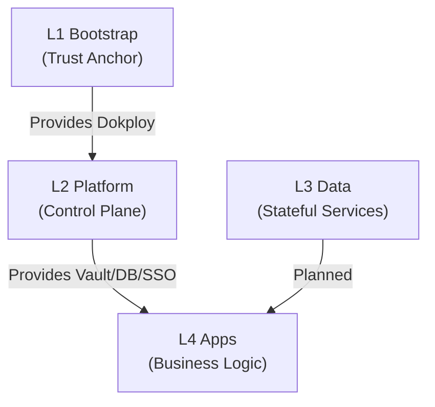

# 核心架构 SSOT

> **SSOT Key**: `core`
> **核心定义**: 定义基础设施的整体分层架构、环境隔离模型及模块间依赖关系。

---

## 1. 真理来源 (The Source)

> **原则**：目录结构即架构 (Directory Structure as Architecture)。

本话题的配置和状态由以下物理位置唯一确定：

| 维度 | 物理位置 (SSOT) | 说明 |
|------|----------------|------|
| **目录结构** | [目录结构规范](#4-目录结构规范) | 物理文件布局 |
| **层级定义** | [Repo Root](https://github.com/wangzitian0/infra2/tree/main) | Bootstrap, Platform, Libs, Tools |
| **变量契约** | `.env` / `.env.<env>` / `.env.example` | 运行时配置入口 |
| **自动化入口** | [`tasks.py`](https://github.com/wangzitian0/infra2/blob/main/tasks.py) | Invoke 任务加载与执行 |

### Code as SSOT 索引

- **任务加载器**：参见 [`tasks.py`](https://github.com/wangzitian0/infra2/blob/main/tasks.py)
- **部署基类**：参见 [`libs/deployer.py`](https://github.com/wangzitian0/infra2/blob/main/libs/deployer.py)
- **环境同步**：参见 [`tools/env_sync.py`](https://github.com/wangzitian0/infra2/blob/main/tools/env_sync.py)

---

## 2. 架构模型



### 层级定义 {#层级定义}

| 层级 | 目录 | 职责 | 部署份数 |
|------|------|------|----------|
| **L1 Bootstrap** | `bootstrap/` | 启动集群，建立 Trust Anchor | 1 (Global) |
| **L2 Platform** | `platform/` | 提供公共服务 (Vault, SSO, DB) | 1 or N (Per-env) |

---

## 3. 设计约束 (Dos & Don'ts)

### ✅ 推荐模式 (Whitelist)

- **模式 A**: 上层模块只能依赖下层模块的**显式交付物**（Vault KV 或 Dokploy 环境变量），禁止隐式依赖。
- **模式 B**: 环境之间 (Staging vs Prod) 必须在 Data 层及以上进行物理隔离。

### ⛔ 禁止模式 (Blacklist)

- **反模式 A**: **禁止** 循环依赖 (如 Bootstrap 依赖 Platform 的 Vault)。
- **反模式 B**: **禁止** 跨环境直接访问数据库 (如 Prod App 连 Staging DB)。

---

## 4. 目录结构规范 {#4-目录结构规范}

### Bootstrap 层目录结构

```
bootstrap/
├── 01.dokploy_install/    # 使用编号前缀（按部署顺序）
│   └── README.md
├── 02.dns_and_cert/
│   └── README.md
├── 03.dokploy_setup/
│   └── README.md
├── 04.1password/
│   ├── README.md
│   └── compose.yaml       # 统一使用 compose.yaml
├── 05.vault/
│   ├── README.md
│   ├── compose.yaml
│   └── vault.hcl
└── README.md              # 组件索引
```

**规则**：
- ✅ 使用 `NN.component_name/` 格式（两位数字 + 点号 + 组件名）
- ✅ 编号反映部署顺序和依赖关系
- ✅ 每个组件目录包含 `README.md`（操作手册）
- ✅ Docker Compose 配置统一命名为 `compose.yaml`
- ✅ 配置文件与 README 放在同一目录

### Platform 层目录结构

```
platform/
├── 01.postgres/
│   ├── README.md
│   ├── compose.yaml
│   ├── deploy.py
│   └── shared_tasks.py
├── 02.redis/
│   ├── README.md
│   ├── compose.yaml
│   ├── deploy.py
│   └── shared_tasks.py
├── 10.authentik/
│   ├── README.md
│   ├── compose.yaml
│   ├── deploy.py
│   └── shared_tasks.py
└── README.md
```

### Volume 路径规范

**层次结构**：
```
/data/
└── bootstrap/           # 按层级组织
    ├── 1password/       # 组件数据目录
    │   ├── 1password-credentials.json
    │   └── ... (database files)
    └── vault/
        ├── file/        # 存储
        ├── logs/        # 日志
        └── config/      # 配置文件
```

**规则**：
- ✅ Volume 根路径：`/data/<layer>/<component>/`
- ✅ Bootstrap 层：`/data/bootstrap/<component>/`
- ✅ Platform 层：`/data/platform/<component>/`
- ✅ Data 层：`/data/<env>/data/<component>/`（若未来引入）

### 文件命名规范

| 文件类型 | 命名规则 | 示例 |
|---------|---------|------|
| Docker Compose | `compose.yaml` | ✅ 统一标准名 |
| HCL 配置 | `<service>.hcl` | `vault.hcl`, `traefik.hcl` |
| 环境变量 | `.env`, `.env.example` | 项目根目录 |
| 自动化脚本 | `tasks.py` / `deploy.py` | Invoke 任务文件 |
| README | `README.md` | 每个组件目录必需 |

---

## 5. 环境变量规范

### 配置层级

| 级别 | 配置入口 | 用途 |
|------|-----------|------|
| Project | `.env` | 项目级通用配置 |
| Environment | `.env.<env>` | 环境级差异配置 |
| Service | `platform/{nn}.{service}/.env.<env>.local` | 服务级配置 |

### 服务命名规范

> **原则**：目录名、Dokploy 应用名、容器名保持一致性。

- **目录名**：`{nn}.{service}`（如 `01.postgres`）
- **Dokploy 应用名**：`service`（如 `postgres`, `redis`, `authentik`）
- **容器名**：`platform-<service>` 或 `<service>-<role>`（如 `platform-postgres`, `authentik-server`）

**完整域名格式**: `<service>.<internal_domain>`

**示例**:
- `sso.${INTERNAL_DOMAIN}`
- `vault.${INTERNAL_DOMAIN}`

### 域名规则 {#域名规则}


| 环境 | 域名模式 | 示例 |
|:---|:---|:---|
| **Platform** | `<service>.<internal_domain>` | `sso.${INTERNAL_DOMAIN}` |
| **Staging** | `x-staging.<base_domain>` | `x-staging.truealpha.club` |
| **Prod** | `<base_domain>` | `truealpha.club` |

---

## 6. 验证与测试 (The Proof)

| 行为描述 | 测试文件 (Test Anchor) | 覆盖率 |
|----------|-----------------------|--------|
| **目录结构完整性** | `test_structure.py` (Backlog) | ⏳ Backlog |
| **DNS 规则一致性** | [`test_network.py`](https://github.com/wangzitian0/infra2/blob/main/e2e_regressions/tests/bootstrap/network_layer/test_network.py) | ✅ Critical |

---

## Used by

- [docs/ssot/README.md](./README.md)
- [docs/README.md](../README.md)
