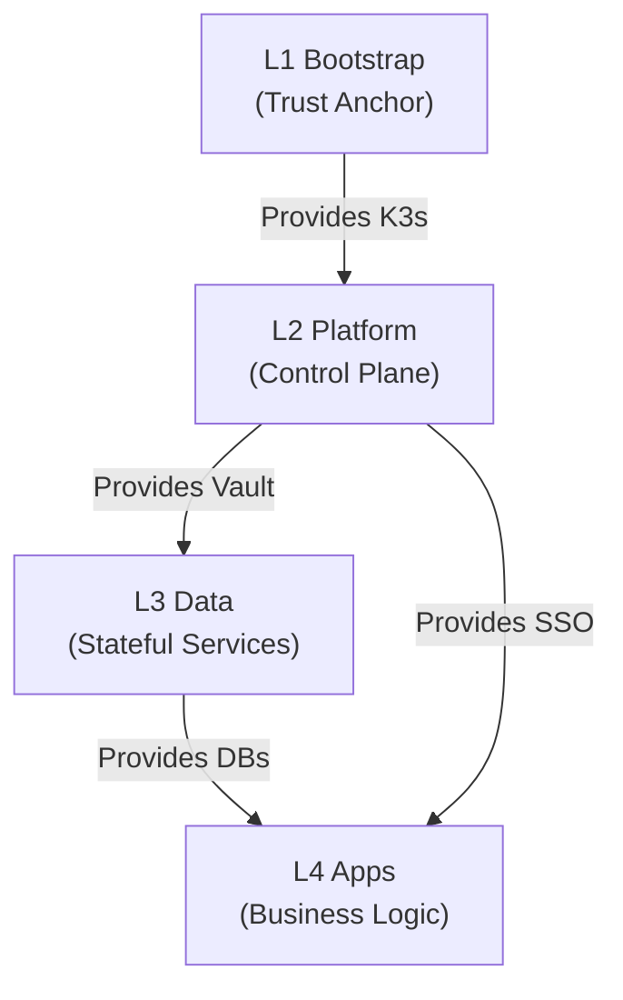

# 核心架构 SSOT

> **SSOT Key**: `core`
> **核心定义**: 定义基础设施的整体分层架构、环境隔离模型及模块间依赖关系。

---

## 1. 真理来源 (The Source)

> **原则**：目录结构即架构 (Directory Structure as Architecture)。

本话题的配置和状态由以下物理位置唯一确定：

| 维度 | 物理位置 (SSOT) | 说明 |
|------|----------------|------|
| **目录结构** | [`docs/ssot/core.dir.md`](./core.dir.md) | 物理文件布局 |
| **层级定义** | [`.`](../../) (Root Directory) | Bootstrap, Platform, Envs |
| **变量契约** | [`variables.tf`](../../variables.tf) | 全局变量定义 |

### Code as SSOT 索引

- **全局变量**：参见 [`variables.tf`](../../variables.tf)
- **环境定义**：参见 [`envs/README.md`](../../envs/README.md)

---

## 2. 架构模型

### 层级定义

| 层级 | 目录 | 职责 | 部署份数 |
|------|------|------|----------|
| **L1 Bootstrap** | `bootstrap/` | 启动集群，建立 Trust Anchor | 1 (Global) |
| **L2 Platform** | `platform/` | 提供公共服务 (Vault, SSO) | 1 (Global) |
| **L3 Data** | `envs/<env>/data/` | 提供数据服务 (DB, Redis) | N (Per-env) |
| **L4 Apps** | `apps/` | 业务应用 | N (Per-env) |

---

## 3. 设计约束 (Dos & Don'ts)

### ✅ 推荐模式 (Whitelist)

- **模式 A**: 上层模块只能依赖下层模块提供的 Output (通过 `terraform_remote_state` 或 Vault)。
- **模式 B**: 环境之间 (Staging vs Prod) 必须在 Data 层及以上进行物理隔离。

### ⛔ 禁止模式 (Blacklist)

- **反模式 A**: **禁止** 循环依赖 (如 Bootstrap 依赖 Platform 的 Vault)。
- **反模式 B**: **禁止** 跨环境直接访问数据库 (如 Prod App 连 Staging DB)。

---

## 4. 环境变量规范

### 命名空间 (Namespace)

| 模块 | Namespace | 用途 |
|------|-----------|------|
| Bootstrap | `kube-system`, `bootstrap` | 系统组件 |
| Platform | `platform`, `observability` | 平台服务 |
| Data | `data-staging`, `data-prod` | 数据服务 |
| Apps | `apps-staging`, `apps-prod` | 业务应用 |

### Service 命名规范

> **原则**：统一后缀，便于多实例扩展。

| 服务类型 | 后缀 | 示例 |
|:---|:---|:---|
| PostgreSQL (读写) | `-rw` | `platform-pg-rw`, `postgresql-rw` |
| PostgreSQL (只读) | `-ro` | `platform-pg-ro` |
| Redis 主节点 | `-master` | `redis-master` |
| Redis 副本 | `-replica` | `redis-replica` |
| 单实例服务 | (无后缀) | `clickhouse`, `arangodb`, `vault` |

**完整 DNS 格式**: `<service>-<suffix>.<namespace>.svc.cluster.local`

**示例**:
- `platform-pg-rw.platform.svc.cluster.local`
- `redis-master.data-staging.svc.cluster.local`
- `vault.platform.svc.cluster.local`

### 域名规则

| 环境 | 域名模式 | 示例 |
|:---|:---|:---|
| **Platform** | `<service>.<internal_domain>` | `sso.${INTERNAL_DOMAIN}` |
| **Staging** | `x-staging.<base_domain>` | `x-staging.truealpha.club` |
| **Prod** | `<base_domain>` | `truealpha.club` |

---

## 5. 验证与测试 (The Proof)

| 行为描述 | 测试文件 (Test Anchor) | 覆盖率 |
|----------|-----------------------|--------|
| **目录结构完整性** | `test_structure.py` (Pending) | ⏳ Planned |
| **DNS 规则一致性** | [`test_network.py`](../../e2e_regressions/tests/bootstrap/network_layer/test_network.py) | ✅ Critical |

---

## Used by

- [docs/ssot/README.md](./README.md)
- [docs/README.md](../../docs/README.md)