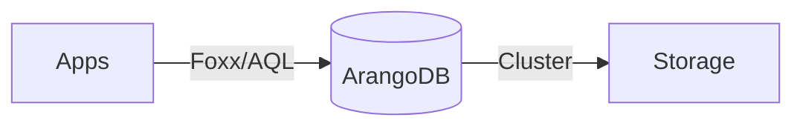

# ArangoDB SSOT

> **SSOT Key**: `db.arangodb`
> **核心定义**: 统一图数据库服务，支持多模型数据存储与复杂关系查询。

---

## 1. 真理来源 (The Source)

本话题的配置和状态由以下物理位置唯一确定：

| 维度 | 物理位置 (SSOT) | 说明 |
|------|----------------|------|
| **实例定义** | [`envs/data-shared/4.arangodb.tf`](../../envs/data-shared/4.arangodb.tf) | ArangoDB 部署配置 |
| **运行时密钥** | **Vault** (`secret/data/arangodb`) | root 密码与 JWT Secret |

---

## 2. 架构模型

---

## 3. 设计约束 (Dos & Don'ts)

### ✅ 推荐模式 (Whitelist)

- **模式 A**: 优先使用 AQL (ArangoDB Query Language) 进行复杂关系查询。
- **模式 B**: 定期清理不需要的 Collection。

### ⛔ 禁止模式 (Blacklist)

- **反模式 A**: **禁止** 在没有索引的情况下进行大规模全量扫描。
- **反模式 B**: **禁止** 暴露 `_admin` 接口到公网。

---

## 4. 标准操作程序 (Playbooks)

### SOP-001: 重置 Root 密码

- **触发条件**: 密码丢失
- **步骤**:
    1. 在 `4.arangodb.tf` 中修改 `root_password` (虽然通常从 Vault 读)。
    2. 如果在 Vault 中，直接 `vault kv put secret/data/arangodb root-password=new...`。
    3. 触发 Pod 重启。

---

## 5. 验证与测试 (The Proof)

| 行为描述 | 测试文件 (Test Anchor) | 覆盖率 |
|----------|-----------------------|--------|
| **ArangoDB 响应测试** | [`test_arangodb.py`](../../e2e_regressions/tests/data/test_arangodb.py) | ✅ Critical |

---

## Used by

- [docs/ssot/db.overview.md](./db.overview.md)