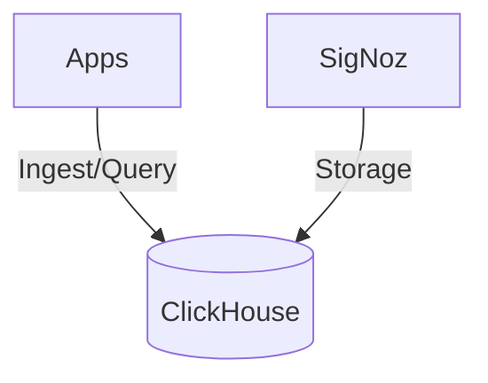

# ClickHouse SSOT

> **SSOT Key**: `db.clickhouse`
> **核心定义**: 用于 OLAP 分析和可观测性 (SigNoz) 的高性能列式数据库配置。

---

## 1. 真理来源 (The Source)

本话题的配置和状态由以下物理位置唯一确定：

| 维度 | 物理位置 (SSOT) | 说明 |
|------|----------------|------|
| **实例定义** | [`envs/data-shared/3.clickhouse.tf`](../../envs/data-shared/3.clickhouse.tf) | ClickHouse 集群定义 |
| **运行时密钥** | **Vault** (`secret/data/clickhouse`) | 默认用户密码 |

---

## 2. 架构模型



---

## 3. 设计约束 (Dos & Don'ts)

### ✅ 推荐模式 (Whitelist)

- **模式 A**: 批量写入数据（Buffer），避免频繁的小记录写入。
- **模式 B**: 使用 `Native` 协议 (Port 9000) 进行高性能查询。

### ⛔ 禁止模式 (Blacklist)

- **反模式 A**: **禁止** 频繁执行 `UPDATE` 或 `DELETE`（ClickHouse 对此支持较弱）。
- **反模式 B**: **禁止** 开启无密码的 HTTP 访问。

---

## 4. 标准操作程序 (Playbooks)

### SOP-001: 检查磁盘占用

- **触发条件**: 磁盘告警
- **步骤**:
    1. 连接数据库: `clickhouse-client`
    2. 查询表大小:
       ```sql
       SELECT table, formatReadableSize(sum(data_compressed_bytes)) AS size 
       FROM system.parts GROUP BY table ORDER BY sum(data_compressed_bytes) DESC;
       ```

---

## 5. 验证与测试 (The Proof)

| 行为描述 | 测试文件 (Test Anchor) | 覆盖率 |
|----------|-----------------------|--------|
| **CH 连通性测试** | [`test_clickhouse.py`](../../e2e_regressions/tests/data/test_clickhouse.py) | ✅ Critical |

---

## Used by

- [docs/ssot/db.overview.md](./db.overview.md)
- [docs/ssot/ops.observability.md](./ops.observability.md)