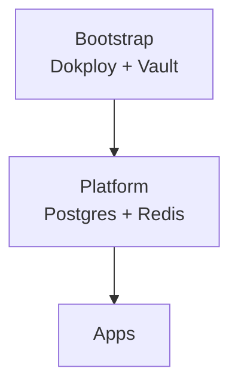

# 数据库总览 SSOT

> **SSOT Key**: `db.overview`
> **核心定义**: 定义平台数据库能力分布、依赖关系及凭据管理模型。

---

## 1. 真理来源 (The Source)

> **原则**：服务定义在 Compose，凭据由 Vault 管理。

| 维度 | 物理位置 (SSOT) | 说明 |
|------|----------------|------|
| **PostgreSQL** | [`platform/01.postgres/compose.yaml`](https://github.com/wangzitian0/infra2/blob/main/platform/01.postgres/compose.yaml) | 平台共享数据库 |
| **Redis** | [`platform/02.redis/compose.yaml`](https://github.com/wangzitian0/infra2/blob/main/platform/02.redis/compose.yaml) | 平台共享缓存 |
| **凭据管理** | **Vault** (`secret/<project>/<env>/<service>`) | 密钥真理 |
| **环境同步** | [`tools/env_sync.py`](https://github.com/wangzitian0/infra2/blob/main/tools/env_sync.py) | 本地对齐 |

---

## 2. 架构模型



### 关键决策 (Architecture Decision)

- **静态凭据**: 以 Vault KV 为准，部署时注入到 Dokploy Env。
- **平台共享**: PostgreSQL/Redis 为平台服务复用。

---

## 3. 设计约束 (Dos & Don'ts)

### ✅ 推荐模式 (Whitelist)

- **模式 A**: 密码必须写入 Vault，再由部署流程读取。
- **模式 B**: 所有数据目录落盘到 `/data/platform/<service>/`。

### ⛔ 禁止模式 (Blacklist)

- **反模式 A**: **严禁** 多个应用共用同一数据库用户（除非明确审批）。
- **反模式 B**: **禁止** 在应用配置中硬编码数据库密码。

---

## 4. 标准操作程序 (Playbooks)

### SOP-001: 验证数据库可达性

- **触发条件**: 应用反馈无法连接数据库
- **步骤**:
    1. 读取 Vault 密码：
       ```bash
       vault kv get -field=root_password secret/platform/production/postgres
       ```
    2. 在 VPS 侧测试连接：
       ```bash
       ssh root@<VPS_HOST>
       docker exec -it platform-postgres psql -U postgres -c 'SELECT 1;'
       ```

---

## 5. 验证与测试 (The Proof)

| 行为描述 | 验证方式 | 状态 |
|----------|----------|------|
| **Postgres 服务健康** | `invoke postgres.shared.status` | ✅ Manual |
| **Redis 服务健康** | `invoke redis.shared.status` | ✅ Manual |

---

## Used by

- [docs/ssot/README.md](./README.md)
