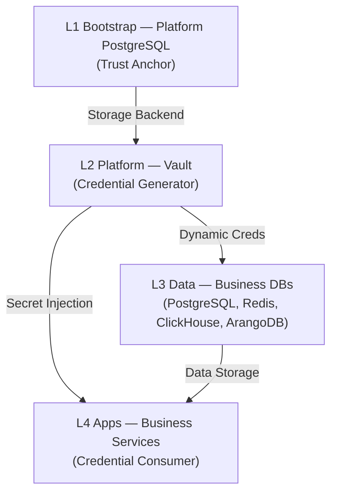

# 数据库总览 SSOT

> **SSOT Key**: `db.overview`
> **核心定义**: 定义全系统的数据库能力分布、层级依赖以及统一的凭据接入模型 (Vault Agent / VSO)。

---

## 1. 真理来源 (The Source)

> **原则**：基础设施定义数据库实体，Vault 定义访问凭据。

本话题的配置和状态由以下物理位置唯一确定：

| 维度 | 物理位置 (SSOT) | 说明 |
|------|----------------|------|
| **实例定义 (L1)** | [`bootstrap/5.platform_pg.tf`](../../bootstrap/5.platform_pg.tf) | 平台级数据库 |
| **实例定义 (L3)** | [`envs/data-shared/`](../../envs/data-shared/) | 业务级数据库集群 |
| **凭据管理** | [`platform/6.vault-database.tf`](../../platform/6.vault-database.tf) | Vault DB 引擎配置 |
| **访问路径** | [`platform/locals.tf`](../../platform/locals.tf) | Vault KV 路径定义 |

### Code as SSOT 索引

- **数据库角色定义**：参见 [`platform/6.vault-database.tf`](../../platform/6.vault-database.tf) (搜索 `vault_database_secret_backend_role`)
- **存储策略**：参见 [**存储层 SSOT**](./bootstrap.storage.md)

---

## 2. 架构模型



### 关键决策 (Architecture Decision)

#### 凭据分治 (Credentials Strategy)

1.  **静态凭据 (Static)**: 
    - **用途**: Operator 初始化 (existingSecret) 或不支持动态凭据的应用。
    - **机制 (VSO Pattern)**: 
      `random_password` (L3) → `Vault KV` → `Vault Secrets Operator` → `K8s Secret`
    - **优点**: 避免了脆弱的 `data.external` 脚本，实现了 GitOps 友好的密码同步。

2.  **动态凭据 (Dynamic)**: 
    - **用途**: 高安全要求的业务应用。
    - **机制**: `Vault Agent Injector` → `database/creds/<role>` (TTL 1h)。

#### 接入标准

- **所有应用**: 统一通过 **Vault Agent Injector** 注入到 Pod 的 `/vault/secrets/` 目录。
- **所有 DB**: 必须配置 `precondition` 检查 Vault 中的密码是否存在且符合复杂度要求。

---

## 3. 设计约束 (Dos & Don'ts)

### ✅ 推荐模式 (Whitelist)

- **模式 A (VSO Pattern)**: 使用 `VaultStaticSecret` CRD 将 Vault KV 同步为 K8s Secret，供 Operator 使用。
- **模式 B (Lifecycle)**: 数据库资源必须配置 `lifecycle { prevent_destroy = true }`。
- **模式 C (Validation)**: Terraform 中必须包含 `precondition` 检查密码强度。
  ```hcl
  precondition {
    condition     = length(data.vault_kv_secret_v2.app.data["password"]) >= 16
    error_message = "Password too weak"
  }
  ```

### ⛔ 禁止模式 (Blacklist)

- **反模式 A**: **严禁** 不同应用共用同一个数据库用户。
- **反模式 B**: **禁止** 在应用代码中硬编码数据库 IP，必须使用 K8s Service 域名。

---

## 4. 标准操作程序 (Playbooks)

### SOP-001: 验证数据库可达性 (Whitebox Check)

- **触发条件**: 应用反馈无法连接数据库
- **步骤**:
    1. 进入临时调试 Pod: `kubectl run -it --rm debug --image=postgres:alpine -n data-staging -- sh`
    2. 测试 DNS: `nslookup postgresql.data-staging.svc.cluster.local`
    3. 测试 TCP: `telnet postgresql 5432`
    4. (可选) 获取 Vault 注入后的文件验证密码。

---

## 5. 验证与测试 (The Proof)

本文档描述的行为由以下测试用例守护：

| 行为描述 | 测试文件 (Test Anchor) | 覆盖率 |
|----------|-----------------------|--------|
| **DB 连通性矩阵** | [`test_db_connectivity.py`](../../e2e_regressions/tests/data/test_db_connectivity.py) | ✅ Critical |
| **Vault 注入验证** | [`test_vault_injection.py`](../../e2e_regressions/tests/platform/secrets/test_vault_injection.py) | ✅ Critical |

---

## Used by

- [docs/ssot/README.md](./README.md)
- [envs/README.md](../../envs/README.md)
