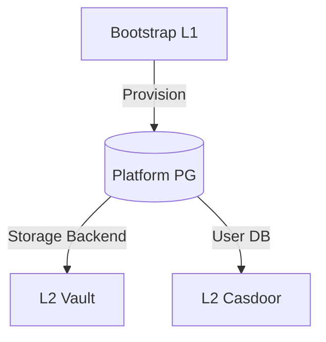

# Platform PostgreSQL SSOT

> **SSOT Key**: `db.platform_pg`
> **核心定义**: 定义控制面核心组件 (Vault/Casdoor) 依赖的后端数据库。作为 Trust Anchor，它具备特殊的生命周期。

---

## 1. 真理来源 (The Source)

> **原则**：L1 平台数据库必须独立于 Vault 运行，其凭据存储于 GitHub Secrets。

本话题的配置和状态由以下物理位置唯一确定：

| 维度 | 物理位置 (SSOT) | 说明 |
|------|----------------|------|
| **实例定义** | [`bootstrap/5.platform_pg.tf`](../../bootstrap/5.platform_pg.tf) | 数据库 Helm 配置 |
| **认证凭证** | **GitHub Secrets** | `TF_VAR_platform_pg_password` |
| **存储路径** | `/data/postgres` | 宿主机持久化路径 |

---

## 2. 架构模型



### 关键决策 (Architecture Decision)

- **为什么在 L1？**: 
    - **打破循环依赖**: Vault 需要数据库来存储自己的数据，因此这个数据库不能由 Vault 托管。
    - **Trust Anchor**: 它是平台启动的首要依赖，必须随 Bootstrap 一层部署。
- **备份策略**: 优先使用本地 `pg_dump` 脚本。

---

## 3. 设计约束 (Dos & Don'ts)

### ✅ 推荐模式 (Whitelist)

- **模式 A**: 仅限 Vault 和 Casdoor 这两个核心平台组件使用此数据库。
- **模式 B**: 始终在宿主机 `/data` 目录下保留物理备份副本。

### ⛔ 禁止模式 (Blacklist)

- **反模式 A**: **严禁** 将业务数据写入 Platform PG。
- **反模式 B**: **禁止** 开启外部公网访问。

---

## 4. 标准操作程序 (Playbooks)

### SOP-001: 备份 Platform PG

- **触发条件**: 每日定时 / 系统升级前
- **步骤**:
    1. 登录 VPS 宿主机。
    2. 执行备份脚本:
       ```bash
       pg_dump -h localhost -p 5432 -U postgres -d vault > /data/backups/pg_vault_$(date +%F).sql
       ```

---

## 5. 验证与测试 (The Proof)

| 行为描述 | 测试文件 (Test Anchor) | 覆盖率 |
|----------|-----------------------|--------|
| **DB 可用性验证** | [`test_platform_pg.py`](../../e2e_regressions/tests/bootstrap/storage_layer/test_platform_pg.py) | ✅ Critical |

---

## Used by

- [docs/ssot/db.overview.md](./db.overview.md)
- [bootstrap/README.md](../../bootstrap/README.md)