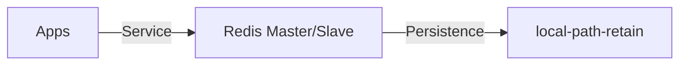

# Redis SSOT

> **SSOT Key**: `db.redis`
> **核心定义**: 全局缓存与消息队列服务 (Redis) 的配置、连接及安全性规范。

---

## 1. 真理来源 (The Source)

本话题的配置和状态由以下物理位置唯一确定：

| 维度 | 物理位置 (SSOT) | 说明 |
|------|----------------|------|
| **实例定义** | [`envs/data-shared/2.redis.tf`](../../envs/data-shared/2.redis.tf) | Redis Helm 配置 |
| **运行时密钥** | **Vault** (`secret/data/redis`) | Redis AUTH 密码 |

---

## 2. 架构模型



---

## 3. 设计约束 (Dos & Don'ts)

### ✅ 推荐模式 (Whitelist)

- **模式 A**: 缓存类数据必须设置 TTL (Time To Live)。
- **模式 B**: 优先使用 Redis Streams 处理轻量级异步任务。

### ⛔ 禁止模式 (Blacklist)

- **反模式 A**: **禁止** 存储过大的二进制文件到 Redis。
- **反模式 B**: **严禁** 在无密码状态下暴露 Redis 到内网。

---

## 4. 标准操作程序 (Playbooks)

### SOP-001: 清理缓存 (Flush Cache)

- **触发条件**: 严重的数据不一致故障
- **步骤**:
    1. 获取密码: `vault kv get -field=password secret/data/redis`
    2. 执行清理:
       ```bash
       redis-cli -h redis-master.data-staging -a <password> FLUSHALL
       ```

---

## 5. 验证与测试 (The Proof)

| 行为描述 | 测试文件 (Test Anchor) | 覆盖率 |
|----------|-----------------------|--------|
| **Redis 读写测试** | [`test_redis.py`](../../e2e_regressions/tests/data/redis/test_redis.py) | ✅ Critical |

---

## Used by

- [docs/ssot/db.overview.md](./db.overview.md)