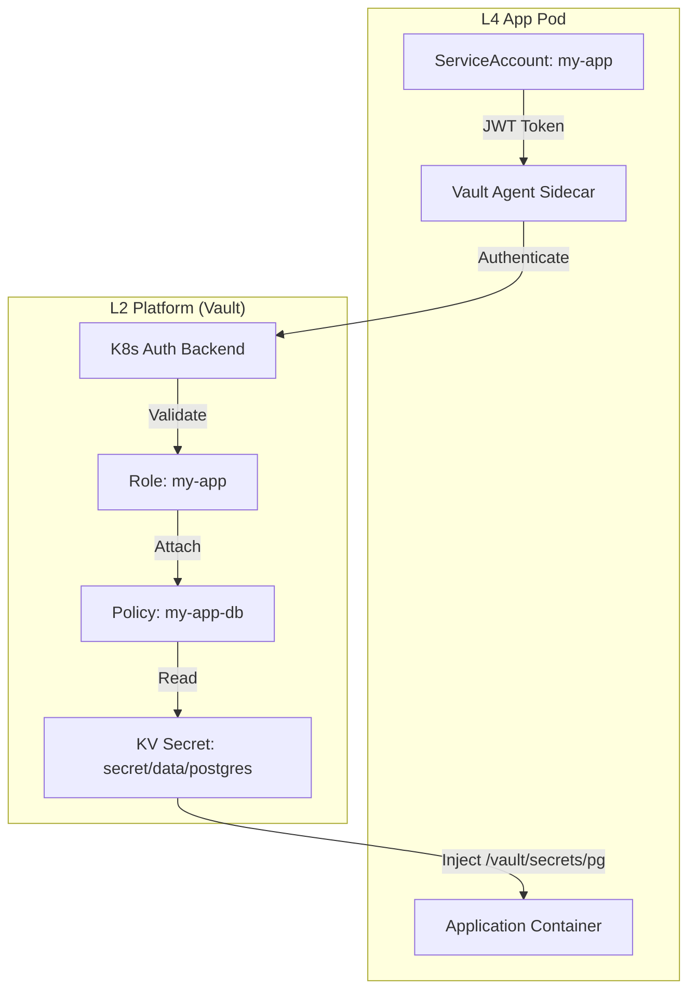

# Vault 数据库接入详解 SSOT

> **SSOT Key**: `db.vault`
> **核心定义**: 定义应用如何通过 Kubernetes ServiceAccount 自动获取数据库凭据的“无感注入”机制。

---

## 1. 真理来源 (The Source)

> **原则**：认证走 K8s，授权走 Vault，交付走 Agent。

本话题的配置和状态由以下物理位置唯一确定：

| 维度 | 物理位置 (SSOT) | 说明 |
|------|----------------|------|
| **K8s Auth 配置** | [`platform/91.vault-auth-kubernetes.tf`](../../platform/91.vault-auth-kubernetes.tf) | 信任 K8s 集群的配置 |
| **应用 Role 定义** | [`platform/92.vault-myapp.tf`](../../platform/92.vault-myapp.tf) | 应用与 Policy 的绑定 |
| **注入规范** | [`platform/6.vault-database.tf`](../../platform/6.vault-database.tf) | 数据库密码存放路径 |

---

## 2. 架构模型



---

## 3. 设计约束 (Dos & Don'ts)

### ✅ 推荐模式 (Whitelist)

- **模式 A**: 使用 `vault.hashicorp.com/agent-inject-template` 格式化输出为应用原生支持的格式（如 `.env` 或 `export`）。
- **模式 B**: 始终设置 `vault.hashicorp.com/role` 以明确标识身份。

### ⛔ 禁止模式 (Blacklist)

- **反模式 A**: **禁止** 直接在 Pod 环境变量中写死 Vault Token。
- **反模式 B**: **禁止** 将不同环境 (staging/prod) 的 ServiceAccount 绑定到同一个具备读写权限的 Vault Role。

---

## 4. 标准操作程序 (Playbooks)

### SOP-001: 接入一个新应用

- **触发条件**: 开发者需要数据库访问权限
- **步骤**:
    1. **定义 Policy**: 在 `2.platform/` 下创建 `.tf` 文件定义应用所需的路径权限。
    2. **定义 Role**: 绑定该应用的 `ServiceAccount` 和 `Namespace`。
    3. **更新 Pod 注解**:
       ```yaml
       vault.hashicorp.com/agent-inject: "true"
       vault.hashicorp.com/role: "myapp"
       vault.hashicorp.com/agent-inject-secret-pg: "secret/data/postgres"
       ```

### SOP-002: 排查“Permission Denied”

- **触发条件**: Pod 启动失败或无法读取密钥
- **步骤**:
    1. 检查 Role 绑定: `vault read auth/kubernetes/role/myapp`
    2. 检查 Policy 权限: `vault policy read myapp`
    3. 检查 K8s SA 是否存在: `kubectl get sa myapp -n my-namespace`

---

## 5. 验证与测试 (The Proof)

| 行为描述 | 测试文件 (Test Anchor) | 覆盖率 |
|----------|-----------------------|--------|
| **K8s Auth 认证流** | [`test_vault_auth.py`](../../e2e_regressions/tests/platform/secrets/test_vault_auth.py) | ✅ Critical |
| **Agent 注入文件存在性** | [`test_agent_injection.py`](../../e2e_regressions/tests/platform/secrets/test_agent_injection.py) | ✅ Critical |

---

## Used by

- [docs/ssot/db.overview.md](./db.overview.md)
- [docs/onboarding/03.database.md](../../docs/onboarding/03.database.md)