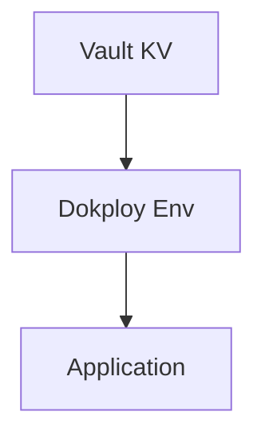

# Vault 数据库接入 SSOT

> **SSOT Key**: `db.vault`
> **核心定义**: 定义应用通过 Vault 获取数据库凭据的接入方式（Dokploy + 环境变量）。

---

## 1. 真理来源 (The Source)

| 维度 | 物理位置 (SSOT) | 说明 |
|------|----------------|------|
| **Vault KV** | `secret/<project>/<env>/<service>` | 数据库凭据路径 |
| **环境工具** | [`tools/env_tool.py`](https://github.com/wangzitian0/infra2/blob/main/tools/env_tool.py) | 读写远端 |
| **部署入口** | Dokploy App Env | 应用运行时变量注入 |

---

## 2. 架构模型



---

## 3. 设计约束 (Dos & Don'ts)

### ✅ 推荐模式 (Whitelist)

- **模式 A**: 数据库密码必须先写入 Vault，再由部署流程读取。
- **模式 B**: 应用运行时仅通过环境变量读取凭据。
- **模式 C**: secrets.ctmpl 使用 `printf` 语法处理动态环境路径：
  ```hcl
  {{ with secret (printf "secret/data/finance_report/%s/postgres" (env "ENV")) }}
  {{ .Data.data.POSTGRES_PASSWORD }}
  {{ end }}
  ```

### ⛔ 禁止模式 (Blacklist)

- **反模式 A**: **禁止** 在代码或镜像中硬编码密码。
- **反模式 B**: **禁止** 复用平台级 root 账号作为业务账号。
- **反模式 C**: **禁止** 在 secrets.ctmpl 中嵌套 `{{ env }}` 函数：
  ```hcl
  # ❌ 错误 - 会导致 template parse error
  {{ with secret "secret/data/finance_report/{{ env \"ENV\" }}/postgres" }}
  
  # ✅ 正确 - 使用 printf 函数
  {{ with secret (printf "secret/data/finance_report/%s/postgres" (env "ENV")) }}
  ```

---

## 4. 标准操作程序 (Playbooks)

### SOP-001: 接入一个新应用

- **触发条件**: 应用需要数据库访问
- **步骤**:
    1. 在 Vault 中写入敏感凭据（示例）：
       ```bash
       vault kv put secret/platform/<env>/<app> PG_USER=... PG_PASS=... PG_DB=...
       ```
    2. 使用 env_tool 验证已写入：
       ```bash
       invoke env.get PG_PASS --project=platform --env=<env> --service=<service>
       ```
    3. 在 Dokploy App 环境变量中设置非敏感值（如 `PG_HOST`, `PG_PORT`），并注入 `PG_USER/PG_PASS/PG_DB`。

### SOP-002: 排查“Permission Denied”

- **触发条件**: 应用连接失败
- **步骤**:
    1. 检查 Vault 路径是否存在。
    2. 确认 Dokploy App 环境变量已更新。
    3. 重启应用容器。


### SOP-003: 排查 Vault-Agent "template parse error"

- **触发条件**: 容器启动失败，日志显示 `template parse error`
- **步骤**:
    1. 检查 `secrets.ctmpl` 文件是否使用正确的 `printf` 语法
    2. 确认环境变量（`ENV`, `PROJECT`）已注入 vault-agent 容器
    3. 验证 Vault 路径格式: `secret/data/<project>/<env>/<service>`
    4. 使用 `vault kv get` 测试路径可访问性

---

## 5. 验证与测试 (The Proof)

| 行为描述 | 验证方式 | 状态 |
|----------|----------|------|
| **Vault 读写验证** | `invoke env.get PG_PASS --project=platform --env=<env> --service=<service>` | ✅ Manual |

---

## 6. Token Management

### Token Type

Use **periodic tokens** (`-period=168h`) for all services:
- Renewable indefinitely by vault-agent
- 7-day window covers weekends/holidays
- Any deploy cycle refreshes the token

### Required vault-agent.hcl Settings

```hcl
auto_auth {
  exit_on_err = true  # Exit on auth failure → Docker restarts container
}

template_config {
  static_secret_render_interval = "5m"
  exit_on_retry_failure = true  # Exit on template failure
}
```

CI enforces these settings on all `vault-agent.hcl` files.

### SOP: Token Expired

**Symptom**: Container stuck in "Created" state, logs show "token validation failed"

**Fix**:
```bash
export VAULT_ROOT_TOKEN=$(op read 'op://Infra2/dexluuvzg5paff3cltmtnlnosm/Token')
invoke vault.setup-tokens  # or: DEPLOY_ENV=staging invoke vault.setup-tokens
invoke fr-app.shared.status  # verify
```

---

## Used by

- [docs/ssot/db.overview.md](./db.overview.md)
- [docs/onboarding/03.database.md](../onboarding/03.database.md)
