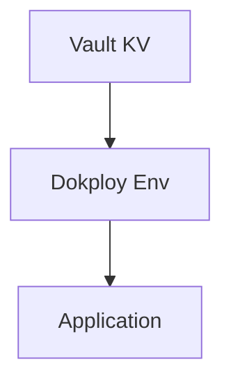

# Vault 数据库接入 SSOT

> **SSOT Key**: `db.vault`
> **核心定义**: 定义应用通过 Vault 获取数据库凭据的接入方式（Dokploy + 环境变量）。

---

## 1. 真理来源 (The Source)

| 维度 | 物理位置 (SSOT) | 说明 |
|------|----------------|------|
| **Vault KV** | `secret/<project>/<env>/<service>` | 数据库凭据路径 |
| **环境工具** | [`tools/env_tool.py`](https://github.com/wangzitian0/infra2/blob/main/tools/env_tool.py) | 读写远端 |
| **部署入口** | Dokploy App Env | 应用运行时变量注入 |

---

## 2. 架构模型



---

## 3. 设计约束 (Dos & Don'ts)

### ✅ 推荐模式 (Whitelist)

- **模式 A**: 数据库密码必须先写入 Vault，再由部署流程读取。
- **模式 B**: 应用运行时仅通过环境变量读取凭据。

### ⛔ 禁止模式 (Blacklist)

- **反模式 A**: **禁止** 在代码或镜像中硬编码密码。
- **反模式 B**: **禁止** 复用平台级 root 账号作为业务账号。

---

## 4. 标准操作程序 (Playbooks)

### SOP-001: 接入一个新应用

- **触发条件**: 应用需要数据库访问
- **步骤**:
    1. 在 Vault 中写入凭据：
       ```bash
       vault kv put secret/platform/production/<app> PG_HOST=... PG_USER=... PG_PASS=...
       ```
    2. 使用 env_tool 验证已写入：
       ```bash
       invoke env.secret-get PG_PASS --project=platform --env=production --service=<app>
       ```
    3. 在 Dokploy App 环境变量中设置上述值（从 Vault 读取）。

### SOP-002: 排查“Permission Denied”

- **触发条件**: 应用连接失败
- **步骤**:
    1. 检查 Vault 路径是否存在。
    2. 确认 Dokploy App 环境变量已更新。
    3. 重启应用容器。

---

## 5. 验证与测试 (The Proof)

| 行为描述 | 验证方式 | 状态 |
|----------|----------|------|
| **Vault 读写验证** | `invoke env.secret-get PG_PASS --project=platform --env=production --service=<app>` | ✅ Manual |

---

## Used by

- [docs/ssot/db.overview.md](./db.overview.md)
- [docs/onboarding/03.database.md](../onboarding/03.database.md)
