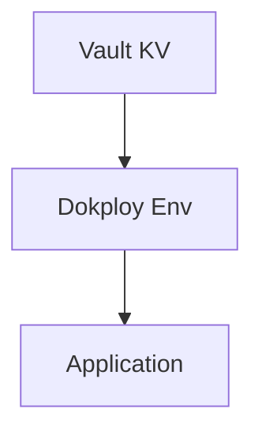

# Vault 数据库接入 SSOT

> **SSOT Key**: `db.vault`
> **核心定义**: 定义应用通过 Vault 获取数据库凭据的接入方式（Dokploy + 环境变量）。

---

## 1. 真理来源 (The Source)

| 维度 | 物理位置 (SSOT) | 说明 |
|------|----------------|------|
| **Vault KV** | `secret/<project>/<env>/<service>` | 数据库凭据路径 |
| **环境工具** | [`tools/env_tool.py`](https://github.com/wangzitian0/infra2/blob/main/tools/env_tool.py) | 读写远端 |
| **部署入口** | Dokploy App Env | 应用运行时变量注入 |

---

## 2. 架构模型


```mermaid
graph TD
    VAULT[Vault KV] --> ENV[Dokploy Env]
    ENV --> APP[Application]
```

---

## 3. 设计约束 (Dos & Don'ts)

### ✅ 推荐模式 (Whitelist)

- **模式 A**: 数据库密码必须先写入 Vault，再由部署流程读取。
- **模式 B**: 应用运行时仅通过环境变量读取凭据。
- **模式 C**: secrets.ctmpl 使用 `printf` 语法处理动态环境路径：
  ```hcl
  {{ with secret (printf "secret/data/finance_report/%s/postgres" (env "ENV")) }}
  {{ .Data.data.POSTGRES_PASSWORD }}
  {{ end }}
  ```

### ⛔ 禁止模式 (Blacklist)

- **反模式 A**: **禁止** 在代码或镜像中硬编码密码。
- **反模式 B**: **禁止** 复用平台级 root 账号作为业务账号。
- **反模式 C**: **禁止** 在 secrets.ctmpl 中嵌套 `{{ env }}` 函数：
  ```hcl
  # ❌ 错误 - 会导致 template parse error
  {{ with secret "secret/data/finance_report/{{ env \"ENV\" }}/postgres" }}
  
  # ✅ 正确 - 使用 printf 函数
  {{ with secret (printf "secret/data/finance_report/%s/postgres" (env "ENV")) }}
  ```

---

## 4. 标准操作程序 (Playbooks)

### SOP-001: 接入一个新应用

- **触发条件**: 应用需要数据库访问
- **步骤**:
    1. 在 Vault 中写入敏感凭据（示例）：
       ```bash
       vault kv put secret/platform/<env>/<app> PG_USER=... PG_PASS=... PG_DB=...
       ```
    2. 使用 env_tool 验证已写入：
       ```bash
       invoke env.get PG_PASS --project=platform --env=<env> --service=<service>
       ```
    3. 在 Dokploy App 环境变量中设置非敏感值（如 `PG_HOST`, `PG_PORT`），并注入 `PG_USER/PG_PASS/PG_DB`。

### SOP-002: 排查“Permission Denied”

- **触发条件**: 应用连接失败
- **步骤**:
    1. 检查 Vault 路径是否存在。
    2. 确认 Dokploy App 环境变量已更新。
    3. 重启应用容器。


### SOP-003: 排查 Vault-Agent "template parse error"

- **触发条件**: 容器启动失败，日志显示 `template parse error`
- **步骤**:
    1. 检查 `secrets.ctmpl` 文件是否使用正确的 `printf` 语法
    2. 确认环境变量（`ENV`, `PROJECT`）已注入 vault-agent 容器
    3. 验证 Vault 路径格式: `secret/data/<project>/<env>/<service>`
    4. 使用 `vault kv get` 测试路径可访问性

---

## 5. 验证与测试 (The Proof)

| 行为描述 | 验证方式 | 状态 |
|----------|----------|------|
| **Vault 读写验证** | `invoke env.get PG_PASS --project=platform --env=<env> --service=<service>` | ✅ Manual |

---

## 6. AppRole Auth Management

### Auth method

All services authenticate to Vault via **AppRole** (the legacy static
`VAULT_APP_TOKEN` periodic-token model was retired in #369 — see
docs/ssot/bootstrap.iac_runner.md §6.4):
- The vault-agent sidecar logs in with `role_id`/`secret_id` and renews /
  re-authenticates natively — no static token to renew or rotate.
- `secret_id_ttl=0` (non-expiring); deploy cycles fail-closed if
  `VAULT_ROLE_ID`/`VAULT_SECRET_ID`/`VAULT_ADDR` are missing from the Dokploy env.

### Ownership

The AppRole lifecycle is owned by infra2:
- AppRole identity is `{project, env, service}`.
- Policy names include the deployment environment, for example
  `finance_report-staging-app`.
- Policies must read only `secret/data/<project>/<env>/<service>` paths. Do not
  use `+` wildcards across environments for app policies.
- `vault.setup-approle` writes the policy, creates the per-service AppRole role,
  mints a non-expiring `role_id`/`secret_id`, injects them into the matching
  Dokploy compose env as `VAULT_ROLE_ID`/`VAULT_SECRET_ID`, and waits for a new
  Dokploy runtime deployment record before reporting success.

Finance Report CI/CD is only a consumer. It must not hold `VAULT_ROOT_TOKEN` or
mutate Vault policies/roles.

### Required vault-agent.hcl Settings

```hcl
auto_auth {
  exit_on_err = true  # Exit on auth failure → Docker restarts container
}

template_config {
  static_secret_render_interval = "5m"
  exit_on_retry_failure = true  # Exit on template failure
}
```

CI enforces these settings on all `vault-agent.hcl` files.

### Required compose health behavior

Vault-agent compose services must:
- Remove stale `/vault/secrets/.env` before starting `vault agent`.
- Fail healthcheck when the vault-agent's AppRole sink-token lookup (`/v1/auth/token/lookup-self`) fails.
- Fail healthcheck when `/vault/secrets/.env` is missing or empty.
- Fail healthcheck when `/vault/secrets/.env` contains Vault template fallback
  text such as `<no value>`.
- Not use rendered-file mtime freshness in Docker healthchecks.

This prevents a previously rendered secrets file from masking a broken vault-agent
(e.g. a failing AppRole login). The deploy preflight skips the legacy `VAULT_APP_TOKEN`
TTL gate for AppRole services, so a vestigial token never hard-blocks a redeploy.

Rendered-file freshness remains a P1 audit signal, not a Docker container health
contract. Vault Agent templates may not rewrite a static secret file when the
secret value is unchanged, so continuous mtime freshness creates false unhealthy
sidecars even when token lookup and template rendering are functional.

### Required live self-refresh audit

The runtime proof for this contract is `invoke vault-audit.self-refresh`.
It is read-only and must not rotate, renew, restart, or redeploy services.

The authoritative inventory is DERIVED (#542) from each service Deployer's
`SecretsFacet` declarations (`libs/service_facets.py` →
`libs/vault_self_refresh_audit.load_inventory`); the former handwritten
`vault-self-refresh-inventory.yaml` is deleted (equivalence frozen as
`libs/tests/fixtures/vault_self_refresh_inventory_frozen.yaml`). Each active
compose file with a `vault-agent` service must have exactly one derived entry
unless the compose file is explicitly a non-deployed alternate.

The audit must check:
- Dokploy service env includes the service's auth credentials (AppRole: a non-empty
  `VAULT_ROLE_ID` + `VAULT_SECRET_ID`).
- The vault-agent's sink token lookup reports `valid=true` (AppRole tokens are
  renewed / re-issued natively by the agent — there is no static token TTL to floor).
- `/vault/secrets/.env` exists in the vault-agent container, is readable,
  non-empty, contains no unresolved template values such as `<no value>`, and
  is fresher than `max_rendered_secret_age_seconds` as an audit signal.
- vault-agent logs do not contain known token refresh or template render errors.
- vault-agent and application containers are running with acceptable health; app
  containers must mount `/secrets/.env`.

The audit output is schema-versioned and redacts secret-like keys before
printing or serializing results.

### Test contract

`libs/tests/test_vault_self_refresh_audit.py` is the regression suite for the
self-refresh audit. It covers inventory/static drift, token classifier outcomes,
rendered env freshness, unresolved template values, log error detection,
container checks, report schema, and redaction. New vault-agent services must
extend the inventory and keep these tests passing.

### SOP: Token Expired

**Symptom**: Container stuck in "Created" state, logs show "VAULT_ROLE_ID and VAULT_SECRET_ID are required" or an AppRole login failure

**Fix**:
```bash
export VAULT_ROOT_TOKEN=$(op read 'op://Infra2/dexluuvzg5paff3cltmtnlnosm/Token')
DEPLOY_ENV=staging invoke vault.setup-approle --project=finance_report --service=app
invoke fr-app.shared.status  # verify
```

For PostgreSQL or Redis sidecars, replace `--service=app` with
`--service=postgres` or `--service=redis`.

### Scheduled Audit / Repair

The normal runtime proof remains read-only:

```bash
invoke vault-audit.self-refresh --env=staging --service=finance_report/app
```

An infra-owned Dokploy server schedule may run a repair shell that only mutates
Vault when the read-only audit reports token failures. Rendered-file freshness
failures should alert first; they must not blindly rotate tokens when token
lookup is still valid.

```bash
set -euo pipefail
cd /path/to/infra2
if ! DEPLOY_ENV=staging invoke vault-audit.self-refresh --env=staging --service=finance_report/app; then
  export VAULT_ROOT_TOKEN="$(op read 'op://Infra2/dexluuvzg5paff3cltmtnlnosm/Token')"
  DEPLOY_ENV=staging invoke vault.setup-approle --project=finance_report --service=app
fi
```

The schedule must run in infra2 or a Dokploy-controlled infra runner. GitHub
Actions for application deploys must not receive `VAULT_ROOT_TOKEN`.

---

## Used by

- [docs/ssot/db.overview.md](./db.overview.md)
- [docs/onboarding/03.database.md](../onboarding/03.database.md)
