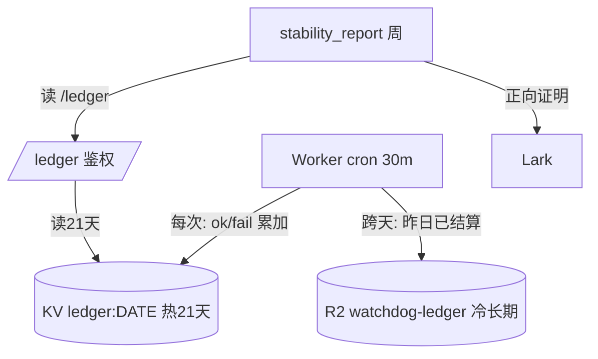

# 可用率账本 SSOT

> **SSOT Key**: `ops.availability_ledger`
> **核心定义**: 定义"正向证明"——watchdog 每次探测的成功/失败如何记账、留存、归档，以及如何由此算出可用率并生成稳定性报告。

---

## 1. 真理来源 (The Source)

> **原则**: 故障流告警证明不了"它一直是好的"。账本是闭环的正向那一半：成功也要记，并且**绝不能把降级信号报成健康**。

| 维度 | 物理位置 (SSOT) | 说明 |
|------|----------------|------|
| **记账逻辑** | [`cloudflare/infra-watchdog/worker.js`](../../cloudflare/infra-watchdog/worker.js) `recordLedger` | 每次 cron 把各信号 ok/fail 累加进当日 rollup |
| **读取/聚合逻辑** | [`libs/availability_ledger.py`](../../libs/availability_ledger.py) | 聚合、算 uptime%、生成报告（纯函数，集中管理） |
| **热数据(21天滚动)** | **Cloudflare KV** `ledger:YYYY-MM-DD` | 供 `/ledger`、`/status`、周报 |
| **冷归档(长期)** | **Cloudflare R2** `watchdog-ledger/YYYY-MM-DD.json` | 跨天时由 Worker R2 binding 直接写；与 [`ops.storage`](./ops.storage.md) 离场存储统一 |
| **周报投递** | [`tools/stability_report.py`](../../tools/stability_report.py) → Lark | 弱 CLI，逻辑全在 libs |

### 关键决策 (Architecture Decision)

- **账本为何外置 (KV/R2 而非 SigNoz)**：SigNoz 与告警 bridge 都跑在单台 VPS 上，**度量不了自己宿主的可用率**。账本必须活在比被测对象更可靠的层（Cloudflare），见 [`ops.alerting`](./ops.alerting.md) 的分层原则。
- **冷归档为何用 R2 而非 Google Drive**：R2 是 S3 标准、静态凭据（无 OAuth 过期失效模式）、与现有备份同一离场后端；Worker 有原生 R2 binding，跨天直接写出，**无需 GitHub 同步 job / rclone / 第二套凭据**。
- **KV 写预算**：每次 cron 1 读 + 1 写当日键（聚合 rollup，**绝不一信号一键**），跨天再 +1 delete +1 R2 put。总量约 400 写/天，远低于 KV 免费版 1000/天。

---

## 2. 架构模型



数据流：探测结果 → 记账（成功也记）→ KV 21 天 + R2 长期 → 周报正向证明。单向，账本只进不被 app 回写。

---

## 3. 设计约束 (Dos & Don'ts)

### ✅ 推荐模式 (Whitelist)

- **模式 A**: 每次 run 写**一个聚合 rollup 值**；新增信号自动被记，无需改记账代码。
- **模式 B**: 聚合/算可用率的逻辑只放 `libs/availability_ledger.py`，CLI 与测试共用同一份。
- **模式 C**: R2 / KV 绑定缺失时记账与归档**安全降级为 no-op**，部署不挂。

### ⛔ 禁止模式 (Blacklist)

- **反模式 A**: **禁止** per-signal-per-run 单独建 KV 键（会击穿免费版写配额，之后每个 put() 抛错、静默假死）。
- **反模式 B**: **禁止** 把 fail>0 的信号计入 100% / perfect 集合——正向证明必须同时如实暴露降级。
- **反模式 C**: **禁止** 信任畸形输入；坏的 day/signal 条目一律忽略，不得抬高可用率。

---

## 4. 标准操作程序 (Playbooks)

### SOP-001: 启用冷归档到 R2

1. 确认 R2 桶 `infra2` 存在（与备份共用）。
2. `wrangler.toml` 的 `[[r2_buckets]] binding = "LEDGER_BUCKET"` 已就位。
3. `cd cloudflare/infra-watchdog && wrangler deploy`。
4. 跨天后在 R2 `watchdog-ledger/` 下应出现前一日 `YYYY-MM-DD.json`。

### SOP-002: 查看每周正向稳定性报告

- 自动：`watchdog-weekly-digest.yml`（周一 UTC）跑 `stability_report.py`，读 `/ledger` → Lark。
- 本地 dry-run：
  ```bash
  INFRA2_STABILITY_REPORT_DRY_RUN=1 python tools/stability_report.py --input ledger.json
  ```

---

## 5. 验证与测试 (The Proof)

> 这种基础设施需要**正例 + 反例**共同证明有效性。

| 行为 | 测试锚点 | 正/反例 |
|------|----------|---------|
| 多日聚合算对 uptime%/perfect/overall | `libs/tests/test_availability_ledger.py` | 正例 |
| **降级信号绝不报成 100%/perfect** | `libs/tests/test_availability_ledger.py` | **反例** |
| 畸形 day/signal 输入不抬高可用率、不崩 | `libs/tests/test_availability_ledger.py` | **反例** |
| 0 检查不触发除零 | `libs/tests/test_availability_ledger.py` | **反例** |
| Worker 记账 + `/ledger` + R2 归档 + 21天裁剪 | `libs/tests/test_cloudflare_watchdog.py` | 正例 |
| 周报正向文案 / dry-run 不投递 | `libs/tests/test_stability_report.py` | 正/反例 |

---

## Used by

- [docs/ssot/README.md](./README.md)
- [docs/ssot/ops.alerting.md](./ops.alerting.md)
- [docs/ssot/ops.observability.md](./ops.observability.md)
- [docs/ssot/ops.storage.md](./ops.storage.md)
