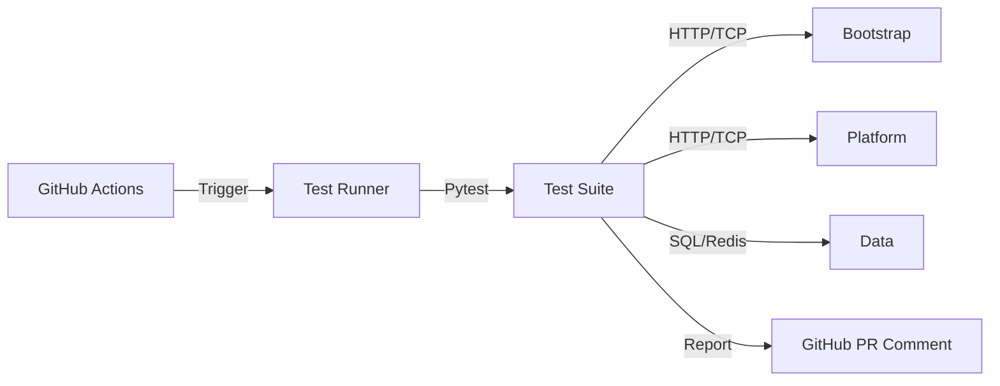

# E2E 回归测试 SSOT

> **SSOT Key**: `ops.e2e`
> **核心定义**: 定义自动化测试框架架构、测试分级策略及 CI 集成规范。

---

## 1. 真理来源 (The Source)

> **原则**：测试代码是验证 SSOT 真实性的唯一标准。

本话题的配置和状态由以下物理位置唯一确定：

| 维度 | 物理位置 (SSOT) | 说明 |
|------|----------------|------|
| **测试代码** | [`e2e_regressions/`](../../e2e_regressions/) | Pytest 测试套件 |
| **CI 流程** | [`.github/workflows/ci.yml`](../../.github/workflows/ci.yml) | 触发逻辑 |

### Code as SSOT 索引

- **测试矩阵**：参见 [`e2e_regressions/tests/README.md`](../../e2e_regressions/tests/README.md)
- **环境配置**：参见 [`e2e_regressions/conftest.py`](../../e2e_regressions/conftest.py)

---

## 2. 架构模型

### 测试分级 (Test Pyramid)

| 级别 | 标记 (Mark) | 运行时长 | 目的 |
|------|-------------|----------|------|
| **Smoke** | `@pytest.mark.smoke` | < 1min | 部署后的冒烟测试 (核心路径) |
| **Critical** | `@pytest.mark.critical` | < 5min | 关键功能验证 |
| **Full** | (无) | > 10min | 完整回归 |

---

## 3. 设计约束 (Dos & Don'ts)

### ✅ 推荐模式 (Whitelist)

- **模式 A**: 每一个 SSOT 文档的 "The Proof" 章节**必须**链接到具体的测试文件。
- **模式 B**: 测试用例应尽量保持幂等性（Idempotent），可重复运行。

### ⛔ 禁止模式 (Blacklist)

- **反模式 A**: **禁止** 在测试代码中硬编码敏感信息（必须通过 Env 注入）。
- **反模式 B**: **禁止** 依赖外部不稳定服务（如公网 API）导致 Flaky Test。

---

## 4. 标准操作程序 (Playbooks)

### SOP-001: 运行本地测试

- **触发条件**: 开发新功能前
- **步骤**:
    1. 配置环境变量 (参考 `.env.example`)。
    2. 运行: `uv run pytest tests/platform/ -m smoke`。

### SOP-002: 添加新测试

- **触发条件**: 补充 SSOT 覆盖率
- **步骤**:
    1. 在 `e2e_regressions/tests/` 下创建新文件。
    2. 编写测试函数 `test_xxx`。
    3. 在对应 SSOT 文档中添加链接。

---

## 5. 评分体系 (Scoring)

> **权重**：按团队目标可调整。

- **定义**：评分细则与可计算子指标参见 [`e2e_regressions/README.md`](../../e2e_regressions/README.md#-scoring)。

---

## 6. 验证与测试 (The Proof)

| 行为描述 | 测试文件 (Test Anchor) | 覆盖率 |
|----------|-----------------------|--------|
| **测试框架自身** | [`conftest.py`](../../e2e_regressions/conftest.py) | ✅ Meta-Test |

---

## Used by

- [docs/ssot/README.md](./README.md)
- [e2e_regressions/README.md](../../e2e_regressions/README.md)
