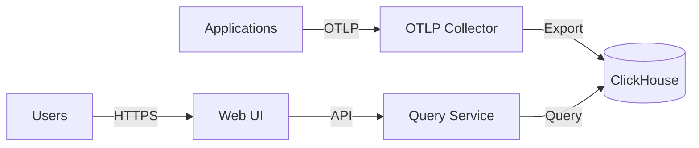

# 可观测性 SSOT

> **SSOT Key**: `ops.obs`
> **核心定义**: 定义日志、指标、链路追踪的统一采集与展示。

---

## 1. 真理来源 (The Source)

| 维度 | 物理位置 (SSOT) | 说明 |
|------|----------------|------|
| **存储层** | [platform/03.clickhouse](../../platform/03.clickhouse/) | ClickHouse + ZooKeeper |
| **应用层** | [platform/11.signoz](../../platform/11.signoz/) | Query Service + Frontend + OTLP Collector |
| **部署指南** | [Infra-007](../project/Infra-007.signoz_install.md) | SigNoz 安装项目 |

---

## 2. 架构模型

### 2.1 组件架构



### 2.2 部署结构

| 组件 | 位置 | 端口 | 用途 |
|------|------|------|------|
| **ClickHouse** | platform/03.clickhouse | 9000, 8123 (内部) | 时序数据存储 |
| **ZooKeeper** | platform/03.clickhouse | 2181 (内部) | 集群协调 |
| **OTLP Collector** | platform/11.signoz | 4317, 4318 | 数据采集 |
| **Query Service** | platform/11.signoz | 8080 (内部) | 查询引擎 |
| **Frontend** | platform/11.signoz | 3301 (Traefik) | Web 界面 |

### 2.3 数据流

1. **采集**: 应用通过 OTLP SDK 发送 traces/metrics/logs → OTLP Collector (4317/4318)
2. **存储**: OTLP Collector 处理并导出 → ClickHouse
3. **查询**: Frontend → Query Service → ClickHouse
4. **展示**: 用户访问 `https://signoz.${INTERNAL_DOMAIN}` → Frontend

---

## 3. 设计约束 (Dos & Don'ts)

### ✅ 推荐模式 (Whitelist)

- **模式 A**: 应用使用 OpenTelemetry SDK 进行自动/手动埋点。
- **模式 B**: 日志默认结构化输出（JSON），便于解析。
- **模式 C**: 敏感数据在发送前脱敏（密码、Token、PII）。
- **模式 D**: 使用 OTLP 协议（gRPC 或 HTTP）统一采集。

### ⛔ 禁止模式 (Blacklist)

- **反模式 A**: **禁止** 在日志/trace 中输出原始敏感信息。
- **反模式 B**: **禁止** 使用私有/非标准协议发送遥测数据。
- **反模式 C**: **禁止** 绕过 OTLP Collector 直接写入 ClickHouse。

---

## 4. 接入指南

### 4.1 应用接入 OTLP

**前置条件**:
- SigNoz 已部署并健康（`invoke signoz.status`）
- 应用部署在 `dokploy-network` Docker 网络中
- OTLP 端点：`platform-signoz-otel-collector:4317` (gRPC) 或 `:4318` (HTTP)

> **注意**: OTLP 端口仅在 Docker 网络内可访问，不对外暴露。

**验证连通性**:
```bash
invoke signoz.shared.test-trace --service-name=myapp
```

**示例（Python，Docker 网络内）**:
```python
from opentelemetry import trace
from opentelemetry.sdk.trace import TracerProvider
from opentelemetry.sdk.trace.export import BatchSpanProcessor
from opentelemetry.exporter.otlp.proto.http.trace_exporter import OTLPSpanExporter
from opentelemetry.sdk.resources import Resource

resource = Resource.create({"service.name": "my-service"})
provider = TracerProvider(resource=resource)
exporter = OTLPSpanExporter(endpoint="http://platform-signoz-otel-collector:4318/v1/traces")
provider.add_span_processor(BatchSpanProcessor(exporter))
trace.set_tracer_provider(provider)

tracer = trace.get_tracer(__name__)
with tracer.start_as_current_span("my-span"):
    print("Hello SigNoz")
```

### 4.2 环境变量配置

| 变量 | 说明 | 示例 |
|------|------|------|
| `OTEL_EXPORTER_OTLP_ENDPOINT` | OTLP 端点（HTTP） | `http://platform-signoz-otel-collector:4318` |
| `OTEL_SERVICE_NAME` | 服务名 | `my-app` |
| `OTEL_RESOURCE_ATTRIBUTES` | 资源属性 | `deployment.environment=prod` |

---

## 5. 运维指南

### 5.1 部署顺序

```bash
# 1. 部署存储层
invoke clickhouse.setup

# 2. 部署应用层
invoke signoz.setup

# 3. 验证
invoke clickhouse.status
invoke signoz.status
```

### 5.2 数据路径

```
/data/platform/clickhouse/
├── data/          # 时序数据（traces, metrics, logs）
├── logs/          # ClickHouse 日志
├── user_scripts/  # 自定义函数
└── zookeeper/     # 集群元数据

/data/platform/signoz/
└── data/          # SQLite 元数据（dashboards, alerts）
```

### 5.3 访问地址

- **Web UI**: `https://signoz.${INTERNAL_DOMAIN}`
- **OTLP gRPC**: `platform-signoz-otel-collector:4317` (Docker 网络内)
- **OTLP HTTP**: `platform-signoz-otel-collector:4318` (Docker 网络内)

### 5.4 容量规划

| 指标 | 建议值 | 说明 |
|------|--------|------|
| **ClickHouse 磁盘** | 100GB+ | 根据保留策略调整 |
| **内存** | 8GB+ | ClickHouse + SigNoz 服务 |
| **OTLP Collector 内存** | 1GB | 通过 memory_limiter 限制 |

---

## 6. 验证与测试 (The Proof)

| 行为描述 | 验证方式 | 状态 |
|----------|----------|------|
| **ClickHouse 健康** | `invoke clickhouse.status` | ✅ Implemented |
| **SigNoz 健康** | `invoke signoz.status` | ✅ Implemented |
| **Frontend 可访问** | `curl -I https://signoz.${INTERNAL_DOMAIN}` | ✅ Implemented |
| **OTLP 端点可用** | `invoke signoz.shared.test-trace` | ✅ Implemented |

---

## 7. 故障排查

### 问题 1: ClickHouse 启动失败
- **检查**: `docker logs platform-clickhouse`
- **常见原因**: 权限问题（uid=101）、磁盘空间不足
- **解决**: `invoke clickhouse.pre-compose` 重新初始化

### 问题 2: OTLP 数据未显示
- **检查**: `docker logs platform-signoz-otel-collector`
- **常见原因**: ClickHouse 连接失败、数据格式错误
- **解决**: 检查 `otel-collector-config.yaml` 的 exporter 配置

### 问题 3: Frontend 502 错误
- **检查**: `docker logs platform-signoz-query-service`
- **常见原因**: Query Service 未就绪、ClickHouse 查询超时
- **解决**: 等待 query-service 健康检查通过

---

## Used by

- [docs/ssot/README.md](./README.md)
- [platform/03.clickhouse/README.md](../../platform/03.clickhouse/README.md)
- [platform/11.signoz/README.md](../../platform/11.signoz/README.md)
