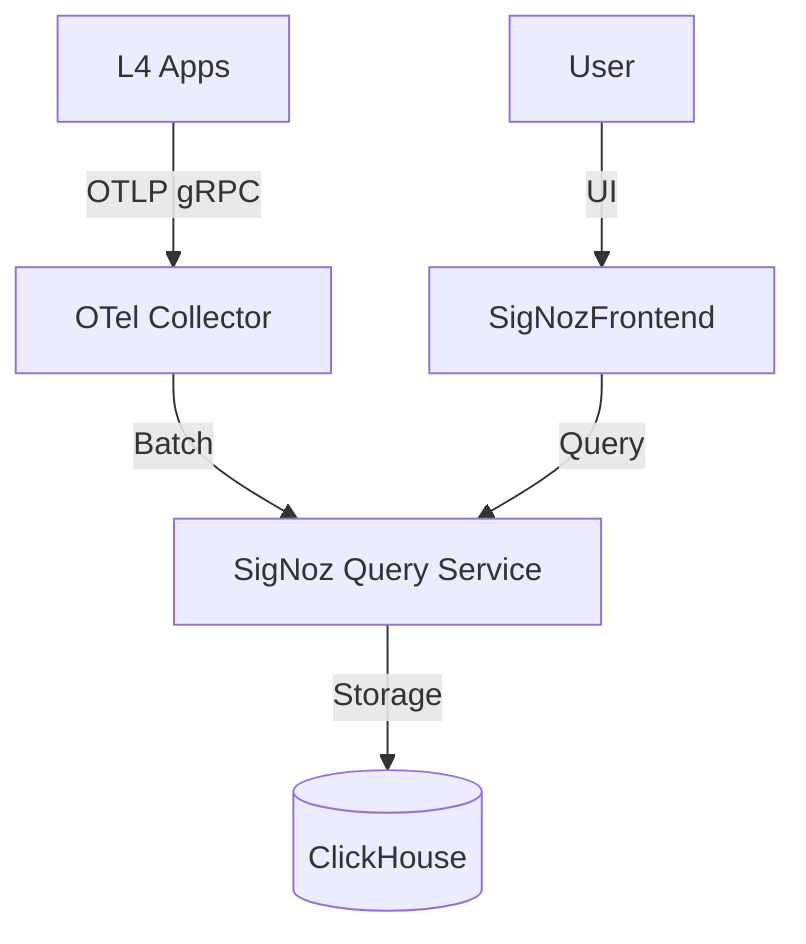

# 可观测性 SSOT

> **SSOT Key**: `ops.obs`
> **核心定义**: 定义日志、指标、链路追踪的统一采集、存储与展示架构。

---

## 1. 真理来源 (The Source)

本话题的配置和状态由以下物理位置唯一确定：

| 维度 | 物理位置 (SSOT) | 说明 |
|------|----------------|------|
| **SigNoz 部署** | [`platform/11.signoz.tf`](../../platform/11.signoz.tf) | 观测平台 Helm 定义 |
| **存储后端** | **ClickHouse** (L3) | 所有的 Trace/Log/Metric 数据 |
| **采集配置** | **OTel Collector** | 统一采集策略 |

---

## 2. 架构模型



### 关键决策 (Architecture Decision)

- **ClickHouse 原生**: 使用 ClickHouse 作为统一存储后端，利用其高压缩比和列式查询性能。
- **OTel Native**: 全面拥抱 OpenTelemetry 标准，应用只需配置 OTel SDK 即可接入，无供应商锁定。

---

## 3. 设计约束 (Dos & Don'ts)

### ✅ 推荐模式 (Whitelist)

- **模式 A**: 应用**必须**设置 `OTEL_SERVICE_NAME` 环境变量以标识自身。
- **模式 B**: 生产环境建议开启 `parentbased_traceidratio=0.1` 采样，避免数据量过大。

### ⛔ 禁止模式 (Blacklist)

- **反模式 A**: **禁止** 在日志中打印敏感信息 (PII, Secrets)。
- **反模式 B**: **禁止** 使用非结构化日志（推荐 JSON 格式）。

---

## 4. 标准操作程序 (Playbooks)

### SOP-001: 接入新服务

- **触发条件**: 新微服务上线
- **步骤**:
    1. 在应用中集成 OTel SDK。
    2. 设置环境变量:
       ```yaml
       OTEL_EXPORTER_OTLP_ENDPOINT: "http://otel-collector.observability.svc:4317"
       OTEL_SERVICE_NAME: "my-service"
       ```
    3. 部署并验证 SigNoz 界面是否有数据。

### SOP-002: 清理历史数据

- **触发条件**: 磁盘告警
- **步骤**:
    1. 修改 SigNoz 配置中的 TTL (Retention Policy)。
    2. 手动执行 ClickHouse `ALTER TABLE ... DELETE WHERE date < ...`。

---

## 5. 验证与测试 (The Proof)

| 行为描述 | 测试文件 (Test Anchor) | 覆盖率 |
|----------|-----------------------|--------|
| **SigNoz UI 可达性** | `test_signoz_health.py` (Pending) | ⏳ Planned |

---

## Used by

- [docs/ssot/README.md](./README.md)
- [docs/ssot/db.clickhouse.md](./db.clickhouse.md)