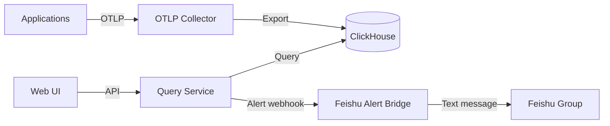

# 可观测性 SSOT (采集 · 告警 · 报告)

> **SSOT Key**: `ops.obs`
> **核心定义**: infra2 可观测性的**唯一 owner**——遥测采集(logs/metrics/traces)、**告警**(规则/分级/飞书路由)、
> **报告/可用率账本**(正向证明),以及把这三者统一起来的**时间尺度分层模型**。
>
> 收敛自原 `ops.alerting` + `ops.availability-ledger`(已并入本文)。`watchdog-signals.yaml` 作为信号数据
> registry 保留;遥测**标识**(env identity)归 [core.environments.md](./core.environments.md#telemetry-identity)。
>
> **第一性原理(本文的脊梁)**:**告警 = 事件驱动**(真出事才发);**报告 = 时间驱动**(周期发)。
> 二者绝不混——尤其**不能周期性地发告警**。详见 §2。

---

## 1. 真理来源 (The Source)

| 维度 | 物理位置 (SSOT) | 说明 |
|------|----------------|------|
| **采集 - 存储** | [platform/03.clickhouse](../../platform/03.clickhouse/) | ClickHouse + ZooKeeper |
| **采集 - 应用** | [platform/11.signoz](../../platform/11.signoz/) | Query Service + Frontend + OTLP Collector |
| **告警 - 规则** | **SigNoz Alert Manager** + `finance_report/finance_report/observability/alert_rules.json`(config-as-code) | 告警规则 |
| **告警 - 通知** | [platform/12.alerting](../../platform/12.alerting/) | SigNoz webhook → Feishu custom bot / app bot bridge;in-band probe runner |
| **告警 - 密钥源头** | 1Password `platform/{env}/alerting` → 运行时镜像 Vault `secret/platform/{env}/alerting` | Feishu 凭据 + 可选 bridge basic auth |
| **带外 watchdog** | [`cloudflare/infra-watchdog`](../../cloudflare/infra-watchdog/)(主,边缘 30min)+ `ops-checks.yml`(GitHub 兜底,日级) | 整机/整栈失联检测 |
| **信号清单** | [`watchdog-signals.yaml`](watchdog-signals.yaml) | 按信号(非组件)追踪 watchdog 归属 |
| **报告 - 账本** | Cloudflare KV(热 21 天)+ R2(冷长期)·`libs/availability_ledger.py`(聚合)·`tools/stability_report.py`(周报) | 正向证明 |
| **部署指南** | [Infra-007](../project/Infra-007.signoz_install.md) | SigNoz 安装 |

In-band 告警路径恒为:`component/app → OTLP Collector → SigNoz → platform/12.alerting → Feishu/Lark`。
带外检测**独立于 VPS**(SigNoz 与 bridge 都在单台机器上,会和宿主一起挂),故走 Cloudflare 边缘 cron 直发 Feishu。

---

## 2. 信号模型与时间尺度分层 (Signal model & cadence tiers)

> 统一框架。立论与 MECE 论证见 issue #425;本节是其 SSOT 落地。

**不变式**:
- **ALERT**(事件驱动)——**只在真故障时发**;cadence = `f(故障时间尺度)`。
- **REPORT**(时间驱动)——**周期性汇总**;cadence = 人的复盘节奏。
- **铁律:任何定时器发出的东西都是报告,绝不是告警。** 推论:**一份报告自身的成功送达,就是投递链路的自证**——无需单独的合成告警。

**分层(cadence = 1 / 故障时间尺度;每个 check 落且只落一档 = 它"在造成伤害前还能抓住"的最粗 cadence)**:

| 尺度 | 性质 | 干什么 | 为什么这个频率 |
|------|------|--------|----------------|
| **分钟级** | **告警** | 真 liveness / 写路径 / 公网 5xx / Vault sealed —— **分钟内伤用户的** | 用户面故障第 1 分钟就疼 → 分钟级抓 |
| **小时级** | **告警** + **带外兜底** | 慢失效:证书/token 临期(TTL 6/24h)、备份新鲜度、路由创建能力;**整机失联**(Cloudflare 边缘 30min)| 小时尺度发展;整机挂也快不过人响应 |
| **天级** | **报告** | **健康日报**(探针绿/红、今日 fire/resolve、备份新鲜度、drift/未发布增量)——**其送达即投递自证**;deploy-v2 canary | 投递配置/drift 在天尺度变;人天级复盘 |
| **月级** | **报告/演练** | **DR 全量恢复演练**(不可逆数据兜底)、凭据轮换审计、容量趋势、SLA 月度 rollup | 重、且守的东西变得慢,但必须**真跑** |

**横切不变式**:**≤小时 = 告警,≥天 = 报告;告警/报告的分界线就是"天"。**

---

## 3. 告警分级 (Severity)

| 等级 | 颜色 | 响应时效 | 定义 |
|------|------|----------|------|
| **P0 (Critical)** | 🔴 Red | 立即 (24x7) | 核心服务不可用 (Vault, SSO, DB Down) |
| **P1 (Error)** | 🟠 Orange | 30分钟 | 部分功能受损，核心链路仍通 |
| **P2 (Warning)** | 🟡 Yellow | 工作日 | 资源使用率高，非关键错误 |

---

## 4. 采集 (Collection / OTLP)

### 4.1 架构与数据流


```mermaid
graph LR
    Apps[Applications] -->|OTLP| Collector[OTLP Collector]
    Collector -->|Export| ClickHouse[(ClickHouse)]
    QueryService[Query Service] -->|Query| ClickHouse
    Frontend[Web UI] -->|API| QueryService
    QueryService -->|Alert webhook| Alerting[Feishu Alert Bridge]
    Alerting -->|Text message| Feishu[Feishu Group]
```

| 组件 | 位置 | 端口 | 用途 |
|------|------|------|------|
| **ClickHouse** | platform/03.clickhouse | 9000, 8123 (内部) | 时序数据存储 |
| **ZooKeeper** | platform/03.clickhouse | 2181 (内部) | 集群协调 |
| **OTLP Collector** | platform/11.signoz | 4317, 4318(内部) | 数据采集 |
| **Query Service** | platform/11.signoz | 8080 (内部) | 查询引擎 |
| **Frontend** | platform/11.signoz | 3301 (Traefik) | Web 界面 |
| **Alert Bridge** | platform/12.alerting | 8080 (内部) | SigNoz 告警转飞书 |

数据流:应用 OTLP → Collector(4317/4318, Docker 网络内)→ ClickHouse → Query Service → Frontend
(`https://signoz${ENV_DOMAIN_SUFFIX}.${INTERNAL_DOMAIN}`);告警 SigNoz Alertmanager webhook → `platform-alerting${ENV_SUFFIX}` → Feishu。

**采集设计约束**:OTLP SDK 埋点 · 结构化(JSON)日志 · 发送前脱敏(密码/Token/PII)· 统一 OTLP 协议。
**禁止**:日志/trace 输出原始敏感信息 · 私有协议 · 绕过 Collector 直写 ClickHouse。

### 4.2 应用接入 OTLP

前置:SigNoz 已部署健康;应用在 `dokploy-network`;端点 `platform-signoz-otel-collector:4317`(gRPC)/`:4318`(HTTP),**仅 Docker 网络内、不对外暴露**。

> **单一全局实例**:SigNoz 是 `prod_only` 单实例。preview/staging/production **全部**打到这个**无后缀** collector,靠 `deployment.environment` 区分环境(无 per-env collector)。标识规则见 [core.environments.md](core.environments.md#telemetry-identity)。

| 变量 | 说明 | 示例 |
|------|------|------|
| `OTEL_EXPORTER_OTLP_ENDPOINT` | OTLP HTTP 端点(所有环境无后缀) | `http://platform-signoz-otel-collector:4318` |
| `OTEL_SERVICE_NAME` | 服务名 | `finance-report-backend` |
| `OTEL_RESOURCE_ATTRIBUTES` | 表层别名 + 底层 commit(单一变量,逗号分隔) | `deployment.environment=production,service.version=<short sha>` |

> 表层别名与底层 commit 由 infra2 部署时签发,应用只消费、对缺失 fast-fail。

### 4.3 finance_report 接入(BE + 浏览器 FE,Infra-014)

后端(Docker 网络内 OTLP HTTP)由 `10.app/secrets.ctmpl` / `preview/secrets.ctmpl` 按环境渲染
`OTEL_EXPORTER_OTLP_ENDPOINT` / `OTEL_SERVICE_NAME=finance-report-backend` / `OTEL_RESOURCE_ATTRIBUTES=deployment.environment=<alias>,service.version=<git sha>`(preview 渲染本别名 `main`/`pr-<N>`/`commit-<sha7>`);`<git sha>` 来自 compose 注入的 `GIT_COMMIT_SHA`。

浏览器前端走**唯一公网 ingest** `otel.${INTERNAL_DOMAIN}`(§4.4),运行时(非 build-time)env 注入
`NEXT_PUBLIC_OTEL_EXPORTER_OTLP_ENDPOINT=https://otel.${INTERNAL_DOMAIN}/v1/traces`、`NEXT_PUBLIC_DEPLOYMENT_ENVIRONMENT=${ENV}`、`NEXT_PUBLIC_GIT_SHA=${GIT_COMMIT_SHA}`(promote-not-rebuild:同一镜像跨环境提升保持环境无关)。

### 4.4 公网浏览器 OTLP ingest:`otel.${INTERNAL_DOMAIN}`(Infra-014)

collector 4317/4318 仅 `expose` 于 Docker 网络、**永不 publish**。唯一公网面是 **Dokploy 托管**域名 `otel.${INTERNAL_DOMAIN}` → `:4318`(`SigNozDeployer.composing()` 通过 `ensure_domains(..., service_name="otel-collector")` 注册,无手写 Traefik 标签)。

**没有 bearer token**:浏览器无法保管秘密,下发到页面的静态 token 不是凭据。决策记录:

| 方案 | 想法 | 为何否决 |
|---|---|---|
| **A. 静态 bearer**(#360 初版) | 给公网 ingest 加"凭据"门槛 | 浏览器无法保密;token 进 JS 即被 DevTools 拿到 → 假凭据、只是障眼法 |
| **B. CORS 门控 + collector 限额**(现状) | 承认公网 ingest 本质不可鉴权,**约束滥用**而非鉴权 | 选中 |

> ⚠️ **CORS 不是鉴权**:它只约束*浏览器*跨域,挡不住 curl/脚本直接 POST。这是**有意为之的未鉴权公网 ingest**,靠 collector `memory_limiter` 限额 + 边缘按 IP 限流(TODO,须 Dokploy 托管 Traefik ratelimit,禁手写标签)兜底。CORS 允许列表在 `otel-collector-config.yaml`,须与 FE 域名同步。`otel.${INTERNAL_DOMAIN}` 在泛域名内,无需新增 DNS。

### 4.5 查询 + synthetic round-trip(分钟级,采集自证)

- **查询(勿重造)**:SigNoz `invoke signoz.shared.query-logs` / `list-services`(key 在 Vault `secret/platform/<env>/signoz`);OpenPanel 查询 CLI 在 app 仓库 `common/observability/openpanel_query.py`(本仓库只引用)。
- **synthetic round-trip**(`infra-probe-runner`,写读探针节流):
  - `signoz-roundtrip`:每 5min 写一条 OTLP log,再从 `signoz_logs.distributed_logs_v2` 按 nonce 查回 → 证 collector→ClickHouse ingest/storage 可用。
  - `openpanel-roundtrip`:每 5min 向 OpenPanel `/track` 写,再从 `openpanel.events` 查回 → 证 API→worker/storage 可用。
  - 窗口由 `OBS_ROUNDTRIP_INTERVAL_SECONDS` / `OBS_ROUNDTRIP_QUERY_WAIT_SECONDS` 控制;失败作 `InfraServiceProbeFailed` 进 bridge。

### 4.6 finance_report 告警/仪表盘 config-as-code(#373)

定义签入 `finance_report/finance_report/observability/`(`alert_rules.json` 含 `FinanceReportBackendErrorLogs` + RED/business 规则;`dashboard.json`;`shared_tasks.py`),**不在 UI 手点**;声明式 apply 见 SOP-004B/C 与 [ops.pipeline.md](./ops.pipeline.md)(apply 折进 tag reconcile 的目标态)。

---

## 5. 告警覆盖目录 (Alert Coverage Catalog)

> 层级编号沿用 [core.md#层级定义](./core.md#层级定义)(L1 Bootstrap / L2 Platform),`L3` 为应用层。

| Layer | Component | Signal | Severity | Status |
|------|-----------|--------|----------|--------|
| L1 Bootstrap | 1Password Connect | `/health` not active or sync not active | P0 | Live (`op-connect-http`) |
| L1 Bootstrap | Vault | sealed / unreachable / token validation fails | P0 | Live probe + vault audit |
| L1 Bootstrap | IaC Runner | `/health` fails before deploy webhook | P1 | Live (`iac-runner-http`) |
| L1 Bootstrap | Dokploy | control-plane API/UI unreachable or deploy webhooks fail | P1 | Live probe |
| Cross-cutting | Docker container health | any container `unhealthy`/`starting`/`Restarting` outside a deploy window | P0/P1 | Out-of-band watchdog SSH |
| L2 Platform | platform Postgres | TCP readiness fails / restart loop | P0 | Live probe |
| L2 Platform | platform Redis | TCP readiness fails / restart loop | P1 | Live probe |
| L2 Platform | ClickHouse | data dir unwritable / ingestion broken | P0 | Write-path healthcheck + `signoz-roundtrip` |
| L2 Platform | MinIO | live endpoint unavailable | P1 | Live probe |
| L2 Platform | Authentik | health endpoint fails | P0 | Live probe |
| L2 Platform | SigNoz | frontend/query fails or synthetic OTLP nonce cannot be queried back | P0 | `signoz-internal-http`, `otel-collector-http`, `signoz-roundtrip` |
| L2 Platform | Alert Bridge | `/health` fails / Feishu unreachable / delivery proof fails | P0 | `alert-bridge-http`, `lark-delivery-http`, `alert-delivery-canary` + out-of-band bridge health |
| L2 Platform | OpenPanel API | `/healthcheck` fails or synthetic `/track` nonce not queryable | P1 | `openpanel-api-http`, `openpanel-roundtrip` |
| L2 Platform | OpenPanel ClickHouse (op-ch) | data dir unwritable / event store broken | P1 | Write-path healthcheck + `openpanel-roundtrip` |
| L2 Platform | OpenPanel Worker / Dashboard | `/healthcheck` / `/api/healthcheck` fails | P1 / P2 | Live probes |
| L2 Platform | Portal / Activepieces / Prefect | frontend / flags / server-health unavailable | P2 / P1 / P1 | Planned |
| L3 Finance Report | fr-postgres / fr-redis | app db / cache health fails | P0 / P1 | Planned |
| L3 Finance Report | fr-app backend | OTEL ERROR/FATAL > 0 over 5m | P1 | code (`FinanceReportBackendErrorLogs`) |
| L3 Finance Report | fr-app backend | RED SLO: 5xx > 5% 5m / p95 > 1500ms | P0/P1 | code (`FinanceReportHigh5xxRate`, `FinanceReportP95LatencyHigh`) |
| L3 Finance Report | fr-app backend | business anomaly: parse spike / reconciliation / rate-limit / async failure | P1/P2 | code (`FinanceReport{StatementParseFailureSpike,ReconciliationAnomaly,RateLimitSaturation,AsyncTaskFailures}`) |
| L3 Finance Report | fr-app public route | `report[-staging].zitian.party/` (web) or `/api/health` from Cloudflare | P0 prod / P1 staging | Cloudflare out-of-band watchdog |
| Cross-cutting | Vault app tokens / rendered env | missing / malformed / invalid / low-TTL / `<no value>` | P0/P1 | Docker healthcheck + `vault-audit.self-refresh` |
| Cross-cutting | Backup freshness | latest off-host backup missing/stale/empty/no-checksum | P1 | backup manifest verifier |
| Cross-cutting | Infra2 host reachability / probe heartbeat | public endpoints fail / probe runner stops heartbeat | P0/P1 | Cloudflare out-of-band watchdog |
| Cross-cutting | SSH host diagnostics | external SSH bridge health fails | P0 | GitHub fallback watchdog |

**设计约束**:告警含 actionable runbook 链接 · 聚合避免风暴 · Feishu 凭据只在 1Password(Vault 仅运行时镜像)· SigNoz webhook 只指向内部 bridge URL。
**禁止**:为瞬时波动指标设 P0 · 忽略 Critical · SigNoz webhook 直指飞书自定义机器人。

---

## 6. 报告与可用率账本 (Reporting & Availability Ledger)

> 故障流告警**证明不了"它一直是好的"**。账本是闭环的正向一半:**成功也记,且绝不能把降级信号报成健康**。

- **为何外置(KV/R2 而非 SigNoz)**:SigNoz 与 bridge 都在单台 VPS,**度量不了自己宿主的可用率**。账本必须活在比被测对象更可靠的层(Cloudflare)。
- **记账**:`worker.js` `recordLedger` 每次 cron 把各信号 ok/fail 累加进**当日一个聚合 rollup**(绝不一信号一键,否则击穿 KV 免费写配额→静默假死);跨天结算的昨日写入 R2(S3 标准、静态凭据、与备份同后端、Worker 原生 binding,无需第二套同步)。
- **热 21 天 KV `ledger:YYYY-MM-DD`** 供 `/ledger`/`/status`/周报;**冷长期 R2 `watchdog-ledger/YYYY-MM-DD.json`**。
- **聚合/算 uptime** 只在 `libs/availability_ledger.py`(纯函数,CLI 与测试共用);R2/KV 缺失时**安全降级 no-op**,部署不挂。
- **周报**:`tools/stability_report.py`(弱 CLI)读 `/ledger` → Lark 正向证明,需 `INFRA2_WATCHDOG_LEDGER_URL`。
- **禁止**:per-signal-per-run 建 KV 键 · 把 `fail>0` 计入 100%/perfect · 信任畸形 day/signal 抬高可用率。

> **天级日报(目标态,#425 T3)**:统一健康日报(探针绿/红、今日 fire/resolve、备份新鲜度、drift)发 Feishu,**其送达即投递自证**,顶替现 6h 合成 `alert-delivery-canary`;"投递真断了"的硬信号留给独立带外 watchdog。

---

## 7. 标准操作程序 (Playbooks)

### SOP-001: 响应 P0 告警
确认影响范围 → 基础设施故障参考 [Recovery SSOT](./ops.recovery.md) → 状态页更新 Incident。

### SOP-002: 接入飞书自定义机器人通道
1. 飞书群建自定义机器人,复制 webhook URL。
2. 写 1Password root vars + setup-approle:
   ```bash
   uv run invoke env.set FEISHU_WEBHOOK_URL=https://open.feishu.cn/open-apis/bot/v2/hook/<token> --project=platform --env=production --service=alerting --credential-type=root_vars
   uv run invoke vault.setup-approle --project=platform --service=alerting
   ```
3. 部署 bridge:`uv run python -m tools.deploy_v2 --service platform/alerting --type prod --iac-ref vX.Y.Z --domain zitian.party --code-reviewed` → `invoke alerting.status`。
4. 建 SigNoz channel:`invoke signoz.shared.create-api-key` → `invoke alerting.create-signoz-channel`。
5. 测试:`invoke alerting.test-feishu --message="Infra2 alert test"`。

### SOP-003: 接入飞书 App Bot 通道
开放平台启用机器人 + 发布 `im:message` 权限 + 拿 `chat_id`,写 1Password root vars(`ALERT_DELIVERY_MODE=feishu_app`、`FEISHU_APP_ID`、`FEISHU_APP_SECRET`、`FEISHU_CHAT_ID`)→ setup-approle → deploy_v2 → `alerting.test-feishu`。

### SOP-004 / 004B / 004C: 应用 OTEL 错误告警 + finance_report 告警目录 config-as-code(#373 / #1106)
1. bridge 健康 + SigNoz API key + Feishu channel(SOP-002/004 步骤)。
2. 应用定义(幂等):
   ```bash
   uv run python -m invoke fr-observability.shared.apply-alerts
   uv run python -m invoke fr-observability.shared.apply-dashboard
   uv run python -m invoke fr-observability.shared.print-alerts   # 离线看 payload
   ```
3. **#1106 SLO/business 目录**:`FinanceReportHigh5xxRate`(5xx>5% 5m,P0)、`FinanceReportP95LatencyHigh`(p95>1500ms,P1)、`FinanceReportStatementParseFailureSpike`、`FinanceReportReconciliationAnomaly`、`FinanceReportRateLimitSaturation`(P2)、`FinanceReportAsyncTaskFailures`。须渲染为 SigNoz v5 PromQL(`alertType=METRIC_BASED_ALERT`, `ruleType=promql_rule`, `condition.compositeQuery.queries[]`);SigNoz 拒任一规则即 fail 整个 apply(部分 apply 不算成功 GitOps)。
4. 先跑 schema canary:`gh workflow run apply-observability.yml --ref <ref> -f mode=canary`(建一条 disabled PromQL 规则验 v5 信封再删)。apply 应在 app 发完所有引用 metric 名后。

> **注**:`apply_alerts` 现为声明式 reconcile(upsert + 默认只 log 的 prune),见 [ops.pipeline.md](./ops.pipeline.md)。

### SOP-005: Cloudflare 带外 watchdog(主,边缘 30min)
活在 [`cloudflare/infra-watchdog`](../../cloudflare/infra-watchdog/),**直发 Feishu**(不经它要验证的 bridge)。归属按信号记于 [`watchdog-signals.yaml`](watchdog-signals.yaml)。默认覆盖:prod 公网路由 `cloud/vault/minio/sso/signoz` + report web/api;staging 选定路由;prod/staging probe-runner heartbeat 新鲜度。Worker 有状态:首现/指纹变/`WATCHDOG_RENOTIFY_SECONDS`/恢复时发,成功静默;dedupe 按稳定失败身份 + failure_domain;config-preflight 失败单独报(不冒充路由故障);投递失败发 `watchdog.delivery.failure` 结构化事件不静默。
- secrets:webhook 模式 `FEISHU_WEBHOOK_URL`;app 模式 `FEISHU_APP_SECRET`;两者 `HEARTBEAT_TOKEN`、`WATCHDOG_STATUS_TOKEN`(源 1Password `Infra2/bootstrap/cloudflare-worker`)。
- KV `WATCHDOG_STATE`;vars `WATCHDOG_ENVIRONMENTS=production,staging`、`WATCHDOG_RENOTIFY_SECONDS=7200` 等。
- 部署:`cd cloudflare/infra-watchdog && wrangler kv namespace create WATCHDOG_STATE && wrangler secret put ... && wrangler deploy`;再配 probe runner heartbeat:`env.set INFRA_PROBE_HEARTBEAT_URL=.../heartbeat` + `INFRA_PROBE_HEARTBEAT_TOKEN`(prod+staging)→ deploy_v2。

### SOP-005B: GitHub 兜底带外 watchdog(日级)
活在 GitHub Actions(在 infra2 宿主之外),**日级**直发 Feishu;留作 SSH 宿主诊断、Cloudflare Worker 自检、Dokploy route-canary liveness、手动诊断。secrets:`INFRA2_WATCHDOG_SSH_{HOST,USER,PRIVATE_KEY}`、`INFRA2_WATCHDOG_WORKER_STATUS_TOKEN`、`DOKPLOY_API_KEY` + Feishu 投递 secrets。默认查:公网 Dokploy 入口、Worker `/health`+`/status`、SSH 可达、Docker daemon、`platform-alerting` 容器内 `/health`。`infra2-docker-health` 检查**强制**(任何 `unhealthy`/`starting`/`Restarting` 容器在部署窗口外即失败),不可移除。投递异常时发 `watchdog.delivery.failure` + 开 GitHub fallback issue(label `watchdog-alert-fallback`)+ 非零退出。
> **已知外部极限**:若 watchdog 与 Feishu/Lark 用的所有外部通道**同时**不可用,本仓库**没有第三条独立人工通知通道**(#425 月级/兜底范畴)。

### SOP-006: In-band 服务探针(分钟级)
配在 `platform/12.alerting/compose.yaml` 的 `INFRA_PROBE_SPECS`。循环 `INFRA_PROBE_INTERVAL_SECONDS=60`(快检);通知分离:`FAILURE_THRESHOLD=3`、`RECOVERY_THRESHOLD=2`、`RENOTIFY_SECONDS=1800`。优先 Docker 网络目标(公网路由归 Cloudflare watchdog;`error code: 1010` 归类 `probe-client-blocked`)。spec 格式 `name|kind|target|expected|severity|timeout|depends_on`;kind=http/tcp/command。`depends_on` 链命中失败 root → 级联抑制(环路 fail-closed,见 `tools/infra_probe_runner.py`)。dry-run:`INFRA_PROBE_DRY_RUN=1 uv run python tools/infra_probe_runner.py --once --json`。
> ⚠️ **`alert-delivery-canary` 现为 6h 合成告警 = 错位(报告当告警)**;目标态见 §6 天级日报(#425 T3)。

### SOP-007: Dokploy 动态 route canary(小时级)
`tools/dokploy_route_canary.py` 部署一个最小双服务 compose(同 app preview 路由形状:一个公网 web + 一个高优先 `/api`),失败归类到 `dokploy-{canary-configuration,control-plane,compose-source-type,worker-or-deployment-record}` / `docker-runtime` / `traefik-public-route`。`ops-checks.yml` 每小时跑(stable host/compose);缺配置 = fail-closed `dokploy-canary-configuration`(不当跳过成功)。app staging/preview gate 应把 canary 失败当平台失败,先于 app readiness。

### SOP-008: 账本冷归档 + 周报
- R2:确认桶 `infra2` + `wrangler.toml` `[[r2_buckets]] binding=LEDGER_BUCKET` → `wrangler deploy`;跨天后 R2 `watchdog-ledger/` 出现昨日 JSON。
- 周报:`ops-checks.yml`(周一 UTC)跑 `stability_report.py` 读 `/ledger` → Lark;本地 `INFRA2_STABILITY_REPORT_DRY_RUN=1 python tools/stability_report.py --input ledger.json`。

---

## 8. 部署与容量

部署顺序:存储(clickhouse)→ 应用(signoz)→ 告警(alerting),各 `deploy_v2 --service ... --type prod --iac-ref vX.Y.Z --code-reviewed`,`invoke {clickhouse,signoz,alerting}.status` 验证。容量:ClickHouse 磁盘 100GB+ / 内存 8GB+ / Collector 1GB(`memory_limiter`)。alert bridge 启动等 `/secrets/.env` 最多 300s,但**不得**要求 vault-agent sidecar 在渲染后保持 Docker-healthy(stale-secret 是另一条服务级信号,不阻塞告警投递)。

---

## 9. 验证与测试 (The Proof)

| 行为 | 测试锚点 | 状态 |
|------|----------|------|
| 采集:ClickHouse/SigNoz/bridge 健康 + OTLP 可用 | `invoke {clickhouse,signoz,alerting}.status`、`signoz.shared.test-trace` | ✅ |
| Feishu payload + 日志错误规则 payload | `libs/tests/test_alerting.py` | ✅ |
| finance_report 告警/看板 config-as-code(#373) | `libs/tests/test_observability_dashboards.py` | ✅ |
| Cloudflare / out-of-band / GitHub 兜底 watchdog 契约 | `test_cloudflare_watchdog.py`, `test_out_of_band_watchdog.py` | ✅ |
| In-band 服务探针 + 级联抑制 | `libs/tests/test_infra_probes.py` | ✅ |
| Dokploy route canary 契约 | `libs/tests/test_dokploy_route_canary.py` | ✅ |
| 备份新鲜度告警 payload | `libs/tests/test_backup_verification.py` | ✅ |
| 账本聚合(正例+反例:降级绝不报 100%/perfect、畸形输入不抬高、0 检查不除零) | `libs/tests/test_availability_ledger.py` | ✅ |
| Worker 账本 + `/ledger` + R2 归档 | `libs/tests/test_cloudflare_watchdog.py` | ✅ |
| 周 watchdog recall digest / 周正向稳定性报告 | `test_watchdog_weekly_digest.py`, `test_stability_report.py` | ✅ |
| Env×Stage failure-domain / disagreement 契约 | `libs/tests/test_pipeline_stage_contract.py` | ✅ |
| synthetic round-trip / 投递 canary | `test_observability_roundtrip_probe.py`, `test_alert_delivery_canary.py` | ✅ |
| 告警通道手动连通 | `uv run invoke alerting.test-feishu` | Manual gate |

---

## 10. 故障排查

- **ClickHouse 启动失败**:`docker logs platform-clickhouse${ENV_SUFFIX}`;常见权限(uid=101)/磁盘 → `invoke clickhouse.pre-compose`。
- **OTLP 未显示**:`docker logs platform-signoz-otel-collector`;查 `otel-collector-config.yaml` exporter。
- **Frontend 502**:`docker logs platform-signoz${ENV_SUFFIX}`;等 query-service 健康。

---

## Used by

- [docs/ssot/README.md](./README.md)
- [docs/ssot/ops.pipeline.md](./ops.pipeline.md)(交付;告警/看板 apply 折进 tag reconcile 的目标态)
- [docs/ssot/watchdog-signals.yaml](./watchdog-signals.yaml)(信号数据 registry)
- [platform/03.clickhouse/README.md](../../platform/03.clickhouse/README.md) · [platform/11.signoz/README.md](../../platform/11.signoz/README.md) · [platform/12.alerting/README.md](../../platform/12.alerting/README.md)
