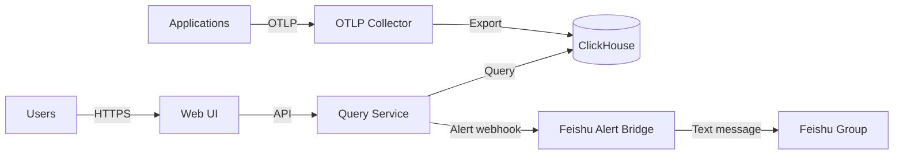

# 可观测性 SSOT

> **SSOT Key**: `ops.obs`
> **核心定义**: 定义日志、指标、链路追踪的统一采集与展示。

---

## 1. 真理来源 (The Source)

| 维度 | 物理位置 (SSOT) | 说明 |
|------|----------------|------|
| **存储层** | [platform/03.clickhouse](../../platform/03.clickhouse/) | ClickHouse + ZooKeeper |
| **应用层** | [platform/11.signoz](../../platform/11.signoz/) | Query Service + Frontend + OTLP Collector |
| **告警通知** | [platform/12.alerting](../../platform/12.alerting/) | SigNoz webhook → Feishu custom webhook or app bot bridge |
| **部署指南** | [Infra-007](../project/Infra-007.signoz_install.md) | SigNoz 安装项目 |

---

## 2. 架构模型

### 2.1 组件架构


```mermaid
graph LR
    Apps[Applications] -->|OTLP| Collector[OTLP Collector]
    Collector -->|Export| ClickHouse[(ClickHouse)]
    QueryService[Query Service] -->|Query| ClickHouse
    Frontend[Web UI] -->|API| QueryService
    QueryService -->|Alert webhook| Alerting[Feishu Alert Bridge]
    Alerting -->|Text message| Feishu[Feishu Group]
    Users[Users] -->|HTTPS| Frontend
```

### 2.2 部署结构

| 组件 | 位置 | 端口 | 用途 |
|------|------|------|------|
| **ClickHouse** | platform/03.clickhouse | 9000, 8123 (内部) | 时序数据存储 |
| **ZooKeeper** | platform/03.clickhouse | 2181 (内部) | 集群协调 |
| **OTLP Collector** | platform/11.signoz | 4317, 4318（内部） | 数据采集 |
| **Query Service** | platform/11.signoz | 8080 (内部) | 查询引擎 |
| **Frontend** | platform/11.signoz | 3301 (Traefik) | Web 界面 |
| **Alert Bridge** | platform/12.alerting | 8080 (内部) | SigNoz 告警转飞书消息 |

### 2.3 数据流

1. **采集**: 应用通过 OTLP SDK 发送 traces/metrics/logs → OTLP Collector (4317/4318, Docker 网络内)
2. **存储**: OTLP Collector 处理并导出 → ClickHouse
3. **查询**: Frontend → Query Service → ClickHouse
4. **展示**: 用户访问 `https://signoz${ENV_DOMAIN_SUFFIX}.${INTERNAL_DOMAIN}` → Frontend
5. **告警**: SigNoz Alertmanager webhook → `platform-alerting${ENV_SUFFIX}` → Feishu custom webhook or app bot

---

## 3. 设计约束 (Dos & Don'ts)

### ✅ 推荐模式 (Whitelist)

- **模式 A**: 应用使用 OpenTelemetry SDK 进行自动/手动埋点。
- **模式 B**: 日志默认结构化输出（JSON），便于解析。
- **模式 C**: 敏感数据在发送前脱敏（密码、Token、PII）。
- **模式 D**: 使用 OTLP 协议（gRPC 或 HTTP）统一采集。

### ⛔ 禁止模式 (Blacklist)

- **反模式 A**: **禁止** 在日志/trace 中输出原始敏感信息。
- **反模式 B**: **禁止** 使用私有/非标准协议发送遥测数据。
- **反模式 C**: **禁止** 绕过 OTLP Collector 直接写入 ClickHouse。

---

## 4. 接入指南

### 4.1 应用接入 OTLP

**前置条件**:
- SigNoz 已部署并健康（`invoke signoz.status`）
- 应用部署在 `dokploy-network` Docker 网络中
- OTLP 端点（所有环境）：`platform-signoz-otel-collector:4317` (gRPC) 或 `:4318` (HTTP)

> **注意**: OTLP 端口仅在 Docker 网络内可访问，不对外暴露。

> **单一全局实例**: SigNoz 是 `prod_only` 的单实例（`platform/11.signoz/deploy.py`）。preview / staging / production **全部**把遥测打到上面这个**无后缀** collector，靠 `deployment.environment` 资源属性区分环境——没有 per-env collector（容器名里的 `${ENV_SUFFIX}` 只在生产部署，恒为空）。环境标识规则见 [core.environments.md](core.environments.md#telemetry-identity)。

**验证连通性**:
```bash
invoke signoz.shared.test-trace --service-name=myapp
```

**示例（Python，Docker 网络内）**:
```python
from opentelemetry import trace
from opentelemetry.sdk.trace import TracerProvider
from opentelemetry.sdk.trace.export import BatchSpanProcessor
from opentelemetry.exporter.otlp.proto.http.trace_exporter import OTLPSpanExporter
from opentelemetry.sdk.resources import Resource

resource = Resource.create({"service.name": "my-service"})
provider = TracerProvider(resource=resource)
exporter = OTLPSpanExporter(endpoint="http://platform-signoz-otel-collector:4318/v1/traces")
provider.add_span_processor(BatchSpanProcessor(exporter))
trace.set_tracer_provider(provider)

tracer = trace.get_tracer(__name__)
with tracer.start_as_current_span("my-span"):
    print("Hello SigNoz")
```

### 4.2 环境变量配置

| 变量 | 说明 | 示例 |
|------|------|------|
| `OTEL_EXPORTER_OTLP_ENDPOINT` | OTLP 端点（HTTP，所有环境无后缀） | `http://platform-signoz-otel-collector:4318` |
| `OTEL_SERVICE_NAME` | 服务名 | `finance-report-backend` |
| `OTEL_RESOURCE_ATTRIBUTES` | 资源属性（**单一变量**，逗号分隔；同时含表层别名 + 底层 commit） | `deployment.environment=production,service.version=<short commit sha>`（别名也可为 `staging` / `pr-<N>`） |

> 表层别名与底层 commit 由 infra2 在部署时签发，应用只消费。规则见 [core.environments.md](core.environments.md#telemetry-identity)。

### 4.3 finance_report 接入（BE + 浏览器 FE，Infra-014）

finance_report 同时上报**后端**与**浏览器前端**两条遥测链路，全部落到上面那个唯一共享 collector，靠 `deployment.environment` 区分环境。注入方式为 config-as-code，应用只消费、不硬编码。

**后端（Docker 网络内，OTLP HTTP）**：由 `finance_report/finance_report/10.app/secrets.ctmpl`（及 `preview/secrets.ctmpl`）按环境渲染：

| 变量 | 渲染值 | 说明 |
|------|--------|------|
| `OTEL_EXPORTER_OTLP_ENDPOINT` | `http://platform-signoz-otel-collector:4318` | 所有环境无后缀；Vault 若显式设置则覆盖（escape hatch） |
| `OTEL_SERVICE_NAME` | `finance-report-backend` | 同上可被 Vault 覆盖 |
| `OTEL_RESOURCE_ATTRIBUTES` | `deployment.environment=<alias>,service.version=<git sha>` | preview 渲染**本别名** ENV（`main`/`pr-<N>`/`commit-<sha7>`），而非密钥来源环境 |

`<git sha>` 来自 compose 注入容器的 `GIT_COMMIT_SHA`（镜像短 sha，空则 `unknown`）。

**浏览器前端（公网 OTLP ingest）**：浏览器无法访问 Docker 内部 collector，因此 FE span 只能走**唯一公网入口** `otel.${INTERNAL_DOMAIN}`（见 4.4）。在 `compose.yaml` 以运行时（非 build-time）env 注入：

| 变量 | 渲染值 |
|------|--------|
| `NEXT_PUBLIC_OTEL_EXPORTER_OTLP_ENDPOINT` | `https://otel.${INTERNAL_DOMAIN}/v1/traces` |
| `NEXT_PUBLIC_DEPLOYMENT_ENVIRONMENT` | `${ENV}`（与 BE `deployment.environment` 对齐，FE/BE span 可关联） |
| `NEXT_PUBLIC_GIT_SHA` | `${GIT_COMMIT_SHA}` |

> **Promote-not-rebuild**：FE OTLP 与 OpenPanel 配置均为运行时 env（非 `NEXT_PUBLIC` build-time 烘焙），同一镜像在各环境提升时保持环境无关。

### 4.4 公网浏览器 OTLP ingest：`otel.${INTERNAL_DOMAIN}`（Infra-014）

collector 的 4317/4318 仅 `expose` 于 Docker 网络、**永不 publish**。唯一公网面是单一 ingest 域名 `otel.${INTERNAL_DOMAIN}`，转发到 `:4318`（OTLP HTTP）。该域名是 **Dokploy 托管**的（无手写 Traefik 标签）：`SigNozDeployer` 的 `composing()` 通过额外的 `client.ensure_domains(..., service_name="otel-collector")` 调用注册它（Web UI 域名 `signoz.<domain>` → `signoz:8080` 仍由基类流程从 `subdomain="signoz"` 注册）。

公网 ingest **没有 bearer token**：浏览器无法保管秘密，下发到页面的静态 token 不构成凭据，因此 #360 的 `HeadersRegexp(Authorization, ^Bearer <token>$)` 匹配器与 Vault `otel_ingest_token` 已删除。

#### 决策记录：bearer token →（否决）→ CORS 门控（Infra-014）

> 设计变更过几次，这里固化"为什么没选 bearer"，避免后人重新踩。

| 方案 | 当初的想法 | 为什么否决 |
|---|---|---|
| **A. 静态 bearer token**（#360 初版）<br>Traefik `HeadersRegexp(Authorization, ^Bearer <token>$)` + Vault `otel_ingest_token`，每环境一个 token | 给公网 ingest 加一道"凭据"门槛，挡掉随手的滥用 | **浏览器无法保管秘密**：token 必须下发到页面 JS 才能加到 OTLP 请求头，任何人 View Source / DevTools 即可拿到 → 它不是凭据，只是"障眼法"。维护成本（每环境签发/轮换/注入 Vault token）换不来真实安全收益。 |
| **B. CORS 门控 + collector 限额**（现状，#360 follow-up `1c079c7`） | 承认"浏览器公网 ingest 本质不可鉴权"，转而**约束滥用**而非**鉴权** | 选中。CORS 把*浏览器*跨域来源限制在已知 FE 域名；`memory_limiter` 兜住打爆风险；边缘按 IP 限流为 TODO。诚实地标注为"有意为之的未鉴权公网 ingest"（见下方 ⚠️），不再用假凭据制造安全错觉。 |

> ⚠️ **CORS 不是鉴权**：CORS 只约束*浏览器*跨域读取响应的来源，**并不能**阻止非浏览器客户端（curl/脚本）直接 POST OTLP 到该端点。因此这是一个**有意为之的、未鉴权的公网 ingest**；它的滥用边界由 collector 限额与边缘限流（TODO）兜底，而非访问控制。

当前由两道**应用层**措施约束（注意：是“约束滥用”而非“鉴权”）：

1. **CORS 允许列表**：`platform/11.signoz/otel-collector-config.yaml` 的 OTLP HTTP receiver 仅对已知 report FE 域名回显 CORS，必须与 FE 域名保持同步（仅影响浏览器）。
2. **collector 限额**：pipeline 上的 `memory_limiter` 在突发下软限内存、提前拒绝数据，避免被未鉴权的公网 ingest 打爆。

> **TODO（Infra-014）**：边缘按来源 IP 限流仍待补（应通过 **Dokploy 托管**的 Traefik ratelimit 中间件实现，**禁止**手写 compose 标签）。

`otel.${INTERNAL_DOMAIN}` 落在 Cloudflare 泛域名 `*.${INTERNAL_DOMAIN} → VPS_HOST` 之内，无需新增显式 DNS 记录（见 [platform.domain.md](platform.domain.md)）。

### 4.5 查询遥测与分析数据（已发布 CLI，勿重造）

- **SigNoz logs / traces**：`invoke signoz.shared.query-logs [--service-name=finance-report-backend --limit=20]`、`invoke signoz.shared.list-services`（见 `platform/11.signoz/shared_tasks.py`）。SigNoz API key 存于 Vault `secret/platform/<env>/signoz`。
- **OpenPanel 事件分析**：app 仓库已发布查询 CLI `common/observability/openpanel_query.py`，使用 `secret/platform/<env>/openpanel/api_key`。本仓库**不重新实现**，仅引用。

### 4.6 finance_report 告警与仪表盘 config-as-code（#373）

finance_report 的 SigNoz 告警规则与仪表盘以代码形式签入
[`finance_report/finance_report/observability/`](../../finance_report/finance_report/observability/)，
不在 UI 里手动点击创建：

| 文件 | 用途 |
|------|------|
| `alert_rules.json` | OTEL 错误日志告警，含 `FinanceReportBackendErrorLogs`（app `apps/backend/src/observability.py` 引用的告警名）。 |
| `dashboard.json` | 基线仪表盘：后端错误率 + 延迟、浏览器前端 web-vitals + 异常。 |
| `shared_tasks.py` | 幂等的 apply/print invoke 任务。 |

定义为真源，下发为合流后的 apply 步骤（先按 `ops.alerting.md` SOP-004 备好
bridge / SigNoz API key / Feishu channel）：

```bash
# 应用定义（幂等）：
uv run python -m invoke fr-observability.shared.apply-alerts
uv run python -m invoke fr-observability.shared.apply-dashboard

# 离线查看 payload（不触碰 SigNoz）：
uv run python -m invoke fr-observability.shared.print-alerts
uv run python -m invoke fr-observability.shared.print-dashboard
```

`FinanceReportBackendErrorLogs` 经共享内部 bridge channel
（`infra2-feishu-alerts-<env>`）转发到 Lark/Feishu；Feishu webhook 密钥只在
1Password `platform/{env}/alerting`，部署时镜像到 Vault，SigNoz channel 仅持有内部
bridge URL（详见 [ops.alerting.md](./ops.alerting.md) SOP-004B）。仪表盘按 service.name
区分 `finance-report-backend` / `finance-report-frontend`，按 `deployment.environment`
区分环境。

---

## 5. 运维指南

### 5.1 部署顺序

```bash
# 1. 部署存储层
python -m tools.deploy_v2 --service platform/clickhouse --type prod --iac-ref vX.Y.Z --domain zitian.party --code-reviewed

# 2. 部署应用层
python -m tools.deploy_v2 --service platform/signoz --type prod --iac-ref vX.Y.Z --domain zitian.party --code-reviewed

# 3. 部署告警 bridge
python -m tools.deploy_v2 --service platform/alerting --type prod --iac-ref vX.Y.Z --domain zitian.party --code-reviewed

# 4. 验证
invoke clickhouse.status
invoke signoz.status
invoke alerting.status
```

### 5.2 数据路径

ClickHouse DATA_PATH（如 `/data/platform/clickhouse${ENV_SUFFIX}`）:

```
${DATA_PATH}/
├── data/          # 时序数据（traces, metrics, logs）
├── logs/          # ClickHouse 日志
├── user_scripts/  # 自定义函数
└── zookeeper/     # 集群元数据
```

SigNoz DATA_PATH（如 `/data/platform/signoz${ENV_SUFFIX}`）:

```
${DATA_PATH}/
└── data/          # SQLite 元数据（dashboards, alerts）
```

### 5.3 访问地址

- **Web UI**: `https://signoz${ENV_DOMAIN_SUFFIX}.${INTERNAL_DOMAIN}`
- **OTLP gRPC**: `platform-signoz-otel-collector:4317` (Docker 网络内)
- **OTLP HTTP**: `platform-signoz-otel-collector:4318` (Docker 网络内)
- **公网浏览器 OTLP ingest**: `https://otel.${INTERNAL_DOMAIN}/v1/traces` (Dokploy 托管域名；CORS + collector 限额，无 bearer，见 4.4)

### 5.4 容量规划

| 指标 | 建议值 | 说明 |
|------|--------|------|
| **ClickHouse 磁盘** | 100GB+ | 根据保留策略调整 |
| **内存** | 8GB+ | ClickHouse + SigNoz 服务 |
| **OTLP Collector 内存** | 1GB | 通过 memory_limiter 限制 |

---

## 6. 验证与测试 (The Proof)

| 行为描述 | 验证方式 | 状态 |
|----------|----------|------|
| **ClickHouse 健康** | `invoke clickhouse.status` | ✅ Implemented |
| **SigNoz 健康** | `invoke signoz.status` | ✅ Implemented |
| **Alert bridge 健康** | `invoke alerting.status` | ✅ Implemented |
| **Frontend 可访问** | `curl -I https://signoz${ENV_DOMAIN_SUFFIX}.${INTERNAL_DOMAIN}` | ✅ Implemented |
| **OTLP 端点可用** | `invoke signoz.shared.test-trace` | ✅ Implemented |
| **Feishu 告警通道可用** | `invoke alerting.test-feishu` | Manual live gate |

---

## 7. 故障排查

### 问题 1: ClickHouse 启动失败
- **检查**: `docker logs platform-clickhouse${ENV_SUFFIX}`
- **常见原因**: 权限问题（uid=101）、磁盘空间不足
- **解决**: `invoke clickhouse.pre-compose` 重新初始化

### 问题 2: OTLP 数据未显示
- **检查**: `docker logs platform-signoz-otel-collector`
- **常见原因**: ClickHouse 连接失败、数据格式错误
- **解决**: 检查 `otel-collector-config.yaml` 的 exporter 配置

### 问题 3: Frontend 502 错误
- **检查**: `docker logs platform-signoz${ENV_SUFFIX}`
- **常见原因**: Query Service 未就绪、ClickHouse 查询超时
- **解决**: 等待 query-service 健康检查通过

---

## Used by

- [docs/ssot/README.md](./README.md)
- [platform/03.clickhouse/README.md](../../platform/03.clickhouse/README.md)
- [platform/11.signoz/README.md](../../platform/11.signoz/README.md)
- [platform/12.alerting/README.md](../../platform/12.alerting/README.md)
