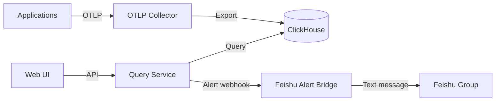

# 可观测性 SSOT (采集 · 告警 · 报告)

> **SSOT Key**: `ops.obs`
> **核心定义**: infra2 可观测性的**唯一 owner**——遥测采集(logs/metrics/traces)、**告警**(规则/分级/飞书路由)、
> **报告/可用率账本**(正向证明),以及把这三者统一起来的**时间尺度分层模型**。
>
> 收敛自原 SSOT key `ops.alerting` + `ops.availability_ledger`(已并入本文)。`watchdog-signals.yaml` 作为信号数据
> registry 保留;遥测**标识**(env identity)归 [core.environments.md](./core.environments.md#telemetry-identity)。
>
> **第一性原理(本文的脊梁)**:**告警 = 事件驱动**(真出事才发);**报告 = 时间驱动**(周期发)。
> 二者绝不混——尤其**不能周期性地发告警**。详见 §2。

---

## 1. 真理来源 (The Source)

| 维度 | 物理位置 (SSOT) | 说明 |
|------|----------------|------|
| **采集 - 存储** | [platform/03.clickhouse](../../platform/03.clickhouse/) | ClickHouse + ZooKeeper |
| **采集 - 应用** | [platform/11.signoz](../../platform/11.signoz/) | Query Service + Frontend + OTLP Collector |
| **告警 - 规则** | **SigNoz Alert Manager** + `finance_report/finance_report/observability/alert_rules.json`(config-as-code) | 告警规则 |
| **告警 - 通知** | [platform/12.alerting](../../platform/12.alerting/) | SigNoz webhook → Feishu custom bot / app bot bridge;in-band probe runner |
| **告警 - 密钥源头** | 1Password `platform/{env}/alerting` → 运行时镜像 Vault `secret/platform/{env}/alerting` | Feishu 凭据 + 可选 bridge basic auth |
| **带外 watchdog** | [`cloudflare/infra-watchdog`](../../cloudflare/infra-watchdog/)(轻量带外,边缘 30min)+ [`.github/workflows/ops-checks.yml`](https://github.com/wangzitian0/infra2/blob/main/.github/workflows/ops-checks.yml)(日级带外审计) | 只判 VPS 自己报告不了的:整机/整栈失联、告警链路自身失效;分工见 §1.1 |
| **信号清单** | [`watchdog-signals.yaml`](watchdog-signals.yaml) | 按信号(非组件)追踪 watchdog 归属 |
| **报告 - 账本** | Cloudflare KV(热 21 天)+ R2(冷长期)·`libs/availability_ledger.py`(聚合)·`tools/stability_report.py`(周报) | 正向证明 |
| **部署指南** | [Infra-007](../project/archive/Infra-007.signoz_install.md) | SigNoz 安装 |

In-band 告警路径恒为:`component/app → OTLP Collector → SigNoz → platform/12.alerting → Feishu/Lark`。
带外检测**独立于 VPS**(SigNoz 与 bridge 都在单台机器上,会和宿主一起挂),故走 Cloudflare 边缘 cron 直发 Feishu。

> [!WARNING]
> **单机共因失效与带外最高仲裁原则**：由于 SigNoz、ClickHouse、OTel Collector 与业务组件均单机共存，当宿主机遭遇物理死锁、网卡断联、磁盘打满时，带内监控将整体静默，监控大屏会虚假呈现“0 告警发生”。系统健康最高仲裁权由独立于 VPS 的带外通道持有（Cloudflare Worker 边缘 watchdog + 外部死人开关心跳），带外失联即刻升级为 P0 级整机灾难告警。

Cloudflare Worker watchdog 的定时执行也由外部 Healthchecks.io 独立监控：每次
30 分钟 cron 完成后 ping 成功；执行异常则发送 `/fail`，任务根本未启动则停止
ping。`WATCHDOG_DEADMAN_PING_URL` 是 Cloudflare Worker secret，不入库、不出日志，
其外部通知不能依赖 VPS、SigNoz、Alert Bridge 或同一个 Worker。按 30 分钟
周期设置外部检查的 grace 和通知窗口，并通过暂停 cron 的受控演练实测送达时间；
不能把宿主机一分钟心跳的 10 分钟时限套给此检查。Worker 目录合入 main 会触发
生产部署的旧工作流，因此该目录的部署工作流必须改为手动 dispatch，并校验
owner 批准的当前 head SHA，才能满足 `AGENTS.md` 的生产权限边界。
>
> **防假绿与维度下钻铁律**：所有业务指标与告警规则必须按 `(service_namespace, environment)` 维度分组计算，严禁在无标签的全局均值上计算成功率。单策略/单任务池故障时禁止被大盘平均值稀释覆盖。告警静默（Cooldown/Snooze）期必须在看板中明确标记为“已静音”而非“健康正常”。

### 1.1 分层职责与唯一报警层 (#901 / #902)

**重活在 VPS,Cloudflare 只做 VPS 自己报告不了的判定。** 容量不是问题:按这个体量,各家免费额度都绰绰有余(#901 实测
日配额用量 5–38%)。#901 审计发现的问题是**职责错位**:Worker 每次 cron 重做 VPS 已经在做的 15 条路由检查、
可用率台账与 R2 归档,单次 CPU 超过免费档 10 ms;同一故障又被 in-band、Worker、GitHub 各报一遍,三种格式三种诊断——
这正是 30 天 2,445 条飞书消息只对应 57 个不同告警对象的放大器。

| 层 | 承担 | 不承担 |
|----|------|--------|
| **VPS**(重活,主告警面) | 全部探测(内部、公网路由、容器、资源、部署队列)· 去重/防抖/聚合/分级 · 卡片渲染 · 唯一告警出口(bridge)· 可用率成功计数 · 日报 | — |
| **Cloudflare Worker**(轻、稳,带外) | 只判 VPS 自己报告不了的:VPS 心跳过期(整机/出网断)、探测循环与投递失效(心跳字段携带)、每个产品 1 个公网入口的外部可达性;直发飞书 | 路由清单、run 内 sleep 重试、台账累加、R2 归档、可用率计算、报告 |
| **GitHub Actions**(日级带外审计) | Worker 自身存活 · 备份与恢复演练 · 配置/密钥漂移 · 对等调度器 · 周报 | VPS 已在做的实时探测(降为报告行) |
| **Healthchecks.io**(可选) | 看守 Worker 的 cron(谁来看守看守者) | — |

- **每类故障只由一层报警**,其余层只能报告。"故障类别 → 报警层"的映射**只**维护在
  [`watchdog-signals.yaml`](watchdog-signals.yaml) 的 `failure_classes`;每个信号标 `failure_class`,层随 `primary_owner`
  (`self` 显式声明 `layer`)。`tools/watchdog_consistency_audit.py` 让报警层不符的信号失败,除非它在 `relayering_debt`
  里挂着清偿它的阶段 issue;已不再违规的欠账条目同样失败——欠账只能随修复一起缩短。
- **Cloudflare 预算(#904 验收)**:cron CPU p99 < 5 ms、每次运行子请求 ≤ 10、KV 只在状态变化时写(≤ 200/天),留在免费档。
  超出是设计缺陷,不是升级付费的理由。
- **可用率(目标态,#904)**:成功计数由 VPS 探针累加(重活);VPS 失联区间由 Worker 只在心跳过期/恢复两个边沿各写一次
  KV(每次事故 2 次写);二者合算可用率。VPS 无法记录自己宕机期间的状态,这部分仍必须在带外——但只记边沿,不做累加。
  §6 描述的是迁移前的现状。

---

## 2. 信号模型与时间尺度分层 (Signal model & cadence tiers)

> 统一框架。立论与 MECE 论证见 issue #425;本节是其 SSOT 落地。

**不变式**:
- **ALERT**(事件驱动)——**只在真故障时发**;cadence = `f(故障时间尺度)`。
- **REPORT**(时间驱动)——**周期性汇总**;cadence = 人的复盘节奏。
- **铁律:任何定时器发出的东西都是报告,绝不是告警。** 推论:**一份报告自身的成功送达,就是投递链路的自证**——无需单独的合成告警。

**分层(cadence = 1 / 故障时间尺度;每个 check 落且只落一档 = 它"在造成伤害前还能抓住"的最粗 cadence)**:

| 尺度 | 性质 | 干什么 | 为什么这个频率 |
|------|------|--------|----------------|
| **分钟级** | **告警** | 真 liveness / 写路径 / 公网 5xx / Vault sealed —— **分钟内伤用户的** | 用户面故障第 1 分钟就疼 → 分钟级抓 |
| **小时级** | **告警** + **带外兜底** | 慢失效:证书/token 临期(TTL 6/24h)、备份新鲜度、路由创建能力;**整机失联**(Cloudflare 边缘 30min)| 小时尺度发展;整机挂也快不过人响应 |
| **天级** | **报告** | **健康日报**(探针绿/红、今日 fire/resolve、备份新鲜度、drift/未发布增量)——**其送达即投递自证**;deploy-v2 canary | 投递配置/drift 在天尺度变;人天级复盘 |
| **月级** | **报告/演练** | **DR 全量恢复演练**(不可逆数据兜底)、凭据轮换审计、容量趋势、SLA 月度 rollup | 重、且守的东西变得慢,但必须**真跑** |

**横切不变式**:**≤小时 = 告警,≥天 = 报告;告警/报告的分界线就是"天"。**

---

## 3. 告警分级 (Severity)

| 等级 | 颜色 | 响应时效 | 定义 |
|------|------|----------|------|
| **P0 (Critical)** | 🔴 Red | 立即 (24x7) | 核心服务不可用 (Vault, SSO, DB Down) |
| **P1 (Error)** | 🟠 Orange | 30分钟 | 部分功能受损，核心链路仍通 |
| **P2 (Warning)** | 🟡 Yellow | 工作日 | 资源使用率高，非关键错误 |

**`severity` 标签 ↔ 等级**:告警等级只有这三个值——`critical` = P0,`error` = P1,`warning` = P2(`ProbeFacet` 默认 `critical`;
`info` 只出现在已恢复的推送与 CI 里禁用的 SigNoz schema canary,不是告警等级)。§5 的 Severity 列就是对应探针/规则**声明**的值,二者不一致即 SSOT 漂移。
probe runner 一次推送覆盖一组内所有失败探针,整条推送的 severity 取其中**最高**的一个(`libs/infra_probes.group_severity`;
未知值按 `critical` 计并以 `critical` 发出),每条 alert 的 label 仍是各自声明值。

---

## 4. 采集 (Collection / OTLP)

### 4.1 架构与数据流


```mermaid
graph LR
    Apps[Applications] -->|OTLP| Collector[OTLP Collector]
    Collector -->|Export| ClickHouse[(ClickHouse)]
    QueryService[Query Service] -->|Query| ClickHouse
    Frontend[Web UI] -->|API| QueryService
    QueryService -->|Alert webhook| Alerting[Feishu Alert Bridge]
    Alerting -->|Text message| Feishu[Feishu Group]
```

| 组件 | 位置 | 端口 | 用途 |
|------|------|------|------|
| **ClickHouse** | platform/03.clickhouse | 9000, 8123 (内部) | 时序数据存储 |
| **ZooKeeper** | platform/03.clickhouse | 2181 (内部) | 集群协调 |
| **OTLP Collector** | platform/11.signoz | 4317, 4318(内部) | 数据采集 |
| **Query Service** | platform/11.signoz | 8080 (内部) | 查询引擎 |
| **Frontend** | platform/11.signoz | 3301 (Traefik) | Web 界面 |
| **Alert Bridge** | platform/12.alerting | 8080 (内部) | SigNoz 告警转飞书 |

数据流:应用 OTLP → Collector(4317/4318, Docker 网络内)→ ClickHouse → Query Service → Frontend
(`https://signoz${ENV_DOMAIN_SUFFIX}.${INTERNAL_DOMAIN}`);告警 SigNoz Alertmanager webhook → `platform-alerting${ENV_SUFFIX}` → Feishu。

**采集设计约束**:OTLP SDK 埋点 · 结构化(JSON)日志 · 发送前脱敏(密码/Token/PII)· 统一 OTLP 协议。
**禁止**:日志/trace 输出原始敏感信息 · 私有协议 · 绕过 Collector 直写 ClickHouse。

### 4.2 应用接入 OTLP

前置:SigNoz 已部署健康;应用在 `dokploy-network`;端点 `platform-signoz-otel-collector:4317`(gRPC)/`:4318`(HTTP),**仅 Docker 网络内、不对外暴露**。

> **单一全局实例**:SigNoz 是 `prod_only` 单实例。preview/staging/production **全部**打到这个**无后缀** collector,靠 `deployment.environment.name` 区分环境(无 per-env collector)。标识规则见 [core.environments.md](core.environments.md#telemetry-identity)。

| 变量 | 说明 | 示例 |
|------|------|------|
| `OTEL_EXPORTER_OTLP_ENDPOINT` | OTLP HTTP 端点(所有环境无后缀) | `http://platform-signoz-otel-collector:4318` |
| `OTEL_SERVICE_NAME` | 服务名 | `finance-report-backend` |
| `OTEL_RESOURCE_ATTRIBUTES` | `ServiceIdentity` 渲染的完整资源身份 | `deployment.environment.name=production,infra.service.id=finance_report/app,service.version=<version>,infra.iac.ref=<sha>` |

> 表层别名与底层 commit 由 infra2 部署时签发,应用只消费、对缺失 fast-fail。

### 4.3 finance_report 接入(BE + 浏览器 FE,Infra-014)

后端(Docker 网络内 OTLP HTTP)由 `10.app/secrets.ctmpl` / `preview/secrets.ctmpl` 按环境渲染
`OTEL_EXPORTER_OTLP_ENDPOINT` / `OTEL_SERVICE_NAME=finance-report-backend` / 由部署入口签发的 `OTEL_RESOURCE_ATTRIBUTES`。Vault template 只转交进程环境；不得从 Vault secret 覆盖服务、环境、版本或 IaC 身份。迁移期 payload 同时含 `deployment.environment.name=<alias>` 与旧 `deployment.environment=<alias>`。

浏览器前端走**唯一公网 ingest** `otel.${INTERNAL_DOMAIN}`(§4.4),运行时(非 build-time)env 注入
`NEXT_PUBLIC_OTEL_EXPORTER_OTLP_ENDPOINT=https://otel.${INTERNAL_DOMAIN}/v1/traces`、`NEXT_PUBLIC_DEPLOYMENT_ENVIRONMENT=${ENV}`、`NEXT_PUBLIC_GIT_SHA=${GIT_COMMIT_SHA}`(promote-not-rebuild:同一镜像跨环境提升保持环境无关)。

### 4.4 公网浏览器 OTLP ingest:`otel.${INTERNAL_DOMAIN}`(Infra-014)

collector 4317/4318 仅 `expose` 于 Docker 网络、**永不 publish**。唯一公网面是 **Dokploy 托管**域名 `otel.${INTERNAL_DOMAIN}` → `:4318`(`SigNozDeployer.composing()` 通过 `ensure_domains(..., service_name="otel-collector")` 注册,无手写 Traefik 标签)。

**没有 bearer token**:浏览器无法保管秘密,下发到页面的静态 token 不是凭据。决策记录:

| 方案 | 想法 | 为何否决 |
|---|---|---|
| **A. 静态 bearer**(#360 初版) | 给公网 ingest 加"凭据"门槛 | 浏览器无法保密;token 进 JS 即被 DevTools 拿到 → 假凭据、只是障眼法 |
| **B. CORS 门控 + collector 限额**(现状) | 承认公网 ingest 本质不可鉴权,**约束滥用**而非鉴权 | 选中 |

> ⚠️ **CORS 不是鉴权**:它只约束*浏览器*跨域,挡不住 curl/脚本直接 POST。这是**有意为之的未鉴权公网 ingest**,靠 collector `memory_limiter` 限额 + 边缘按 IP 限流(TODO,须 Dokploy 托管 Traefik ratelimit,禁手写标签)兜底。CORS 允许列表在 `otel-collector-config.yaml`,须与 FE 域名同步。`otel.${INTERNAL_DOMAIN}` 在泛域名内,无需新增 DNS。

### 4.5 查询 + synthetic round-trip(分钟级,采集自证)

- **查询(勿重造)**:SigNoz `invoke signoz.shared.query-logs` / `list-services`(key 在 Vault `secret/platform/<env>/signoz`);OpenPanel 查询 CLI 在 app 仓库 `common/observability/openpanel_query.py`(本仓库只引用)。
- **synthetic round-trip**(`infra-probe-runner`,写读探针节流):
  - `signoz-roundtrip`:每 5min 写一条 OTLP log,再从 `signoz_logs.distributed_logs_v2` 按 nonce 查回 → 证 collector→ClickHouse ingest/storage 可用。
  - `openpanel-roundtrip`:每 5min 向 OpenPanel `/track` 写,再从 `openpanel.events` 查回 → 证 API→worker/storage 可用。
  - 窗口由 `OBS_ROUNDTRIP_INTERVAL_SECONDS` / `OBS_ROUNDTRIP_QUERY_WAIT_SECONDS` 控制;成功后节流 5min,失败的 round-trip 在 runner 的每一轮(60s)重跑。
  - **声明的 severity 按"失败是否丢数据"定**(§3/§5):`signoz-roundtrip` = `critical`(P0,遥测 ingest);`openpanel-roundtrip` 与它的
    cascade root `openpanel-api-http` = `error`(P1,产品分析事件)。API 挂时 round-trip 被 cascade 抑制、由 api-http 出面,
    所以 root 必须同级,否则整条 ingest 丢失反而按 P2 发。单次抖动仍不会发:runner 的 3 轮去抖 + 下面的 3 次 / 15min 升级规则(#734)照旧。
- **失败分道(#726)**:round-trip 失败有两条出口,措辞不同:
  - `InfraServiceProbeFailed`(该组正常流,按 ProbeFacet **声明的** severity):曾经成功过的探针一失败就走这里(照常 3 轮去抖);
    **从 runner 启动起从未成功过**的探针,在连续失败 ≥3 次且跨度 ≥15min(`INFRA_PROBE_NEVER_GREEN_ESCALATION_{FAILURES,SECONDS}`,
    默认 3 / 900)后也升级到这里——`/healthcheck` 为绿不代表能写入(OpenPanel 在 NOSCRIPT 期间 `/healthcheck` 一直 200,事件丢了 17h)。
  - `InfraProbeMisconfigured`(`<group>:misconfigured`,固定 warning):探针自报配置缺失(退出码 `EX_CONFIG`=78,如 OpenPanel client id
    缺失、URL 非法)**永远**留在这里,不论历史——它没测到目标;从未成功过、仍在 15min 宽限期内的失败也暂留这里,描述写明
    "has not passed since the probe runner started … becomes InfraServiceProbeFailed after …",而不是"探针坏了"。

### 4.6 finance_report 告警/仪表盘 config-as-code(#373)

定义签入 `finance_report/finance_report/observability/`(`alert_rules.json` 含 `FinanceReportBackendErrorLogs` + RED/business 规则;`dashboard.json`;`shared_tasks.py`),**不在 UI 手点**;声明式 apply 见 SOP-004B/C 与 [ops.pipeline.md](./ops.pipeline.md)(apply 折进 tag reconcile 的目标态)。

---

## 5. 告警覆盖目录 (Alert Coverage Catalog)

> 层级编号沿用 [core.md#层级定义](./core.md#层级定义)(L1 Bootstrap / L2 Platform),`L3` 为应用层。

| Layer | Component | Signal | Severity | Status |
|------|-----------|--------|----------|--------|
| L1 Bootstrap | 1Password Connect | `/health` not active or sync not active | P0 | Live (`op-connect-http`) |
| L1 Bootstrap | Vault | sealed / unreachable / token validation fails | P0 | Live probe + vault audit |
| L1 Bootstrap | IaC Runner | `/health` fails before deploy webhook | P1 | Live (`iac-runner-http`) |
| L1 Bootstrap | Dokploy | deployment control-plane API/UI unreachable or deploy webhooks fail; app health alerts remain app-owned | P1 | Live probe |
| Cross-cutting | Docker container health | any container `unhealthy`/`starting`/`Restarting` outside a deploy window | P0/P1 | Out-of-band watchdog SSH |
| L2 Platform | platform Postgres | TCP readiness fails / restart loop | P0 | Live probe |
| L2 Platform | platform Redis | TCP readiness fails / restart loop | P1 | Live probe |
| L2 Platform | ClickHouse | data dir unwritable / ingestion broken | P0 | Write-path healthcheck + `signoz-roundtrip` |
| L2 Platform | MinIO | live endpoint unavailable | P1 | Live probe |
| L2 Platform | Authentik | health endpoint fails | P0 | Live probe |
| L2 Platform | SigNoz | frontend/query fails or synthetic OTLP nonce cannot be queried back | P0 | `signoz-internal-http`, `otel-collector-http`, `signoz-roundtrip` |
| L2 Platform | Alert Bridge | `/health` fails / Feishu unreachable | P0 | `alert-bridge-http`, `lark-delivery-http` + out-of-band bridge health |
| L2 Platform | OpenPanel API | `/healthcheck` fails or synthetic `/track` nonce not queryable | P1 | `openpanel-api-http`, `openpanel-roundtrip` |
| L2 Platform | OpenPanel ClickHouse (op-ch) | data dir unwritable / event store broken | P1 | Write-path healthcheck + `openpanel-roundtrip` |
| L2 Platform | OpenPanel Worker / Dashboard | `/healthcheck` / `/api/healthcheck` fails | P2 / P2 | Live probes (`openpanel-worker-http`, `openpanel-dashboard-http`);worker 停止落库时由 `openpanel-roundtrip` 以 P1 发 |
| L2 Platform | Portal / Prefect | frontend / server-health unavailable | P2 / P1 | Planned |
| L3 Finance Report | fr-postgres / fr-redis | app db / cache health fails | P0 / P1 | Planned |
| L3 Finance Report | fr-app backend | OTEL ERROR/FATAL > 0 over 5m | P1 | code (`FinanceReportBackendErrorLogs`) |
| L3 Finance Report | fr-app backend | RED SLO: 5xx > 5% 5m / p95 > 1500ms | P0/P1 | code (`FinanceReportHigh5xxRate`, `FinanceReportP95LatencyHigh`) |
| L3 Finance Report | fr-app backend | business anomaly: parse spike / reconciliation / rate-limit / async failure | P1/P2 | code (`FinanceReport{StatementParseFailureSpike,ReconciliationAnomaly,RateLimitSaturation,AsyncTaskFailures}`) |
| L3 Finance Report | fr-app public route | `report[-staging].zitian.party/` (web) or `/api/health` from Cloudflare | P0 prod / P1 staging | Cloudflare out-of-band watchdog |
| Cross-cutting | Vault app tokens / rendered env | missing / malformed / invalid / low-TTL / `<no value>` | P0/P1 | Docker healthcheck + `vault-audit.self-refresh` |
| Cross-cutting | Backup freshness | latest off-host backup missing/stale/empty/no-checksum | P1 | backup manifest verifier |
| Cross-cutting | Infra2 host reachability / probe heartbeat | public endpoints fail / probe runner stops heartbeat | P0/P1 | Cloudflare out-of-band watchdog |
| Cross-cutting | SSH host diagnostics | external SSH bridge health fails | P0 | GitHub fallback watchdog |
| Cross-cutting | Deploy queue | 部署卡在 `running` 超过 ceiling(默认 30min;单并发 FIFO 会阻塞所有后续部署) | P0 | Live (`DeployQueueStuck`,probe-runner 常驻进程内的 ResidentWatcher 插件 `libs/deploy_queue_guard.py`,#543 单 sidecar 合并;观测默认开,`DEPLOY_GUARD_REMEDIATE=1` 才 opt-in 走 Dokploy API kill/clean + 复查升级,绝不直接动 Redis/BullMQ) |

**设计约束**:告警含 actionable runbook 链接 · 聚合避免风暴 · Feishu 凭据只在 1Password(Vault 仅运行时镜像)· SigNoz webhook 只指向内部 bridge URL。
**禁止**:为瞬时波动指标设 P0 · 忽略 Critical · SigNoz webhook 直指飞书自定义机器人。

### 5.1 健康检查接口规范与 Anti-Puppet 铁律 (Liveness & Readiness SSOT)

为杜绝组件假绿（GREEN-WHILE-EMPTY / 吞异常返回 200），所有接入 infra2 的应用服务统一遵循分级探针协议：

1. **`/livez`（存活探针 - Liveness）**：
   - 目标：检测容器进程与核心事件循环是否存活。
   - 判据：进程无死锁即返回 HTTP 200。**严禁在 `/livez` 内部检查外部下游依赖（如远程数据库或外部 API）**，防止外部故障引发容器级联驱逐与无限重启风暴。

2. **`/readyz`（就绪探针 - Readiness）**：
   - 目标：检测服务是否具备对外处理流量的完整业务能力。
   - 判据：检查本服务必需的核心运行时依赖（Postgres 连接握手、Redis 可写、S3 连通、本地配置加载完成）。
   - **失败即阻断**：任一必需依赖不可达时，**必须返回 HTTP 503 (Service Unavailable)**，并在响应体 JSON 中明确列出未就绪的具体原因。**严禁使用 `try...except pass` 吞咽异常并假装 200 返回**。

3. **`/health`（向后兼容聚合探针）**：
   - 响应格式必须为结构化 JSON：`{"status": "healthy"|"degraded"|"unhealthy", "checks": {...}}`。
   - 当关键依赖挂掉时，HTTP 状态码必须对齐整体健康状态（非 200），供上层 Ingress / Load Balancer 安全切断流量。

4. **探针级联依赖抑制 (`depends_on`)**：
   - 当上游服务（如 Web/LLM）依赖下游基础组件（如 Postgres/Redis）时，上游探针在 `ProbeFacet` 中必须显式声明 `depends_on="<下游探针名>"`。
   - 当下游基础组件挂掉引发告警时，探针引擎自动抑制上游级联失效探针，只向值班人员投递根因告警，从物理层消除告警风暴。

---

## 6. 报告与可用率账本 (Reporting & Availability Ledger)

> 故障流告警**证明不了"它一直是好的"**。账本是闭环的正向一半:**成功也记,且绝不能把降级信号报成健康**。

- **为何外置(KV/R2 而非 SigNoz)**:SigNoz 与 bridge 都在单台 VPS,**度量不了自己宿主的可用率**。账本必须活在比被测对象更可靠的层(Cloudflare)。**#904 将按 §1.1 拆分**:累加迁回 VPS,带外只记失联边沿。
- **记账**:`worker.js` `recordLedger` 每次 cron 把各信号 ok/fail 累加进**当日一个聚合 rollup**(绝不一信号一键,否则击穿 KV 免费写配额→静默假死);跨天结算的昨日写入 R2(S3 标准、静态凭据、与备份同后端、Worker 原生 binding,无需第二套同步)。
- **热 21 天 KV `ledger:YYYY-MM-DD`** 供 `/ledger`/`/status`/周报;**冷长期 R2 `watchdog-ledger/YYYY-MM-DD.json`**。
- **聚合/算 uptime** 只在 `libs/availability_ledger.py`(纯函数,CLI 与测试共用);R2/KV 缺失时**安全降级 no-op**,部署不挂。
- **周报**:`tools/stability_report.py`(弱 CLI)读 `/ledger` → Lark 正向证明,需 `INFRA2_WATCHDOG_LEDGER_URL`。
- **禁止**:per-signal-per-run 建 KV 键 · 把 `fail>0` 计入 100%/perfect · 信任畸形 day/signal 抬高可用率。

> **天级日报(目标态,#425 T3)**:统一健康日报(探针绿/红、今日 fire/resolve、备份新鲜度、drift)发 Feishu,**其送达即投递自证**;"投递真断了"的硬信号留给独立带外 watchdog。6h 合成 `alert-delivery-canary` 已退役(它把投递自证做成了周期性告警);当前 bridge→Feishu 路径由 `lark-delivery-http`(配置有效 + Feishu 可达,不真发)、带外 watchdog 的 bridge `/health`、日报自身投递、以及真实告警共同覆盖。

---

## 7. 标准操作程序 (Playbooks)

### SOP-001: 响应 P0 告警
确认影响范围 → 按 [Infra-022 五类 P0 Runbook](../runbooks/infra022-p0.md)
30 秒定位（磁盘满、部署失败、容器 kill、Schema 分叉、Watchdog 报死）→
基础设施故障参考 [Recovery SSOT](./ops.recovery.md) → 状态页更新 Incident。
Runbook 入库仅交付操作路径；#723 要求的一次现场演练、完整告警分级与路由、
低流量 Canary 防误报及行动率 KPI 仍须单独验收。

### SOP-002: 接入飞书自定义机器人通道
1. 飞书群建自定义机器人,复制 webhook URL。
2. 写 1Password root vars + setup-approle:
   ```bash
   uv run invoke env.set FEISHU_WEBHOOK_URL=https://open.feishu.cn/open-apis/bot/v2/hook/<token> --project=platform --env=production --service=alerting --credential-type=root_vars
   uv run invoke vault.setup-approle --project=platform --service=alerting
   ```
3. 部署 bridge:`uv run python -m tools.deploy_v2 --service platform/alerting --type prod --iac-ref vX.Y.Z --domain zitian.party --code-reviewed` → `invoke alerting.status`。
4. 建 SigNoz channel:`invoke signoz.shared.create-api-key` → `invoke alerting.create-signoz-channel`。
5. 测试:`invoke alerting.test-feishu --message="Infra2 alert test"`。

### SOP-003: 接入飞书 App Bot 通道
开放平台启用机器人 + 发布 `im:message` 权限 + 拿 `chat_id`,写 1Password root vars(`ALERT_DELIVERY_MODE=feishu_app`、`FEISHU_APP_ID`、`FEISHU_APP_SECRET`、`FEISHU_CHAT_ID`)→ setup-approle → deploy_v2 → `alerting.test-feishu`。

### SOP-004 / SOP-004B / SOP-004C: 应用 OTEL 错误告警 + finance_report 告警目录 config-as-code(#373 / #1106)
1. bridge 健康 + SigNoz API key + Feishu channel(SOP-002/004 步骤)。
2. 应用定义(幂等):
   ```bash
   uv run python -m invoke fr-observability.shared.apply-alerts
   uv run python -m invoke fr-observability.shared.apply-dashboard
   uv run python -m invoke fr-observability.shared.print-alerts   # 离线看 payload
   ```
3. **#1106 SLO/business 目录**:`FinanceReportHigh5xxRate`(5xx>5% 5m,P0)、`FinanceReportP95LatencyHigh`(p95>1500ms,P1)、`FinanceReportStatementParseFailureSpike`、`FinanceReportReconciliationAnomaly`、`FinanceReportRateLimitSaturation`(P2)、`FinanceReportAsyncTaskFailures`。须渲染为 SigNoz v5 PromQL(`alertType=METRIC_BASED_ALERT`, `ruleType=promql_rule`, `condition.compositeQuery.queries[]`);SigNoz 拒任一规则即 fail 整个 apply(部分 apply 不算成功 GitOps)。
4. 先跑 schema canary:`gh workflow run apply-observability.yml --ref <ref> -f mode=canary`(建一条 disabled PromQL 规则验 v5 信封再删)。apply 应在 app 发完所有引用 metric 名后。

> **注**:`apply_alerts` 现为声明式 reconcile(upsert + 默认只 log 的 prune),见 [ops.pipeline.md](./ops.pipeline.md)。

### SOP-005: Cloudflare 带外 watchdog(轻量带外,边缘 30min;#904 瘦身中)
活在 [`cloudflare/infra-watchdog`](../../cloudflare/infra-watchdog/),**直发 Feishu**(不经它要验证的 bridge)。归属按信号记于 [`watchdog-signals.yaml`](watchdog-signals.yaml)。默认覆盖:prod 公网路由 `cloud/vault/minio/sso/signoz` + report web/api;staging 选定路由;prod/staging probe-runner heartbeat 新鲜度。每个 target 携带 registry 校验的 `service_id`;结构化事件写 `identity_schema=v1` / `managed_by=infra2`,dedupe keys on **stable failure identity plus failure domain**，具体 fingerprint 使用 `(environment, service_id, signal, failure_domain)`。config-preflight 失败单独报(不冒充路由故障);投递失败发 `watchdog.delivery.failure` 结构化事件不静默。
- secrets:webhook 模式 `FEISHU_WEBHOOK_URL`;app 模式 `FEISHU_APP_SECRET`;两者 `HEARTBEAT_TOKEN`、`WATCHDOG_STATUS_TOKEN`(源 1Password `Infra2/bootstrap/cloudflare-worker`)。
- KV `WATCHDOG_STATE`;vars `WATCHDOG_ENVIRONMENTS=production,staging`、`WATCHDOG_RENOTIFY_SECONDS=7200` 等。
- 部署:首次 `cd cloudflare/infra-watchdog && wrangler kv namespace create WATCHDOG_STATE && wrangler secret put ... && wrangler deploy`;之后由 `deploy-cloudflare-watchdog.yml` **手动 dispatch** 部署,输入必须是 owner 批准的 main 精确 head SHA(`approved_sha`);合流本身不部署。再配 probe runner heartbeat:`env.set INFRA_PROBE_HEARTBEAT_URL=.../heartbeat` + `INFRA_PROBE_HEARTBEAT_TOKEN`(prod+staging)→ deploy_v2。
- **KV 写预算**(免费档全账号 1000 put/天;耗尽后心跳 put 全失败、记录冻结 → 假 stale 告警):心跳 verdict 每 `WATCHDOG_HEARTBEAT_MIN_WRITE_INTERVAL_SECONDS`(900)刷新一次;verdict 变化提前写,每 key 每 UTC 日至多 `WATCHDOG_HEARTBEAT_STATUS_CHANGE_WRITES_PER_DAY`(24)次;runner 的 liveness ping(`liveness: true`)**不得改写** verdict;只存 `WATCHDOG_HEARTBEATS_JSON` 里的 key。最坏 `2×(96+24)+48×3=384/天`(38%)。事故先例:2026-09-15/16 liveness `ok=true` 与失败 verdict 每轮交替、每次交替都写 → 1198 / 1157 put/天。证明:`libs/tests/test_cloudflare_watchdog_kv_budget.py`(node 回放整日流量);每日 `tools/secrets_reconcile.py` 报告 `cloudflare.kv.write` 近 7 日 + 今日趋势。

### SOP-005B: GitHub 兜底带外 watchdog(日级)
活在 GitHub Actions(在 infra2 宿主之外),**日级**直发 Feishu;留作 SSH 宿主诊断、Cloudflare Worker 自检、Dokploy 控制面状态消费、手动诊断。secrets:`INFRA2_WATCHDOG_SSH_{HOST,USER,PRIVATE_KEY}`、`INFRA2_WATCHDOG_WORKER_STATUS_TOKEN`、`DOKPLOY_API_KEY` + Feishu 投递 secrets。默认查:公网 Dokploy 入口、Worker `/health`+`/status`、SSH 可达、Docker daemon、`platform-alerting` 容器内 `/health`。`infra2-docker-health` 检查**强制**(任何 `unhealthy`/`starting`/`Restarting` 容器在部署窗口外即失败),不可移除。投递异常时发 `watchdog.delivery.failure` + 开 GitHub fallback issue(label `watchdog-alert-fallback`)+ 非零退出。
- **Issue 留痕(truealpha#876 W4)**:Feishu 之外(不替代),job 末步 `tools/watchdog_issue_trail.py` 为**每个红检查**维护一个 issue,标题**精确等于** `ops-checks watchdog is red: <check>`(label `incident`):红 → 已开则评论最早那条、否则新建;允许关闭的绿运行 → 评论并关闭同名 issue。各步把结论追加到 `INFRA2_WATCHDOG_VERDICTS_PATH`(`out-of-band-watchdog`、`iac-runner-health` 两个来源);**某来源没记录 = 该来源自身为红**(崩溃不等于安静)。`dokploy-status:*` 只在红时出现,状态查询成功即视整族已读,缺席的单元为绿。列表失败**绝不**转为新建(警告,下次重试);列表成功后写失败 → 退出 1。issue 正文进公开仓库:去除 job 密钥型环境变量的值与 IP。模式(`libs/observability/issue_trail.py::issue_trail_mode` 与兼容垫片 `libs/watchdog_issue_trail.py`):schedule 或 main 上的普通 dispatch = 开/评/关;带 drill 上限或非 main 分支的 dispatch = 只开/评、永不关闭;`dry_run` 或 `ssh_targets_override` = 不写。权限:`issues: write` 只授予 watchdog job(digest job 为 `issues: read`),不在 workflow 级(deploy-v2-canary 会跑同仓 PR 代码)。
- **对等存活(truealpha#876 W5)**:`truealpha-scheduler-liveness` 检查 truealpha 的 `scheduler-liveness` workflow(它看护全 estate 的定时 workflow,却无法报告自己的调度器死亡)。红:非 `active`;最新**已起 job** 的 schedule run(`created_at`,`startup_failure`/排队不算)早于上限;从未按 schedule 运行且文件在默认分支最后变更早于上限;cron 无法测量;任何依赖的读取失败(不可验证即红,重试一次)。上限按 truealpha 同一规则**从其 cron 测量**:2×最大间隔 + 1h(`41 */6 * * *` → 13h)。最新 tick 取两个见证(`?event=schedule` 与未过滤列表)中较新者。GitHub 平面为日级,故发现延迟 ≤ 上限 + 24h。演练:`workflow_dispatch` `task=out-of-band-watchdog` + `peer_liveness_bound_cap_hours=0`(上限只能收紧)→ Feishu page + issue 开/评,且该运行不会关闭 issue;下一次定时运行(或 main 上的普通 dispatch)以实测上限变绿并关闭。
> **已知外部极限**:若 watchdog 与 Feishu/Lark 用的所有外部通道**同时**不可用,本仓库**没有第三条独立人工通知通道**(#425 月级/兜底范畴)。

### SOP-006: In-band 服务探针(分钟级)
`INFRA_PROBE_SPECS` 由各服务 `deploy.py` Deployer 的 `ProbeFacet` 声明渲染(#541 单一声明点:聚合器 `libs/probe_specs.py::render_probe_spec_text()` 经 `AlertingDeployer.compose_env_base()` 注入 Dokploy env;迁移前的手写 literal 冻结为 `libs/tests/fixtures/infra_probe_specs_frozen.txt`,由 `libs/tests/test_probe_specs_equivalence.py` 做永久逐字段等价回归)。循环 `INFRA_PROBE_INTERVAL_SECONDS=60`(快检);通知分离:`FAILURE_THRESHOLD=3`、`RECOVERY_THRESHOLD=2`、`RENOTIFY_SECONDS=1800`。优先 Docker 网络目标(公网路由归 Cloudflare watchdog;`error code: 1010` 归类 `probe-client-blocked`)。spec 格式 `name|kind|target|expected|severity|timeout|depends_on|service_id`;kind=http/tcp/command。第八字段强制绑定 registry。`depends_on` 链命中失败 root → 级联抑制(环路 fail-closed,见 `tools/infra_probe_runner.py`)。dry-run:`INFRA_PROBE_DRY_RUN=1 uv run python tools/infra_probe_runner.py --once --json`。

**公网路由探针(#543,反转 #209)**:`PUBLIC_ROUTE_PROBE_SPECS` 由各服务的 `PublicRouteFacet` 声明渲染(`libs/probe_specs.py::render_public_route_spec_text`,域名渲染期解析、无 `$` 传输);prod_only 服务只渲染生产、非生产一律降为 warning。每个渲染出的 `*-public-route` 名字必须是已注册 signal(`libs/tests/test_infra_probes.py` 锁定)。

**内部 signal 注册派生(#543)**:`watchdog-signals.yaml` 的 `primary_owner: internal` 条目不再手写,由 `libs/watchdog_signal_entries.py` 从 ProbeFacet+SignalFacet 派生(声明探针即注册 signal);`watchdog_consistency_audit.py` 加载时合并派生条目、拒绝手写 internal 条目,并对派生条目强制 #425 T5 tier/type/debounce 校验;跨平面条目(cloudflare/github/self/excluded)仍手写。手写时代的 39 条冻结于 `libs/tests/fixtures/watchdog_internal_signals_frozen.yaml`,`libs/tests/test_watchdog_signal_entries.py` 做永久逐字段等价回归。

**常驻拓扑(#543 单 sidecar)**:probe-runner(`platform-alerting-probes`)是仓库唯一常驻进程;container-breakdown watch 与 deploy-queue guard 以 `ResidentWatcher` 插件(`libs/observability/watchers/` 与 `libs/resident_watchers.py`)在其循环内自节奏运行,故障隔离、由 runner 的 healthcheck/heartbeat 兜底(挂起 watcher → state file 过期 → compose healthcheck 重启)。新增常驻能力 = 新增 watcher 插件,不新建 sidecar。
> ✅ **`alert-delivery-canary` 已退役(#425 T3)**:它把"投递自证"做成了 6h 周期性告警(报告当告警),是 #425 禁止的反模式。bridge→Feishu 路径现由 `lark-delivery-http` + 带外 watchdog 的 bridge `/health` + 日报投递 + 真实告警覆盖,告警频道不再被合成事件刷屏。

### SOP-007: Dokploy route canary(已退役,#543)
> ✅ **已退役**:每小时部署合成 compose 的 route canary(`tools/dokploy_route_canary.py` + `libs/dokploy_route_canary.py`,约 1000 行)整体删除,不设观察期。其原有覆盖由更便宜的常驻机制承接:公网路由可达性 → `PublicRouteFacet` 声明渲染进 probe runner(SOP-006)+ Cloudflare watchdog;Dokploy 控制面/部署状态 → 带外 watchdog 的 `run_dokploy_status_check`(缺 `DOKPLOY_API_KEY` fail-closed 归类 `configuration`,签名由 canary 移交);部署卡死 → deploy-queue guard(常驻 sidecar 插件)。真实 preview 路由回归由 app PR preview 流程自身承担。

### SOP-007B: deploy_v2 Canary(日级/变更触发)
`tools/deploy_v2_canary.py` 只使用保留的 `pr-999` 预览位，健康检查后必须清理 stack 与临时 DB。
成功保持静默，仅在 GitHub summary 输出 `infra2-sdk v1.0.0` `StageResult`；非 PR 失败才经带外
Feishu page，且告警携带同一结构化记录。不得通过破坏 production 数据或恢复周期性
`alert-delivery-canary` 来制造失败；Feishu 正向投递仍由日报送达自证。

### SOP-008: 账本冷归档 + 周报
- R2:确认桶 `infra2` + `wrangler.toml` `[[r2_buckets]] binding=LEDGER_BUCKET` → `wrangler deploy`;跨天后 R2 `watchdog-ledger/` 出现昨日 JSON。
- 周报:`ops-checks.yml`(周一 UTC)跑 `stability_report.py` 读 `/ledger` → Lark;本地 `INFRA2_STABILITY_REPORT_DRY_RUN=1 python tools/stability_report.py --input ledger.json`。

---

## 8. 部署与容量

部署顺序:存储(clickhouse)→ 应用(signoz)→ 告警(alerting),各 `deploy_v2 --service ... --type prod --iac-ref vX.Y.Z --code-reviewed`,`invoke {clickhouse,signoz,alerting}.status` 验证。容量:ClickHouse 磁盘 100GB+ / 内存 8GB+ / Collector 1GB(`memory_limiter`)。alert bridge 启动等 `/secrets/.env` 最多 300s,但**不得**要求 vault-agent sidecar 在渲染后保持 Docker-healthy(stale-secret 是另一条服务级信号,不阻塞告警投递)。

---

## 9. 验证与测试 (The Proof)

| 行为 | 测试锚点 | 状态 |
|------|----------|------|
| 采集:ClickHouse/SigNoz/bridge 健康 + OTLP 可用 | `invoke {clickhouse,signoz,alerting}.status`、`signoz.shared.test-trace` | ✅ |
| Feishu payload + 日志错误规则 payload | `libs/tests/test_alerting.py` | ✅ |
| finance_report 告警/看板 config-as-code(#373) | `libs/tests/test_observability_dashboards.py` | ✅ |
| Cloudflare / out-of-band / GitHub 兜底 watchdog 契约 | `test_cloudflare_watchdog.py`, `test_out_of_band_watchdog.py` | ✅ |
| GitHub watchdog issue 留痕(精确标题去重、列表失败不新建、drill 不关闭、缺失来源即红、公开正文脱敏)(truealpha#876) | `libs/tests/test_watchdog_issue_trail.py` | ✅ |
| truealpha scheduler-liveness 对等存活(上限实测且强制、非 active 红、读取失败红、从未运行的宽限)(truealpha#876) | `libs/tests/test_scheduler_peer_liveness.py`, `test_out_of_band_watchdog.py` | ✅ |
| In-band 服务探针 + 级联抑制 + round-trip 失败分道/升级(#726) | `libs/tests/test_infra_probes.py` | ✅ |
| Deploy-queue guard(卡死检测纯逻辑 + sidecar 编排:env 加载、扫描失败隔离、renotify 抑制、remediate/升级序列) | `libs/tests/test_deploy_queue.py`, `libs/tests/test_deploy_queue_guard.py` | ✅ |
| 备份新鲜度告警 payload | `libs/tests/test_backup_verification.py` | ✅ |
| 账本聚合(正例+反例:降级绝不报 100%/perfect、畸形输入不抬高、0 检查不除零) | `libs/tests/test_availability_ledger.py` | ✅ |
| Worker 账本 + `/ledger` + R2 归档 | `libs/tests/test_cloudflare_watchdog.py` | ✅ |
| 周 watchdog recall digest / 周正向稳定性报告 | `test_watchdog_weekly_digest.py`, `test_stability_report.py` | ✅ |
| Env×Stage failure-domain / disagreement 契约 | `libs/tests/test_pipeline_stage_contract.py` | ✅ |
| synthetic round-trip(配置缺失 → `EX_CONFIG`,后端失败 → 1) | `test_observability_roundtrip_probe.py` | ✅ |
| IaC/runtime/telemetry/alert 身份契约 | `tools/service_identity_audit.py`, `libs/tests/test_service_identity*.py` | ✅ |
| 告警通道手动连通 | `uv run invoke alerting.test-feishu` | Manual gate |

---

## 10. 故障排查

- **ClickHouse 启动失败**:`docker logs platform-clickhouse${ENV_SUFFIX}`;常见权限(uid=101)/磁盘 → `invoke clickhouse.pre-compose`。
- **OTLP 未显示**:`docker logs platform-signoz-otel-collector`;查 `otel-collector-config.yaml` exporter。
- **Frontend 502**:`docker logs platform-signoz${ENV_SUFFIX}`;等 query-service 健康。

---

## Used by

- [docs/ssot/README.md](./README.md)
- [docs/ssot/ops.pipeline.md](./ops.pipeline.md)(交付;告警/看板 apply 折进 tag reconcile 的目标态)
- [docs/ssot/watchdog-signals.yaml](./watchdog-signals.yaml)(信号数据 registry)
- [platform/03.clickhouse/README.md](../../platform/03.clickhouse/README.md) · [platform/11.signoz/README.md](../../platform/11.signoz/README.md) · [platform/12.alerting/README.md](../../platform/12.alerting/README.md)
