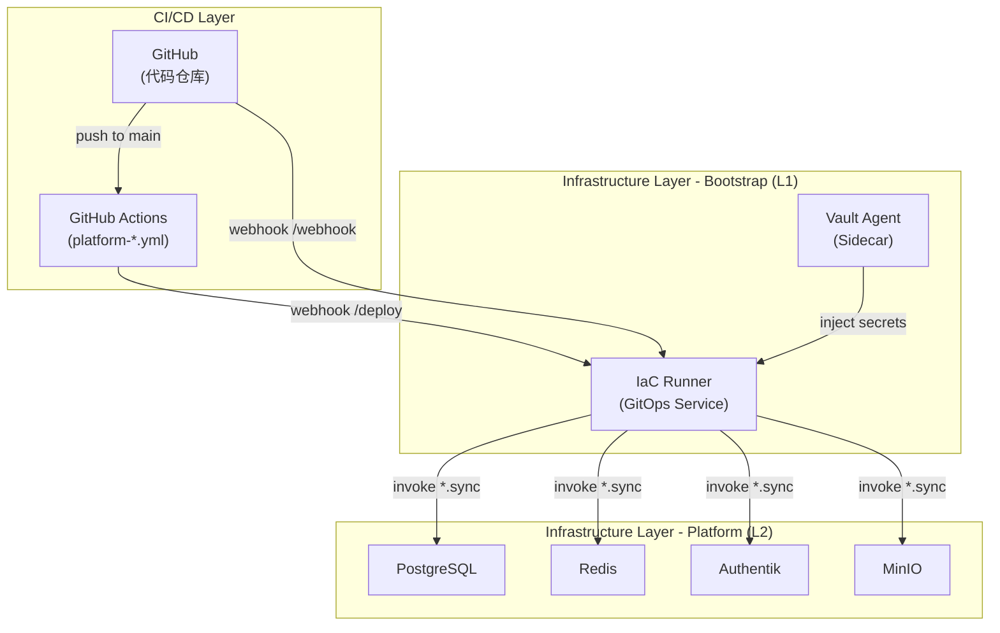

# Pipeline SSOT (运维流水线)

> **SSOT Key**: `ops.pipeline`
> **核心定义**: CI/CD 流水线，包括文档站自动构建与 GitOps 版本部署流程。

---

## 1. 真理来源 (The Source)

| 维度 | 物理位置 (SSOT) | 说明 |
|------|----------------|------|
| **Docs Workflow** | [`.github/workflows/docs-site.yml`](https://github.com/wangzitian0/infra2/blob/main/.github/workflows/docs-site.yml) | Pages 构建与发布 |
| **MkDocs 配置** | [`docs/mkdocs.yml`](../mkdocs.yml) | 站点结构与导航 |
| **依赖列表** | [`docs/requirements.txt`](../requirements.txt) | Python 依赖 |
| **Platform Staging** | [`.github/workflows/platform-staging.yml`](https://github.com/wangzitian0/infra2/blob/main/.github/workflows/platform-staging.yml) | 自动部署 staging |
| **Platform Production** | [`.github/workflows/platform-production.yml`](https://github.com/wangzitian0/infra2/blob/main/.github/workflows/platform-production.yml) | 手动部署 production |

---

## 2. 文档站流水线 (Documentation Pipeline)

### 触发条件 (Triggers)

- **PR**: 任何 `docs/**` 或 `*.md` 变更将触发构建验证。
- **Push 到 main**: 自动构建并部署到 GitHub Pages。
- **手动**: 可在 GitHub Actions 手动触发。

### 构建与发布流程 (Build & Deploy)

1. 安装依赖：`pip install -r docs/requirements.txt`
2. 构建站点：`mkdocs build --config-file docs/mkdocs.yml`
3. 发布：GitHub Pages 使用 Actions 部署产物 `.site/`

---

## 3. GitOps 版本部署流水线 (Version Deployment Pipeline)

### 架构概览

```
┌─────────────┐     platform-staging.yml    ┌──────────────┐     /deploy    ┌─────────────┐
│   GitHub    │ ────────────────────────▶  │  Tag v1.2.X  │ ──────────────▶│ IaC Runner  │
│  (main)     │                             │  (auto)      │                │  (staging)  │
└─────────────┘                             └──────────────┘                └─────────────┘
                                                                                    │
                                                                                    ▼
┌─────────────┐     platform-production.yml ┌──────────────┐     /deploy    ┌─────────────┐
│   Manual    │ ────────────────────────▶  │  Tag v1.X.0  │ ──────────────▶│ IaC Runner  │
│  (promote)  │                             │  (manual)    │                │ (production)│
└─────────────┘                             └──────────────┘                └─────────────┘
```

### 版本策略 (Versioning Strategy)

**语义化版本**: `v{major}.{minor}.{patch}`

- **Patch**: Staging 迭代 (每次 push main 自动 +1)
- **Minor**: Production 发布 (手动提升，从 staging tag promote)
- **Major**: 架构变更 (罕见，手动)

### Staging 自动部署

**触发条件**:
- Push 到 `main` 分支
- 修改了 `platform/**`, `libs/**`, 或 `bootstrap/06.iac_runner/**`

**工作流**:
1. 读取最新 tag (如 `v1.2.3`)
2. 自动递增 patch: `v1.2.4`
3. 创建 git tag
4. 调用 IaC Runner `/deploy` endpoint:
   ```json
   {
     "env": "staging",
     "tag": "v1.2.4",
     "triggered_by": "github-actions"
   }
   ```
5. IaC Runner checkout tag 并执行 `invoke {service}.sync` for all platform services

### Production 手动部署

**触发条件**:
- GitHub Actions 手动触发
- 提供 staging tag (如 `v1.2.4`) + 确认字段 `confirm="deploy"`

**工作流**:
1. 验证 staging tag 存在
2. 提取 minor version 并 +1: `v1.2.4` → `v1.3.0`
3. 创建 production tag
4. 调用 IaC Runner `/deploy` endpoint:
   ```json
   {
     "env": "production",
     "tag": "v1.3.0",
     "triggered_by": "manual-promotion"
   }
   ```
5. 创建 GitHub Release

### Hotfix 流程

从 production tag 创建 hotfix，patch +1，无需合并回 main:

```bash
# 从 production tag 创建分支
git checkout v1.3.0
git checkout -b hotfix/critical-fix

# 修复并测试
git add .
git commit -m "fix: critical issue"

# 手动创建 hotfix tag
git tag v1.3.1
git push origin v1.3.1

# 手动触发 production 部署
gh workflow run platform-production.yml \
  -f confirm="deploy" \
  -f staging_tag="v1.3.1"
```

---

## 4. IaC Runner 集成

> **详细参考**: [bootstrap.iac_runner SSOT](./bootstrap.iac_runner.md)

### 4.1 IaC Runner 架构

IaC Runner 是 **L1 Bootstrap 层**组件，负责自动化部署 **L2 Platform 层**服务。



**Vault-Agent Sidecar 模式**:
```
┌─────────────────────────────────────────────────────────────────┐
│                       IaC Runner Pod                            │
│  ┌──────────────┐    tmpfs    ┌─────────────────────────────┐   │
│  │ vault-agent  │───────────▶│     IaC Runner              │   │
│  │ (sidecar)    │ /secrets   │  - Webhook server           │   │
│  └──────────────┘            │  - Sync runner              │   │
│         │                    └─────────────────────────────┘   │
│         ▼                                                       │
│  Vault (fetch WEBHOOK_SECRET, GIT_REPO_URL)                     │
└─────────────────────────────────────────────────────────────────┘
```

### 4.2 Endpoints

| Endpoint | Method | Description |
|----------|--------|-------------|
| `/health` | GET | 健康检查 |
| `/webhook` | POST | GitHub webhook (change-based sync) |
| `/deploy` | POST | 版本部署 (GitOps) |
| `/sync` | POST | 手动同步 (legacy) |

### 4.3 版本部署请求格式

```bash
# 部署到 staging
PAYLOAD='{"env":"staging","tag":"v1.2.4","triggered_by":"github-actions"}'
SIGNATURE=$(echo -n "$PAYLOAD" | openssl dgst -sha256 -hmac "$WEBHOOK_SECRET" | awk '{print $2}')
curl -X POST https://iac.zitian.party/deploy \
  -H "Content-Type: application/json" \
  -H "X-Hub-Signature-256: sha256=$SIGNATURE" \
  -d "$PAYLOAD"

# 部署到 production
PAYLOAD='{"env":"production","tag":"v1.3.0","triggered_by":"manual-promotion"}'
SIGNATURE=$(echo -n "$PAYLOAD" | openssl dgst -sha256 -hmac "$WEBHOOK_SECRET" | awk '{print $2}')
curl -X POST https://iac.zitian.party/deploy \
  -H "Content-Type: application/json" \
  -H "X-Hub-Signature-256: sha256=$SIGNATURE" \
  -d "$PAYLOAD"
```

### 4.4 幂等性保证

每个服务的 `sync` task 使用 config hash:
1. 计算本地 `compose.yaml + env vars` 的 SHA256
2. 与 Dokploy 中存储的 `IAC_CONFIG_HASH` 比较
3. 仅在 hash 不匹配时重新部署

### 4.5 服务映射规则

| 变更路径 | 触发任务 | 说明 |
|---------|---------|------|
| `platform/01.postgres/*` | `postgres.sync` | 自动同步 PostgreSQL |
| `platform/02.redis/*` | `redis.sync` | 自动同步 Redis |
| `platform/10.authentik/*` | `authentik.sync` | 自动同步 Authentik |
| `platform/11.minio/*` | `minio.sync` | 自动同步 MinIO |
| `libs/*` | **All platform services** | 公共库变更，全量同步 |
| `bootstrap/*` | **Skipped** | 手动部署（避免循环依赖）|
| `finance_report/*` | **Skipped** | 使用 finance_report 独立 CI |
| `finance/*` | **Skipped** | 使用应用独立 CI |

**为什么 Bootstrap 不自动同步？**
- IaC Runner 本身是 Bootstrap 组件
- 自动同步会导致循环依赖（IaC Runner 重启自己）
- Bootstrap 变更频率低，手动部署更安全

---

## 5. 设计约束 (Dos & Don'ts)

### ✅ 推荐模式
- MkDocs 输入源为 `docs/` 目录（`docs_dir: .`）。
- 变更导航请更新 `docs/mkdocs.yml`。
- 所有 staging 部署必须有对应的 git tag。
- Production 部署必须从 staging tag promote。
- 使用语义化版本规范。

### ⛔ 禁止模式
- 禁止手动推送到 `gh-pages` 分支（统一由 Actions 发布）。
- 禁止直接部署 untagged commits 到 production。
- 禁止跳过 staging 直接部署到 production。
- 禁止手动修改 production 服务配置 (必须通过 GitOps)。

---

## 6. 验证与测试 (The Proof)

| 行为描述 | 验证方式 | 状态 |
|----------|----------|------|
| **文档站构建成功** | `mkdocs build --config-file docs/mkdocs.yml` | ✅ Manual |
| **Pages 发布成功** | GitHub Actions `docs-site` workflow | ✅ Manual |
| **Staging 自动部署** | Push to main → 检查 tag 创建 → 验证 IaC Runner logs | ⏳ Pending PR merge |
| **Production 手动部署** | 手动触发 workflow → 检查 tag + Release → 验证 production | ⏳ Pending PR merge |
| **Config hash 幂等性** | 相同配置重复部署应 skip | ⏳ Pending PR merge |

---

## 7. Troubleshooting

### Staging 部署失败

```bash
# 检查 GitHub Actions logs
gh run list --workflow=platform-staging.yml
gh run view <run-id> --log

# 检查 IaC Runner logs
ssh root@103.214.23.41 "docker logs iac-runner --tail 100"

# 验证 webhook secret
invoke env.get WEBHOOK_SECRET --project=bootstrap --service=iac_runner
gh secret list --repo wangzitian0/infra2 | grep IAC
```

### Production 部署失败

```bash
# 检查 workflow 输入
gh run list --workflow=platform-production.yml
gh run view <run-id> --log

# 验证 staging tag 存在
git fetch --tags
git tag -l "v*.*.*" | grep <staging-tag>

# 检查 production tag 是否创建
git tag -l "v*.*.*" | sort -V | tail -5
```

### 版本冲突

```bash
# 查看所有版本 tags
git fetch --tags
git tag -l "v*.*.*" | sort -V

# 如果 tag 冲突，删除并重新创建
git tag -d v1.2.4
git push --delete origin v1.2.4
```

---

## Used by

- [docs/ssot/README.md](./README.md)
- [docs/ssot/bootstrap.iac_runner.md](./bootstrap.iac_runner.md)
- [bootstrap/06.iac_runner/README.md](../../bootstrap/06.iac_runner/README.md)

