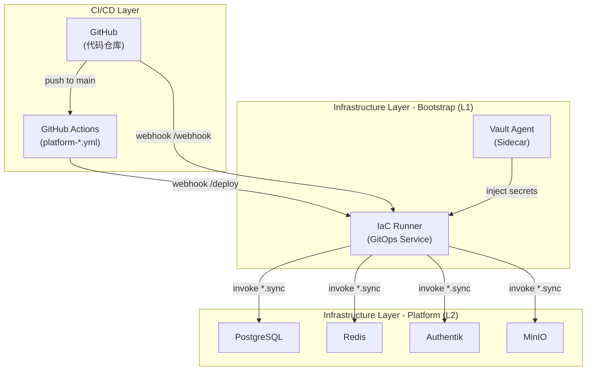

# Pipeline SSOT (运维流水线)

> **SSOT Key**: `ops.pipeline`
> **核心定义**: CI/CD 流水线，包括文档站自动构建与 GitOps 版本部署流程。

---

## 1. 真理来源 (The Source)

| 维度 | 物理位置 (SSOT) | 说明 |
|------|----------------|------|
| **Docs Workflow** | [`.github/workflows/docs-site.yml`](https://github.com/wangzitian0/infra2/blob/main/.github/workflows/docs-site.yml) | Pages 构建与发布 |
| **MkDocs 配置** | [`docs/mkdocs.yml`](../mkdocs.yml) | 站点结构与导航 |
| **依赖列表** | [`docs/requirements.txt`](../requirements.txt) | Python 依赖 |
| **IaC Runner Bootstrap** | [`.github/workflows/deploy-platform.yml`](https://github.com/wangzitian0/infra2/blob/main/.github/workflows/deploy-platform.yml) | Updates the iac_runner container itself when its bootstrap changes. |
| **IaC Input Reconcile** | [`.github/workflows/reconcile-iac-inputs.yml`](https://github.com/wangzitian0/infra2/blob/main/.github/workflows/reconcile-iac-inputs.yml) | Main-push input-drift reconcile for `iac_pinned` services via `deploy_v2 -> iac_runner`; config hash decides no-op vs restart. |
| **Deploy (deploy_v2)** | [`.github/workflows/deploy.yml`](https://github.com/wangzitian0/infra2/blob/main/.github/workflows/deploy.yml) | Manual unified deploy front door (app + platform, staging/prod, pinned ref) |
| **Auto-deploy report-branch-main** | [`.github/workflows/deploy-report-main.yml`](https://github.com/wangzitian0/infra2/blob/main/.github/workflows/deploy-report-main.yml) | The ONE auto target: main preview re-deploys on app main push |

---

## 2. 文档站流水线 (Documentation Pipeline)

### 触发条件 (Triggers)

- **PR**: 任何 `docs/**` 或 `*.md` 变更将触发构建验证。
- **Push 到 main**: 自动构建并部署到 GitHub Pages。
- **手动**: 可在 GitHub Actions 手动触发。

### 构建与发布流程 (Build & Deploy)

1. 安装依赖：`pip install -r docs/requirements.txt`
2. 构建站点：`mkdocs build --config-file docs/mkdocs.yml`
3. 发布：GitHub Pages 使用 Actions 部署产物 `.site/`

---

## 3. GitOps 版本部署流水线 (Version Deployment Pipeline)

> **触发模型**：`deploy-platform.yml` 只更新 iac_runner 自身；普通 `iac_pinned`
> 服务由 `reconcile-iac-inputs.yml` 在 `main` push 后自动做 input-drift
> reconcile。该 workflow 不打开 Dokploy native `autoDeploy`，而是把受影响服务交给
> `deploy_v2 -> iac_runner`，再由 Deployer config-hash gate 决定 no-op 还是重启。
> `deploy.yml` 仍是 operator-triggered 的手动前门。

### 架构概览

```
┌─────────────┐  changed inputs + SHA       ┌──────────────┐     /deploy    ┌─────────────┐
│   GitHub    │ ────────────────────────▶  │ deploy_v2    │ ──────────────▶│ IaC Runner  │
│  (main)     │                             │ fan-out      │                │  (staging)  │
└─────────────┘                             └──────────────┘                └─────────────┘
                                                                                    │
                                                                                    ▼
┌─────────────┐  reviewed main SHA          ┌──────────────┐     /deploy    ┌─────────────┐
│   GitHub    │ ────────────────────────▶  │ deploy_v2    │ ──────────────▶│ IaC Runner  │
│  (main)     │                             │ code-reviewed│                │ (production)│
└─────────────┘                             └──────────────┘                └─────────────┘
```

### 版本策略 (Versioning Strategy)

**语义化版本**: `v{major}.{minor}.{patch}`

- **App release tags**: app staging/prod fixed environments use reviewed release
  refs through `deploy.yml` / `deploy_v2`.
- **IaC-pinned services**: platform/backing-service artifact identity is the
  infra2 commit SHA. Main merges trigger reconcile; the config hash decides
  whether a runtime restart is required.
- **Major**: 架构变更 (罕见，手动)

### IaC input-drift reconcile

**触发条件**:
- Push 到 `main` 分支
- Modified `platform/**`, `finance_report/finance_report/**`, `libs/**`,
  `tools/**`, `common/**`, `docs/ssot/deploy-dependencies.yaml`, or
  `.github/workflows/reconcile-iac-inputs.yml`

**工作流**:
1. Checkout with full history so the workflow can diff `${{ github.event.before }}`
   to `${{ github.sha }}`.
2. Run `tools.reconcile_iac_inputs` to compute changed files and fan-out with
   `libs.deploy_dependencies.explain_fanout`.
3. Drop non-`iac_pinned` services such as `finance_report/app`, because fixed app
   deploys need an explicit app `version_ref`.
4. For selected `iac_pinned` services, call `deploy_v2` with `iac_ref=GITHUB_SHA`.
   Non-`prod_only` services reconcile staging first, then prod with
   `--code-reviewed --staging-validated`; `prod_only` services reconcile prod only.
5. iac_runner/Deployer compares local vs remote `IAC_CONFIG_HASH`; unchanged inputs
   exit as a successful no-op, changed inputs deploy and verify the effective hash.
6. The workflow writes changed files, selected services, dropped files, ignored
   services, and deploy results to the GitHub step summary and artifact.

每次 apply 仍调用 IaC Runner `/deploy` endpoint:
   ```json
   {
     "env": "staging",
     "ref": "0123456789abcdef0123456789abcdef01234567",
     "services": ["platform/alerting"],
     "triggered_by": "deploy_v2",
     "wait": false
   }
   ```

### Manual release deploys

**触发条件**:
- `finance_report/app` staging/prod fixed environments remain manual release
  deploys because they require an explicit app `version_ref`.
- Operators may still manually dispatch `deploy.yml` for any app or platform
  reconcile when a break/fix needs an explicit pinned ref.

**工作流**:
1. Resolve the requested app `version_ref` and infra2 `iac_ref` to immutable
   commit SHAs.
2. Apply deploy_v2 red lines: prod requires `--staging-validated` and
   `--code-reviewed`.
3. Execute the same deploy_v2 front door used by automation.
4. Create or update the GitHub Release through the release process when this is
   a production app promotion.

### Hotfix 流程

从 production tag 创建 hotfix，patch +1，无需合并回 main:

```bash
# 从 production tag 创建分支
git checkout v1.3.0
git checkout -b hotfix/critical-fix

# 修复并测试
git add .
git commit -m "fix: critical issue"

# 手动创建 hotfix tag
git tag v1.3.1
git push origin v1.3.1

# 手动触发 production 部署（统一走 deploy_v2，钉 tag）
gh workflow run deploy.yml \
  -f service="finance_report/app" \
  -f type="prod" \
  -f version_ref="v1.3.1" \
  -f iac_ref="v1.3.1" \
  -f staging_validated=true \
  -f code_reviewed=true
```

---

## 4. IaC Runner 集成

> **详细参考**: [bootstrap.iac_runner SSOT](./bootstrap.iac_runner.md)

### 4.1 IaC Runner 架构

IaC Runner 是 **L1 Bootstrap 层**组件，负责自动化部署 **L2 Platform 层**服务。

The post-merge deployment workflow is serialized with GitHub Actions
`concurrency` before calling IaC Runner. It also runs a `/health` preflight so
bootstrap drift fails before any signed `/deploy` request is sent. GitHub
Actions must start deployment with a short signed `/deploy` request and then
poll signed `/deploy/status` requests; a green workflow means IaC Runner
reported a completed service sync result, not merely that the request was
accepted. Long `wait=true` calls through the public Cloudflare route are not
used by Actions because they can return 524 before sync finishes.


```mermaid
flowchart TB
    subgraph "CI/CD Layer"
        GitHub["GitHub<br/>(代码仓库)"]
        Actions["GitHub Actions<br/>(platform-*.yml)"]
    end

    subgraph "Infrastructure Layer - Bootstrap (L1)"
        IaCRunner["IaC Runner<br/>(GitOps Service)"]
        VaultAgent["Vault Agent<br/>(Sidecar)"]
    end

    subgraph "Infrastructure Layer - Platform (L2)"
        Postgres["PostgreSQL"]
        Redis["Redis"]
        Authentik["Authentik"]
        MinIO["MinIO"]
    end

    GitHub -->|push to main| Actions
    Actions -->|webhook /deploy| IaCRunner
    GitHub -->|webhook /webhook| IaCRunner
    
    VaultAgent -->|inject secrets| IaCRunner
    
    IaCRunner -->|invoke *.sync| Postgres
    IaCRunner -->|invoke *.sync| Redis
    IaCRunner -->|invoke *.sync| Authentik
    IaCRunner -->|invoke *.sync| MinIO
```

**Vault-Agent Sidecar 模式**:
```
┌─────────────────────────────────────────────────────────────────┐
│                       IaC Runner Pod                            │
│  ┌──────────────┐    tmpfs    ┌─────────────────────────────┐   │
│  │ vault-agent  │───────────▶│     IaC Runner              │   │
│  │ (sidecar)    │ /secrets   │  - Webhook server           │   │
│  └──────────────┘            │  - Sync runner              │   │
│         │                    └─────────────────────────────┘   │
│         ▼                                                       │
│  Vault (fetch WEBHOOK_SECRET, GIT_REPO_URL)                     │
└─────────────────────────────────────────────────────────────────┘
```

### 4.2 Endpoints

| Endpoint | Method | Description |
|----------|--------|-------------|
| `/health` | GET | 健康检查 |
| `/webhook` | POST | GitHub webhook (change-based sync) |
| `/deploy` | POST | 版本部署 (GitOps); starts deployment, `wait=true` is legacy direct wait |
| `/deploy/status` | POST | Signed status poll for a deployment's real sync result |
| `/sync` | POST | 手动同步 (legacy) |

### 4.3 版本部署请求格式

```bash
# 部署到 staging
PAYLOAD='{"env":"staging","ref":"main","triggered_by":"github-actions","wait":false}'
SIGNATURE=$(echo -n "$PAYLOAD" | openssl dgst -sha256 -hmac "$WEBHOOK_SECRET" | awk '{print $2}')
curl -X POST https://iac.zitian.party/deploy \
  -H "Content-Type: application/json" \
  -H "X-Hub-Signature-256: sha256=$SIGNATURE" \
  -d "$PAYLOAD"
STATUS_PAYLOAD='{"env":"staging","ref":"main","triggered_by":"github-actions"}'
STATUS_SIGNATURE=$(echo -n "$STATUS_PAYLOAD" | openssl dgst -sha256 -hmac "$WEBHOOK_SECRET" | awk '{print $2}')
curl -X POST https://iac.zitian.party/deploy/status \
  -H "Content-Type: application/json" \
  -H "X-Hub-Signature-256: sha256=$STATUS_SIGNATURE" \
  -d "$STATUS_PAYLOAD"

# 部署到 production
PAYLOAD='{"env":"production","ref":"v1.3.0","triggered_by":"manual-promotion","wait":false}'
SIGNATURE=$(echo -n "$PAYLOAD" | openssl dgst -sha256 -hmac "$WEBHOOK_SECRET" | awk '{print $2}')
curl -X POST https://iac.zitian.party/deploy \
  -H "Content-Type: application/json" \
  -H "X-Hub-Signature-256: sha256=$SIGNATURE" \
  -d "$PAYLOAD"
```

### 4.4 幂等性保证

每个服务的 `sync` task 使用 config hash:
1. 计算本地 `compose.yaml + env vars + local artifacts` 的 SHA256
2. 与 Dokploy 中存储的 `IAC_CONFIG_HASH` 比较
3. 仅在 hash 不匹配时重新部署

Local artifacts include compose-referenced bind mount files, Dockerfiles, and
Dockerfile `COPY`/`ADD` source files. This prevents code-backed infra services
from skipping redeploys when source code or Vault templates change without a
compose/env text change.

Dokploy accepting a deploy request is not sufficient proof that runtime changed.
After each generic compose deploy, the deployer records the existing deployment
IDs from Dokploy's compose deployment listing API, requires a new
`running`/`done` deployment record, retries once with `compose.redeploy` when
`compose.deploy` is a no-op, and fails the sync if both attempts leave the
deployment list unchanged. The compose detail's embedded deployment snapshot is
only a compatibility fallback.

### 4.5 服务映射规则

| 变更路径 | 触发任务 | 说明 |
|---------|---------|------|
| `platform/01.postgres/*` | `postgres.sync` | 自动同步 PostgreSQL |
| `platform/02.redis/*` | `redis.sync` | 自动同步 Redis |
| `platform/10.authentik/*` | `authentik.sync` | 自动同步 Authentik |
| `platform/11.minio/*` | `minio.sync` | 自动同步 MinIO |
| `platform/12.alerting/*` | `alerting.sync` | 自动同步 alert bridge and probe runner |
| `libs/*` | **All platform services** | 公共库变更，全量同步 |
| `bootstrap/06.iac_runner/*` | External bootstrap update | Actions rebuilds runner before `/deploy` |
| `bootstrap/*` | **Skipped** | Other bootstrap services stay manual |
| `finance_report/*` | **Skipped** | 使用 finance_report 独立 CI |
| `finance/*` | **Skipped** | 使用应用独立 CI |

**Why runner bootstrap is external**
- IaC Runner must not restart itself inside the `/deploy` request that GitHub
  Actions is polling.
- GitHub Actions owns the self-update step from outside the container: update
  the Dokploy compose checkout, rebuild the runner image, wait for health, then
  call `/deploy`.
- Other bootstrap services remain manual because they are first-install and
  disaster-recovery dependencies.

### 4.6 Env x Stage Result Contract

`libs/pipeline_stage_contract.py` owns the shared sparse Env x Stage evidence
schema for CI, CD, route canary, watchdog, and probe outputs. Producers must
emit comparable records instead of one-off log text when a stage result is used
for deployment decisions, alert routing, or acceleration.

Required fields:

| Field | Purpose |
|-------|---------|
| `source` | Producer name, for example `deploy-platform.yml` or `cloudflare-watchdog`. |
| `environment` | One of `local`, `pr`, `pr-preview`, `staging`, `production`. |
| `stage` | Shared stage name such as `config-preflight`, `deploy-status`, `route-canary`, or `watchdog`. |
| `target` | Service, route, variable, compose, or provider target being checked. |
| `status` | One of `pass`, `fail`, `skip`, `warn`, `running`. |
| `duration_ms` / `deadline_ms` | Speed evidence used before tightening timeouts or skipping work. |
| `failure_domain` | Required for failed stages; `none` only when the stage did not fail. |
| `external_dependency` | Marks provider/config/control-plane failures before expensive stages start. |
| `suppressed_reason` / `skipped_reason` | Required for skipped stages so acceleration is auditable. |

Acceleration rule:

- Production skips are not considered safe acceleration.
- Non-production skips can count as acceleration only when the skipped stage is
  explicitly eligible and the record carries `skipped_reason` or
  `suppressed_reason`.
- Stage duration soft/hard breaches are classified before any timeout is reduced.

Consistency rule:

- Cross-stage contradictions are recorded as disagreement kinds rather than
  operator interpretation. Initial covered cases include internal health passing
  while the public route fails, heartbeat freshness disagreeing with public
  route status, and route-canary deployment-record failures while fallback
  watchdog evidence passes.

---

## 5. 设计约束 (Dos & Don'ts)

### ✅ 推荐模式
- MkDocs 输入源为 `docs/` 目录（`docs_dir: .`）。
- 变更导航请更新 `docs/mkdocs.yml`。
- 所有 staging 部署必须有对应的 git tag。
- Production 部署必须从 staging tag promote。
- 使用语义化版本规范。

### ⛔ 禁止模式
- 禁止手动推送到 `gh-pages` 分支（统一由 Actions 发布）。
- 禁止直接部署 untagged commits 到 production。
- 禁止跳过 staging 直接部署到 production。
- 禁止手动修改 production 服务配置 (必须通过 GitOps)。

---

## 6. 验证与测试 (The Proof)

| 行为描述 | 验证方式 | 状态 |
|----------|----------|------|
| **文档站构建成功** | `mkdocs build --config-file docs/mkdocs.yml` | ✅ Manual |
| **Pages 发布成功** | GitHub Actions `docs-site` workflow | ✅ Manual |
| **Staging 自动部署** | Push to main → 检查 tag 创建 → 验证 IaC Runner logs | ⏳ Pending PR merge |
| **Production 手动部署** | 手动触发 workflow → 检查 tag + Release → 验证 production | ⏳ Pending PR merge |
| **Config hash 幂等性** | 相同配置重复部署应 skip | ⏳ Pending PR merge |
| **Env x Stage schema / speed / consistency contract** | `libs/tests/test_pipeline_stage_contract.py` | ✅ Implemented |

---

## 7. Troubleshooting

### Staging 部署失败

```bash
# 检查 GitHub Actions logs
gh run list --workflow=deploy-platform.yml
gh run view <run-id> --log

# 检查 IaC Runner logs
ssh root@103.214.23.41 "docker logs iac-runner --tail 100"

# 404 means routing/app drift, not a bad deploy payload
curl -i https://iac.zitian.party/health

# Check Dokploy source path
uv run invoke dokploy.logs iac_runner --project=bootstrap --env=production --deployment --tail=120
# Expected compose path: bootstrap/06.iac_runner/compose.yaml

# 验证 webhook secret
invoke env.get WEBHOOK_SECRET --project=bootstrap --service=iac_runner
gh secret list --repo wangzitian0/infra2 | grep IAC
```

### Production 部署失败

```bash
# 检查 workflow 输入
gh run list --workflow=deploy-platform.yml
gh run view <run-id> --log

# 验证 staging tag 存在
git fetch --tags
git tag -l "v*.*.*" | grep <staging-tag>

# 检查 production tag 是否创建
git tag -l "v*.*.*" | sort -V | tail -5
```

### 版本冲突

```bash
# 查看所有版本 tags
git fetch --tags
git tag -l "v*.*.*" | sort -V

# 如果 tag 冲突，删除并重新创建
git tag -d v1.2.4
git push --delete origin v1.2.4
```

---

## Used by

- [docs/ssot/README.md](./README.md)
- [docs/ssot/bootstrap.iac_runner.md](./bootstrap.iac_runner.md)
- [bootstrap/06.iac_runner/README.md](../../bootstrap/06.iac_runner/README.md)
