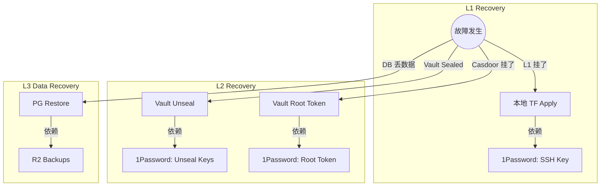

# 故障恢复 SSOT

> **SSOT Key**: `ops.recovery`
> **核心定义**: 定义各级故障的恢复策略、紧急绕过路径 (Break-glass) 及数据还原流程。

---

## 1. 真理来源 (The Source)

> **原则**：1Password 是最终的信任根 (Root of Trust)。只要它还在，整个基础设施就可以从零重建。

本话题的配置和状态由以下物理位置唯一确定：

| 维度 | 物理位置 (SSOT) | 说明 |
|------|----------------|------|
| **Master Keys** | **1Password** | Root Token, Unseal Keys, SSH Keys |
| **数据备份** | **Cloudflare R2** | TF State, DB Dumps |
| **代码仓库** | **GitHub** | IaC 代码, 应用代码 |

---

## 2. 架构模型 (恢复路径)



### 关键决策 (Architecture Decision)

- **Trust Anchor 独立性**: Bootstrap 层 (L1) 不依赖任何 L2+ 组件，确保在全站瘫痪时仍可由人工（持 1Password 密钥）恢复。
- **分治认证**: 保留多种认证路径（Basic Auth, Token, OIDC），防止单一 SSO 故障导致管理端死锁。

---

## 3. 设计约束 (Dos & Don'ts)

### ✅ 推荐模式 (Whitelist)

- **模式 A**: 必须定期验证 1Password 中的密钥是否有效（演练）。
- **模式 B**: 必须将所有持久化数据（State, DB）异地备份到 R2。

### ⛔ 禁止模式 (Blacklist)

- **反模式 A**: **禁止** 仅依赖 Vault 存储自身的 Unseal Keys（死锁）。
- **反模式 B**: **禁止** 在生产环境关闭 PVC 的 `Retain` 策略。

---

## 4. 标准操作程序 (Playbooks)

### SOP-001: Vault 解封 (Unseal)

- **触发条件**: Vault Pod 重启 / Sealed 状态
- **步骤**:
    1. 获取 Keys: `op item get 'Vault Unseal Keys' --vault my_cloud --reveal`
    2. 执行解封:
       ```bash
       kubectl exec -n platform vault-0 -- vault operator unseal <key1>
       kubectl exec -n platform vault-0 -- vault operator unseal <key2>
       kubectl exec -n platform vault-0 -- vault operator unseal <key3>
       ```

### SOP-002: 平台数据库恢复

- **触发条件**: Platform PG 数据损坏
- **步骤**:
    1. 停止上层服务: `kubectl scale deploy -n platform vault casdoor --replicas=0`
    2. 恢复数据:
       ```bash
       kubectl exec -i -n platform postgresql-0 -- psql -U postgres < /data/backups/latest.sql
       ```
    3. 恢复服务: `kubectl scale deploy -n platform vault casdoor --replicas=1`

### SOP-003: 紧急访问 (Break-glass)

- **触发条件**: SSO 不可用，需操作 Vault
- **步骤**:
    1. 获取 Root Token: `op read 'op://Infrastructure/Vault Root Token/credential'`
    2. 端口转发: `kubectl port-forward -n platform svc/vault 8200:8200`
    3. 登录: `vault login <root_token>`

---

## 5. 验证与测试 (The Proof)

| 行为描述 | 测试文件 (Test Anchor) | 覆盖率 |
|----------|-----------------------|--------|
| **备份文件存在性** | `test_backup_integrity.py` (Pending) | ⏳ Planned |
| **Vault Unseal 流程** | [`test_vault_health.py`](../../e2e_regressions/tests/platform/secrets/test_vault_health.py) | ✅ Critical |

---

## Used by

- [docs/ssot/README.md](./README.md)
- [docs/onboarding/README.md](../../docs/onboarding/README.md)