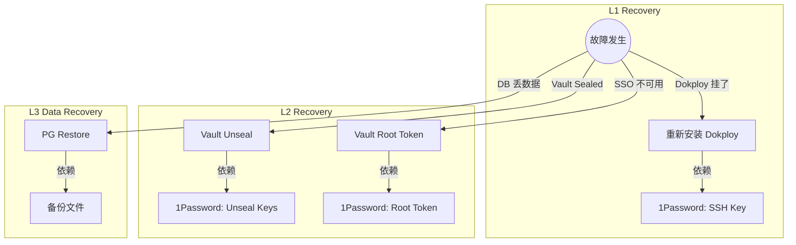

# 故障恢复 SSOT

> **SSOT Key**: `ops.recovery`
> **核心定义**: 定义故障恢复策略、紧急绕过路径 (Break-glass) 及数据还原流程。

---

## 1. 真理来源 (The Source)

> **原则**：1Password 是最终的信任根 (Root of Trust)。只要它还在，基础设施就可重建。

| 维度 | 物理位置 (SSOT) | 说明 |
|------|----------------|------|
| **Master Keys** | **1Password** | Root Token, Unseal Keys, SSH Keys |
| **数据备份** | **/data** + 远端备份（规划中） | DB Dumps |
| **代码仓库** | **GitHub** | 部署代码、Compose 定义 |

---

## 2. 架构模型 (恢复路径)



---

## 3. 设计约束 (Dos & Don'ts)

### ✅ 推荐模式 (Whitelist)

- **模式 A**: 必须定期验证 1Password 中的密钥是否有效（演练）。
- **模式 B**: 必须将 `/data` 的关键数据备份到异地。

### ⛔ 禁止模式 (Blacklist)

- **反模式 A**: **禁止** 仅依赖 Vault 存储自身的 Unseal Keys（死锁）。
- **反模式 B**: **禁止** 无备份直接清理 `/data`。

---

## 4. 标准操作程序 (Playbooks)

### SOP-001: Vault 解封 (Unseal)

- **触发条件**: Vault 重启后处于 Sealed 状态
- **步骤**:
    1. 获取 Keys: `op item get "bootstrap/vault/Unseal Keys" --vault "Infra2" --reveal`
    2. 进入 VPS 并执行：
       ```bash
       ssh root@<VPS_HOST>
       export VAULT_ADDR=https://vault.${INTERNAL_DOMAIN}
       vault operator unseal <key1>
       vault operator unseal <key2>
       vault operator unseal <key3>
       ```

### SOP-002: 平台数据库恢复

- **触发条件**: Platform PG 数据损坏
- **步骤**:
    1. 停止相关服务（Dokploy Stop）。
    2. 恢复数据：
       ```bash
       ssh root@<VPS_HOST>
       docker exec -i platform-postgres psql -U postgres < /data/backups/latest.sql
       ```
    3. 启动服务并验证健康。

### SOP-003: 紧急访问 (Break-glass)

- **触发条件**: SSO 不可用，需操作 Vault
- **步骤**:
    1. 获取 Root Token: `op item get "bootstrap/vault/Unseal Keys" --vault "Infra2" --reveal`
    2. 登录: `vault login <root_token>`

---

## 5. 验证与测试 (The Proof)

| 行为描述 | 验证方式 | 覆盖率 |
|----------|----------|--------|
| **备份文件存在性** | 手动检查 `/data/backups` | ⏳ Manual |
| **Vault Unseal 流程** | `vault status` | ✅ Manual |

---

## Used by

- [docs/ssot/README.md](./README.md)
- [docs/onboarding/README.md](../onboarding/README.md)
