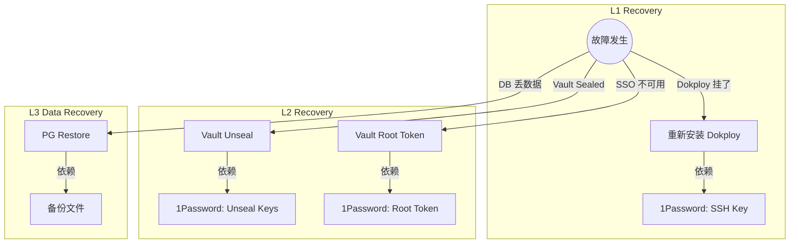

# 故障恢复 SSOT

> **SSOT Key**: `ops.recovery`
> **核心定义**: 定义故障恢复策略、紧急绕过路径 (Break-glass) 及数据还原流程。

---

## 1. 真理来源 (The Source)

> **原则**：1Password 是最终的信任根 (Root of Trust)。只要它还在，基础设施就可重建。

| 维度 | 物理位置 (SSOT) | 说明 |
|------|----------------|------|
| **Master Keys** | **1Password** | Root Token, Unseal Keys, SSH Keys |
| **数据备份** | `/data` + [`ops.backup-inventory.yaml`](./ops.backup-inventory.yaml) + off-host manifest | DB dumps and persistent data archives |
| **代码仓库** | **GitHub** | 部署代码、Compose 定义 |

---

## 2. 架构模型 (恢复路径)


```mermaid
graph TD
    Failure((故障发生))

    subgraph "L1 Recovery"
        Failure -->|Dokploy 挂了| Reinstall[重新安装 Dokploy]
        Reinstall -->|依赖| OP_SSH[1Password: SSH Key]
    end

    subgraph "L2 Recovery"
        Failure -->|Vault Sealed| Unseal[Vault Unseal]
        Unseal -->|依赖| OP_KEYS[1Password: Unseal Keys]

        Failure -->|SSO 不可用| RootLogin[Vault Root Token]
        RootLogin -->|依赖| OP_ROOT[1Password: Root Token]
    end

    subgraph "L3 Data Recovery"
        Failure -->|DB 丢数据| Restore[PG Restore]
        Restore -->|依赖| BACKUP[备份文件]
    end
```

---

## 3. 设计约束 (Dos & Don'ts)

### ✅ 推荐模式 (Whitelist)

- **模式 A**: 必须定期验证 1Password 中的密钥是否有效（演练）。
- **模式 B**: 必须将 `/data` 的关键数据备份到异地。
- **模式 C**: 每个 deployer-owned `DATA_PATH` 必须在 backup inventory 中登记 owner、method、RPO、retention 和 restore command。

### ⛔ 禁止模式 (Blacklist)

- **反模式 A**: **禁止** 仅依赖 Vault 存储自身的 Unseal Keys（死锁）。
- **反模式 B**: **禁止** 无备份直接清理 `/data`。

---

## 4. 标准操作程序 (Playbooks)

### SOP-001: Vault 解封 (Unseal)

- **触发条件**: Vault 重启后处于 Sealed 状态
- **步骤**:
    1. 获取 Keys: `op item get "bootstrap/vault/Unseal Keys" --vault "Infra2" --reveal`
    2. 进入 VPS 并执行：
       ```bash
       ssh root@<VPS_HOST>
       export VAULT_ADDR=https://vault.<INTERNAL_DOMAIN>
       vault operator unseal <key1>
       vault operator unseal <key2>
       vault operator unseal <key3>
       ```

### SOP-002: 平台数据库恢复

- **触发条件**: Platform PG 数据损坏
- **步骤**:
    1. 停止相关服务（Dokploy Stop）。
    2. 恢复数据：
       ```bash
       ssh root@<VPS_HOST>
       docker exec -i platform-postgres${ENV_SUFFIX} psql -U postgres < /data/backups/latest.sql
       ```
    3. 启动服务并验证健康。

### SOP-003: 紧急访问 (Break-glass)

- **触发条件**: SSO 不可用，需操作 Vault
- **步骤**:
    1. 获取 Root Token: `op item get "bootstrap/vault/Unseal Keys" --vault "Infra2" --reveal`
    2. 登录: `vault login <root_token>`

### SOP-004: 备份 freshness 验证

备份系统必须产出一个 off-host manifest，至少包含：

```json
{
  "artifacts": [
    {
      "service_id": "platform/postgres",
      "created_at": "2026-06-05T00:00:00Z",
      "size_bytes": 123456,
      "sha256": "<64 hex chars>",
      "remote_uri": "r2:infra2/platform/postgres/archive.tar.gz"
    }
  ]
}
```

验证命令：

```bash
uv run python tools/backup_verification.py --manifest /path/to/manifest.json --json
```

失败条件包括：manifest 缺少服务、artifact 超过 RPO、size 为空、checksum 缺失、
或 `remote_uri` 不是 inventory 指定的 off-host remote。

### SOP-005: 生成并上传 off-host 备份

备份 runner 读取 [`ops.backup-inventory.yaml`](./ops.backup-inventory.yaml)，
为每个登记的 `data_path` 创建 archive、计算 SHA256，并通过主机上的 `rclone`
remote 上传到 off-host storage。

Dry-run 不上传：

```bash
uv run python tools/backup_runner.py --output-dir /tmp/infra2-backups --no-upload
```

生产上传示例：

```bash
BACKUP_REMOTE=r2:infra2 uv run python tools/backup_runner.py \
  --output-dir /data/backups/infra2 \
  --manifest /data/backups/infra2/manifest.json
```

`rclone` remote credentials must live on the host or in 1Password-managed
runtime configuration. They must not be committed to this repository.

### SOP-006: On-host scheduled backup runner (logical dumps)

`tools/host_backup.sh` is the on-host scheduled backup runner. Unlike the
inventory archiver, it produces **restorable logical backups**:

- Postgres services: `pg_dumpall` via `docker exec` (crash-consistent).
- Redis services: `redis-cli SAVE` (best-effort) then archive `dump.rdb`.
- Other data paths: gzip tar.

It writes a `tools/backup_verification.py`-compatible manifest and, when
`BACKUP_REMOTE` (an rclone target) is set, uploads each archive off-host. Local
retention keeps the most recent `BACKUP_KEEP` (default 7) run directories.

Scheduled on the host via crontab:

```cron
30 3 * * * /usr/local/sbin/infra2-host-backup.sh >> /var/log/infra2-backup.log 2>&1
45 3 * * * ENV_SUFFIX=-staging /usr/local/sbin/infra2-host-backup.sh >> /var/log/infra2-backup-staging.log 2>&1
```

> **OFF-HOST STATUS**: on-host logical backups are live and scheduled, but
> off-host upload is **inactive until R2 S3 credentials are provisioned**.
> A single-VPS host loss currently loses both data and on-host backups. To
> activate off-host durability: create a Cloudflare R2 access key/secret, store
> it in 1Password (`bootstrap/cloudflare` or a dedicated `bootstrap/r2` item),
> install `rclone` + an `r2:` remote on the host, then set `BACKUP_REMOTE=r2:infra2`
> in the cron entries. The off-host manifest is then verified with SOP-004.


---

## 5. 验证与测试 (The Proof)

| 行为描述 | 验证方式 | 覆盖率 |
|----------|----------|--------|
| **Backup inventory covers DATA_PATH** | `libs/tests/test_backup_verification.py` | ✅ Implemented |
| **Backup archive + checksum runner** | `tools/backup_runner.py` | ✅ Implemented |
| **Backup freshness/checksum manifest** | `tools/backup_verification.py` | ✅ Implemented |
| **Vault Unseal 流程** | `vault status` | ✅ Manual |

---

## Used by

- [docs/ssot/README.md](./README.md)
- [docs/onboarding/README.md](../onboarding/README.md)
