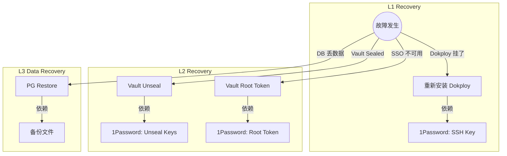

# 故障恢复 SSOT

> **SSOT Key**: `ops.recovery`
> **核心定义**: 定义故障恢复策略、紧急绕过路径 (Break-glass) 及数据还原流程。

---

## 1. 真理来源 (The Source)

> **原则**：1Password 是最终的信任根 (Root of Trust)。只要它还在，基础设施就可重建。

| 维度 | 物理位置 (SSOT) | 说明 |
|------|----------------|------|
| **Master Keys** | **1Password** | Root Token, Unseal Keys, SSH Keys |
| **数据备份** | `/data` + 各服务 `deploy.py` 的 `BackupFacet` 声明（派生：[`libs/backup/`](../../libs/backup/README.md) [`libs/backup/verification.py::load_backup_inventory`]，#542）+ off-host manifest | DB dumps and persistent data archives |
| **代码仓库** | **GitHub** | 部署代码、Compose 定义 |

---

## 2. 架构模型 (恢复路径)


```mermaid
graph TD
    Failure((故障发生))

    subgraph "L1 Recovery"
        Failure -->|Dokploy 挂了| Reinstall[重新安装 Dokploy]
        Reinstall -->|依赖| OP_SSH[1Password: SSH Key]
    end

    subgraph "L2 Recovery"
        Failure -->|Vault Sealed| Unseal[Vault Unseal]
        Unseal -->|依赖| OP_KEYS[1Password: Unseal Keys]

        Failure -->|SSO 不可用| RootLogin[Vault Root Token]
        RootLogin -->|依赖| OP_ROOT[1Password: Root Token]
    end

    subgraph "L3 Data Recovery"
        Failure -->|DB 丢数据| Restore[PG Restore]
        Restore -->|依赖| BACKUP[备份文件]
    end
```

---

## 3. 设计约束 (Dos & Don'ts)

### ✅ 推荐模式 (Whitelist)

- **模式 A**: 必须定期验证 1Password 中的密钥是否有效（演练）。
- **模式 B**: 必须将 `/data` 的关键数据备份到异地。
- **模式 C**: 每个 deployer-owned `DATA_PATH` 必须在 backup inventory 中登记 owner、method、RPO、retention 和 restore command。

### ⛔ 禁止模式 (Blacklist)

- **反模式 A**: **禁止** 仅依赖 Vault 存储自身的 Unseal Keys（死锁）。
- **反模式 B**: **禁止** 无备份直接清理 `/data`。

---

## 4. 标准操作程序 (Playbooks)

### SOP-001: Vault 解封 (Unseal)

- **触发条件**: Vault 重启后处于 Sealed 状态
- **步骤**:
    1. 获取 Keys: `op item get "bootstrap/vault/Unseal Keys" --vault "Infra2" --reveal`
    2. 进入 VPS 并执行：
       ```bash
       ssh root@<VPS_HOST>
       export VAULT_ADDR=https://vault.<INTERNAL_DOMAIN>
       vault operator unseal <key1>
       vault operator unseal <key2>
       vault operator unseal <key3>
       ```

### SOP-002: 平台数据库恢复

- **触发条件**: Platform PG 数据损坏
- **先取证**：确定目标环境和服务 ID（Production 为 `platform/postgres`），从该环境的
  `/data/backups/infra2/production-manifest.json` 或
  `/data/backups/infra2/staging-manifest.json` 选定一个归档及其 SHA256。
  用 SOP-004 验证完整 manifest，再从异地拉取所选归档并核对实际字节与 SHA256。
  环境专用 manifest 缺失或服务条目不全即暂停，不能猜测旧 `manifest.json` 的环境。
- **先隔离恢复**：在替换任何在线数据前，使用 SOP-006A 的沙箱恢复证明该归档可读。
  记录归档时间、演练结果和当前故障库的只读快照；禁止把未验证的文件直接灌入在线库。
- **生产切换**：停写、选择新数据库实例或隔离目标、执行服务专属恢复、校验业务不变量、
  再切换依赖方；此步骤需要 owner 对目标环境与当前操作批准。当前仓库只有沙箱演练工具，
  **没有**经验证的自动化生产数据库切换执行器。必须先在同版本隔离目标完成演练并记录
  实际命令和结果，不能把演练 PASS 当成在线切换 PASS。

旧命令 `/data/backups/latest.sql` 与现行 manifest/归档格式不符，不能作为恢复入口。

### SOP-003: 紧急访问 (Break-glass)

- **触发条件**: SSO 不可用，需操作 Vault
- **步骤**:
    1. 从 1Password `Infra2` vault 的 **`bootstrap/vault/Root Token`** 条目读取
       `Root Token` 字段；`bootstrap/vault/Unseal Keys` 只用于 SOP-001 解封。
    2. 在可信的操作终端先确认 `INTERNAL_DOMAIN` 指向目标环境，执行
       `export VAULT_ADDR="https://vault.${INTERNAL_DOMAIN:?set INTERNAL_DOMAIN}"`。
       用 `read -r -s -p 'Vault root token: ' VAULT_TOKEN; printf '\n'; export VAULT_TOKEN`
       从交互式提示输入 token，随后用 `vault token lookup` 确认权限，再完成紧急操作。
       结束后立即 `unset VAULT_TOKEN`。不要运行会把 root token 缓存到本机 token
       helper 的普通 `vault login`，也不要把 token 写入命令参数、工单或日志。

### SOP-004: 备份 freshness 验证

备份系统必须产出一个 off-host manifest，至少包含：

```json
{
  "artifacts": [
    {
      "service_id": "platform/postgres",
      "created_at": "2026-06-05T00:00:00Z",
      "size_bytes": 123456,
      "sha256": "<64 hex chars>",
      "remote_uri": "gdrive-backup:infra2/weekly/20260920T033000Z/platform/postgres/archive.tar.gz"
    }
  ]
}
```

验证命令：

```bash
uv run python tools/backup_verification.py --manifest /path/to/manifest.json --json
```

失败条件包括：manifest 缺少服务、artifact 超过 RPO、size 为空、checksum 缺失、
或 `remote_uri` 不是 inventory 指定的 off-host remote。

### SOP-005: 生成并上传 off-host 备份

备份 runner 读取各服务 `BackupFacet` 声明派生的清单（[`libs/backup/`](../../libs/backup/README.md) `libs/backup/verification.py::load_backup_inventory` / 兼容门面 `libs/backup_verification.py`，#542），
为每个登记的 `data_path` 创建 archive、计算 SHA256，并通过主机上的 `rclone`
remote 上传到 off-host storage。

这个按声明生成文件归档的命令目前是手工入口；宿主机定时任务使用下面的
`host_backup.sh`。不能用这里的示例命令证明每周的异地备份已经运行。

Dry-run 不上传：

```bash
uv run python tools/backup_runner.py --output-dir /tmp/infra2-backups --no-upload
```

生产上传示例：

```bash
BACKUP_REMOTE=gdrive-backup:infra2 uv run python tools/backup_runner.py \
  --output-dir /data/backups/infra2 \
  --manifest /data/backups/infra2/manifest.json
```

`rclone` remote credentials live in 1Password `bootstrap/gdrive` (`rclone_conf` field).
They must not be committed to this repository.

### SOP-006: On-host scheduled backup runner (logical dumps + tiered retention)

`tools/host_backup.sh` is the on-host scheduled backup runner. Unlike the
inventory archiver, it produces **restorable logical backups**:

- Postgres services: `pg_dumpall` via `docker exec` (crash-consistent). They run
  **first**.
- Redis services: an authenticated `redis-cli SAVE` (`REDISCLI_AUTH` from the
  container's `/secrets/.env`), then archive `dump.rdb` only. A SAVE that does not
  answer `OK` logs `WARN` and the archive holds the last automatic snapshot
  (`--save 60 1`).
- Other data paths: gzip tar, **last** (minio is the busiest live tree).

Failure contract (#618, found by the truealpha#650 restore drill):

- `tar` exit 1 (a live file changed or vanished mid-read) is a `WARN` and the
  archive is kept as crash-consistent. Exit ≥2 fails that service.
- A failing service never stops the others. It is logged as `FAILED <service_id>`,
  its partial archive is removed, it is absent from the manifest (so SOP-004
  reports it missing), and the run exits 1.
- Before #618 the first failure ended the run under `set -e`: every scheduled
  prod run stopped at `platform/minio` and never dumped the finance_report or
  truealpha databases.

It writes a `tools/backup_verification.py`-compatible manifest and, when
`BACKUP_REMOTE` (an rclone target) is set, uploads each archive off-host into
the tier/environment directory (`${REMOTE}/${BACKUP_TIER}/${ENVIRONMENT}/${TS}`). Local retention keeps the
most recent `BACKUP_KEEP` (default 7) run directories **per environment** and is
skipped on a failed run. Run directories are named `production-<timestamp>` or
`staging-<timestamp>` under `/data/backups/infra2`; each run's manifest records
its environment. The latest pointers are `production-manifest.json` and
`staging-manifest.json` in that directory. The off-host latest manifests are
likewise separate (`gdrive-backup:infra2/production/manifest.json` and
`gdrive-backup:infra2/staging/manifest.json`). Legacy unprefixed local runs are
left untouched for an operator to retire after the new path is verified.
Because the set includes Vault and 1Password Connect state, the runner uses
`umask 077` and makes `/data/backups/infra2` root-only (`0700`). On rollout,
check this on the host before the next run; restricting this parent also shields
legacy archives that were created with looser modes.
Remote retention automatically prunes expired snapshots (`weekly` > 60d; `quarterly` > 730d).

The script's service list must equal the `BackupFacet` inventory. The list is
currently hand-kept because the installed host copy runs without a repo Python
environment; `libs/tests/test_host_backup_script.py` checks both directions and
the declared data paths. A new facet without a scheduled backup entry fails CI.
Bootstrap paths are shared by both environments; environment-scoped paths take
`ENV_SUFFIX`. Source coverage alone is not runtime proof: after merging a script
change, reinstall the host copy, verify its checksum, and inspect a fresh
off-host manifest and restored artifact for every required entry.

The host copy is installed by hand from `main` (script-deploy drift belongs to
the reconcile lane). After a change merges, reinstall it and compare checksums:

```bash
install -m 0755 tools/host_backup.sh /usr/local/sbin/infra2-host-backup.sh
sha256sum tools/host_backup.sh /usr/local/sbin/infra2-host-backup.sh
```

Scheduled on the host via crontab:

```cron
# Weekly backups (Sundays 03:30 UTC, rolling 60d window)
30 3 * * 0 BACKUP_REMOTE=gdrive-backup:infra2 BACKUP_TIER=weekly /usr/local/sbin/infra2-host-backup.sh >> /var/log/infra2-backup.log 2>&1
45 3 * * 0 BACKUP_REMOTE=gdrive-backup:infra2 BACKUP_TIER=weekly ENV_SUFFIX=-staging /usr/local/sbin/infra2-host-backup.sh >> /var/log/infra2-backup-staging.log 2>&1

# Quarterly long-term snapshots (04:00 UTC on Jan 1, Apr 1, Jul 1, Oct 1, 2-year retention)
0 4 1 1,4,7,10 * BACKUP_REMOTE=gdrive-backup:infra2 BACKUP_TIER=quarterly /usr/local/sbin/infra2-host-backup.sh >> /var/log/infra2-backup-quarterly.log 2>&1
```

> **OFF-HOST STATUS**: **ACTIVE**. Off-host logical backups are encrypted end-to-end
> (`rclone crypt`) and uploaded to Google Drive (`gdrive-backup:infra2`).
> The root of trust is 1Password (`bootstrap/gdrive`). To restore credentials on a
> fresh host: `op item get "bootstrap/gdrive" --vault "Infra2" --fields "rclone_conf" > ~/.config/rclone/rclone.conf`.
> The off-host manifest is verified with SOP-004.

### SOP-006A: Off-host restore rehearsal

Backups are not considered durable until the latest off-host artifact has been
restored into a disposable target and checked. Use
`tools/run_restore_rehearsal.py` for automated, sandboxed end-to-end rehearsals:

```bash
# Automated sandboxed rehearsal (spins up disposable container, restores, checks invariants, destroys container)
python3 tools/run_restore_rehearsal.py \
  --manifest /data/backups/infra2/production-manifest.json \
  --service-id finance_report/postgres \
  --database finance_report
```

Or low-level manual invocation with `tools/backup_restore_rehearsal.py`:

```bash
uv run python tools/backup_restore_rehearsal.py \
  --manifest /data/backups/infra2/production-manifest.json \
  --service-id finance_report/postgres \
  --target-container finance_report-postgres-restore-rehearsal
```

Safety rules:

- The manifest must pass the same off-host freshness/checksum checks as SOP-004.
- The automated runner defaults to Production and requires the manifest's
  `environment` to match. To rehearse Staging, pass both `--environment staging`
  and `--manifest /data/backups/infra2/staging-manifest.json`. Missing or
  mismatched environment is a failure; the runner never guesses from the latest
  timestamp because the later Staging cron would otherwise mask Production.
- The target container name must contain `rehearsal`, `restore`, or `throwaway`
  unless an operator deliberately uses the explicit override in code.
- Zero host port binds and zero volume mounts to production `/data`.
- The default invariants run `SELECT 1`,
  `SELECT count(*) >= 1 FROM pg_database`, table count assertions, and domain
  row count checks (e.g. `SELECT count(*) FROM accounts`, `alembic_version`).

Schedule, as installed in root's crontab on the host (#892):

```cron
15 4 * * 0 cd /opt/infra2 && git pull -q origin main && PYTHONPATH=. python3 tools/run_restore_rehearsal.py --service-id all >> /var/log/infra2-backup-restore-rehearsal.log 2>&1
```

The out-of-band watchdog signal `infra2-restore-rehearsal` reads the last lines of
that log and holds them to the backup RPO bound (180h). While the log does not
exist yet, it reads root's crontab instead (#926):

- If no uncommented entry writes that log, the rehearsal is not scheduled and the signal is red.
- If the crontab was last written within the bound, the first rehearsal is not yet due and the signal is green, saying so.
- If the crontab was last written earlier than the bound, the rehearsal has never run and the signal is red.

Until the first run writes the log, any crontab edit restarts that clock. After the first run, only the log's age counts.

### SOP-006B: VPS 全灭后的整机恢复演练与 RTO 计时

**状态：尚未实测。** SOP-006A 的 10.62 秒记录只覆盖一个数据库在现有主机上的
沙箱还原；它不包含购置/启动新主机、恢复控制面、17 个状态服务、DNS 切换或业务验收，
不得写作整机 RTO。当前周备策略的恢复点取决于最后一个通过字节与 SHA256 校验的
异地归档；没有已验证的 WAL/PITR 路径，不能声称 15 分钟 RPO。

1. **宣告与隔离**：记下故障宣告时刻 `t0`、受影响环境、最后一次成功的异地
   manifest 和故障主机状态。若旧主机仍可写，先阻止双写；保留其磁盘和日志取证，
   不在旧机上清理 `/data`。演练在与生产隔离的新 VPS 上进行，不切生产 DNS。
2. **重建信任根与控制面**：从 1Password 取得 SSH、rclone crypt、Vault 所需的
   现有凭据，从 GitHub 固定一个 infra2 commit；按 bootstrap 顺序恢复主机、
   Dokploy、1Password Connect、Vault 与 IaC Runner。不得从已失效主机上的 Vault
   寻找唯一解封材料，也不得把任何凭据写进仓库或演练日志。
3. **恢复数据**：分别选择 Production/Staging 的最新合格 off-host manifest，
   用 SOP-004 验证覆盖、时间、字节和 SHA256。先用 SOP-006A 在隔离容器里证明
   Postgres 归档能还原；其余服务逐项按 `BackupFacet.restore_command` 规划并验证。
   缺项或失败项记为恢复失败，不能用其他环境的较新 manifest 顶替。
4. **重建服务与验收**：按依赖顺序启动平台与应用；逐项核对 17/17 状态归档、
   Vault/密钥供给、数据库业务不变量、公开探针和告警路径。只有数据与服务均通过
   才记 `t1`。生产 DNS/流量切换属于单独的 owner 批准操作，演练不执行。
5. **记录实测**：整机 `RTO=t1-t0`；按每个状态服务分别记录
   `RPO=故障时刻-该服务最后可恢复归档的生成时刻`。留存新主机规格、代码 SHA、
   manifest URI/校验摘要、各阶段起止时刻、失败及人工步骤。首次整机演练通过前，
   RTO 状态为 **unknown**，不是目标值或单库还原耗时。

整机演练没有自动化执行器；上面是顺序与验收契约。实际恢复命令须先在隔离目标
逐项验证，再写入服务级 runbook；不可将声明中的 `restore_command` 当作已经实测。

### SOP-007: 服务因 vault-agent 缺凭证崩溃 (re-provision AppRole)

- **触发条件**: 某服务的 vault-agent 反复 `Restarting`,日志 `VAULT_ROLE_ID and
  VAULT_SECRET_ID are required`(旧 token_file 服务则是 `VAULT_APP_TOKEN is
  required`);它的 app 容器停在 `created`/`unhealthy`,公网路由 404。最常见于:
  服务被 recreate(一次部署 / AppRole 迁移落地)后,Dokploy 项目 env 里少了这两个 key。
- **先确认不是应用的锅**: backend 没启动 → 迁移没跑 → DB/ODS 安全。证据:该服务
  `…/10.app/.env`(或对应目录)缺 `VAULT_ROLE_ID`/`VAULT_SECRET_ID`;iac-runner
  sync 日志出现 `vault_permission_denied`。
- **恢复**(在 iac-runner 里跑——它已带 vault CLI(#289)且能从 1Password 取 root token):
    ```bash
    ssh root@<VPS_HOST>
    docker exec iac-runner sh -c '
      set -a; . /secrets/.env 2>/dev/null; set +a
      export VAULT_ROOT_TOKEN=$(op read "op://Infra2/dexluuvzg5paff3cltmtnlnosm/Root Token")
      cd /workspace/infra2
      BOOT="import platform, runpy, sys; sys.path.insert(0, \".\"); runpy.run_module(\"invoke\", run_name=\"__main__\")"
      python3 -P -c "$BOOT" vault.setup-approle --project <project> --service <service> --deploy
    '
    ```
  `setup-approle --deploy` 会:幂等启用 approle → 建/取 role + 签发 secret-id → 写回
  Dokploy 项目 env(#294 的 `RUNTIME_ENV_KEYS_TO_PRESERVE` 保证之后重部署不再抹掉)→
  触发重部署。**全程不要 echo/打印 token。**
- **兜底**(Dokploy 重部署没产生新 deployment record / 高负载): 直接把 role-id +
  fresh secret-id 写进该服务 `.env`,`docker compose -p <proj> -f <compose> up -d`
  重建(creds `secret_id_ttl=0` 不过期)。
- **验证**: vault-agent `healthy` → app 容器起 → `/api/health` 200 → 迁移落地。
- **关联**: 根因 #290(provisioning 链脆弱);creds 持久化 #294;vault CLI 入镜像
  #289;policy 缺口 #287。**收尾目标(高优)**: 把这条 playbook 自动化成不依赖人肉
  root token 的可重放 provisioning,见 #290。


---

## 5. 验证与测试 (The Proof)

| 行为描述 | 验证方式 | 覆盖率 |
|----------|----------|--------|
| **Backup inventory covers DATA_PATH** | `libs/tests/test_backup_verification.py` | ✅ Implemented |
| **Backup archive + checksum runner** | `tools/backup_runner.py` | ✅ Implemented |
| **Backup freshness/checksum manifest** | `tools/backup_verification.py` | ✅ Implemented |
| **On-host backup runner (SOP-006): dumps first, one failure never stops the rest, tar exit 1 is a WARN, authenticated redis SAVE** | `libs/tests/test_host_backup_script.py` | ✅ Implemented |
| **Off-host restore rehearsal** | `tools/run_restore_rehearsal.py` + `libs/backup/` (`libs/tests/test_backup_verification.py`) | ✅ Implemented & Live Verified (10.62s PASS) |
| **Vault Unseal 流程（自动）** | `bootstrap/05.vault/unsealer.py` 常驻自动解封;契约由 `libs/tests/test_vault_unsealer.py`(过期 Connect token 拒绝 / sync 非 ACTIVE / sealed 报不健康 / key 不足中止)+ `libs/tests/test_bootstrap_health.py`(healthcheck 接线)覆盖 | ✅ Automated |
| **Vault Unseal 流程（手动兜底,SOP-001）** | `vault status` + `vault operator unseal` | ✅ Manual |
| **vault-agent 凭证 re-provision (SOP-007)** | `vault.setup-approle --deploy` | ✅ Manual |

---

## Used by

- [docs/ssot/README.md](./README.md)
- [docs/onboarding/README.md](../onboarding/README.md)
