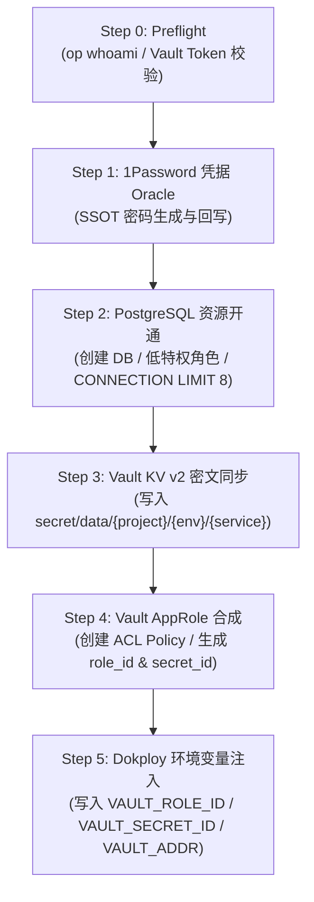

# 服务生命周期管理 SSOT (Service Lifecycle Management)

> **SSOT Key**: `ops.service_lifecycle`  
> **核心定义**: 微服务在 `infra2` 平台上的原子接入（Onboard Saga）、对称退役（Offboard Teardown）、凭据轮转与资源隔离生命周期规范。

---

## 1. 核心架构设计与原则

`infra2` 平台坚持**工业级零安全降级**原则：即使对于 95% 的轻量化微服务，其安全防御强度（Vault AppRole 凭据隔离、tmpfs 内存挂载 `.env`、PostgreSQL 独立限流用户、SigNoz APM 观测）也必须保持 100% 完备。

生命周期管理通过原子事务 Saga（`tools/service_onboard.py` 与 `tools/service_offboard.py`）提供全自动化的开通与注销流水线。

---

## 2. 服务接入原子 Saga (Onboarding Saga)

服务开通遵循严格的单向依赖拓扑与幂等事务：



### 步骤详解

1. **Step 0: Preflight**
   - 验证 `op` CLI 已登录（`op whoami` 退出码 0），确保可信凭据根源。
   - 验证 `VAULT_ROOT_TOKEN` 可用性。
2. **Step 1: 1Password Oracle (SSOT)**
   - 检查 `1Password` 中是否存在目标项（如 `apps/production/{service}/db`）。
   - 若存在则复用，若不存在则生成高熵密码写入 1Password，确保 1Password 是静态凭据唯一事实源。
3. **Step 2: PostgreSQL 资源硬限与隔离**
   - 创建独占数据库 `{project}_{service}_db` 与低特权账户 `{project}_{service}_user`。
   - **连接池耗尽防御**: 强制设置 `CONNECTION LIMIT 8`。
   - **超时防护**: 强制设置 `idle_in_transaction_session_timeout = '60s'` 与 `statement_timeout = '30s'`。
4. **Step 3: Vault KV v2 运行时密文同步**
   - 将包括 `DATABASE_URL` 在内的敏感信息同步写入 `secret/data/{project}/{env}/{service}`。
5. **Step 4: Vault AppRole 与最小权限 ACL Policy**
   - 动态命名 Policy: `{project}-{env}-{service}`。
   - 策略严格受限为仅可读取当前服务的 Vault KV 路径以及公共路径（`common`），具备只读与续期能力。
   - 签发 AppRole 凭据（`role_id` 与 `secret_id`）。
6. **Step 5: Dokploy 环境变量注入**
   - 通过 Dokploy API 查询微服务的 `composeId`。
   - 注入 `VAULT_ROLE_ID`、`VAULT_SECRET_ID`、`VAULT_ADDR` 与 `ENV`。

---

## 3. 动态 Vault 目标发现契约 (Dynamic Discovery Contract)

- **去重与 SSOT 消除漂移**：`bootstrap/05.vault/tasks.py` 不再维护任何硬编码项目与服务元组。
- **单一来源**：Vault AppRole 扫描目标统一由 `bootstrap/05.vault/tasks.py` 经物理文件系统层级（`platform`、`finance_report`、`truealpha`、`apps`）动态发现，凡包含 Vault 配置标记（`vault-agent.hcl` / `vault-policy.hcl` / `secrets.ctmpl`）的服务均自动纳入 AppRole 管理（排除 bootstrap vault 与 1password）。
- **基础配置模板**：提供 `bootstrap/05.vault/templates/vault-agent.base.hcl` 作为标准化 Vault Agent 配置底座。

---

## 4. 服务安全退役与注销 (Offboarding Teardown)

服务下线操作必须支持防御性安全锁定与可审计的数据清理：

```bash
# 默认安全注销（保留持久化数据，防御性锁定）
invoke service.offboard --service=<service> --project=<project>

# 危险操作：彻底清除数据库与持久卷
invoke service.offboard --service=<service> --project=<project> --purge-data
```

### 注销动作语义

1. **默认模式（Safe Default）**：
   - **PostgreSQL 角色锁定**: 执行 `ALTER ROLE {user} NOLOGIN;`，并立即执行 `pg_terminate_backend` 踢出所有残留活跃连接。
   - **Vault 凭据吊销**: 删除对应 AppRole 与 ACL Policy，彻底废弃已有 token 与 secret_id。
   - **Dokploy 容器停止**: 停止并删除 Compose 应用，但保留持久卷（`delete_volumes=False`）。
   - **数据库保留**: 保留数据库本身，防止误操作导致数据丢失。
2. **彻底清理模式（`--purge-data`）**：
   - 需显式传入 `--purge-data` 标志。
   - 执行 `DROP DATABASE {db};` 与 `DROP ROLE {user};`，并通知 Dokploy 删除卷挂载。

---

## 5. 命令行入口与调用契约

所有微服务生命周期动作统一由 `invoke` 接管：

| 命令 | 用途 | 适用场景 |
|------|------|----------|
| `invoke service.onboard --service=<name> --project=<project>` | 执行原子开通 Saga | 新服务上线 / 环境初始化 |
| `invoke service.offboard --service=<name> --project=<project>` | 执行安全注销 | 服务下线 / 临时沙箱回收 |

---

## 6. 证据与防漂移守卫 (Proofs & Guards)

- `libs/tests/test_service_onboard.py`: 校验开通 Saga、PostgreSQL 角色配额、Vault AppRole 合成与对称注销。
- `libs/tests/test_dynamic_vault_targets.py`: 校验 Vault AppRole 目标动态发现机制与目录扫描覆盖。
- `docs/onboarding/07.new-service-sop.md`: 面向开发者的 Sub-3-Minute 极速上线操作规程。
