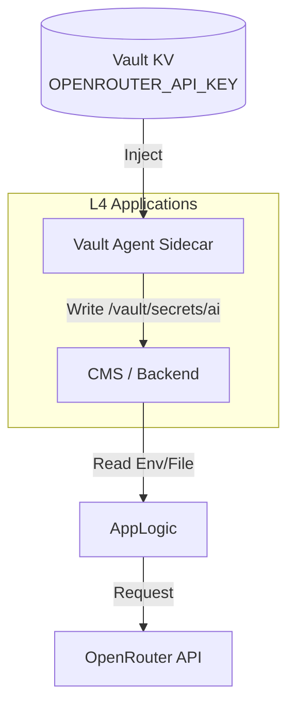

# AI 接入 SSOT

> **SSOT Key**: `platform.ai`
> **核心定义**: 定义基于 OpenRouter 的统一 LLM 接入网关、密钥管理与应用注入规范。

---

## 1. 真理来源 (The Source)

> **原则**：Infrastructure 仅提供“通道” (Key & URL)，具体的模型选择 (Model Selection) 由应用层决定。

本话题的配置和状态由以下物理位置唯一确定：

| 维度 | 物理位置 (SSOT) | 说明 |
|------|----------------|------|
| **API Key** | **Vault** (`secret/data/platform/ai`) | OpenRouter API Key |
| **接入地址** | **环境变量** | `OPENROUTER_BASE_URL` |
| **应用注入** | **Vault Agent** | Pod 侧的 Sidecar 注入 |

### Code as SSOT 索引

- **Vault 路径定义**：参见 [`platform/locals.tf`](../../platform/locals.tf) (AI 相关的 secret path)
- **应用注入示例**：参见 [`apps/cms/deployment.yaml`](../../apps/cms/deployment.yaml) (搜索 `vault.hashicorp.com/agent-inject`)

---

## 2. 架构模型



### 关键决策 (Architecture Decision)

- **Gateway 选型**: 使用 **OpenRouter** 作为统一网关。
    - 理由：单一 API 接口支持多模型（GPT-4, Claude 3, Llama 3），统一计费，且兼容 OpenAI SDK。
- **密钥不落盘**: API Key 仅存在于 Vault 和运行时的内存/Tmpfs 中，严禁写入 Git 或 Docker 镜像。

---

## 3. 设计约束 (Dos & Don'ts)

### ✅ 推荐模式 (Whitelist)

- **模式 A**: 应用通过读取 `/vault/secrets/ai` 文件获取 API Key。
- **模式 B**: 开发环境 (Local) 使用 `.env.local` 覆盖配置，但不提交。

### ⛔ 禁止模式 (Blacklist)

- **反模式 A**: **严禁** 将 `OPENROUTER_API_KEY` 硬编码在代码或 Dockerfile 中。
- **反模式 B**: **禁止** 在 L1/L2 层通过 Terraform 变量传递 AI Key（这是 L4 业务层的关注点）。

---

## 4. 标准操作程序 (Playbooks)

### SOP-001: 轮换 OpenRouter Key

- **触发条件**: Key 泄露 / 额度耗尽 / 定期轮换
- **步骤**:
    1. 在 OpenRouter 控制台生成新 Key。
    2. 写入 Vault:
       ```bash
       vault kv put secret/platform/ai key=sk-or-v1-new...
       ```
    3. 重启应用 Pod 以触发重新注入 (Vault Agent 默认也有 TTL，重启更即时):
       ```bash
       kubectl rollout restart deployment -n apps cms
       ```

---

## 5. 验证与测试 (The Proof)

本文档描述的行为由以下测试用例守护：

| 行为描述 | 测试文件 (Test Anchor) | 覆盖率 |
|----------|-----------------------|--------|
| **AI Key 注入验证** | `test_ai_injection.py` (需新建) | ⏳ Pending |

**如何运行验证**:
```bash
# TODO: 实现测试用例
# pytest e2e_regressions/tests/platform/ai/ -v
```

---

## Used by

- [docs/ssot/README.md](./README.md)
- [apps/README.md](../../apps/README.md)