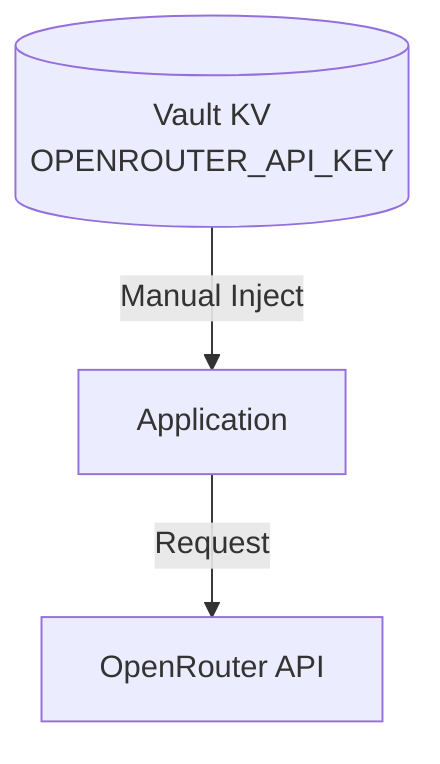

# AI 接入 SSOT

> **SSOT Key**: `platform.ai`
> **核心定义**: 定义基于 OpenRouter 的统一 LLM 接入规范（规划中）。

---

## 1. 真理来源 (The Source)

> **现状**：本仓库尚未落地 AI 网关服务与应用接入实现。

| 维度 | 物理位置 (SSOT) | 说明 |
|------|----------------|------|
| **API Key** | **Vault** (`secret/platform/<env>/ai`) | 规划中的 Key 存储路径 |
| **接入地址** | **环境变量** | `OPENROUTER_BASE_URL` |

---

## 2. 架构模型



---

## 3. 设计约束 (Dos & Don'ts)

### ✅ 推荐模式 (Whitelist)

- **模式 A**: API Key 只存放在 Vault 或部署环境变量中。

### ⛔ 禁止模式 (Blacklist)

- **反模式 A**: **严禁** 将 `OPENROUTER_API_KEY` 硬编码在代码或镜像中。

---

## 4. 标准操作程序 (Playbooks)

### SOP-001: 轮换 OpenRouter Key

- **触发条件**: Key 泄露 / 额度耗尽 / 定期轮换
- **步骤**:
    1. 在 OpenRouter 控制台生成新 Key。
    2. 写入 Vault：
       ```bash
       vault kv put secret/platform/<env>/ai key=sk-or-v1-new...
       ```
    3. 更新 Dokploy 环境变量并重启应用。

---

## 5. 验证与测试 (The Proof)

| 行为描述 | 验证方式 | 状态 |
|----------|----------|------|
| **AI Key 注入验证** | 待补测试用例 | ⏳ Backlog |

---

## Used by

- [docs/ssot/README.md](./README.md)
