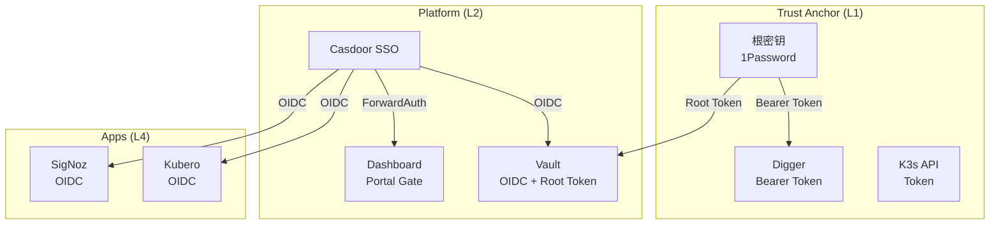

# 认证与授权 SSOT

> **SSOT Key**: `platform.auth`
> **核心定义**: 定义基于 Casdoor (IdP) 和 Vault (SP) 的统一身份认证体系，以及 Portal Gate 的分治策略。

---

## 1. 真理来源 (The Source)

> **原则**：身份 (Identity) 由 Casdoor 管理，授权 (Authorization) 由 Vault 基于身份标签 (Roles) 决定。

本话题的配置和状态由以下物理位置唯一确定：

| 维度 | 物理位置 (SSOT) | 说明 |
|------|----------------|------|
| **Casdoor 部署** | [`platform/5.casdoor.tf`](../../platform/5.casdoor.tf) | SSO 服务定义 |
| **OIDC 配置** | [`platform/90.casdoor-apps.tf`](../../platform/90.casdoor-apps.tf) | OIDC Clients 定义 |
| **Vault Roles** | [`platform/91.casdoor-roles.tf`](../../platform/91.casdoor-roles.tf) | Casdoor Roles 定义 |
| **Vault Policies** | [`platform/91.vault-oidc.tf`](../../platform/91.vault-oidc.tf) | OIDC Group Alias 映射 |

### Code as SSOT 索引

- **Role 映射逻辑**：参见 [`platform/91.vault-oidc.tf`](../../platform/91.vault-oidc.tf) (Identity Group Alias)
- **Portal Gate 配置**：参见 [`platform/92.portal-auth.tf`](../../platform/92.portal-auth.tf)

---

## 2. 架构模型



### 关键决策 (Architecture Decision)

- **分治策略 (Divide and Conquer)**:
    - **L1 Bootstrap (Digger/K3s)**: 使用独立根密钥/Token认证，**禁止**依赖 L2 Casdoor（避免循环依赖）。
    - **原生 OIDC 应用 (Vault/Kubero)**: 直连 Casdoor OIDC，**禁用** Portal Gate（避免双重认证）。
    - **遗留应用 (Dashboard)**: 使用 Portal Gate (OAuth2-Proxy + ForwardAuth) 提供 SSO 保护。

- **职责模型**:
    1. **Casdoor (IdP)**: 管理“你是谁”和“你的标签” (Roles: `vault-admin`, `vault-developer`)。
    2. **Vault (SP)**: 根据标签映射具体 Policies (Identity Groups)。

---

## 3. 设计约束 (Dos & Don'ts)

### ✅ 推荐模式 (Whitelist)

- **模式 A**: 新接入的应用首选 **OIDC Authorization Code Flow**。
- **模式 B**: 必须为 L1 服务保留“紧急访问通道” (Break-glass access)，如 1Password 中的 `DIGGER_BEARER_TOKEN` 或 Kubeconfig。

### ⛔ 禁止模式 (Blacklist)

- **反模式 A**: **严禁** L1 服务依赖 L2 Casdoor 进行认证（会导致系统挂了没法修）。
- **反模式 B**: **禁止** 在 Portal Gate 后面再套一层 OIDC（用户体验极差，需登录两次）。

---

## 4. 标准操作程序 (Playbooks)

### SOP-001: 新增 OIDC 应用

- **触发条件**: 接入新服务 (如 PostHog)
- **步骤**:
    1. 在 `platform/90.casdoor-apps.tf` 定义 `casdoor_application`。
    2. 获取 `client_id` 和 `client_secret` (存于 Vault)。
    3. 配置应用侧的 OIDC 参数。
    4. 提交 PR 并 Apply。

### SOP-002: 用户权限变更

- **触发条件**: 员工入职/离职/转岗
- **步骤**:
    1. 登录 Casdoor UI (`sso.<internal_domain>`)。
    2. 在 "Users" 中修改用户所属的 Roles (`vault-admin` vs `vault-viewer`)。
    3. 用户重新登录 Vault，权限自动更新 (TTL 默认为 1h)。

---

## 5. 验证与测试 (The Proof)

本文档描述的行为由以下测试用例守护：

| 行为描述 | 测试文件 (Test Anchor) | 覆盖率 |
|----------|-----------------------|--------|
| **Vault OIDC 登录** | [`test_auth_flow.py`](../../e2e_regressions/tests/platform/auth/test_auth_flow.py) | ✅ Critical |
| **Casdoor 服务状态** | [`test_casdoor.py`](../../e2e_regressions/tests/platform/auth/test_casdoor.py) | ✅ Critical |

**如何运行验证**:
```bash
pytest e2e_regressions/tests/platform/auth/ -v
```

---

## Used by

- [docs/ssot/README.md](./README.md)
- [docs/onboarding/05.sso.md](../../docs/onboarding/05.sso.md)
- [platform/README.md](../../platform/README.md)