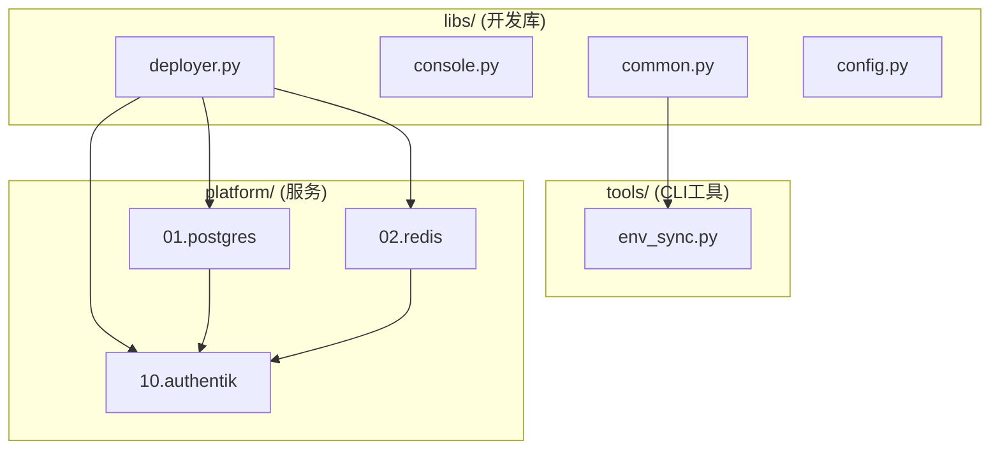

# Platform Automation SSOT

> **SSOT Key**: `platform.automation`  
> **核心定义**: Platform 模块的自动化采用 Deployer 模式 + Invoke tasks。

---

## 1. 真理来源 (The Source)

| 维度 | 物理位置 (SSOT) | 说明 |
|------|----------------|------|
| **服务定义** | `platform/{nn}.{service}/compose.yaml` | Docker Compose 配置 |
| **部署任务** | `platform/{nn}.{service}/deploy.py` | pre_compose, composing, post_compose |
| **状态检查** | `platform/{nn}.{service}/shared_tasks.py` | status() 返回 {is_ready, details} |
| **公共库** | `libs/` | common, console, config, deployer |
| **CLI 工具** | `tools/` | env_sync.py |

### Code as SSOT 索引

- **任务加载器**: [`tasks.py`](https://github.com/wangzitian0/infra2/blob/main/tasks.py)
- **基类**: [`libs/deployer.py`](https://github.com/wangzitian0/infra2/blob/main/libs/deployer.py)
- **公共函数**: [`libs/common.py`](https://github.com/wangzitian0/infra2/blob/main/libs/common.py)

---

## 2. 架构模型



### 目录结构

```
platform/{nn}.{service}/
├── compose.yaml       # Docker Compose
├── deploy.py          # XxxDeployer 类 + @task
├── shared_tasks.py    # status() 检查
├── .env.example       # 环境变量模板
└── README.md          # 服务文档
```

---

## 3. 设计约束 (Dos & Don'ts)

### ✅ 推荐模式

- **模式 A**: 使用 Deployer 基类减少重复
  ```python
  class PostgresDeployer(Deployer):
      service = "postgres"
      compose_path = "platform/01.postgres/compose.yaml"
      data_path = "/data/platform/postgres"
  ```

- **模式 B**: status() 使用 check_docker_service()
  ```python
  def status(c):
      return check_docker_service(c, "platform-postgres", "pg_isready", "PostgreSQL")
  ```

### ⛔ 禁止模式

- **反模式 A**: 禁止在 deploy.py 模块级导入 shared_tasks
- **反模式 B**: 禁止硬编码环境变量，使用 get_env()

---

## 4. 标准操作程序 (Playbooks)

### SOP-001: 部署服务

```bash
# 完整部署
invoke postgres.setup

# 分步部署
invoke postgres.pre-compose   # 创建目录、生成密码
invoke postgres.composing      # 手动在 Dokploy 部署
invoke postgres.post-compose   # 验证健康状态
```

### SOP-002: 检查服务状态

```bash
invoke postgres.shared.status
invoke redis.shared.status
invoke authentik.shared.status
```

### SOP-003: 同步环境变量

```bash
# 推送到 Vault
invoke env.push --project=platform --env=production --level=service

# 从 Vault 拉取
invoke env.pull --project=platform --env=production --level=service
```

---

## 5. 验证与测试 (The Proof)

| 行为描述 | 测试方式 |
|----------|----------|
| **所有模块加载** | `invoke --list` 无报错 |
| **服务健康** | `invoke {service}.shared.status` |
| **Vault 读写** | `invoke env.status --project=platform --env=production` |

---

## Used by

- [platform/README.md](https://github.com/wangzitian0/infra2/blob/main/platform/README.md)
- [libs/README.md](https://github.com/wangzitian0/infra2/blob/main/libs/README.md)
