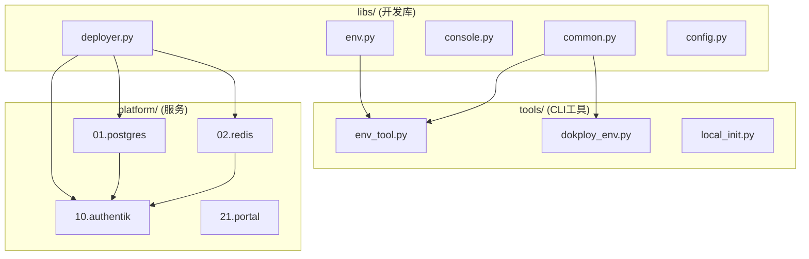

# Platform Automation SSOT

> **SSOT Key**: `platform.automation`  
> **核心定义**: Platform 模块的自动化采用 Deployer 模式 + Invoke tasks。

---

## 1. 真理来源 (The Source)

| 维度 | 物理位置 (SSOT) | 说明 |
|------|----------------|------|
| **服务定义** | `platform/{nn}.{service}/compose.yaml` | Docker Compose 配置 |
| **部署任务** | `platform/{nn}.{service}/deploy.py` | pre-compose, composing, post-compose |
| **状态检查** | `platform/{nn}.{service}/shared_tasks.py` | status() 返回 {is_ready, details} |
| **公共库** | `libs/` | env, common, console, config, deployer, dokploy |
| **CLI 工具** | `tools/` | env_tool.py, dokploy_env.py, local_init.py |

> **Note**: 服务部署通过 Dokploy API 完成（需要 `DOKPLOY_API_KEY` 或 1Password 中的对应字段）。`env_tool` 仅管理 1Password/Vault secrets。

### Code as SSOT 索引

- **任务加载器**: [`tasks.py`](https://github.com/wangzitian0/infra2/blob/main/tasks.py)
- **基类**: [`libs/deployer.py`](https://github.com/wangzitian0/infra2/blob/main/libs/deployer.py)
- **公共函数**: [`libs/common.py`](https://github.com/wangzitian0/infra2/blob/main/libs/common.py)

---

## 2. 架构模型



### 目录结构

```
platform/{nn}.{service}/
├── compose.yaml       # Docker Compose
├── deploy.py          # XxxDeployer 类 + @task
├── shared_tasks.py    # status() 检查
└── README.md          # 服务文档
```

---

## 3. 设计约束 (Dos & Don'ts)

### ✅ 推荐模式

- **模式 A**: 使用 Deployer 基类减少重复
  ```python
  class PostgresDeployer(Deployer):
      service = "postgres"
      compose_path = "platform/01.postgres/compose.yaml"
      data_path = "/data/platform/postgres"
  ```

- **模式 B**: status() 使用 check_service()
  ```python
  def status(c):
      return check_service(c, "postgres", "pg_isready")
  ```

### ⛔ 禁止模式

- **反模式 A**: 禁止在 deploy.py 模块级导入 shared_tasks
- **反模式 B**: 禁止硬编码环境变量，使用 get_env()

---

## 4. 标准操作程序 (Playbooks)

### SOP-000: 本地 CLI 就绪检查

```bash
invoke local.check
invoke local.init
invoke local.version
invoke local.bootstrap
invoke local.phase
```

### SOP-001: 部署服务

```bash
# 完整部署
invoke postgres.setup

# 分步部署
invoke postgres.pre-compose   # 创建目录、生成密码
invoke postgres.composing      # 通过 Dokploy API 部署
invoke postgres.post-compose   # 验证健康状态
```

### SOP-002: 检查服务状态

```bash
invoke postgres.shared.status
invoke redis.shared.status
invoke authentik.shared.status
```

### SOP-003: 管理密钥

```bash
# 读取/设置密钥
invoke env.get KEY --project=platform --env=production --service=postgres
invoke env.set KEY=VALUE --project=platform --env=production --service=postgres

# 预览（masked）
invoke env.list-all --project=platform --service=postgres

# init/env_vars
invoke env.init-status
```

### SOP-004: 创建 Dokploy 环境

```bash
# 确保 staging 环境存在
invoke dokploy.env-ensure --project=platform --env=staging --description="staging env"
```

---

## 5. 验证与测试 (The Proof)

| 行为描述 | 测试方式 |
|----------|----------|
| **所有模块加载** | `invoke --list` 无报错 |
| **服务健康** | `invoke {service}.shared.status` |
| **Vault 读写** | `invoke env.get POSTGRES_PASSWORD --project=platform --env=production --service=postgres` |

---

## Used by

- [platform/README.md](https://github.com/wangzitian0/infra2/blob/main/platform/README.md)
- [libs/README.md](https://github.com/wangzitian0/infra2/blob/main/libs/README.md)
