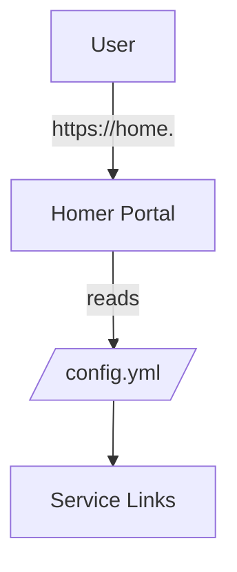

# Platform Portal (Homer) SSOT

> **SSOT Key**: `platform.portal`
> **Core definition**: Homer provides the single source of truth for the portal homepage at `home.<internal_domain>`.

---

## 1. The Source

> **Principle**: Documentation explains "why"; code/config defines "what".

| Dimension | Source of Truth | Notes |
|-----------|-----------------|-------|
| **Service definition** | `platform/21.portal/compose.yaml` | Docker Compose service |
| **Config template** | `platform/21.portal/config.yml.tmpl` | Homer config template |
| **Deployment tasks** | `platform/21.portal/deploy.py` | pre_compose/composing/post_compose |
| **Status checks** | `platform/21.portal/shared_tasks.py` | status() health check |
| **Runtime config** | `/data/platform/portal/config.yml` | Rendered config on VPS |
| **Environment variables** | `platform/21.portal/.env.example` + init/env_vars | `INTERNAL_DOMAIN` comes from init/env_vars |

### Code as SSOT Index

- **Task loader**: `tasks.py`
- **Deployer base**: `libs/deployer.py`

---

## 2. Architecture Model

### Key Decisions

- **Why Homer**: static, fast, file-based config, easy to maintain.
- **Domain**: portal is served at `home.<internal_domain>` via Traefik labels.
- **Config flow**: template is rendered with `INTERNAL_DOMAIN` during `pre-compose` and stored under `/data/platform/portal/`.

### Dependencies

- **L1 Bootstrap**: Dokploy + Traefik routing + TLS.
- **DNS**: `home.<internal_domain>` points to Traefik.

---

## 3. Design Constraints

### ✅ Recommended

- Keep all URLs in `config.yml.tmpl` aligned to `INTERNAL_DOMAIN`.
- Regenerate config via `invoke portal.pre-compose` after edits.
- Use Traefik labels for routing and TLS.

### ⛔ Forbidden

- Do not store secrets in the Homer config.
- Do not hand-edit `/data/platform/portal/config.yml` without updating the template.

---

## 4. Playbooks

### SOP-001: Deploy or Update Portal

1. Update `platform/21.portal/config.yml.tmpl` if links change.
2. Run `invoke portal.pre-compose` to render + upload config.
3. Deploy via Dokploy using `platform/21.portal/compose.yaml`.
4. Verify with `invoke portal.shared.status`.

### SOP-002: Add a New Link

1. Add the entry to `config.yml.tmpl`.
2. Re-run `invoke portal.pre-compose`.
3. Refresh `https://home.<internal_domain>`.

---

## 5. Verification (The Proof)

| Behavior | Verification | Coverage |
|----------|--------------|----------|
| Portal is reachable | `invoke portal.shared.status` | Manual |
| Traefik routing works | Visit `https://home.<internal_domain>` | Manual |

---

## Used by

> **Note**: Backlinks are managed by MkDocs. No manual edits needed here.
