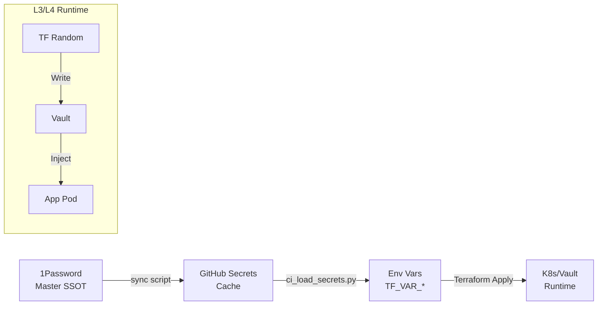

# 密钥管理 SSOT

> **SSOT Key**: `platform.secrets`
> **核心定义**: 定义从 1Password (Master) 到 GitHub Secrets (Cache) 再到 Terraform/Vault (Runtime) 的密钥流转体系。

---

## 1. 真理来源 (The Source)

> **原则**：1Password 是唯一的 Master Record，GitHub Secrets 只是 CI/CD 的临时缓存。

本话题的配置和状态由以下物理位置唯一确定：

| 维度 | 物理位置 (SSOT) | 说明 |
|------|----------------|------|
| **Master Record** | **1Password** (`Infra-GHA-Secrets`) | 所有静态密钥的源头 |
| **映射逻辑** | [`tools/secrets/ci_load_secrets.py`](../../tools/secrets/ci_load_secrets.py) | 将 GH Secrets 映射为 TF_VAR |
| **运行时注入** | **Vault** (`secret/data/...`) | 动态/业务密钥的运行时真理 |
| **部署缓存** | **GitHub Secrets** | 仅用于 CI 运行，不应人工维护 |

### Code as SSOT 索引

- **密钥映射字典**：参见 [`tools/secrets/ci_load_secrets.py`](../../tools/secrets/ci_load_secrets.py) (查看 `OP_CONTRACT` 和 `MAPPING`)
- **L1 密钥注入**：参见 [`bootstrap/variables.tf`](../../bootstrap/variables.tf)

---

## 2. 架构模型



### 关键决策 (Architecture Decision)

- **1Password as Master**: 解决了“密钥去哪找”的问题，并提供审计历史。
- **Python Loader**: 使用 `ci_load_secrets.py` 替代 GitHub Actions 的复杂 step，实现了跨工作流的 DRY (Don't Repeat Yourself)。
- **Terraform Remote State**: L3/L4 不直接读取 L2 的 Secret，而是通过 `terraform_remote_state` 读取非敏感输出 (Output)，敏感信息走 Vault。

---

## 3. 设计约束 (Dos & Don'ts)

### ✅ 推荐模式 (Whitelist)

- **模式 A**: 静态密钥 (API Keys) -> 1Password -> GitHub Secrets -> TF_VAR。
- **模式 B**: 动态密钥 (DB Passwords) -> `resource "random_password"` -> Vault -> App Pod。

### ⛔ 禁止模式 (Blacklist)

- **反模式 A**: **严禁** 在 Git 仓库中提交 `.env` 文件。
- **反模式 B**: **禁止** 手动在 GitHub Settings 页面修改 Secret（必须通过 1Password 同步，否则会被覆盖）。
- **反模式 C**: **禁止** L3/L4 读取 L1 的敏感 State（State 文件包含明文密码）。

---

## 4. 标准操作程序 (Playbooks)

### SOP-001: 新增基础设施密钥

- **触发条件**: 引入新 Provider (如 Cloudflare API Token)
- **步骤**:
    1. 在 1Password `Infra-GHA-Secrets` 条目中添加字段 (如 `CLOUDFLARE_API_TOKEN`)。
    2. 在 `tools/secrets/ci_load_secrets.py` 的 `MAPPING` 中添加映射。
    3. 运行同步脚本: `op item get ... | gh secret set ...` (详见脚本注释)。
    4. 在 Terraform 中声明 `variable "cloudflare_api_token" {}`。

### SOP-002: 轮换 GitHub Secrets

- **触发条件**: 密钥泄露 / 定期轮换
- **步骤**:
    1. 在 1Password 中更新值。
    2. 运行同步脚本刷新 GitHub Secrets。
    3. 触发受影响层的 CI Pipeline (`/bootstrap plan` 或 `/plan`)。

### SOP-003: 本地导出环境变量 (Local TF/Digger)

- **触发条件**: 需要在本地运行 Terraform/Digger 进行迭代。
- **步骤**:
    1. 运行 `python3 tools/secrets/sync_secrets.py`，按提示输入三位开关（GitHub Secrets / tfvars.example / tfvars）。
    2. 使用 `bootstrap/local.tfvars` 作为本地 Bootstrap Terraform 的输入（该文件默认被 git 忽略）。
    3. `bootstrap/local.tfvars.example` 可提交，用于共享 key 清单。

---

## 5. 验证与测试 (The Proof)

本文档描述的行为由以下测试用例守护：

| 行为描述 | 测试文件 (Test Anchor) | 覆盖率 |
|----------|-----------------------|--------|
| **密钥加载器逻辑** | [`test_secrets_loader.py`](../../tools/secrets/tests/test_secrets_loader.py) | ✅ Unit Test |
| **Vault 读写验证** | [`test_secrets.py`](../../e2e_regressions/tests/platform/secrets/test_secrets.py) | ✅ Critical |

**如何运行验证**:
```bash
python3 tools/secrets/tests/test_secrets_loader.py
pytest e2e_regressions/tests/platform/secrets/ -v
```

---

## Used by

- [docs/ssot/README.md](./README.md)
- [docs/onboarding/04.secrets.md](../../docs/onboarding/04.secrets.md)
- [bootstrap/README.md](../../bootstrap/README.md)
