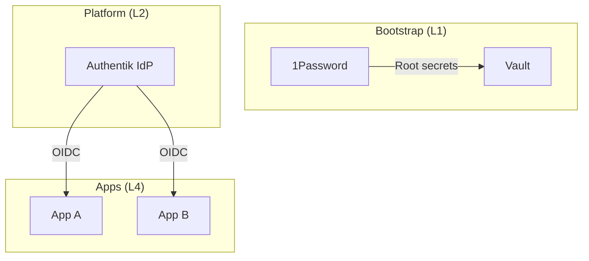

# 认证与授权 SSOT

> **SSOT Key**: `platform.sso`
> **核心定义**: 定义基于 Authentik (IdP) 的统一身份认证体系，以及 OIDC 应用接入规范。

---

## 1. 真理来源 (The Source)

> **原则**：身份由 Authentik 管理，应用侧以 OIDC 方式接入。

| 维度 | 物理位置 (SSOT) | 说明 |
|------|----------------|------|
| **Authentik 部署** | [`platform/10.authentik/compose.yaml`](https://github.com/wangzitian0/infra2/blob/main/platform/10.authentik/compose.yaml) | SSO 服务定义 |
| **部署任务** | [`platform/10.authentik/deploy.py`](https://github.com/wangzitian0/infra2/blob/main/platform/10.authentik/deploy.py) | pre-compose / composing / post-compose |
| **状态检查** | [`platform/10.authentik/shared_tasks.py`](https://github.com/wangzitian0/infra2/blob/main/platform/10.authentik/shared_tasks.py) | status() 健康检查 |

---

## 2. 架构模型



### 关键决策 (Architecture Decision)

- **Authentik 统一入口**：所有需要登录的服务使用 Authentik OIDC。
- **最小闭环**：SSO 自身由 Platform 管理，不依赖上层业务服务。

---

## 3. 设计约束 (Dos & Don'ts)

### ✅ 推荐模式 (Whitelist)

- **模式 A**: 新接入应用优先使用 OIDC Authorization Code Flow。
- **模式 B**: 通过 Authentik Group 管理角色，再由应用侧映射权限。

### ⛔ 禁止模式 (Blacklist)

- **反模式 A**: **禁止** 在同一入口叠加多层认证（如 Portal Gate + App OIDC）。
- **反模式 B**: **禁止** 共享 Client Secret（每个应用独立创建）。

---

## 4. 标准操作程序 (Playbooks)

### SOP-001: 新增 OIDC 应用

- **触发条件**: 接入新服务
- **步骤**:
    1. 登录 Authentik UI: `https://sso.${INTERNAL_DOMAIN}`。
    2. 创建 **Provider (OAuth2/OIDC)**，记录 Client ID/Secret。
    3. 创建 **Application** 并绑定 Provider。
    4. 将 Client Secret 写入 Vault（示例）：
       ```bash
       vault kv put secret/platform/production/<app> client_id=... client_secret=...
       ```
    5. 在应用侧配置 OIDC 参数并完成回调。

### SOP-002: 轮换 Client Secret

- **触发条件**: 泄露或定期轮换
- **步骤**:
    1. 在 Authentik UI 重新生成 Secret。
    2. 更新 Vault 中对应路径。
    3. 触发应用重启加载新配置。

---

## 5. 验证与测试 (The Proof)

| 行为描述 | 验证方式 | 状态 |
|----------|----------|------|
| **Authentik 服务可达** | `invoke authentik.shared.status` | ✅ Manual |
| **OIDC 配置验证** | Authentik UI 中 Provider 配置 | ⏳ Manual |

---

## Used by

- [docs/ssot/README.md](./README.md)
- [docs/onboarding/05.sso.md](../onboarding/05.sso.md)
- [platform/README.md](https://github.com/wangzitian0/infra2/blob/main/platform/README.md)
